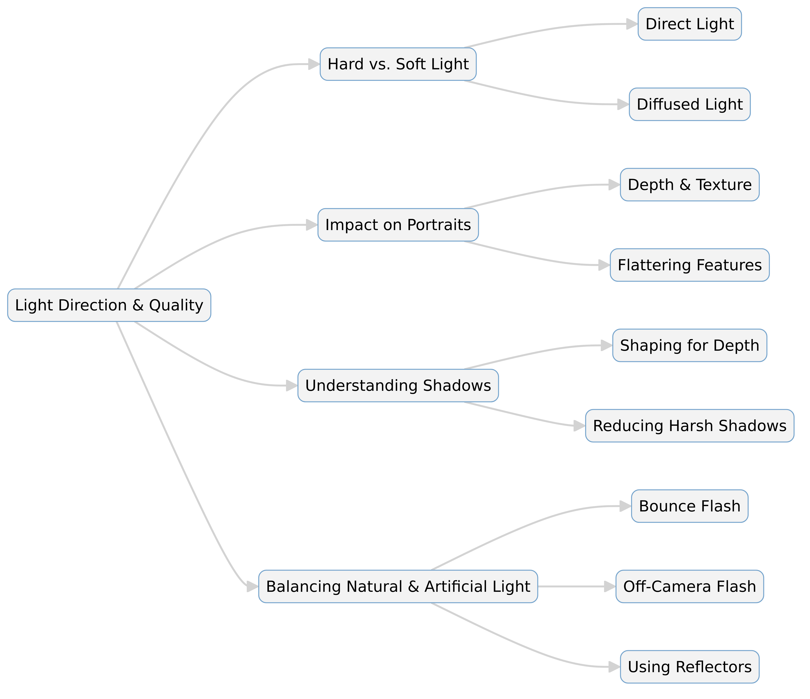

--- 
slug: book-takeaways-1-Direction-Quality-of-Light
title: "Book Takeaways: Direction & Quality of Light by Neil van Niekerk"

date: 2025-02-29

tags: 
  - Photos
  - Books
  - Book-Takeaways
--- 

### 📖 *Direction & Quality of Light: Your Key to Better Portrait Photography Anywhere* – Neil van Niekerk (2013)

Neil van Niekerk’s *Direction & Quality of Light* is a practical guide to understanding and manipulating light for portrait photography. The book focuses on the interplay between light direction and quality to create visually compelling images, regardless of location or lighting conditions. Through clear explanations and real-world examples, van Niekerk shares techniques for shaping and controlling light using natural, ambient, and artificial sources.

---

## 🎯 Conclusion  
Van Niekerk emphasizes that mastering light is the key to consistently strong portrait photography. The book teaches photographers to analyze light quality and direction rather than rely on preset camera settings or luck. Using bounce flash, off-camera flash, reflectors, and available light, he demonstrates ways to shape light for pleasing skin tones, soft shadows, and three-dimensionality. By the end, readers gain confidence in handling any lighting scenario, whether shooting indoors, outdoors, or in mixed-light environments.

---

## 📌 Key Points  

📸 **Light direction matters** – The angle at which light falls on a subject affects mood, texture, and depth.  

💡 **Quality of light is crucial** – Hard vs. soft light changes the overall look of portraits and should be controlled accordingly.  

🔦 **Bounce flash for natural results** – Using walls, ceilings, or reflectors helps soften artificial light and mimic natural light.  

🌞 **Use available light creatively** – Window light, shade, and backlighting can be used to create dynamic portraits.  

📷 **Off-camera flash enhances control** – Moving the flash off-camera allows for dramatic or subtle effects, depending on placement.  

🔄 **Balance ambient and artificial light** – Matching flash power with natural light ensures seamless integration.  

🎭 **Shadows add dimension** – Controlling shadow placement gives portraits depth and prevents flat-looking images.  

🛠️ **Modifiers improve flash output** – Softboxes, grids, and reflectors help direct and soften flash light effectively.  

📍 **Positioning the subject wisely** – Placing subjects in the right environment enhances composition and lighting.  

📖 **Practical case studies** – The book provides real-world examples, showing step-by-step lighting techniques.  

---

## 📚 Summary  

1. **Understanding Light** – The book begins by explaining how light direction and quality influence portraits, breaking down concepts such as soft vs. hard light and how light interacts with facial features.  

2. **Natural Light Techniques** – Van Niekerk discusses methods for using window light, open shade, and backlight to create flattering portraits without artificial lighting.  

3. **Using Bounce Flash** – A major theme in the book is bounce flash, where light is reflected off ceilings, walls, or other surfaces to create soft, directional lighting.  

4. **Off-Camera Flash for Control** – Moving the flash off-camera gives photographers flexibility in creating dramatic or natural-looking portraits, with examples of different positioning setups.  

5. **Mixing Flash and Ambient Light** – The book teaches how to balance artificial and natural light, avoiding overexposed highlights or unnatural-looking shadows.  

6. **Shaping Shadows for Depth** – Shadows aren’t just a byproduct of lighting; they are an essential tool for adding depth and dimension to portraits. The book explains how to control them effectively.  

7. **Light Modifiers and Tools** – Softboxes, grids, umbrellas, and reflectors all play a role in shaping and controlling light. The book compares different tools and their effects.  

8. **Practical Shooting Scenarios** – The author provides detailed case studies of portraits taken in various environments, illustrating lighting setups and problem-solving techniques.  

9. **Finding Good Light Anywhere** – Whether shooting indoors, outdoors, or in mixed-light environments, the book emphasizes the importance of quickly assessing and adjusting to lighting conditions.  

10. **Developing a Photographer’s Eye** – The final chapters encourage photographers to train themselves to "see" light, predict how it will interact with a subject, and use it creatively to achieve their vision.  

---

# **Details of Direction & Quality of Light: Your Key to Better Portrait Photography Anywhere**  
*By Neil van Niekerk (2013, Amherst Media)*  

## 📷 Introduction  
Lighting is the foundation of great portrait photography. Neil van Niekerk’s *Direction & Quality of Light* provides photographers with the knowledge to master both natural and artificial lighting, allowing them to create stunning portraits in any setting. By understanding how light direction and quality affect an image, photographers can take full control of their work. This book is filled with real-world examples, step-by-step guides, and practical advice to help photographers make the most of any lighting condition.

---

## 💡 The Fundamentals of Light  

### **1. The Importance of Light Direction**  
The way light falls on a subject determines shadows, highlights, and overall depth. Light can come from various directions, such as:  
- **Front lighting**: Flattens features and reduces shadows.  
- **Side lighting**: Adds depth and texture but can create harsh shadows.  
- **Backlighting**: Creates silhouettes or rim lighting for separation.  

### **2. Understanding Light Quality**  
Light quality is classified into:  
- **Hard light**: Direct, unfiltered light that creates sharp shadows (e.g., midday sun).  
- **Soft light**: Diffused light that wraps around the subject, reducing harsh shadows (e.g., cloudy days, bounced flash).  

### **3. Controlling Shadows**  
Shadows can enhance depth or create distractions. Learning to shape and soften shadows is key to professional portraiture. Techniques include using reflectors, diffusers, or modifying flash intensity.

---

## ☀️ Natural Light Techniques  

### **1. Window Light for Indoor Portraits**  
Window light is a fantastic natural source for portrait photography. Positioning a subject near a window with indirect sunlight provides a soft, flattering glow.  
- **Sheer curtains** can diffuse harsh sunlight.  
- **Reflectors** bounce light to fill in shadows.  

### **2. Shooting in Open Shade**  
When working outdoors, open shade offers a soft, even light source. Ideal locations include:  
- Under trees  
- Near buildings  
- Under large overhangs  

### **3. Using Backlighting for Creative Effects**  
Placing the subject between the camera and the sun creates beautiful, glowing backlit portraits. To prevent overexposure:  
- **Use exposure compensation** to retain details.  
- **Shoot at golden hour** for warm, directional light.  

---

## 🔦 Mastering Flash Photography  

### **1. The Power of Bounce Flash**  
Bounce flash is one of van Niekerk’s signature techniques. Instead of using direct flash, bouncing light off walls or ceilings produces a more natural look.  
- **Aim for large, neutral-colored surfaces.**  
- **Angle the flash to avoid direct light on the subject.**  

### **2. Off-Camera Flash for Professional Control**  
Moving the flash away from the camera allows for more dramatic lighting.  
- **A flash stand or assistant can help position the light.**  
- **Using wireless triggers offers full creative control.**  

### **3. Blending Flash with Ambient Light**  
To maintain a natural look, balance flash power with existing light sources.  
- **Lower flash output to prevent overexposure.**  
- **Use a slower shutter speed to blend background light smoothly.**  

---

## 🎭 Advanced Lighting Control  

### **1. Modifiers to Shape Light**  
Different tools help photographers control flash quality:  
- **Softboxes** diffuse flash for softer shadows.  
- **Grids** direct light into a narrow beam.  
- **Umbrellas** scatter light for even illumination.  

### **2. Shaping Shadows for Depth**  
Strategically placing the key light source creates more dynamic images.  
- **Short lighting** (lighting the side away from the camera) makes faces appear slimmer.  
- **Broad lighting** (lighting the side facing the camera) is useful for emphasizing volume.  

### **3. Adapting to Challenging Locations**  
Lighting conditions are rarely perfect. The book provides examples of overcoming common issues:  
- **Low-light environments** → Use higher ISO or off-camera flash.  
- **Harsh midday sun** → Move subject into shade or use a diffuser.  
- **Mixed light sources** → Adjust white balance for consistency.  

---

## 📌 Conclusion  
Neil van Niekerk’s *Direction & Quality of Light* is an essential resource for photographers who want to improve their lighting skills. By mastering light direction, controlling quality, and using tools like bounce flash and modifiers, photographers can create stunning portraits anywhere. The book’s practical approach, with real-world examples, helps photographers adapt to any lighting scenario with confidence.

---

# **📖 Direction & Quality of Light: Your Key to Better Portrait Photography Anywhere**  
*By Neil van Niekerk (2013, Amherst Media)*  

## **📷 Introduction**  
Lighting is the foundation of great portrait photography. While camera settings, lenses, and composition are important, light determines the mood, depth, and overall impact of an image. In *Direction & Quality of Light*, Neil van Niekerk teaches photographers how to control and manipulate light to achieve professional results in any environment.  

Unlike books that focus purely on technical aspects, this guide emphasizes practical applications, showing how to use available light, bounce flash, off-camera flash, and light modifiers effectively. By understanding light direction and quality, photographers can improve their portraits dramatically, whether shooting indoors, outdoors, or in mixed lighting conditions.  

This expanded summary covers all key principles and practical techniques explored in the book.  

---

# **💡 Understanding Light Direction and Quality**  

## **1. Why Light Direction Matters**  
The way light falls on a subject influences the entire composition of an image. It affects:  
- **Depth and dimension** – Proper lighting can make a subject appear three-dimensional rather than flat.  
- **Mood and emotion** – Hard shadows create drama, while soft light gives a natural, flattering effect.  
- **Facial features** – Light direction enhances or diminishes facial structure.  

### **Types of Light Direction:**  
📌 **Front Lighting** – Illuminates the entire face, minimizing shadows but reducing depth.  
📌 **Side Lighting** – Creates contrast and depth, accentuating facial structure.  
📌 **Backlighting** – Separates the subject from the background, creating a glowing rim effect.  
📌 **Top Lighting** – Often unflattering, creating deep shadows under the eyes and nose.  
📌 **Under Lighting** – Rarely used in portraits, but can add a dramatic, eerie effect.  

## **2. Hard vs. Soft Light**  
The book defines **light quality** as either **hard or soft**, which changes the appearance of the subject:  
- **Hard Light** (e.g., midday sun, direct flash) → Creates sharp, defined shadows.  
- **Soft Light** (e.g., overcast sky, bounced flash) → Produces gradual transitions between light and shadow.  

### **How to Soften Light:**  
✅ Use **cloud cover** or shade outdoors.  
✅ **Bounce light** off walls, ceilings, or reflectors.  
✅ Attach **softboxes, umbrellas, or diffusers** to artificial lights.  

---

# **☀️ Mastering Natural Light Portraits**  

## **1. Using Window Light for Indoor Portraits**  
One of the most accessible and flattering lighting setups involves using window light.  
- **Position the subject** at a 45-degree angle for soft directional light.  
- **Use sheer curtains** to diffuse harsh sunlight.  
- **Add a reflector** to bounce light and fill in shadows.  

## **2. Shooting in Open Shade for Even Lighting**  
Outdoor portraits often suffer from harsh sunlight, but open shade provides a solution.  
- **Find shaded areas** under trees, buildings, or overhangs.  
- **Avoid mixed lighting** (e.g., partial sunlight filtering through trees).  
- **Use a reflector or white card** to bring back some light into the subject’s face.  

## **3. Using Backlighting for Creative Effects**  
Backlighting can create a dreamy, professional look when done correctly.  
- **Golden hour (sunrise or sunset) is the best time** for warm, glowing light.  
- **Expose for the subject’s face**, allowing the background to be slightly overexposed.  
- **Use a lens hood** to prevent lens flare, or embrace flare for artistic effect.  

---

# **🔦 Using Flash Effectively**  

## **1. The Power of Bounce Flash**  
Many photographers struggle with direct flash, which creates harsh, unflattering shadows. Instead, van Niekerk recommends **bouncing the flash** to create a softer, more natural look.  
- **Aim the flash** at a nearby wall, ceiling, or large surface.  
- **Choose neutral-colored surfaces** to avoid unwanted color casts.  
- **Use flash exposure compensation** (+/- settings) to fine-tune brightness.  

## **2. Off-Camera Flash for Professional Control**  
Moving the flash off-camera allows for more dramatic lighting.  
- **Use a wireless trigger** to position the flash separately from the camera.  
- **Experiment with different angles** (side, back, or overhead) for creative effects.  
- **Modify the light** using softboxes, umbrellas, or grids.  

## **3. Balancing Flash with Ambient Light**  
A major challenge in portrait photography is ensuring that flash blends seamlessly with natural light.  
- **Adjust shutter speed** to control background brightness.  
- **Lower flash power** to prevent an artificial look.  
- **Use gel filters** on flash to match ambient color temperature.  

---

# **🎭 Advanced Lighting Control Techniques**  

## **1. Shaping Shadows for Depth and Drama**  
Shadows are just as important as light in portrait photography.  
- **Short lighting** (lighting the side away from the camera) makes faces look slimmer.  
- **Broad lighting** (lighting the side facing the camera) is useful for emphasizing facial features.  
- **Rembrandt lighting** (light from the side creating a small triangle of light under the eye) adds depth.  

## **2. Using Light Modifiers to Enhance Flash**  
Different light modifiers help photographers refine their lighting setup:  
- **Softboxes** → Diffuse light for softer shadows.  
- **Grids** → Focus light into a tighter beam.  
- **Reflectors** → Bounce light back onto the subject.  

## **3. Problem-Solving in Difficult Lighting Conditions**  
- **Low-light environments** → Use a higher ISO and off-camera flash.  
- **Harsh midday sun** → Move the subject into shade or use a diffuser.  
- **Mixed light sources** → Adjust white balance to create color consistency.  

---

# **📌 Conclusion**  
Neil van Niekerk’s *Direction & Quality of Light* teaches photographers how to master lighting in any situation. Rather than relying on presets or luck, photographers can analyze and shape light to achieve professional results. The book emphasizes:  
✅ **Understanding light direction** to enhance portraits.  
✅ **Mastering natural light** using windows, shade, and backlighting.  
✅ **Using bounce and off-camera flash** for more control.  
✅ **Shaping shadows and modifying light** for creative effects.  
✅ **Problem-solving in difficult conditions** to maintain consistent quality.  

By following these principles, photographers can confidently create stunning portraits anywhere, using any light source.  

---

## 📊 Table: Key Concepts in *Direction & Quality of Light*  

| **Concept**              | **Description**                                       | **Techniques & Tools**                           |
|-------------------------|---------------------------------------------------|--------------------------------|
| **Light Direction**      | Determines shadows, depth, and subject emphasis. | Front, side, back, top, under lighting. |
| **Hard vs. Soft Light**  | Hard light creates sharp shadows; soft light is diffused. | Direct light vs. bounce flash, diffusers. |
| **Window Light**         | Natural indoor light for soft, flattering portraits. | Positioning, sheer curtains, reflectors. |
| **Open Shade**          | Outdoor light that minimizes harsh shadows. | Finding shaded areas, reflectors for fill light. |
| **Backlighting**        | Creates separation and a glowing rim light. | Golden hour shooting, exposure adjustments. |
| **Bounce Flash**        | Softens artificial light by reflecting off surfaces. | Walls, ceilings, bounce cards. |
| **Off-Camera Flash**    | Allows more creative lighting angles. | Wireless triggers, flash stands, modifiers. |
| **Balancing Flash & Ambient Light** | Ensures a natural look by blending artificial and natural light. | Adjusting shutter speed, flash power, and white balance. |
| **Shaping Shadows**     | Shadows add depth and dimension to portraits. | Short lighting, broad lighting, Rembrandt lighting. |
| **Light Modifiers**     | Tools to control flash and soften shadows. | Softboxes, umbrellas, grids, reflectors. |
| **Low-Light Solutions** | Techniques for shooting in dim conditions. | High ISO, slower shutter speeds, off-camera flash. |
| **Harsh Sunlight Solutions** | Avoiding overexposure and unflattering shadows. | Shade, diffusers, reflectors. |
| **Mixed Light Sources** | Ensuring consistent color in different lighting. | White balance adjustments, gel filters on flash. |

## 📜 Quotes from *Direction & Quality of Light* – Neil van Niekerk  

📌 **On the Importance of Light Direction:**  
*"The way light falls on your subject will determine how the final image looks. Understanding and controlling this is key to professional portraiture."*  

📌 **On Hard vs. Soft Light:**  
*"Hard light is not inherently bad, nor is soft light always the best choice. What matters is how you use it to shape your subject."*  

📌 **On Bounce Flash Techniques:**  
*"Bouncing flash is about more than just softening the light; it's about controlling the direction and shaping shadows to create depth."*  

📌 **On Natural Light Portraits:**  
*"Window light, when used properly, can be as powerful as any professional studio setup."*  

📌 **On Balancing Flash and Ambient Light:**  
*"A good portrait doesn't scream 'flash photography.' The key is to blend artificial and available light seamlessly."*  

📌 **On Modifying Light for Creative Effect:**  
*"A simple reflector or a change in flash angle can dramatically alter the mood and quality of your portraits."*  

📌 **On Overcoming Difficult Lighting Conditions:**  
*"There is no such thing as bad light—only light that hasn't been properly understood and used effectively."*  

📌 **On Developing a Photographer’s Eye:**  
*"Train yourself to see light before you even lift the camera. Understanding it is what separates a good shot from a great one."*  

📌 **On Why Lighting Matters More Than Camera Gear:**  
*"The best camera in the world won’t save a photo with poor lighting. Master light first, then worry about the gear."*  

📌 **On Experimentation and Learning:**  
*"The best way to improve is to experiment. Play with angles, modify light, and study how it interacts with your subject."*  
