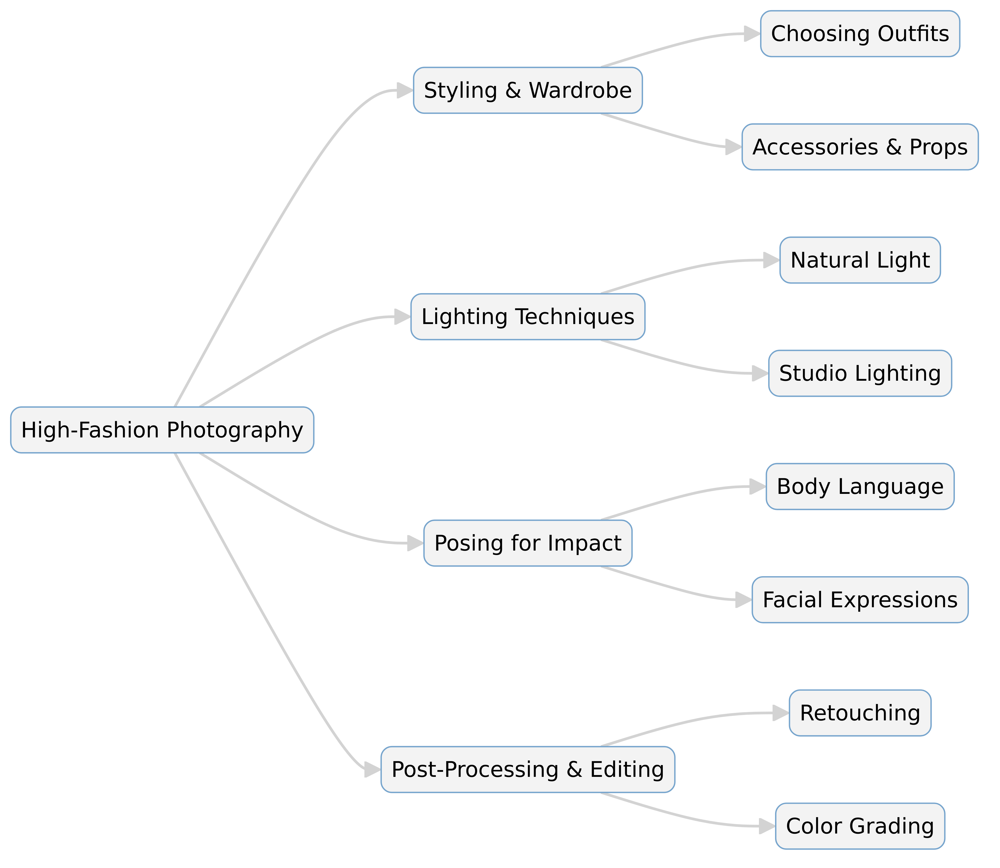

--- 
slug: book-takeaways-1
title: "Book Takeaways: "

date: 2025-01-20

tags: 
  - Photos
  - Books
  - Book-Takeaways
--- 

### **Fashion Flair for Portrait and Wedding Photography – Lindsay Adler**  

**Overview:**  
Lindsay Adler’s *Fashion Flair for Portrait and Wedding Photography* is a comprehensive guide that blends high-fashion techniques with traditional portrait and wedding photography. The book teaches photographers how to incorporate fashion-inspired elements, from styling to posing, lighting, and post-production, to create compelling and artistic images. Adler provides step-by-step guidance, real-world examples, and industry insights to elevate portrait and wedding photography beyond standard shots.  

---

## **Conclusion**  
Lindsay Adler successfully bridges the gap between fashion photography and traditional portrait/wedding photography, making her techniques accessible to professionals and hobbyists alike. The book highlights how photographers can use styling, lighting, and creative concepts to transform everyday images into high-fashion-inspired masterpieces. Adler’s guidance is practical and filled with real-world applications, making it a valuable resource for photographers looking to stand out in a competitive market.  

---

## **Key Points**  

📸 **Fashion Inspiration in Photography**: Adler emphasizes drawing from fashion magazines and runway shows to create stylish and dramatic images.  

🎭 **Styling and Wardrobe**: Tips on how to use clothing, accessories, and styling to enhance portrait and wedding photography.  

💡 **Lighting Techniques**: Covers studio and natural light setups to create a high-fashion look in portraits.  

🖼 **Posing for Impact**: Teaches photographers how to direct models and clients for elegant and confident poses.  

🎨 **Color Theory and Composition**: Explains how colors, textures, and compositions affect the mood and feel of a photograph.  

🔍 **Attention to Detail**: Discusses how small elements, such as hair, makeup, and props, can make or break a shot.  

📷 **Post-Processing and Retouching**: Covers editing techniques to refine images while maintaining a natural yet polished look.  

🎬 **Storytelling Through Photography**: Encourages photographers to create images with depth, emotion, and storytelling elements.  

👰 **Applying Fashion Techniques to Weddings**: Explores how wedding photographers can incorporate fashion-forward concepts into their work.  

💼 **Business and Branding**: Adler provides advice on marketing, branding, and working with clients to build a unique photography style.  

---

## **Summary**  

1. **Blending Fashion and Photography**: Adler explains how photographers can integrate fashion aesthetics into portrait and wedding photography to create unique, editorial-style images.  

2. **Understanding Fashion Styling**: The book provides insights into selecting outfits, accessories, and themes that enhance the overall visual appeal of a photoshoot.  

3. **Lighting Essentials**: A deep dive into lighting setups, both in natural and studio environments, to achieve the polished look of high-fashion photography.  

4. **Posing Techniques**: Adler breaks down effective posing strategies that highlight a subject’s best features while maintaining a natural feel.  

5. **Creative Composition and Color Theory**: The book covers how to use angles, framing, and color combinations to craft striking images.  

6. **Attention to Detail**: Emphasizes the importance of small details like makeup, hair, and props to create flawless final images.  

7. **Post-Production and Editing**: Techniques for refining images, including retouching, color grading, and enhancing textures.  

8. **Fashion-Inspired Wedding Photography**: Demonstrates how wedding photographers can use high-fashion techniques to elevate their work beyond traditional styles.  

9. **Storytelling in Photography**: Encourages photographers to think beyond simple portraits and create images that tell a compelling story.  

10. **Building a Business and Personal Brand**: Offers practical tips on marketing, client management, and establishing a distinctive style in a competitive market.  

**Enter a number to expand on a topic.**  

---

# **Detail Summary of Fashion Flair for Portrait and Wedding Photography**  
### *By Lindsay Adler*  

## **Introduction**  
Photography is more than just capturing a moment—it’s about creating a visually stunning experience. In *Fashion Flair for Portrait and Wedding Photography*, Lindsay Adler teaches photographers how to incorporate high-fashion elements into traditional portrait and wedding photography. This book serves as a practical guide for photographers who want to elevate their work using styling, lighting, posing, and post-production techniques inspired by the fashion industry.  

---

## **Blending Fashion and Photography**  
### **Why Fashion?**  
Fashion photography is known for its dramatic lighting, stylish composition, and editorial storytelling. By integrating these elements, portrait and wedding photographers can create images that stand out in a competitive market.  

### **How to Incorporate Fashion Elements**  
- Study fashion magazines and runway photography for inspiration.  
- Use storytelling to create more dynamic and engaging portraits.  
- Pay attention to small details like accessories, fabrics, and textures.  

---

## **Styling and Wardrobe in Photography**  
### **The Role of Clothing and Accessories**  
A model’s outfit can set the tone for an entire photoshoot. Adler explains how photographers can collaborate with stylists or personally curate wardrobe choices that enhance the final image.  

### **Key Styling Tips**  
✅ Use bold colors and textures to add depth to photos.  
✅ Coordinate wardrobe choices with the shoot’s overall theme.  
✅ Incorporate accessories like hats, jewelry, and scarves for extra flair.  

### **Creating a Cohesive Look**  
- Understand how color theory impacts the mood of an image.  
- Experiment with different styles, from classic elegance to avant-garde fashion.  
- Work with a makeup artist to ensure the model’s look complements the shoot.  

---

## **Mastering Lighting Techniques**  
Lighting is crucial in fashion photography, and Adler breaks it down into easy-to-follow techniques.  

### **Types of Lighting**  
💡 **Natural Light** – Works well for soft, dreamy aesthetics. Best used in golden-hour outdoor shoots.  
💡 **Studio Lighting** – Offers full control over shadows and highlights, creating a polished, editorial look.  

### **Fashion Lighting Setups for Portraits and Weddings**  
- **Rembrandt Lighting**: A classic look with dramatic shadows.  
- **High-Key Lighting**: Bright, even light with minimal shadows, great for modern and minimalistic portraits.  
- **Backlighting**: Creates a soft, ethereal glow, ideal for romantic wedding photography.  

---

## **Posing for Maximum Impact**  
### **Directing Models and Clients**  
Photographers must guide their subjects to create visually striking and confident poses. Adler outlines how to make clients feel comfortable and how to adjust angles for the most flattering results.  

### **Key Posing Techniques**  
✅ **Body Language** – Encouraging confident and relaxed postures.  
✅ **Facial Expressions** – Subtle expressions can completely change the mood of an image.  
✅ **Angles and Asymmetry** – Using diagonal lines and off-center framing to add dynamic energy.  

### **Posing for Weddings vs. Editorial Portraits**  
- Wedding photography tends to focus on natural, romantic poses.  
- Editorial portraits often include more dramatic and stylized posing.  

---

## **Composition and Color Theory**  
The arrangement of elements within a photo greatly influences its impact.  

### **Fashion-Inspired Composition Techniques**  
- **Rule of Thirds** – Keeping the subject slightly off-center for a natural look.  
- **Leading Lines** – Using architecture, streets, or landscapes to guide the viewer’s eye.  
- **Negative Space** – Allowing empty areas in the frame to create a modern, high-end feel.  

### **The Role of Color in Photography**  
🎨 **Warm Tones (Red, Orange, Yellow):** Create energy and excitement.  
🎨 **Cool Tones (Blue, Green, Purple):** Evoke calmness and sophistication.  
🎨 **Black & White Photography:** Adds a timeless and dramatic feel.  

---

## **Post-Processing and Retouching**  
Editing plays a significant role in achieving the polished, high-fashion look.  

### **Essential Editing Techniques**  
- **Skin Retouching** – Smoothing skin while maintaining natural texture.  
- **Dodge and Burn** – Enhancing highlights and shadows for depth.  
- **Color Grading** – Adjusting tones to create a cohesive mood.  

### **Tools for Editing**  
🖥 Adobe Lightroom – For color correction and exposure adjustments.  
🖥 Adobe Photoshop – For retouching and advanced compositing.  
🖥 Capture One – Preferred by many fashion photographers for color control.  

---

## **Fashion-Inspired Wedding Photography**  
Wedding photography can benefit from high-fashion elements by focusing on styling, creative lighting, and dramatic posing.  

### **Bringing Editorial Flair to Weddings**  
✅ Use a mix of candid and editorial-style portraits.  
✅ Experiment with creative lighting, such as off-camera flash and backlighting.  
✅ Work with a stylist to ensure the couple’s wardrobe enhances the aesthetic.  

---

## **Storytelling Through Photography**  
Fashion photography often tells a story through imagery. Adler encourages photographers to think beyond simple portraits and focus on crafting a narrative in their work.  

### **How to Create Story-Driven Images**  
📖 Use location and props to add depth to the story.  
📖 Capture emotions and interactions to make images feel alive.  
📖 Experiment with sequences of images that tell a complete visual tale.  

---

## **Building a Photography Business and Brand**  
Photography isn’t just about artistry—it’s also about running a successful business.  

### **Marketing and Branding Tips**  
💼 **Find Your Unique Style** – Develop a signature look that sets you apart.  
💼 **Social Media & Portfolio** – Showcase your best work consistently.  
💼 **Networking & Collaborations** – Work with models, stylists, and designers to expand your reach.  

### **Working with Clients**  
- Communication is key to understanding and delivering their vision.  
- Offer style guides to help clients prepare for their shoot.  
- Create an unforgettable experience to encourage referrals.  

---

## **Conclusion**  
Lindsay Adler’s *Fashion Flair for Portrait and Wedding Photography* is a must-read for photographers looking to elevate their craft. By applying fashion photography techniques, photographers can create visually compelling, high-end images that stand out in today’s saturated market. Whether you’re a portrait photographer or a wedding photographer, these principles can help you take your work to the next level.  

---

# **Expanded Summary: Fashion Flair for Portrait and Wedding Photography**  
### *By Lindsay Adler*  

## **📸 Introduction**  
Lindsay Adler’s *Fashion Flair for Portrait and Wedding Photography* provides photographers with a fresh approach to portrait and wedding photography by integrating high-fashion aesthetics. Traditional wedding and portrait photography often focuses on capturing authentic moments, but Adler pushes the boundaries by adding elements of styling, dramatic lighting, and editorial storytelling. This book serves as a guide for photographers looking to enhance their craft by incorporating techniques from fashion photography, enabling them to produce compelling, magazine-worthy images.  

Adler emphasizes that incorporating fashion elements doesn't mean making wedding or portrait photography unnatural. Instead, it helps elevate the artistic appeal of images, making them more visually captivating. The book is structured to help photographers with every step, from conceptualizing a shoot to executing it with precision, using lighting, wardrobe, posing, and post-production techniques.  

---

## **🎭 The Influence of Fashion Photography in Portrait and Wedding Photography**  
### **Why Fashion?**  
Fashion photography is known for its dramatic, well-composed, and stylized images. Adler explains that photographers can take inspiration from fashion magazines, runway shows, and editorial spreads to add a refined, stylish look to their portraits.  

### **Key Elements of Fashion-Inspired Portraiture:**  
- **Intentional Styling** – Using clothing, makeup, and accessories to create an artistic vision.  
- **Dramatic Lighting** – Employing high-fashion lighting techniques to add mood and depth.  
- **Striking Poses** – Moving beyond traditional wedding poses to incorporate movement, attitude, and storytelling.  

### **How Fashion Photography Transforms Wedding Photography**  
Traditionally, wedding photography focuses on candid moments and soft romance, but incorporating fashion elements can create bold, elegant imagery. Instead of just documenting, fashion-inspired wedding photography curates a stylized experience, using controlled lighting, structured posing, and sophisticated compositions.  

---

## **👗 Styling and Wardrobe: Elevating the Look of a Portrait**  
### **Why Styling Matters**  
Clothing choices impact the mood and quality of an image. Adler emphasizes the importance of working with stylists, makeup artists, and designers when possible, or personally curating outfits that enhance the shoot.  

### **Key Styling Tips:**  
✅ Choose outfits that complement the model's body shape and the shoot’s theme.  
✅ Use texture and layering to create depth and dimension.  
✅ Ensure clothing works well with lighting conditions to avoid unwanted reflections or distortions.  

### **How to Achieve a High-Fashion Look in Portraits:**  
- Incorporate **bold fashion pieces** (statement jewelry, couture gowns, or textured fabrics).  
- **Match wardrobe with setting** (e.g., flowing dresses in a windy outdoor shoot create movement).  
- Utilize **color theory** to create striking contrasts (e.g., red dress against a neutral background).  

---

## **💡 Mastering Lighting: Creating the Right Atmosphere**  
Lighting is one of the most critical elements in fashion photography. Adler explains that proper lighting techniques can dramatically change the look and feel of a portrait.  

### **Types of Lighting:**  
🔆 **Natural Light** – Best for soft, ethereal portraits. Can be enhanced with reflectors and diffusers.  
💡 **Studio Lighting** – Allows full control of shadows and highlights, creating a polished, editorial effect.  
🔥 **Off-Camera Flash** – Ideal for dramatic wedding portraits with a professional finish.  

### **Popular Lighting Techniques in Fashion Photography:**  
- **Rembrandt Lighting** – Classic triangle of light on the cheek for depth and drama.  
- **High-Key Lighting** – Bright, minimal shadow photography for a clean, modern aesthetic.  
- **Backlighting** – Creates a glowing, dreamy effect, often used in wedding photography.  

---

## **🖼 Posing Techniques: The Power of Body Language**  
### **Directing Clients and Models**  
Adler stresses that great posing is not just about positioning the body but also about confidence, storytelling, and subtlety. She provides step-by-step techniques to ensure natural and elegant poses.  

### **Essential Posing Guidelines:**  
✅ Use **elongated body lines** to create an elegant, statuesque effect.  
✅ Encourage **fluid movement** (e.g., walking, turning, adjusting a dress) to capture natural expressions.  
✅ Utilize **asymmetry** to make images more dynamic and interesting.  

### **Wedding Posing vs. Fashion Posing:**  
- **Traditional wedding poses** focus on softness, romance, and connection between the couple.  
- **Fashion-inspired poses** introduce more attitude, structure, and editorial styling.  

---

## **🎨 Color Theory and Composition: The Art of Visual Impact**  
Composition is crucial in photography, as it guides the viewer’s eye and creates balance. Adler explains how fashion photography uses bold compositions that portrait and wedding photographers can integrate into their work.  

### **Key Composition Techniques:**  
📌 **Rule of Thirds** – Placing subjects off-center to create balance.  
📌 **Leading Lines** – Using elements like roads, walls, or staircases to direct attention.  
📌 **Negative Space** – Leaving empty areas in the frame for a minimalist, editorial feel.  

### **Using Color for Maximum Impact:**  
🎨 **Warm Tones** (reds, oranges) evoke energy and passion.  
🎨 **Cool Tones** (blues, purples) create a calm and sophisticated mood.  
🎨 **Monochrome/Black & White** adds timeless elegance and drama.  

---

## **📷 Post-Production: The Finishing Touches**  
Editing is where a good image becomes a great one. Adler details retouching techniques that enhance portraits without making them look over-processed.  

### **Retouching Techniques:**  
- **Skin Retouching** – Smoothing out blemishes while maintaining natural texture.  
- **Dodge and Burn** – Enhancing highlights and shadows for depth.  
- **Color Grading** – Adjusting tones for a cohesive aesthetic.  

### **Recommended Software:**  
🖥 Adobe Lightroom – Best for color correction and overall image balance.  
🖥 Adobe Photoshop – Ideal for advanced retouching and compositing.  
🖥 Capture One – Used by many fashion photographers for precise color control.  

---

## **👰 Applying High-Fashion Techniques to Wedding Photography**  
Wedding photography is evolving, and many couples now seek a more artistic, editorial approach. Adler outlines how photographers can integrate fashion-forward techniques while maintaining the essence of a wedding day.  

### **How to Achieve a High-Fashion Wedding Look:**  
✅ Use off-camera flash for **cinematic lighting**.  
✅ Incorporate structured poses and **dramatic angles**.  
✅ Style the bride and groom’s wardrobe for an **editorial flair**.  

---

## **📖 Storytelling in Photography: More Than Just a Pretty Picture**  
Fashion photography often tells a story, and Adler encourages photographers to apply the same mindset to portraits and weddings.  

### **Techniques for Story-Driven Images:**  
📖 Use props and background elements to add context.  
📖 Capture candid interactions that feel natural and emotional.  
📖 Plan a sequence of images to tell a visual narrative.  

---

## **💼 Branding and Business: Standing Out in the Industry**  
Adler emphasizes that photographers should develop a **signature style** to set themselves apart. Marketing, branding, and client relationships play a crucial role in building a successful career.  

### **Essential Business Tips:**  
- **Find Your Unique Aesthetic** – Develop a recognizable style.  
- **Social Media Presence** – Consistently share high-quality work.  
- **Network and Collaborate** – Work with stylists and designers to elevate your portfolio.  

---

## **🏆 Conclusion: Elevate Your Photography with Fashion Flair**  
Lindsay Adler’s *Fashion Flair for Portrait and Wedding Photography* is a game-changer for photographers looking to push creative boundaries. By integrating styling, lighting, and fashion-inspired poses, photographers can craft images that are not only beautiful but also compelling and artistic. Whether you're a beginner or an experienced professional, Adler’s insights provide valuable tools to refine your work and stand out in today’s competitive photography industry.  

## **Table: Key Concepts from *Fashion Flair for Portrait and Wedding Photography***  

| **Category**       | **Key Insights**                                                   | **Application**                                           |
|--------------------|--------------------------------------------------------------------|----------------------------------------------------------|
| **Fashion Influence** | Draws inspiration from high-fashion photography to enhance portraits. | Creates visually striking and editorial-style images. |
| **Styling & Wardrobe** | Outfits, accessories, and textures play a major role in image quality. | Use bold fashion choices and coordinate with shoot themes. |
| **Lighting Techniques** | Studio, natural, and off-camera flash lighting enhance portraits. | Experiment with Rembrandt, backlighting, and high-key lighting. |
| **Posing Strategies** | Body language and asymmetry add dynamism and confidence to portraits. | Guide subjects to use elegant, structured poses. |
| **Composition** | Rule of Thirds, leading lines, and negative space improve framing. | Direct viewer’s focus and add artistic depth. |
| **Color Theory** | Warm and cool tones evoke different emotions in photography. | Use color grading to create mood and consistency. |
| **Post-Processing** | Retouching, dodge & burn, and color correction refine the final image. | Utilize Photoshop and Lightroom for professional edits. |
| **Wedding Photography** | Editorial fashion techniques make wedding photography stand out. | Mix candid moments with stylized, fashion-inspired poses. |
| **Storytelling** | A narrative approach makes portraits more engaging and expressive. | Use locations, props, and sequences to tell visual stories. |
| **Business & Branding** | Developing a signature style helps photographers stand out. | Focus on social media marketing, networking, and collaborations. |

## **Quotes from *Fashion Flair for Portrait and Wedding Photography***  

📸 **"Fashion photography is about making a statement—apply the same mindset to portrait and wedding photography to elevate your work."**  

🎭 **"Styling is not just about clothing; it's about creating a mood and visual story that captivates the viewer."**  

💡 **"Lighting is the soul of a photograph—master it, and you can transform an ordinary image into a masterpiece."**  

👗 **"A well-styled subject can make all the difference between a good photo and an extraordinary one."**  

🖼 **"Composition is about guiding the viewer’s eye—every element in your frame should serve a purpose."**  

📷 **"The best poses are those that feel natural yet exude confidence and elegance."**  

🎨 **"Color is a powerful storytelling tool—use it wisely to create mood and emotion in your images."**  

🖥 **"Editing should enhance an image, not overpower it—keep retouching subtle and refined."**  

👰 **"Wedding photography can be both timeless and high-fashion—combine both for truly unique results."**  

💼 **"Success in photography isn’t just about talent—it’s about branding, marketing, and creating a signature style."**  

## **Quiz: Test Your Knowledge!**  

Click the link below to take the quiz on *Fashion Flair for Portrait and Wedding Photography*:  
[👉 Start the Quiz](https://questions.widenex.com/fc1d83bc-47fe-46b3-b3e8-99dd1d6bf4d9)  
