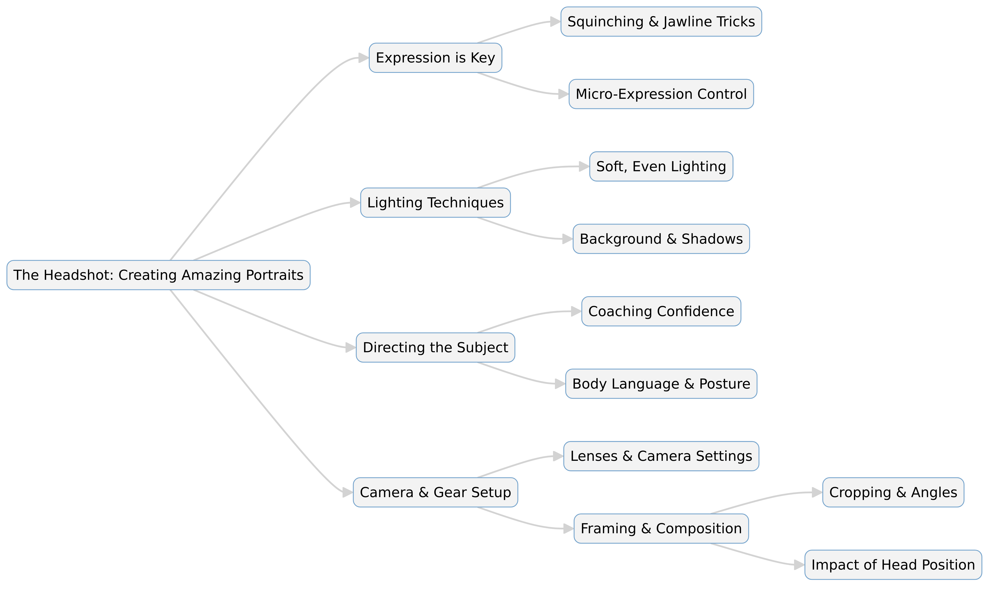

--- 
slug: book-takeaways-the-headshot-perter-hurley
title: "Book Takeaways: The Headshot – Peter Hurley"

date: 2025-01-20

tags: 
  - Photos
  - Books
  - Book-Takeaways
--- 

### 📖 *The Headshot: The Secrets to Creating Amazing Headshot Portraits* – Peter Hurley (2015)  

Peter Hurley, one of the world's most renowned headshot photographers, shares his expertise on capturing professional, compelling portraits. The book covers everything from technical camera settings to the psychology behind bringing out the best in a subject. With an emphasis on expression and authenticity, Hurley reveals his signature techniques that make his headshots stand out.

---  
## 🏁 Conclusion  
Hurley’s book goes beyond photography techniques—it delves into the psychological and interpersonal skills needed to create authentic and powerful portraits. He emphasizes the importance of coaching subjects to relax, using subtle direction to draw out natural expressions. With practical advice on lighting, composition, and workflow, *The Headshot* is essential reading for both aspiring and professional photographers looking to refine their craft.  

---  
## 🔑 Key Points  

📸 **Expression is Everything**: The key to a great headshot is a genuine, engaging expression that conveys confidence and approachability.  

💡 **Lighting Techniques**: Hurley explains his go-to lighting setups, including how to use soft, even lighting to highlight the subject’s best features.  

👀 **"Squinching" for a Stronger Look**: One of his signature techniques, “squinching,” involves slightly narrowing the eyes to create a more intense and confident gaze.  

🗣 **Directing the Subject**: Engaging with and coaching the subject is crucial for capturing authentic expressions.  

📏 **Composition and Framing**: The importance of cropping and positioning the face correctly in the frame for maximum impact.  

🖥 **Retouching Essentials**: Keeping edits natural while enhancing skin texture, eyes, and facial contours.  

🎭 **Body Language and Posture**: Subtle changes in head position and posture make a significant difference in how the subject is perceived.  

🎨 **Choosing the Right Background**: How different backgrounds can impact the mood and effectiveness of a headshot.  

🛠 **Gear and Camera Settings**: Recommendations for cameras, lenses, and settings that work best for headshot photography.  

🎯 **Developing a Personal Style**: Encouraging photographers to find their unique voice and approach to portraiture.  

---  
## 📚 Summary  

1️⃣ **The Power of a Headshot** – Hurley explains why a great headshot is essential for actors, professionals, and personal branding. It’s not just about looking good but about creating a connection.  

2️⃣ **Mastering Expressions** – The most critical part of a headshot is the subject’s expression. Hurley details his techniques for making people look natural and engaging, including micro-adjustments in facial expressions.  

3️⃣ **Lighting for Headshots** – He breaks down his signature lighting setup, emphasizing soft, even illumination to enhance facial features without harsh shadows.  

4️⃣ **Camera and Gear Selection** – While gear doesn’t make the photographer, Hurley provides recommendations for lenses and cameras that help achieve high-quality results.  

5️⃣ **The Psychology of Photography** – Creating a comfortable environment and establishing trust with the subject is essential for capturing authentic expressions.  

6️⃣ **Coaching for Confidence** – Many people feel awkward in front of a camera. Hurley explains how to direct and encourage them to bring out their best look.  

7️⃣ **Squinching and Jawline Tricks** – Hurley’s technique of “squinching” (narrowing the eyes slightly) and adjusting the jawline to make the subject look more confident and photogenic.  

8️⃣ **Framing and Composition** – The right crop and head positioning enhance the impact of a headshot. Small shifts in angles can make a big difference.  

9️⃣ **Post-Processing and Retouching** – Keeping edits minimal but effective—removing distractions while preserving natural skin texture and details.  

🔟 **Developing Your Own Style** – Encourages photographers to experiment and find their own approach while learning from Hurley’s techniques.  

---  

# **Detail Summary of The Headshot: The Secrets to Creating Amazing Headshot Portraits**  
### *By Peter Hurley (2015)*  

## 📷 Introduction  
Peter Hurley is a world-renowned headshot photographer whose images have transformed the way professionals present themselves. In *The Headshot: The Secrets to Creating Amazing Headshot Portraits*, Hurley breaks down his approach to capturing stunning, expressive portraits. This book is not just about technical camera settings—it’s about the psychology, directing skills, and subtle details that make a headshot truly stand out.  

Hurley emphasizes that a great headshot is built on confidence, connection, and authenticity. His techniques, including signature methods like "squinching" and jawline positioning, have become industry standards. Whether you're a professional photographer or an amateur looking to improve your portrait skills, this book provides essential guidance on lighting, composition, and interacting with subjects to bring out their best expressions.  

---

## 🎭 The Power of a Headshot  
A headshot is more than just a photo—it's a representation of a person’s brand, personality, and confidence. Whether for actors, business professionals, or social media profiles, the right headshot can make a significant impact.  

Hurley explains that people are naturally drawn to faces, and a strong headshot can build trust and engagement. He emphasizes that the best portraits capture an *authentic expression* rather than just a posed look.  

---

## 👀 Mastering Expression: The Key to a Great Headshot  
Hurley’s most famous lesson is that *expression* makes or breaks a headshot. Lighting and technical aspects are important, but without a compelling expression, the image falls flat.  

- **Confidence & Approachability**: The subject should appear self-assured yet friendly.  
- **The Squinch**: A subtle narrowing of the eyes that gives the subject a more intense, confident look.  
- **Jawline Definition**: Slight adjustments in posture to create a more flattering, defined jawline.  
- **Micro-Expression Control**: Encouraging small, natural changes in the face to capture authenticity.  

Hurley spends significant time on coaching methods to help subjects relax and project the best version of themselves.  

---

## 💡 Lighting Techniques for Headshots  
Lighting is a critical component of headshot photography. Hurley prefers soft, even lighting that flatters facial features while minimizing harsh shadows.  

### **Key Lighting Principles**:  
- **Soft Light**: Helps eliminate unwanted shadows and creates a clean, polished look.  
- **Flat Lighting**: Ensures even exposure across the subject's face.  
- **Shadow Control**: Adds depth and dimension when necessary, but should be subtle.  
- **Background Lighting**: Should complement, not distract from, the subject.  

Hurley provides diagrams of his preferred lighting setups, which include:  
1. **Clamshell Lighting** – A two-light setup for even illumination.  
2. **Rembrandt Lighting** – A slight shadow under the eye for added dimension.  
3. **Natural Light Techniques** – Using window light effectively for a soft look.  

---

## 🗣 Directing and Coaching the Subject  
A headshot photographer is more than just someone who clicks a shutter; they must act as a director. Hurley outlines techniques for making subjects comfortable, drawing out natural expressions, and building trust.  

### **Coaching Techniques**:  
- **Talking Throughout the Shoot** – Keeps subjects engaged and less self-conscious.  
- **Giving Clear, Simple Directions** – Helps guide their expressions naturally.  
- **Using Humor & Energy** – Lightens the mood and encourages authentic reactions.  
- **Micro-Adjustments** – Small tweaks to posture and facial expression make a big difference.  

---

## 📏 Composition & Framing  
The way a headshot is framed impacts how it is perceived. Hurley discusses:  

- **Head Positioning**: Small angle shifts can enhance the subject's face.  
- **Tight Cropping**: Cutting out distractions to keep the focus on the eyes.  
- **Eye Line Placement**: Aligning the eyes near the upper third of the frame for better balance.  
- **Symmetry & Asymmetry**: Using slight asymmetry for a more dynamic look.  

Hurley encourages photographers to test different compositions to find the most flattering angle for each subject.  

---

## 🎭 Body Language & Posture  
Although headshots focus primarily on the face, body positioning still plays a role. Hurley explains how slight tilts of the head, relaxed shoulders, and avoiding tension in the neck can all contribute to a more natural look.  

Some key tips include:  
- Avoiding *straight-on, stiff poses*  
- Creating a *slight lean forward* for engagement  
- Adjusting the shoulders to add depth to the image  

---

## 🖥 Retouching: Enhancing Without Overdoing It  
Hurley believes in a natural look when it comes to retouching. He shares his approach to enhancing an image while keeping the subject's features realistic.  

### **Retouching Focus Areas**:  
- **Skin Softening** – Reducing blemishes without eliminating texture.  
- **Eye Enhancement** – Brightening the whites while maintaining realism.  
- **Jawline Refinement** – Subtle contouring to enhance structure.  
- **Color & Contrast Adjustments** – Bringing out the best in the subject's skin tones.  

He warns against over-processing, which can make images look unnatural.  

---

## 🎯 Camera Gear & Settings for Headshots  
While Hurley emphasizes that great photography is about skill, not just gear, he does recommend certain tools to achieve the best results.  

### **Recommended Gear**:  
- **Camera**: Full-frame DSLRs or mirrorless cameras with high resolution.  
- **Lenses**: 85mm to 135mm prime lenses for natural perspective and compression.  
- **Aperture**: F/4 to f/8 for sharp focus while maintaining background softness.  
- **Shutter Speed**: 1/125s or higher to avoid motion blur.  
- **ISO**: As low as possible to maintain image quality.  

Hurley stresses that while gear matters, *understanding light, composition, and expression is far more important*.  

---

## 🎨 Developing Your Own Headshot Style  
Rather than just copying his techniques, Hurley encourages photographers to develop their own artistic vision. He suggests:  

- Experimenting with different lighting and angles  
- Practicing expression coaching techniques  
- Studying how body language affects the perception of a subject  
- Creating a signature look that differentiates your work  

---

## 🏁 Conclusion  
Peter Hurley’s *The Headshot* is a game-changer for portrait and headshot photographers. While technical aspects like lighting and camera settings are covered in detail, the book’s greatest strength is its focus on expression and human interaction. Hurley teaches that the key to a compelling headshot is in the way the subject *feels* rather than just how they *look*.  

By applying these techniques—coaching subjects effectively, mastering lighting, and refining composition—photographers can dramatically improve their headshot game. Whether you’re a beginner or a seasoned pro, Hurley’s insights provide the tools needed to capture truly amazing portraits.  

---

# **📸 The Headshot: The Secrets to Creating Amazing Headshot Portraits**  
### *By Peter Hurley (2015)*  

Peter Hurley’s *The Headshot* is more than just a photography guide—it’s a masterclass in portraiture, psychology, and expression coaching. As one of the world’s top headshot photographers, Hurley shares his expertise on capturing compelling, natural, and engaging portraits. This expanded summary dives deep into his key concepts, including lighting techniques, camera settings, directing the subject, and the psychological aspects of bringing out authentic expressions.  

---

# 📷 **Why Headshots Matter**  
A headshot is a crucial representation of an individual, whether for professional, personal, or artistic purposes. Hurley highlights that:  

✔ **A strong headshot can make a lasting impression**—it’s often the first image people see on LinkedIn, corporate websites, or casting profiles.  
✔ **Expression is the key to connection**—a genuine, confident, and approachable look will draw people in.  
✔ **A well-crafted headshot can elevate a personal brand**—it communicates professionalism, personality, and presence.  

Hurley believes that a photographer’s role is not just technical but psychological—helping subjects feel comfortable and bringing out their most natural, compelling self.  

---

# 🎭 **Mastering Expression: The Heart of a Headshot**  
Unlike traditional portraits, where lighting or styling might dominate, Hurley argues that the *subject’s expression* is the most critical aspect of a headshot.  

## **1️⃣ The Squinch** – Hurley’s Signature Technique  
Hurley introduced the concept of the **"squinch"**—a subtle narrowing of the eyes to create a more intense, confident gaze.  

🔹 Why it works: Wide-open eyes often convey fear or uncertainty, while slightly squinted eyes give off confidence.  
🔹 How to do it: Have the subject relax their upper eyelids and bring up the lower lids slightly—this creates a natural, engaging look.  

## **2️⃣ Jawline Definition** – The Secret to a Sculpted Face  
A well-defined jawline can significantly improve how a headshot looks. Hurley teaches:  

🔹 **Forward movement**: Pushing the forehead slightly forward and tilting the chin down sharpens the jawline.  
🔹 **Neck tension reduction**: Avoiding tension in the neck makes the pose look more natural.  

## **3️⃣ Micro-Expression Coaching** – The Power of Subtlety  
Small adjustments in facial expression make a big difference. Hurley guides subjects with cues like:  

✅ "Give me a hint of a smile"—for a natural, rather than forced, expression.  
✅ "Imagine you just won an award"—to bring genuine excitement to the eyes.  
✅ "Relax your lips slightly"—to avoid tight, awkward smiles.  

By using verbal guidance, Hurley helps subjects ease into authentic expressions that feel natural rather than posed.  

---

# 💡 **Lighting for Perfect Headshots**  
Lighting is one of the most crucial aspects of headshot photography. Hurley prefers **soft, even lighting** to create a clean, flattering look.  

## **1️⃣ The Key Lighting Principles**  
✔ **Avoid Harsh Shadows**: Even lighting minimizes imperfections and makes the subject stand out.  
✔ **Use Soft Light**: Softboxes, beauty dishes, or natural light diffusers help create smooth skin tones.  
✔ **Catchlights Matter**: The small reflection of light in the eyes adds life and energy to the portrait.  

## **2️⃣ Hurley’s Preferred Lighting Setups**  
### 📌 **Clamshell Lighting** (Soft & Even)  
✔ Uses two soft light sources—one above and one below.  
✔ Creates a flattering, natural look with minimal shadows.  

### 📌 **Rembrandt Lighting** (Adds Depth)  
✔ One primary light positioned at an angle to create a triangle of light on one side of the face.  
✔ Adds a sense of depth and character to the image.  

### 📌 **Natural Light Techniques**  
✔ Uses window light or outdoor settings to create soft, organic-looking headshots.  
✔ Reflectors can help bounce light back onto the subject’s face.  

Hurley believes lighting should never overpower the subject—it should serve as a tool to highlight their best features.  

---

# 🗣 **Directing and Coaching the Subject**  
Even with the best lighting and equipment, a great headshot depends on how well the subject is directed. Hurley emphasizes the photographer’s role as a **coach** rather than just a camera operator.  

## **1️⃣ Engaging the Subject**  
📌 **Talk Constantly** – Silence makes subjects uncomfortable. Keep a steady flow of lighthearted conversation.  
📌 **Encourage Movement** – Have subjects subtly shift their head positions to find their best angles.  
📌 **Use Humor** – Light jokes or fun prompts help relax facial tension.  

## **2️⃣ Adjusting Posture for a Stronger Look**  
✔ **Slight Chin Tilt Downward**: Prevents a double-chin effect and sharpens the jawline.  
✔ **Relax the Shoulders**: Helps avoid a stiff or awkward pose.  
✔ **Subtle Forward Lean**: Engages the subject with the camera more effectively.  

---

# 📏 **Composition & Framing for Impact**  
### **1️⃣ The Power of Cropping**  
- Tight crops keep the **focus on the eyes** and remove distractions.  
- A slight asymmetry in framing makes the shot more dynamic.  

### **2️⃣ Eye Positioning & Balance**  
- Placing the **eyes in the upper third of the frame** creates a strong composition.  
- Tilting the head slightly adds engagement without feeling unnatural.  

---

# 🖥 **Retouching & Post-Processing**  
Retouching should be **subtle and natural**—not overly airbrushed.  

✔ **Remove distractions, not features**—Avoid making the skin look plastic.  
✔ **Enhance natural beauty**—Brighten eyes, refine jawlines, but keep the subject looking like themselves.  
✔ **Color Correction**—Adjust tones for a natural, professional finish.  

---

# 🎯 **Camera Gear & Settings**  
Hurley believes that while skill is more important than gear, the right tools do make a difference.  

✔ **Camera**: Full-frame DSLRs or mirrorless cameras with high resolution.  
✔ **Lenses**: **85mm to 135mm** prime lenses create flattering perspectives.  
✔ **Aperture**: **F/4 to f/8** for sharp focus with a slightly blurred background.  
✔ **Shutter Speed**: **1/125s or higher** to avoid motion blur.  
✔ **ISO**: Keep as **low as possible** to maintain quality.  

---

# 🎨 **Developing Your Own Headshot Style**  
Hurley encourages photographers to:  

✅ **Experiment with Lighting & Angles** – Find what works best for each subject.  
✅ **Develop a Signature Look** – Distinguish yourself with a unique approach.  
✅ **Focus on Emotion & Expression** – Create images that connect with viewers.  

---

# 🏁 **Final Thoughts**  
Peter Hurley’s *The Headshot* is not just a technical guide—it’s a **mindset shift** for photographers. He teaches that a **great headshot is about confidence, authenticity, and connection.**  

By **mastering expression coaching, refining lighting techniques, and focusing on composition**, photographers can elevate their portraits to a professional level. Whether you're an aspiring photographer or an established pro, Hurley’s methods will help you **capture portraits that truly stand out.**  

---

## 📊 Table: *The Headshot – Key Concepts & Techniques*  

| **Category**         | **Key Insights** | **Techniques & Tips** |
|----------------------|----------------|----------------------|
| **Importance of Headshots** | Headshots create a strong first impression and build trust. | Ensure the subject appears confident, approachable, and authentic. |
| **Expression & Engagement** | Expression is the most critical element of a headshot. | Use the *squinch*, jawline positioning, and micro-expression coaching. |
| **Lighting Techniques** | Soft, even lighting enhances features and minimizes distractions. | Use *clamshell lighting*, Rembrandt lighting, or natural light with reflectors. |
| **Directing the Subject** | Subjects often feel awkward in front of a camera. | Engage in constant conversation, use humor, and provide simple cues for expression. |
| **Jawline & Posture** | A strong jawline improves the impact of a headshot. | Ask subjects to push their forehead forward and slightly tilt their chin down. |
| **Framing & Composition** | Proper framing enhances visual impact. | Place the eyes in the upper third of the frame, and use tight cropping. |
| **Retouching & Post-Processing** | Edits should enhance but not alter the subject. | Focus on natural skin retouching, eye enhancement, and subtle jawline refinement. |
| **Camera Gear & Settings** | While skill is most important, the right gear helps. | Use full-frame cameras, 85mm–135mm lenses, and an aperture of f/4–f/8 for sharpness. |
| **Body Language** | Slight movements affect perception. | Encourage relaxed shoulders, slight leans forward, and minimal tension in the face. |
| **Developing a Personal Style** | Unique approaches set photographers apart. | Experiment with lighting, angles, and expressions to create a signature look. |

---

## 🎯 *Quiz: The Headshot – Peter Hurley*  
Test your knowledge on *The Headshot* with this interactive quiz!  

🔗 **[Start the Quiz](https://questions.widenex.com/b4fd3996-72b2-46f7-85d6-5631a7644bf6)**  

### Other

eter Hurley's *The Headshot* has been a seminal guide in headshot photography since its publication in 2015.ver the past decade, the field has evolved significantly, embracing new trends and technologies.Here's an overview of the latest developments:
---

## 📸 **Current Trends in Headshot Photography**

1. **Authenticity Over Perfection**

  Modern headshots prioritize genuine expressions and natural appearances over heavily retouched imagesThis shift reflects a desire for authenticity, making subjects appear more relatable and trustworthy citeturn0search1

2. **Environmental Portraits**

  Incorporating meaningful backgrounds adds context to headshots, showcasing individuals in settings that reflect their personalities or professionsThis approach provides depth and narrative to the image citeturn0search1

3. **Casual and Approachable Styles**

  There's a move away from stiff, formal poses towards more relaxed and approachable aestheticsCasual attire and natural postures help convey openness and friendliness citeturn0search1

4. **Minimalist and Modern Aesthetics**

  Clean compositions that focus on the subject's face and expression are gaining popularityThis minimalist approach eliminates distractions, emphasizing the individual's features citeturn0search7

5. **Cinematic and Dramatic Lighting**

  Some photographers are experimenting with bold lighting techniques, using creative setups to add depth and intrigue to headshotsThis style creates a striking and memorable image citeturn0search7

---

## 🤖 **The Rise of AI in Headshot Photography**Artificial Intelligence has made significant inroads into headshot photograph

- **AI-Generated Headshots**

Services like Portrait Pal offer AI-generated headshots, providing a cost-effective and convenient alternative to traditional photoshootUsers upload personal photos, and the AI creates professional-quality image citeturn0news1

- **AI in Selection and Editing**

Platforms like Tinder have introduced AI tools to help users select their best photos, analyzing attributes such as lighting, clarity, and expression to recommend optimal image citeturn0news2

---

## 🎨 **Technological Advancements**

- **3D-Aware Face Generators**
 Innovations like 3DPortraitGAN are pushing the boundaries by creating 3D-aware face generators, allowing for more dynamic and versatile headshot compositio. citeturn0academia

--
These developments highlight the dynamic nature of headshot photography, blending traditional techniques with modern innovations to create compelling and authentic portrai 