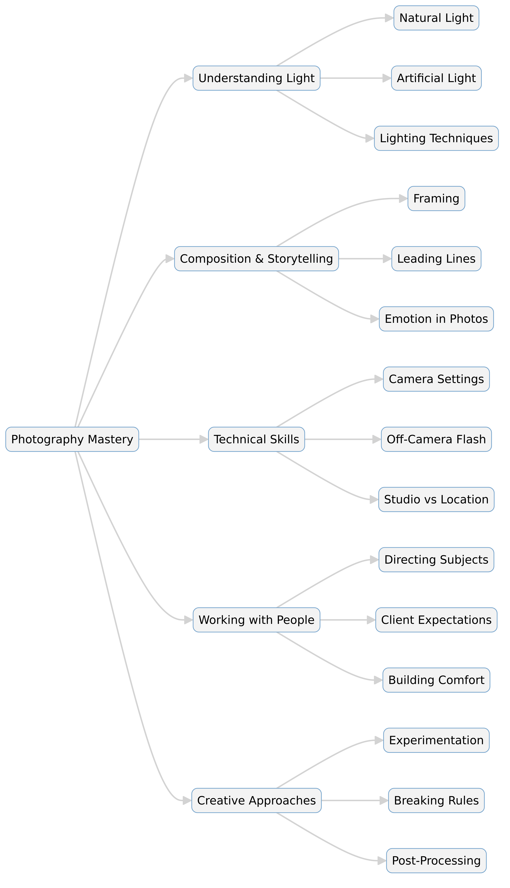

--- 
slug: book-takeaways-the-moment-it-clicks
title: "Book Takeaways: The Moment It Clicks: Photography Secrets from One of the World’s Top Shooters – Joe McNally"

date: 2025-01-20

tags: 
  - Photos
  - Books
  - Book-Takeaways
--- 

### 📸 *The Moment It Clicks: Photography Secrets from One of the World's Top Shooters* – Joe McNally (2008)

Joe McNally, a world-renowned photographer, shares his decades of experience in photography through a mix of storytelling, technical advice, and behind-the-scenes insights. The book provides practical guidance, lighting techniques, and creative inspiration, offering both beginners and professionals valuable lessons on how to capture powerful images.

---

## 🎯 Conclusion  
McNally's book is more than a photography guide—it's a masterclass in vision, creativity, and problem-solving. He emphasizes the importance of knowing your gear but also thinking beyond technical constraints. Through real-world stories, he reveals the challenges photographers face and how to overcome them with ingenuity. His insights into lighting, composition, and storytelling provide a deeper understanding of what makes an image truly remarkable. The book serves as an essential read for photographers looking to elevate their craft by focusing on both technical mastery and artistic expression.

---

## 🔥 Key Points  

📷 **The Power of the Moment**: Great shots often come from intuition, timing, and an ability to anticipate action.  

💡 **Lighting is Everything**: Understanding and controlling light—natural and artificial—is crucial to creating striking images.  

📖 **Storytelling in Photography**: A photo should tell a story, evoke emotion, or create a connection with the viewer.  

🛠️ **Technical Mastery**: While creativity is essential, knowing your gear inside out allows you to shoot confidently in any situation.  

🎭 **Working with People**: Directing subjects, managing client expectations, and creating a comfortable environment lead to better portraits.  

🌍 **Adaptability is Key**: A great photographer must be able to adjust quickly to changing conditions, both in light and subject.  

🎨 **Composition & Framing**: Thoughtful composition, use of lines, and framing techniques elevate an ordinary image into a work of art.  

📝 **Lessons from the Field**: McNally shares real-world experiences from assignments for National Geographic, Life, and TIME.  

🔦 **Off-Camera Flash Techniques**: Using Speedlights and modifiers can dramatically change the impact of an image.  

🧠 **Creative Thinking**: The best images come from stepping outside conventional approaches and experimenting with new perspectives.  

---

## 📌 Summary  

1. **Photography is About Capturing Emotion** – McNally emphasizes that technical skills are essential, but the real magic happens when a photographer captures a feeling, moment, or connection.  

2. **Master Light to Master Photography** – Whether using natural light or strobes, understanding how light shapes an image is fundamental to creating compelling visuals.  

3. **Be Ready for Anything** – Adaptability is crucial in photography. Assignments rarely go as planned, so being flexible with gear, composition, and settings is key.  

4. **Great Photos Tell Stories** – McNally stresses the importance of context and narrative, showing how a single frame can convey deep meaning.  

5. **Experiment and Take Risks** – Some of the best photos come from stepping outside comfort zones, playing with angles, and breaking conventional rules.  

6. **Work with People, Not Just Cameras** – Building rapport with subjects leads to more natural and impactful portraits.  

7. **Learn to See Differently** – Training your eye to notice light, patterns, and emotions is as important as mastering your camera.  

8. **Post-Processing Matters** – While capturing a great image in-camera is ideal, editing helps refine and enhance storytelling.  

9. **Practice, Practice, Practice** – Becoming a great photographer takes years of experience, constant shooting, and learning from mistakes.  

10. **Love What You Do** – Passion for photography is what drives the best images. McNally’s career proves that persistence and enthusiasm lead to success.  

---

### **Details of The Moment It Clicks: Photography Secrets from One of the World's Top Shooters**  
#### *By Joe McNally (2008)*  

---

## **📖 Introduction**  
Joe McNally, an internationally recognized photographer, shares his experiences and insights into professional photography. This book blends technical tips, personal anecdotes, and real-world lessons to help photographers refine their craft. It focuses on the artistic, technical, and emotional aspects of capturing powerful images.  

---

## **🔍 The Art of Seeing**  
### **1. Photography is More Than Just a Camera**  
McNally emphasizes that great photography is about vision, not just equipment. While knowing your gear is crucial, the ability to see and interpret a moment is what makes a photo stand out.  

### **2. The Role of Light in Photography**  
Lighting is the backbone of any strong image. McNally discusses natural light, artificial light, and how to manipulate both to create stunning effects. He shares techniques for using off-camera flash and balancing ambient light with strobes.  

### **3. Composition and Storytelling**  
A good photograph tells a story. McNally explains how composition techniques such as leading lines, framing, and symmetry enhance an image. He stresses that each shot should evoke emotion and connect with viewers.  

---

## **📷 Technical Mastery**  
### **4. Mastering the Camera Settings**  
McNally dives into shutter speed, aperture, and ISO, explaining how these settings affect exposure and creative control. He also discusses when to break traditional rules to achieve unique results.  

### **5. Working with Off-Camera Flash**  
Using Speedlights and strobes effectively can transform a dull image into a masterpiece. McNally shares step-by-step guidance on using lighting modifiers, softboxes, and bounce techniques for professional-quality portraits.  

### **6. Shooting on Location vs. Studio Work**  
The book explores the differences between studio and on-location shooting. McNally explains how to handle challenging environments, from bright outdoor settings to dimly lit interiors.  

---

## **👥 Working with People**  
### **7. Directing Subjects for Stronger Portraits**  
McNally highlights the importance of connecting with people during shoots. His tips include engaging with subjects, making them feel comfortable, and giving clear but natural directions.  

### **8. The Challenges of Assignment Photography**  
Through stories from his career working with *National Geographic*, *TIME*, and *Life*, McNally shares the pressures and unpredictability of professional assignments. He teaches how to adapt quickly and make the most of every opportunity.  

---

## **🎨 Creative Approaches**  
### **9. Thinking Outside the Box**  
Some of the most memorable images come from experimenting with perspective, composition, and unconventional lighting. McNally encourages photographers to push their creative boundaries.  

### **10. The Role of Post-Processing**  
Editing is an essential part of photography. McNally discusses how small adjustments in color, contrast, and exposure can significantly impact an image’s final look.  

---

## **📝 Conclusion**  
*The Moment It Clicks* is more than just a technical manual; it’s a guide to thinking like a photographer. McNally’s combination of real-world experience and practical advice makes this book a valuable resource for photographers of all levels. He emphasizes the importance of persistence, passion, and creativity in developing a unique photographic style.  

---

## **📌 Key Takeaways**  
✔ **Photography is about vision, not just equipment.**  
✔ **Light is the most powerful tool in an image.**  
✔ **A strong photo tells a compelling story.**  
✔ **Understanding camera settings leads to creative freedom.**  
✔ **Off-camera flash can dramatically enhance portraits.**  
✔ **Connecting with subjects creates more authentic images.**  
✔ **Adaptability is essential in professional photography.**  
✔ **Creativity comes from breaking conventional rules.**  
✔ **Editing refines and enhances storytelling.**  
✔ **Passion and persistence lead to photographic success.**  

# 📸 *Expand Summarization of The Moment It Clicks: Photography Secrets from One of the World's Top Shooters* – Joe McNally (2008)  

## 📖 Introduction  
Joe McNally, a renowned photographer known for his work with *National Geographic*, *TIME*, and *Life*, shares a lifetime of lessons in this book. Rather than a step-by-step technical guide, *The Moment It Clicks* combines personal stories, photography tips, and creative insights. It focuses on how photographers can capture emotion, master lighting, and tell compelling stories through images. McNally's book is designed to inspire both amateur and professional photographers, offering real-world lessons from one of the industry's best.  

---

# 🎨 **Section 1: The Art of Seeing**  

## 📷 **1. Photography is More Than Just Equipment**  
McNally stresses that a great image is not about having the best camera but about knowing how to see. A strong vision and the ability to anticipate a moment are far more important than having expensive gear.  

### Key Takeaways:  
- Learn to "see" like a photographer—observe light, emotion, and composition.  
- Train your eye by studying other great images and practicing daily.  
- Your gear is just a tool; what matters is how you use it.  

## ☀️ **2. Mastering Light**  
Lighting is the single most important element in photography. McNally breaks down how to work with both natural and artificial light, emphasizing how light direction, intensity, and quality shape an image.  

### Key Takeaways:  
- **Natural Light:** Use the sun's position to create dramatic effects (e.g., golden hour for warmth, midday light for high contrast).  
- **Artificial Light:** Speedlights, strobes, and LED panels offer control over exposure and mood.  
- **Light Modifiers:** Softboxes, reflectors, and diffusers help create softer or more dramatic lighting.  

## 🎭 **3. Storytelling Through Photography**  
A powerful photo tells a story or conveys an emotion. McNally explains how to use composition, subject placement, and context to create compelling narratives.  

### Key Takeaways:  
- **Composition matters:** Use leading lines, framing, and symmetry to guide the viewer's eye.  
- **Emotion is key:** Capture authentic expressions and interactions.  
- **Avoid clutter:** A strong subject should stand out without distractions.  

---

# 🔧 **Section 2: Technical Mastery**  

## 📸 **4. Understanding Camera Settings**  
McNally simplifies camera settings, explaining how aperture, shutter speed, and ISO work together.  

### Key Takeaways:  
- **Shutter speed:** Controls motion blur or freeze action (e.g., 1/1000 sec for sports).  
- **Aperture:** Adjusts depth of field (e.g., f/1.8 for blurred background, f/11 for landscapes).  
- **ISO:** Affects image brightness and noise (e.g., ISO 100 for clarity, ISO 3200 for low-light).  

## 🔦 **5. Off-Camera Flash Techniques**  
McNally is famous for using Speedlights creatively. He demonstrates how to bounce light, mix flash with ambient light, and use gels for color effects.  

### Key Takeaways:  
- **Avoid direct flash:** Use bounce techniques to soften shadows.  
- **Use multiple lights:** Positioning two or more flashes creates depth.  
- **Experiment with gels:** Colored gels change the mood of an image.  

## 🌍 **6. Shooting on Location vs. Studio Work**  
Shooting outdoors presents different challenges than a controlled studio. McNally provides insights on handling changing light, working in extreme conditions, and dealing with distractions.  

### Key Takeaways:  
- **Outdoor shooting:** Be adaptable—clouds, shadows, and reflections change constantly.  
- **Studio:** Offers full control but requires creative lighting to avoid a flat look.  
- **Be prepared:** Carry backup batteries, memory cards, and weather protection.  

---

# 👥 **Section 3: Working with People**  

## 🤝 **7. Directing Subjects for Stronger Portraits**  
A great portrait depends on how comfortable and natural the subject feels. McNally shares techniques to help photographers interact with people to get authentic expressions.  

### Key Takeaways:  
- **Give simple directions:** Avoid overcomplicating poses—let subjects act naturally.  
- **Make them laugh:** Humor eases tension and results in better expressions.  
- **Engage with the subject:** Conversation builds a connection and trust.  

## 🏆 **8. Managing Clients and Assignments**  
Professional photography isn’t just about taking pictures—it’s about meeting client expectations.  

### Key Takeaways:  
- **Understand the client’s vision:** Ask questions to clarify their needs.  
- **Be punctual and professional:** Clients value reliability as much as skill.  
- **Deliver quality work:** Edit carefully and provide the best final images.  

## 😌 **9. Building Comfort and Confidence**  
Many people feel awkward in front of a camera. McNally explains how to make subjects feel at ease.  

### Key Takeaways:  
- **Use music or a relaxed setting to reduce tension.**  
- **Show them some shots during the session to boost confidence.**  
- **Give positive feedback to make them feel comfortable.**  

---

# 🎨 **Section 4: Creative Thinking in Photography**  

## 🎭 **10. Experimentation and Risk-Taking**  
Some of McNally’s best images came from breaking traditional photography rules.  

### Key Takeaways:  
- **Try unusual angles:** Shoot from high or low perspectives for dramatic effects.  
- **Play with motion blur:** Long exposures can create artistic results.  
- **Use unconventional lighting:** Experiment with colored lights or mixed sources.  

## 📏 **11. When to Break the Rules**  
McNally argues that rules in photography should be guidelines, not strict limits.  

### Key Takeaways:  
- **Center compositions work if balanced with strong colors or contrast.**  
- **Overexposure and underexposure can create artistic effects.**  
- **Blurry or imperfect images can still be powerful if they tell a story.**  

## 🖥 **12. The Role of Post-Processing**  
Editing is part of photography. McNally explains how post-processing enhances but doesn’t replace good shooting techniques.  

### Key Takeaways:  
- **Adjust exposure, contrast, and color balance carefully.**  
- **Use retouching tools sparingly—keep images realistic.**  
- **Cropping can improve composition without losing quality.**  

---

# 🏆 **Conclusion**  
McNally’s *The Moment It Clicks* is both inspiring and practical. He teaches that great photography is about vision, storytelling, and problem-solving rather than just technical settings. His advice spans from lighting and camera techniques to working with people and creative risk-taking. Whether you’re a beginner or a professional, this book offers invaluable insights into capturing powerful images that stand out.  

---

## 🔥 **Key Lessons to Remember**  

✔ **Master lighting—it makes or breaks an image.**  
✔ **A compelling photo tells a story.**  
✔ **Knowing your camera settings gives creative freedom.**  
✔ **Connecting with people leads to better portraits.**  
✔ **Experimentation is key—break the rules when necessary.**  
✔ **Adapt to any environment—be ready for surprises.**  
✔ **Post-processing enhances but doesn’t fix bad photos.**  
✔ **Photography is about passion, patience, and persistence.**  

Would you like a **quiz**, **flashcards**, or **study session** based on this book? 😊