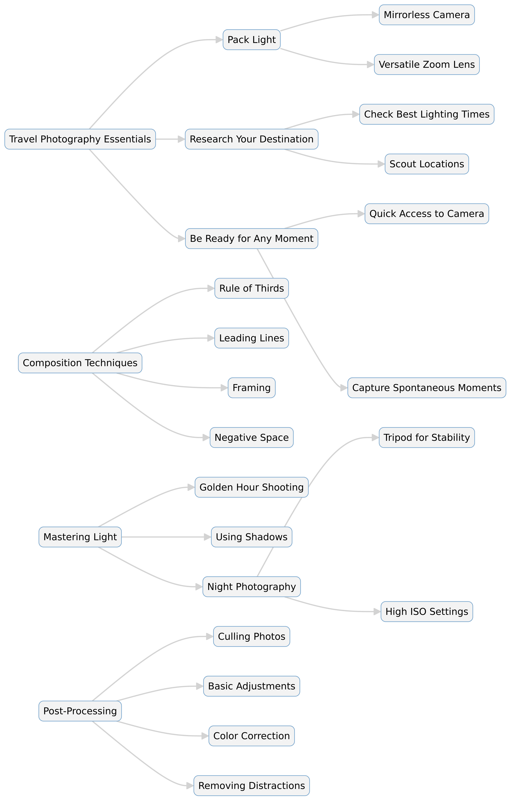

--- 
slug: book-takeaways-the-travel-photography-book
title: "Book Takeaways: The Travel Photography Book – Scott Kelby  "

date: 2025-01-20

tags: 
  - Photos
  - Books
  - Book-Takeaways
--- 

### 📸 *The Travel Photography Book* – Scott Kelby  

Scott Kelby’s *The Travel Photography Book* (2021) is a hands-on guide packed with practical tips for capturing stunning travel photos. Written in a conversational and easy-to-follow style, Kelby shares step-by-step techniques used by professionals to take breathtaking images while traveling. The book covers everything from camera settings and composition to lighting, gear selection, and post-processing, making it an essential resource for both beginners and experienced photographers.  

---  
## 🌍 Conclusion  

Kelby simplifies travel photography by providing actionable advice on composition, lighting, and storytelling. He emphasizes planning, using the right gear efficiently, and capturing the essence of a location without overcomplicating the process. The book includes advice on shooting in different environments (cities, landscapes, portraits, etc.), dealing with challenging lighting, and optimizing workflow from camera to final image. With a focus on real-world application rather than theory, this book is an invaluable guide for travelers who want to elevate their photography skills without carrying excessive equipment.  

---  
## 🔑 Key Takeaways  

📷 **Gear matters, but less is more**: Kelby advises using a minimal setup—typically a lightweight mirrorless or DSLR camera with a versatile zoom lens—to avoid carrying excessive weight.  

🗺 **Plan your shots**: Researching locations, checking weather conditions, and scouting the best times for lighting (golden hour, blue hour) are crucial for great shots.  

📏 **Composition is king**: Applying the rule of thirds, leading lines, and framing techniques can significantly improve the quality of travel photos.  

🌞 **Master lighting**: Natural light is your best friend, but knowing how to use reflectors, flash, and exposure compensation helps in challenging situations.  

👥 **People and culture make a story**: Including local people in travel shots adds depth and authenticity, but always seek permission when necessary.  

📌 **Avoid cliché shots**: Instead of capturing overdone tourist angles, look for unique perspectives, details, and cultural nuances.  

📱 **Use your smartphone wisely**: Today’s smartphones can take stunning images; learning manual controls and using apps for editing can enhance results.  

💻 **Post-processing is essential**: Editing with software like Lightroom or Photoshop helps bring out the best in your images, but subtlety is key.  

🚫 **Avoid overpacking gear**: Travel light with a good camera, spare batteries, memory cards, and a portable tripod instead of carrying every lens you own.  

🌆 **Shooting at night requires different techniques**: Stabilization (tripod or handheld tricks), high ISO settings, and careful exposure control are crucial for capturing nightscapes.  

---  
## ✨ Summary  

1. **Understanding Travel Photography**: Kelby introduces the core principles of travel photography, emphasizing storytelling, composition, and capturing emotion in images.  

2. **Choosing the Right Gear**: He provides recommendations for cameras, lenses, tripods, and accessories that are practical for travel without being overly bulky.  

3. **Mastering Composition**: Simple yet powerful techniques like leading lines, symmetry, and framing can turn an average shot into a stunning image.  

4. **Lighting Techniques**: Natural light is best, but learning to work with artificial light, reflectors, and flash can save challenging shots.  

5. **Portraits & People Photography**: Capturing local people adds authenticity, and Kelby shares tips on how to approach and photograph strangers respectfully.  

6. **Shooting Landscapes & Cityscapes**: He details how to capture dramatic scenery, use filters (like ND and polarizers), and shoot in varying weather conditions.  

7. **Mobile Photography Tips**: Smartphones can be powerful tools, and Kelby explains how to use them effectively with composition tricks and editing apps.  

8. **Post-Processing Workflow**: Editing enhances photos, and he provides step-by-step techniques using Lightroom and Photoshop to refine images.  

9. **Practical Travel Advice for Photographers**: From keeping gear safe to backing up photos and avoiding tourist-trap shots, Kelby offers useful insights.  

10. **Advanced Techniques**: For those looking to go beyond basics, he discusses long-exposure photography, HDR techniques, and creative shooting methods.  

---

# 📸 Detail Summary of The Travel Photography Book: Step-by-Step Techniques to Capture Breathtaking Travel Photos Like the Pros  
### ✍️ By Scott Kelby (2021, Rocky Nook)  

## 📖 Introduction  

Travel photography is more than just snapping pictures of famous landmarks; it's about storytelling, capturing the soul of a place, and preserving memories with professional-quality images. In *The Travel Photography Book*, Scott Kelby provides a step-by-step guide to help travelers take breathtaking photos using simple, practical techniques. This book is packed with expert advice on camera settings, composition, lighting, and editing—without overwhelming readers with technical jargon.  

Kelby’s approach is straightforward, emphasizing real-world strategies that photographers of all skill levels can use immediately. Whether you shoot with a DSLR, mirrorless camera, or smartphone, this book teaches you how to elevate your travel photos with minimal gear and maximum creativity.  

---  

## 🏞️ Chapter 1: Travel Photography Essentials  

Kelby starts with the fundamentals, explaining that great travel photography doesn’t depend on expensive equipment but on preparation and vision. He shares key principles:  

- **Pack Light**: Carrying too much gear can slow you down and attract unwanted attention. A lightweight mirrorless camera with a zoom lens is often ideal.  
- **Research Your Destination**: Look up iconic photography spots, best times for lighting, and cultural norms regarding photography.  
- **Be Ready for Any Moment**: Keep your camera accessible and learn to shoot quickly to capture unexpected moments.  

---  

## 📷 Chapter 2: The Right Gear for Travel Photography  

While Kelby acknowledges that gear isn’t everything, he outlines the ideal travel photography setup:  

- **Camera**: A mirrorless or DSLR with a good dynamic range and fast autofocus.  
- **Lenses**: A versatile zoom lens (24-105mm) covers most needs, while a prime lens (50mm or 85mm) is great for portraits.  
- **Tripod**: A lightweight travel tripod helps with low-light and long-exposure shots.  
- **Accessories**: Extra batteries, memory cards, a polarizing filter, and a small cleaning kit.  

He also offers smartphone photography tips, showing that modern phones can take excellent travel shots if used properly.  

---  

## 🖼️ Chapter 3: Composition – The Secret to Great Travel Photos  

Good composition turns an average photo into an outstanding one. Kelby shares practical techniques:  

- **Rule of Thirds**: Place subjects off-center for a more balanced image.  
- **Leading Lines**: Use roads, bridges, or paths to draw the viewer’s eye into the scene.  
- **Framing**: Frame your subject using arches, windows, or natural elements for added depth.  
- **Negative Space**: A clean background helps subjects stand out.  

He also stresses avoiding clichés and finding unique perspectives instead of capturing overdone tourist shots.  

---  

## ☀️ Chapter 4: Mastering Natural and Artificial Light  

Lighting is crucial in photography, and Kelby covers both natural and artificial lighting techniques:  

- **Golden Hour**: The best light is shortly after sunrise and before sunset.  
- **Blue Hour**: The period just after sunset is great for cityscapes.  
- **Harsh Midday Light**: Use shadows, reflections, or shoot in shaded areas to soften light.  
- **Night Photography**: Use a tripod and long exposure settings to capture night scenes without blur.  

For indoor and low-light conditions, he discusses using small LED lights or external flashes subtly.  

---  

## 👥 Chapter 5: Capturing People & Cultures  

Kelby highlights the importance of photographing people to bring authenticity to travel stories. His tips include:  

- **Respect Cultural Norms**: Always ask permission before photographing people, especially in religious or private settings.  
- **Candid vs. Posed Shots**: Natural expressions often look better than forced poses.  
- **Use a Longer Lens**: A 70-200mm lens allows for natural-looking portraits without getting too close.  
- **Capture Daily Life**: Markets, street musicians, and artisans offer dynamic storytelling opportunities.  

---  

## 🏙️ Chapter 6: Photographing Landscapes and Cityscapes  

Whether capturing mountains or urban skylines, Kelby shares strategies for breathtaking landscape shots:  

- **Use a Tripod for Sharpness**: Helps with long exposures and stability.  
- **Foreground Elements Add Depth**: Rocks, flowers, or street elements enhance composition.  
- **Clouds Make the Sky More Interesting**: Overcast skies often result in more dramatic photos.  
- **Reflections Enhance Cityscapes**: Puddles, lakes, and rivers add a creative touch.  

For cityscapes, he suggests using wide-angle lenses for expansive views and telephoto lenses to isolate architectural details.  

---  

## 📱 Chapter 7: Smartphone Travel Photography  

Kelby acknowledges that today’s smartphones can take professional-quality images. His mobile photography tips include:  

- **Use HDR Mode**: Helps balance shadows and highlights.  
- **Third-Party Camera Apps**: Apps like Halide or Lightroom Mobile offer better manual controls.  
- **Edit on the Go**: Snapseed and Lightroom Mobile are powerful for quick edits.  

Smartphone cameras work best in good lighting, but knowing how to adjust settings can improve results in difficult conditions.  

---  

## 💻 Chapter 8: Post-Processing and Editing  

Editing is a crucial step in travel photography. Kelby provides a simple workflow:  

1. **Cull Photos**: Select the best shots and delete duplicates.  
2. **Basic Adjustments**: Crop, straighten, and correct exposure in Lightroom or Photoshop.  
3. **Color Correction**: Adjust white balance, contrast, and saturation.  
4. **Remove Distractions**: Use the healing tool to eliminate unwanted objects.  
5. **Sharpen & Export**: Save images in high resolution for prints and lower resolution for web use.  

He warns against over-editing and emphasizes keeping images natural-looking.  

---  

## ✈️ Chapter 9: Practical Travel Photography Advice  

Kelby shares essential travel tips for photographers:  

- **Back Up Photos Daily**: Use external hard drives or cloud storage.  
- **Be Aware of Local Laws**: Some countries have strict photography rules.  
- **Blend In**: Avoid drawing attention to expensive gear in high-theft areas.  
- **Stay Flexible**: Weather and unexpected events may require quick changes in plans.  

---  

## 🌟 Chapter 10: Advanced Photography Techniques  

For those who want to take their skills further, Kelby introduces:  

- **Long Exposure Photography**: Creating silky water effects or capturing star trails.  
- **HDR Photography**: Merging multiple exposures for high-contrast scenes.  
- **Panoramas**: Stitching multiple images together for wide-angle landscapes.  
- **Black & White Travel Photography**: Removing color to focus on textures and contrast.  

---  

## 🎯 Conclusion  

Scott Kelby’s *The Travel Photography Book* is a practical, no-nonsense guide for travelers who want to improve their photography without carrying excessive gear. He emphasizes simple techniques, proper lighting, and smart composition rather than overcomplicating the process. Whether you’re a beginner or an experienced photographer, this book provides actionable tips to make every travel shot look more professional.  

By mastering the basics of composition, lighting, and storytelling, anyone can elevate their travel photography game and return home with images that truly capture the essence of their journey.  

---  

# 📸 *The Travel Photography Book* – In-Depth Summary  

Scott Kelby’s *The Travel Photography Book* is a step-by-step guide for capturing stunning travel photos, whether using a DSLR, mirrorless camera, or smartphone. The book focuses on practical techniques used by professionals while keeping things simple and accessible for travelers of all skill levels. Kelby shares expert advice on composition, lighting, gear, and post-processing, ensuring that anyone can take breathtaking images without carrying excessive equipment.  

---  

## 🌍 Chapter 1: Travel Photography Essentials  

Kelby emphasizes that great travel photography isn’t about expensive gear but about preparation, creativity, and an eye for storytelling. He highlights:  

- **Minimalist Gear**: Carrying too much equipment can slow you down and make travel less enjoyable.  
- **Researching Locations**: Checking the best times for lighting and planning key shots in advance.  
- **Being Spontaneous**: While planning helps, staying ready for unexpected moments leads to some of the best shots.  

He also advises keeping camera settings simple to focus on capturing the moment rather than constantly adjusting dials.  

---  

## 📷 Chapter 2: Choosing the Right Gear  

While gear isn’t the most important factor, having the right tools makes a difference. Kelby recommends:  

- **Camera**: A mirrorless or DSLR with a good dynamic range and fast autofocus.  
- **Lenses**: A 24-105mm zoom lens for versatility, and a 50mm or 85mm prime lens for portraits.  
- **Tripod**: A lightweight, travel-friendly tripod for stability in low-light situations.  
- **Accessories**: Extra batteries, memory cards, a polarizing filter, and a small camera cleaning kit.  

He also covers smartphone photography, explaining that modern phones can take excellent shots with the right technique.  

---  

## 🖼️ Chapter 3: Mastering Composition  

Composition plays a key role in making travel photos stand out. Kelby shares the most effective techniques:  

- **Rule of Thirds**: Placing the subject off-center for a balanced composition.  
- **Leading Lines**: Roads, rivers, or pathways draw the viewer’s eye into the image.  
- **Framing**: Using natural elements like doorways, windows, or trees to create depth.  
- **Negative Space**: Keeping the background simple to emphasize the subject.  

He also encourages photographers to find fresh perspectives rather than relying on overused tourist shots.  

---  

## ☀️ Chapter 4: Working with Light  

Lighting is one of the most important elements in photography. Kelby provides tips on using natural and artificial light effectively:  

- **Golden Hour (Sunrise & Sunset)**: The best time for warm, soft lighting.  
- **Blue Hour (Twilight)**: Perfect for moody cityscapes and landscapes.  
- **Midday Challenges**: Harsh light can create unflattering shadows; use shade or adjust exposure settings.  
- **Night Photography**: A tripod, high ISO, and slow shutter speed help capture nighttime scenes without blur.  

For indoor and low-light conditions, he discusses using small LED lights or an external flash to maintain natural-looking light.  

---  

## 👥 Chapter 5: Photographing People & Culture  

Photographing people brings authenticity to travel photography. Kelby shares strategies for capturing portraits:  

- **Respect and Permission**: Always ask before taking pictures of strangers, especially in private or religious spaces.  
- **Candid vs. Posed Shots**: Natural expressions often make for more engaging portraits.  
- **Using a Telephoto Lens**: A longer lens allows for intimate shots without intruding on a subject’s space.  
- **Documenting Daily Life**: Capturing street vendors, musicians, and artisans tells a story about a place.  

---  

## 🌆 Chapter 6: Shooting Landscapes & Cityscapes  

Capturing the beauty of a location requires the right techniques:  

- **Use a Tripod**: Helps with long exposure shots and keeping images sharp.  
- **Foreground Elements**: Rocks, flowers, or street objects add depth and context.  
- **Weather Considerations**: Overcast skies add drama, while clear skies are great for minimalistic shots.  
- **Reflections & Symmetry**: Using water, mirrors, and buildings to create compelling compositions.  

For cityscapes, he suggests wide-angle lenses for expansive views and telephoto lenses to highlight architectural details.  

---  

## 📱 Chapter 7: Smartphone Travel Photography  

Kelby acknowledges that today’s smartphones are capable of capturing high-quality travel photos. His tips for maximizing mobile photography include:  

- **Use HDR Mode**: Helps balance bright and dark areas in a scene.  
- **Third-Party Camera Apps**: Apps like Halide or Lightroom Mobile offer better manual controls.  
- **Post-Processing on the Go**: Apps like Snapseed and Lightroom Mobile can enhance images quickly.  

He stresses that composition and lighting matter more than megapixels, making skill more important than equipment.  

---  

## 💻 Chapter 8: Post-Processing and Editing  

Editing is essential for refining travel photos. Kelby shares a simple editing workflow:  

1. **Culling Photos**: Select the best images and delete unnecessary ones.  
2. **Basic Adjustments**: Crop, straighten, and correct exposure in Lightroom or Photoshop.  
3. **Color Correction**: Adjust white balance, contrast, and saturation to bring out the best in the image.  
4. **Removing Distractions**: Use the healing tool to eliminate unwanted objects in the frame.  
5. **Sharpening & Exporting**: Ensure images are high resolution for prints and optimized for sharing online.  

He advises subtle editing to keep photos looking natural rather than overprocessed.  

---  

## ✈️ Chapter 9: Practical Travel Photography Tips  

Beyond technical skills, Kelby offers important advice for traveling photographers:  

- **Back Up Photos Daily**: Use external drives or cloud storage to prevent data loss.  
- **Know Local Photography Laws**: Some countries have strict regulations about taking pictures.  
- **Be Aware of Theft Risks**: Avoid drawing attention to expensive gear in crowded or unsafe areas.  
- **Be Flexible**: Weather, access restrictions, and unexpected events may require quick adjustments to plans.  

---  

## 🌟 Chapter 10: Advanced Techniques  

For those looking to push their skills further, Kelby introduces:  

- **Long Exposure Photography**: Blurring water and capturing star trails.  
- **HDR Photography**: Combining multiple exposures for high-contrast scenes.  
- **Panoramas**: Stitching multiple images together for wide landscapes.  
- **Black & White Photography**: Focusing on textures, contrast, and composition.  

---  

## 🎯 Conclusion  

Scott Kelby’s *The Travel Photography Book* is a highly practical, no-nonsense guide for anyone wanting to improve their travel photography. He focuses on simple, effective techniques rather than overwhelming readers with technical details. Whether you’re a beginner or an experienced photographer, this book offers valuable insights into capturing stunning travel images with minimal effort.  

By mastering composition, lighting, and storytelling, you can create compelling travel photos that go beyond typical tourist snapshots and truly capture the essence of a place.  

---  

## 📊 Travel Photography Techniques Table  

| **Category**             | **Key Techniques & Tips** |
|-------------------------|----------------------------|
| 📷 **Gear Selection** | Use a mirrorless or DSLR with a versatile zoom lens (24-105mm). Keep gear lightweight to travel efficiently. |
| 🗺 **Planning** | Research locations, check lighting conditions, and plan your shots ahead of time. |
| 🎨 **Composition** | Apply the rule of thirds, leading lines, and framing techniques to improve image structure. |
| ☀️ **Lighting** | Shoot during golden hour or blue hour for the best natural lighting. Use reflectors or artificial lights when needed. |
| 👥 **Portraits** | Capture people in natural settings, ask permission when necessary, and use a telephoto lens for candid shots. |
| 🌆 **Landscapes & Cityscapes** | Use foreground elements for depth, work with reflections, and adjust settings for dramatic weather conditions. |
| 📱 **Smartphone Photography** | Use HDR mode, third-party camera apps, and post-process with mobile editing apps like Lightroom Mobile. |
| 🖥 **Post-Processing** | Enhance images with exposure correction, color grading, and object removal using Lightroom or Photoshop. |
| 🔐 **Safety & Backup** | Back up images daily, store them in cloud storage, and keep gear secure while traveling. |
| 🚀 **Advanced Techniques** | Experiment with long exposure, HDR photography, and panoramic shots for more creative compositions. |

---

## 📸 Quotes from *The Travel Photography Book* – Scott Kelby  

### ✨ On Gear and Preparation  
📌 *"The best travel camera is the one you’ll actually carry with you all day."*  

📌 *"You don’t need a huge camera bag full of lenses—one good zoom lens will cover 90% of what you shoot."*  

📌 *"Spending a little time researching your destination will pay off in a big way when it’s time to shoot."*  

### 🎨 On Composition and Creativity  
📌 *"Great travel photos aren’t just about the place—they’re about how you see the place."*  

📌 *"The easiest way to improve your photos instantly? Stop putting your subject dead-center in the frame."*  

📌 *"Leading lines are your best friend—use roads, fences, or bridges to guide the viewer’s eye through the image."*  

### ☀️ On Lighting and Timing  
📌 *"If you want beautiful light, you have to chase it—sunrise and sunset are your golden opportunities."*  

📌 *"Bad weather makes great photos—clouds, fog, and rain add drama and mood to your shots."*  

📌 *"Don’t be afraid of shadows. Sometimes, what you leave in the dark is just as important as what you light up."*  

### 📱 On Smartphone Photography  
📌 *"Your phone’s camera is more powerful than you think—learn its settings and use them to your advantage."*  

📌 *"Editing is part of photography. Even pros enhance their photos before sharing them."*  

### 🛡️ On Travel and Safety  
📌 *"Always have a backup—whether it’s an extra battery, memory card, or cloud storage for your photos."*  

📌 *"Be respectful of the culture you’re photographing—sometimes, putting the camera down is the right choice."*  

📌 *"Some of the best shots happen when you least expect them—always keep your camera within reach."*  

---

## 🎯 Travel Photography Quiz  

Test your knowledge with this quiz based on *The Travel Photography Book*!  

🔗 **[Start the Quiz](https://questions.widenex.com/e574bb95-dccd-4265-bebd-4dfde43392f3)**  

## Others
