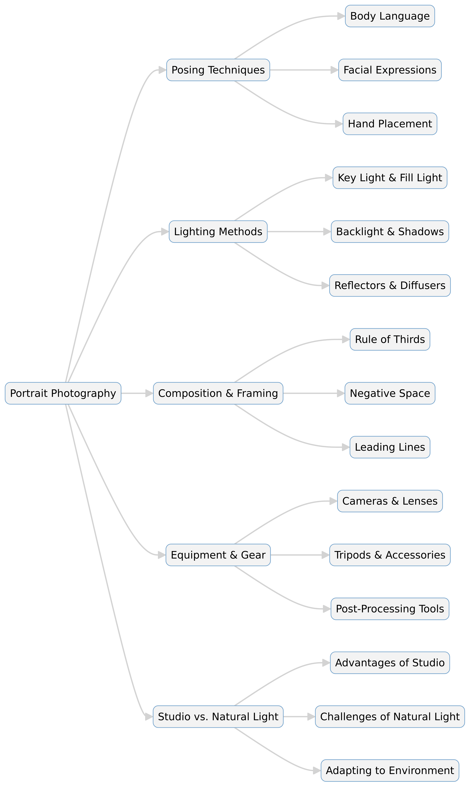

--- 
slug: book-takeaways-portrait-photography-secrets-of-posing-lighting
title: "Book Takeaways: Portrait Photography: Secrets of Posing & Lighting – Mark Cleghorn"

date: 2025-01-20

tags: 
  - Photos
  - Books
  - Book-Takeaways
--- 

### 📖 *Portrait Photography: Secrets of Posing & Lighting* – Mark Cleghorn  

This book is a detailed guide to mastering the art of portrait photography, covering essential techniques in posing, lighting, and composition. Mark Cleghorn, an experienced photographer, shares his expertise to help photographers enhance their skills, whether they are beginners or professionals. The book provides practical tips, illustrated examples, and step-by-step instructions to improve portrait photography results.

---

## 📌 Key Takeaways  

📸 **Posing Fundamentals**: The book breaks down the principles of posing, focusing on body language, hand placement, and expressions to create natural and engaging portraits.  

💡 **Lighting Techniques**: Cleghorn explains different lighting setups, such as natural light, studio lighting, and reflectors, showing how to manipulate shadows and highlights for various effects.  

👀 **Understanding Facial Features**: Tips on how to photograph different face shapes, enhance features, and minimize imperfections with lighting and angles.  

🎭 **Mood & Expression**: Guidance on directing subjects to convey emotions that enhance the portrait's storytelling quality.  

🌅 **Outdoor vs. Studio Shooting**: The book compares the advantages and challenges of shooting in natural light versus controlled studio environments.  

📷 **Equipment & Lenses**: Insights into choosing the right camera gear, including lens selection for different styles of portraiture.  

🖼 **Composition & Framing**: Strategies for positioning the subject within the frame to create visually appealing and balanced images.  

🎨 **Color & Black-and-White Photography**: How to decide between color and monochrome for different moods and artistic effects.  

📖 **Practical Case Studies**: Real-world examples and step-by-step breakdowns of professional portrait sessions.  

🛠 **Troubleshooting & Common Mistakes**: Advice on avoiding typical errors in lighting, posing, and exposure settings.  

---

## 📚 Summary  

1️⃣ *The Art of Posing*: Cleghorn emphasizes that posing is an essential skill in portrait photography. He provides techniques to make subjects look natural and comfortable, explaining the importance of posture, angles, and hand placement.  

2️⃣ *Lighting Essentials*: The book covers various lighting techniques, including key light, fill light, and backlight. It explores how soft and hard light affects the final image and how to use reflectors and diffusers.  

3️⃣ *Facial Analysis & Expression*: Cleghorn discusses how different face shapes require different lighting approaches. He also explains how to guide subjects to achieve flattering expressions.  

4️⃣ *Studio vs. Natural Light*: The book compares controlled lighting in a studio versus unpredictable natural light, offering tips to adapt to both environments effectively.  

5️⃣ *Gear & Equipment Choices*: From camera bodies to lenses and lighting equipment, Cleghorn suggests the best tools for portrait photography and explains how each affects the final result.  

6️⃣ *Creating Mood in Portraits*: Different lighting setups, color choices, and posing strategies can influence the mood of an image. The book details how to create dramatic, soft, or vibrant portraits.  

7️⃣ *Composing the Perfect Shot*: Using the rule of thirds, leading lines, and negative space, Cleghorn provides guidance on arranging subjects within the frame for a balanced composition.  

8️⃣ *Editing & Post-Processing*: Basic retouching techniques, including skin smoothing, color correction, and black-and-white conversions, are discussed.  

9️⃣ *Real-World Examples*: The book includes case studies of professional shoots, showing step-by-step how to achieve certain looks and effects.  

🔟 *Avoiding Common Pitfalls*: Cleghorn addresses common issues like unflattering shadows, overexposed highlights, and awkward poses, providing solutions to fix them.  

---

# 📸 Details of Portrait Photography: Secrets of Posing & Lighting  
### *By Mark Cleghorn*  

## 📖 Introduction  
Portrait photography is more than just capturing a face—it’s about storytelling, emotion, and technical mastery. In *Portrait Photography: Secrets of Posing & Lighting*, Mark Cleghorn shares expert techniques to help photographers refine their skills in posing, lighting, and composition. Whether working in a studio or using natural light, Cleghorn’s practical advice enhances the ability to create stunning portraits.  

---

## 🏛 The Fundamentals of Posing  

### 📍 The Importance of Posing  
Posing is crucial in portrait photography as it dictates body language, comfort, and expression. Cleghorn explains how to position the subject naturally, ensuring flattering angles and a relaxed demeanor.  

### 👤 Body Positioning  
- **The S-curve pose**: A natural and elegant posture often used for female portraits.  
- **Weight distribution**: Subjects should shift weight onto one leg for a more relaxed look.  
- **Chin and jawline**: Tilting the head slightly forward enhances definition.  

### ✋ Hand Placement & Facial Expressions  
- **Hands should be relaxed**—stiff hands can ruin a pose.  
- **Expressions must match the mood**—smiling, serious, or thoughtful.  
- **Eye direction matters**—looking into the camera vs. gazing away.  

---

## 💡 Mastering Lighting Techniques  

### ☀ Natural vs. Studio Lighting  
Lighting defines a portrait’s mood and quality. Cleghorn compares different lighting setups:  
- **Natural light**: Soft, organic, and easy to work with outdoors.  
- **Studio light**: Offers control over intensity, shadows, and highlights.  

### 🔆 Key Lighting Techniques  
- **Key light**: The primary source of illumination.  
- **Fill light**: Softens shadows to balance exposure.  
- **Backlight**: Creates depth and separation from the background.  

### 🎭 Light Modifiers & Effects  
- **Reflectors**: Bounce light to brighten shadows.  
- **Diffusers**: Soften harsh lighting.  
- **Gels & color filters**: Add creative effects to portraits.  

---

## 📐 Composition & Framing  

### 🏛 Rules of Composition  
- **Rule of thirds**: Place the subject off-center for dynamic balance.  
- **Leading lines**: Use elements in the scene to direct attention to the subject.  
- **Negative space**: Leaving empty space around the subject can enhance impact.  

### 📏 Framing Techniques  
- **Tight crop for intimacy**: Close-up shots emphasize emotion.  
- **Using foreground elements**: Creates depth and layers in the image.  
- **Headroom balance**: Avoid cutting off essential parts of the subject.  

---

## 📷 Equipment & Gear  

### 🏆 Choosing the Right Camera & Lens  
- **Full-frame vs. crop sensor cameras**: Full-frame offers better depth and low-light performance.  
- **Portrait lenses**:  
  - **50mm** – Versatile and natural-looking.  
  - **85mm** – Ideal for professional headshots.  
  - **70-200mm** – Great for compressed backgrounds and flattering portraits.  

### 🎛 Essential Accessories  
- **Tripods**: For stability in low-light conditions.  
- **External flashes**: Provide additional light control.  
- **Light meters**: Help achieve precise exposure.  

---

## 🏡 Studio vs. Outdoor Portraits  

### 🎬 Advantages of Studio Photography  
- **Complete control over lighting**  
- **No weather limitations**  
- **Consistent results**  

### 🌳 Challenges & Benefits of Outdoor Photography  
- **Natural backdrops create unique aesthetics**  
- **Unpredictable lighting requires quick adjustments**  
- **Golden hour (sunrise/sunset) produces stunning results**  

### 🎭 Adapting to Different Environments  
- Use reflectors in harsh sunlight.  
- Find open shade for softer light.  
- Adjust white balance based on surroundings.  

---

## 🖼 Post-Processing & Retouching  

### ✍ Basic Edits for Portraits  
- **Skin smoothing (without over-processing)**  
- **Color correction for accurate tones**  
- **Sharpening details like eyes and hair**  

### 🎨 Black & White vs. Color Editing  
- **Black & white for dramatic effect**  
- **Color for vibrancy and warmth**  
- **Selective color grading for creative styles**  

---

## 🚀 Conclusion  
Mark Cleghorn’s *Portrait Photography: Secrets of Posing & Lighting* is an invaluable resource for photographers looking to refine their skills. From mastering posing techniques to manipulating lighting for artistic effect, the book provides step-by-step guidance that enhances portrait photography. Whether working with natural light or in a controlled studio environment, Cleghorn’s insights help photographers capture more compelling and professional portraits.  

# 📸 *Portrait Photography: Secrets of Posing & Lighting* – Expanded Summary  
### *By Mark Cleghorn*  

## 🏆 Introduction  
Portrait photography is an art that combines technical expertise with creative vision. In *Portrait Photography: Secrets of Posing & Lighting*, Mark Cleghorn breaks down the essential elements of posing, lighting, composition, and equipment selection. His goal is to help photographers create natural, flattering, and visually compelling portraits. The book is filled with step-by-step guides, real-world examples, and professional tips for working with both studio and natural light. Whether you’re a beginner or an experienced photographer, this book provides the knowledge needed to elevate portrait photography to a professional level.  

---

## 📍 Chapter 1: Understanding Posing  

### 💃 Why Posing Matters  
Posing is a fundamental aspect of portrait photography because it shapes the subject’s body language, emotional expression, and overall aesthetic. Cleghorn emphasizes that a well-posed subject appears confident, comfortable, and natural.  

### 📏 Key Posing Techniques  
- **Weight Distribution**: Having the subject shift their weight onto one leg creates a more relaxed and natural look.  
- **Head Positioning**: Slightly tilting the head forward and to the side enhances facial structure and jawline.  
- **Hand Placement**: Relaxed hands prevent awkwardness; fingers should be slightly curved rather than stiff.  
- **Posture & Lines**: A straight spine with relaxed shoulders improves body posture. S-curves and triangular compositions make poses more dynamic.  

### 👀 Expressions & Eye Contact  
- *Direct gaze*: Engages the viewer, making the portrait feel personal.  
- *Looking away*: Can add mystery or storytelling elements.  
- *Natural smiles*: Achieved by engaging the subject in conversation rather than forcing a pose.  

---

## 💡 Chapter 2: Lighting Mastery  

### 🌞 Natural Light vs. Artificial Light  
- **Natural Light**: Soft and flattering but requires adaptability. Golden hour (early morning and late afternoon) provides the best results.  
- **Studio Light**: Controlled and consistent, allowing photographers to shape the light precisely.  

### 🔆 The Three-Point Lighting Setup  
1. **Key Light** – The main light source, placed at a 45-degree angle to the subject.  
2. **Fill Light** – Softens shadows and adds depth.  
3. **Backlight (Rim Light)** – Creates separation between the subject and the background.  

### 🌗 Light Modifiers & Their Effects  
- **Reflectors**: Bounce light to fill in shadows.  
- **Softboxes**: Create soft, even lighting.  
- **Beauty Dishes**: Enhance facial features with contrast.  
- **Gels & Filters**: Add color and mood to images.  

---

## 📐 Chapter 3: Composition & Framing  

### 🖼 The Rule of Thirds  
- Placing the subject off-center makes the image more dynamic.  
- The eyes should generally align with the upper third of the frame.  

### 🔲 Negative Space & Leading Lines  
- **Negative Space**: Leaves room around the subject to create breathing space in the composition.  
- **Leading Lines**: Elements such as pathways, fences, or shadows guide the viewer’s eye toward the subject.  

### ✂ Cropping & Perspective  
- Close-ups emphasize emotions.  
- Shooting from slightly above enhances facial proportions, while low angles create a powerful look.  

---

## 📷 Chapter 4: Selecting the Right Equipment  

### 📸 Best Cameras for Portraits  
- **Full-frame cameras**: Provide excellent depth of field and low-light performance.  
- **Crop sensor cameras**: More affordable but require careful lens selection for portraits.  

### 🔍 Lens Selection  
- **50mm (Prime Lens)** – Great for natural-looking portraits.  
- **85mm (Portrait Lens)** – Provides beautiful background compression.  
- **70-200mm (Telephoto Lens)** – Perfect for professional portraits with soft backgrounds.  

### 🛠 Essential Accessories  
- **Tripods**: Useful for studio and long-exposure shots.  
- **External Flashes**: Provide additional light control.  
- **Light Meters**: Help achieve perfect exposure.  

---

## 🏡 Chapter 5: Studio vs. Outdoor Photography  

### 🏢 Advantages of Studio Portraits  
- Controlled lighting conditions.  
- Ability to manipulate shadows and highlights.  
- No interference from weather.  

### 🌿 Benefits & Challenges of Outdoor Photography  
- Natural backdrops create beautiful, organic aesthetics.  
- Unpredictable weather and lighting conditions require adaptability.  
- The golden hour produces the best outdoor portraits.  

### 🌍 Adapting to Different Environments  
- Using reflectors in harsh sunlight prevents overexposed highlights.  
- Open shade provides soft, even lighting.  
- White balance adjustments help correct color temperature shifts.  

---

## 🖥 Chapter 6: Post-Processing & Editing  

### 🎨 Basic Retouching  
- Skin smoothing without over-processing.  
- Enhancing eyes and sharpening details.  
- Removing blemishes while keeping natural texture.  

### 🌈 Color vs. Black & White  
- Color portraits are vibrant and lively.  
- Black & white photos focus on contrast and emotion.  
- Selective color grading can create mood and artistic effects.  

### 🛠 Editing Software  
- **Adobe Lightroom** for global adjustments.  
- **Photoshop** for advanced retouching.  
- **Capture One** for professional color grading.  

---

## 🚀 Chapter 7: Troubleshooting & Common Mistakes  

### ❌ Avoiding Unflattering Poses  
- Watch for unnatural angles that distort the subject’s features.  
- Ensure hands are placed naturally—never stiff or clenched.  

### 🌟 Fixing Lighting Issues  
- Use reflectors or a fill light to balance harsh shadows.  
- Adjust the key light to minimize unflattering nose shadows.  
- Control background brightness to prevent distractions.  

### ⚡ Preventing Technical Errors  
- Always double-check focus, especially on the eyes.  
- Use proper aperture settings (f/2.8-f/5.6) for flattering depth of field.  
- Adjust white balance to match the lighting environment.  

---

## 🎯 Conclusion  

Mark Cleghorn’s *Portrait Photography: Secrets of Posing & Lighting* is a comprehensive guide for photographers looking to improve their craft. From perfecting posing techniques to mastering lighting setups, Cleghorn provides expert advice that enhances portrait photography. His insights on composition, gear selection, and post-processing help photographers achieve stunning and professional-looking results. Whether working in a controlled studio or adapting to outdoor environments, the skills in this book will elevate any photographer’s portrait work.  

---
 