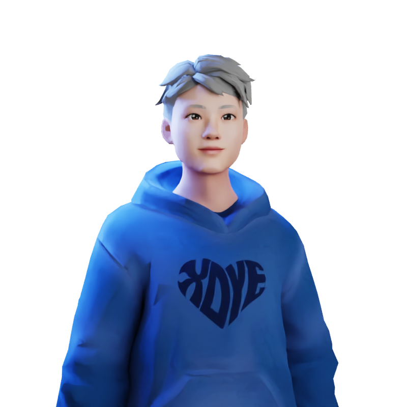

    

Hi!

I'm Ky, a Software Engineer living in Seoul, Korea.
Currently, I work as an ML Software Engineer at AItheNutrigene, where I work with a cross-functional team of five, building unique products and intelligent solutions that are helping people and businesses achieve more by using Machine Learning! 

I'm deeply passionate about creating loved and trusted products that help people improve their skills and achieve their goals.

Competencies: Mobile Development, Deep Learning Models, Unix/Linux Environment, Large Software Systems, OOP..

## Current status:

* Conversational AI, VAD, Speech Commands 
* Clean Architecture, Design Pattern
* Familiar with Reactive programming

* Increase my Korean ability
* Need exercise every day (walkingpad, pull-ups, dumbbell)
* Learn sth new, One commit a day (not only code but for my blog posts)

* -Efficiently use iPad for managing & studying-
* -Understanding Machine Learning in Production (MLOps)-  => [Done](https://coursera.org/share/78562cedf72c31cc18abe6d0607b2fed)
* -Natural Language Processing basics- => [Done](https://www.coursera.org/account/accomplishments/specialization/certificate/PTVXPH6WC6KD)

## Interesting in:
#Productivity #Exercise #StockInvestment #Property #SoftwareEngineering

