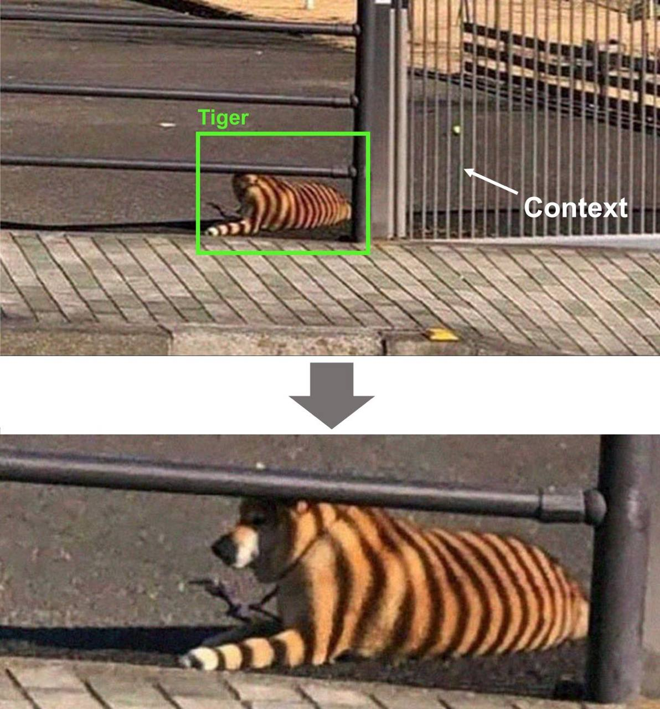

--- 
slug: contextual-ai-human-like-ai-system
title: "Contextual AI: human-like AI system"

date: 2022-03-31

tags: 

  - AI & ML

--- 

Currently, We are building a chatbot that can chat and confide in humans like a real friend. One of problems with existing chatbots is that they cannot remember previous conversations. Therefore, it is very difficult for them to become a true friend, they have no empathy for us and just act like a bot. While researching, I found an approach called contextual AI that may solve problems.

Contextual AI will help a traditional AI system, chat box and virtual assistant can act like a real human.  Without contextual understanding, data is just reduced to random information. 

By leveraging contextual AI to Chatbot, voice assistant… , a virtual assistant can recall historical data, user inputs, previous interactions. It will make the AI system smarter, smoother and more user-friendly 

### Additional Reading

* [How chatbots can answer more complex questions through contextual AI | ITProPortal](https://www.itproportal.com/features/how-chatbots-can-answer-more-complex-questions-through-contextual-ai/)
* [The What, Where, and Why of Contextual AI | Symbl.ai](https://symbl.ai/blog/the-what-where-and-why-of-contextual-ai/)