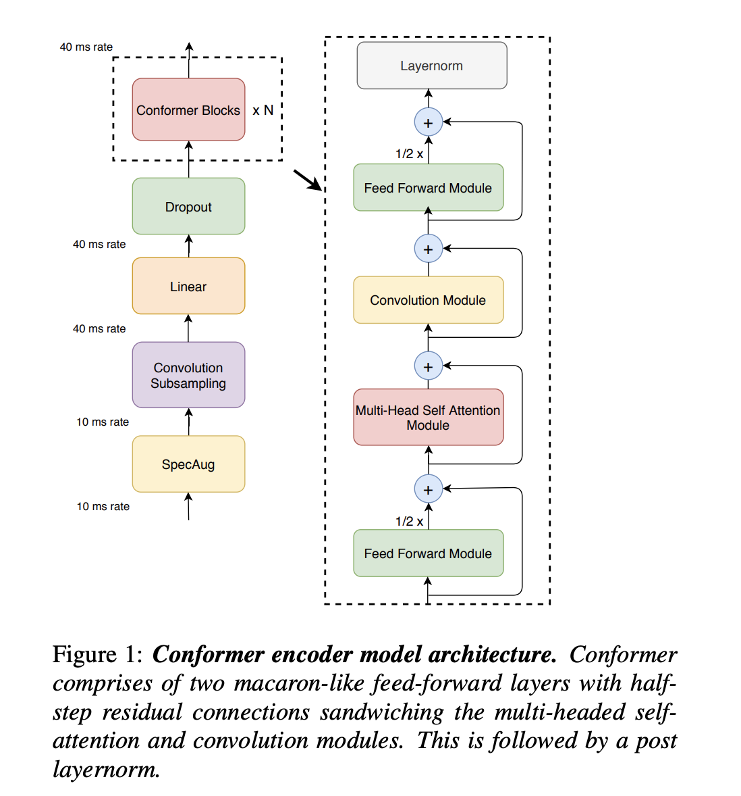
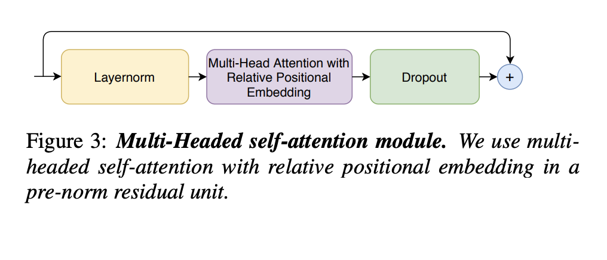
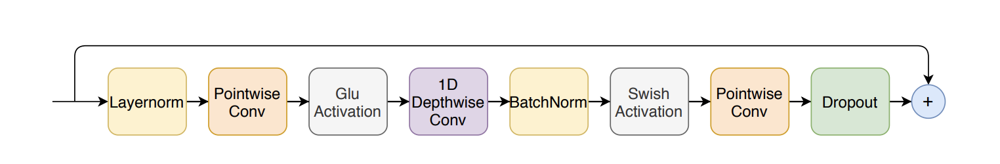
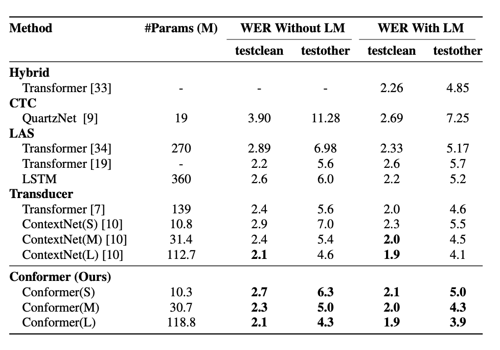

--- 
slug: conformer-convolution-augmented-transformer-for-speech-recognition
title: "[Paper-review] Conformer: Convolution-augmented Transformer for Speech Recognition"

date: 2022-03-22

tags: 

  - Papers
  - NLP
  - ASR

---
In this papers, authors introduced Conformer, an architecture that **integrate components from CNN and Transformer** for end-to-end speech recognition. The importance of each component have been studied and they show that **the inclusion of CNN is critical to the performance of Conformer model.** Conformer achieved better accuracy with fewer parameters than previous network.

## *Problem:* 
Recently, the Transformer architecture based on self-attention has been very popular due to their efficiency. CNN have also been successful for ASR, which capture local context progressively via local receptive layer by layer. However, they have some limitations. While Transformers are good at modeling long-range global context, they are less capable to extract fine-grained local feature patterns. CNNs on another hand,  which is good at exploiting local information but need many more layers or parameters to capture global information.

## *Proposed Method:* 
Author proposed a novel combination of CNN with self-attention in ASR models. The new  combination can achieve the best of worlds - self-attention for global information and CNN

## Conformer Encoder

As shown in Figure 1, Conformer block composed of **4 modules** stacked together (i.e: feed-forward + multi-head-self-attention + convolution + feed-forward)

**Multi-Headed Self-Attention Module:** utilize the relative positional embedding from Transformer-XL, which help generalize better on different input length. A residual units with dropout helps training and regularizing deeper models. 

**Convolution Module Structure:** starts with a gated convolution network mechanism with a pointwise convolution, a gated linear unit (GLU). Batchnorm is utilised to aid training deep models

**Feed forward module:**
The first Linear Layer expand the dimension by 4 and the second linear layer projects it back to the model dimension.

Three models have been defined, small, medium and large with 10M, 30M and 118M params, respectively by changing different combinations of network depth, model dimensions, number of attention heads …

## Results on LibriSpeech:
The model show improvements consistently over various model parameters size. 

## Reference
[*Conformer: Convolution-augmented Transformer for Speech Recognition*](https://arxiv.org/abs/2005.08100)
