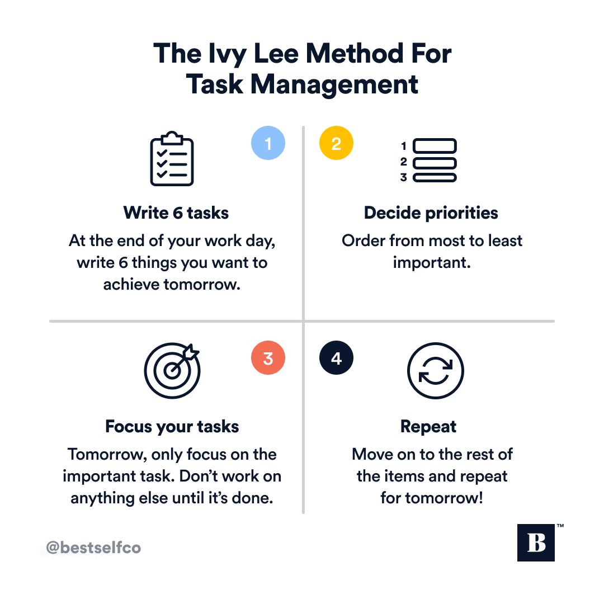

--- 
slug: book-takeaways-ivy-lee-method
title: (Book-Takeaways) IVY Lee Method for prioritizing tasks

date: 2023-01-30

tags: 

  - Books
  - Book-Takeaways

--- 

Recently, I came accross the Ivy Lee Method while reading a book on Focus. After applying this method for some time, I have found it to be extremely useful in managing and prioritizing tasks. The method helps us focus on the most important tasks each day, preventing us from wasting time and feeling like a day has passed without accomplishing any meaningful.

### What is Ivy Lee method:
The Ivy Lee Method is a productivity technique that was developed by Ivy Lee, a productivity consultant, in the early 20th century. The method is based on the idea of **prioritizing tasks and focusing on the most important tasks** each day.

The steps of the Ivy Lee Method are as follows:
1. At the end of each workday, write down the six most important tasks you need to accomplish the next day, in order of priority.
2. The next day, focus only on the first task until it is completed. Then move on to the next task, and so on.
3. If you do not complete all six tasks, transfer the unfinished tasks to the next day’s list.
4. Repeat this process every day.

By following these steps, We are focusing and completed the most important tasks of day. We can effectively prioritize our tasks, stay focused and get more done in less time.

### To apply Ivy Lee method effectively, There are some rule as follows:
1. Make sure to prioritize your tasks each day, so that you are focusing on the most important tasks first.
2. Stick to your list and avoid distractions
3. Stay flexible and be willing to adjust your list if new tasks arise or priorities change.
4. Celebrate your accomplishments and reflect on what you have learned each day, to continually improve your productivity.

