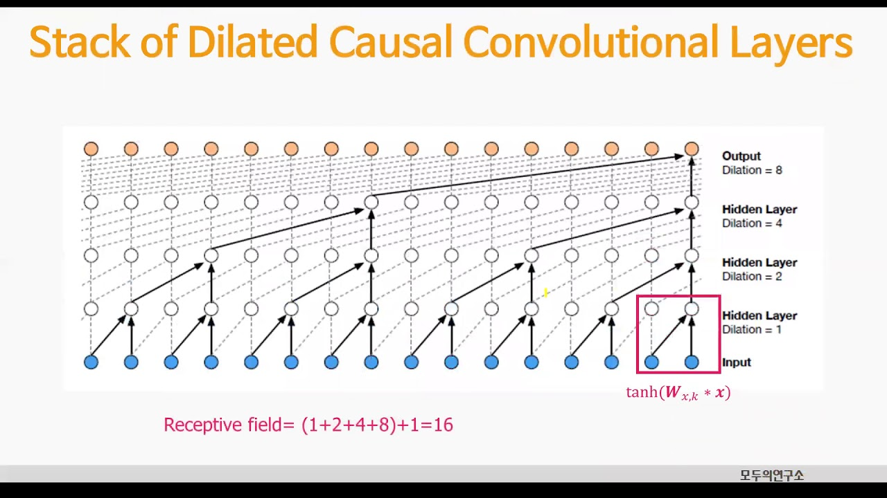
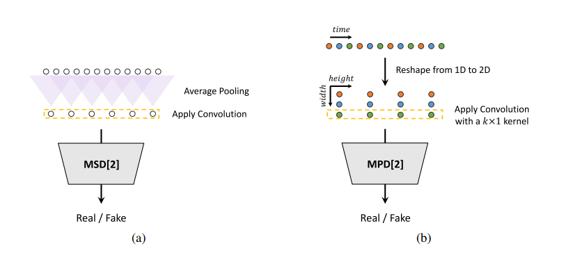

--- 
slug: audio-synthesis-in-tts-system
title: "Audio Synthesis in TTS System"

date: 2023-02-14

tags:

  - NLP
  - TTS

--- 

In theory, we can just convert a spectrogram to audio by using inverse FFT(iFFT). However, there are two most challenging problems:

1. The mel spectrogram does not contain the **phrase information** output by the original FFT.
2. The predicted spectrogram is **imperfect**. It is likely smoother than the GT and may contain noise or other **unnatural characteristics/artifacts.**

In problem one, we could approximate the phrase using the **Griffin-Lim algorithm.**

In problem two, we train a separate model called a **vocoder** to generate the audio. This model learned to do the audio reconstruction more accurately. 

## Spectrogram Inversion Modeling (Vocoder):

### 1. WaveNet: a very large auto-regressive dilated causal CNN

[WaveNet](https://arxiv.org/abs/1609.03499) was developed by researchers at DeepMind in 2016, The architecture of WaveNet is based on CNNs. One of the key innovations of WaveNet is its use of dilated causal CNNs, which allow the network to have a large **receptive field** while still maintaining a small number of parameters.

WaveNet has been used in a variety of applications, including TTS system, music generation, and noise reduction. It has also been integrated into Google’s Assistant to improve the quality of speech synthesis

### 2. HiFi-GAN:

HiFi-GAN was created by a team of researchers from Tencent AI Lab in 2020. Their work was published in a research paper titled “[HiFi-GAN: High-Fidelity Generative Adversarial Networks for Audio Synthesis](https://arxiv.org/pdf/2010.05646.pdf)”. 

The architecture is similar to WaveNet but it’s smaller and not auto-regressive ⇒ 10000x faster than WaveNet. HiFi-GAN is trained through an adversarial training method, treating the vocoder like a generative adversarial network (GAN). It uses **multiple scale discriminators**, which are temporal CNNs that try to classify the audio as real or fake after average pooling sets of adjacent audio samples, and **period discriminators** which try to classify using audio sampled over different periods

### 3. WaveRNN:

WaveRNN is an autoregressive model that uses a Recurrent Neural Network (RNN) architecture to generate audio samples one sample at a time. 

Since the model uses RNNs, training time requires a long time compared to CNNs and Transformers. However one of the advantages of WaveRNN is its ability to generate high-quality audio in real-time, making it useful for real-world applications and industries. Especially, **this model is an ideal vocoder for low-latency and low-power situations like on-device TTS** due to their small compute requirements and memory footprint at inference time.