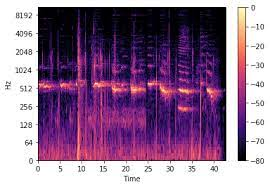
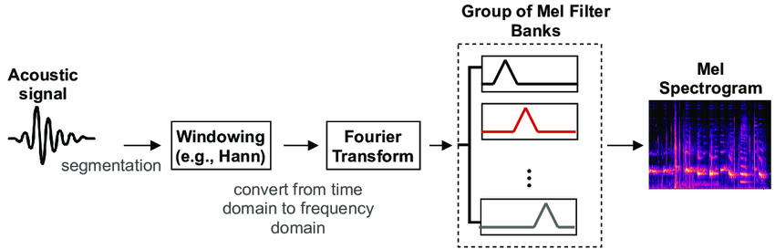

--- 
slug: spectrogram-synthesis
title: Spectrogram Synthesis

date: 2023-02-12

tags:

  - NLP
  - TTS

--- 

Spectrogram synthesis is one of step in TTS pipeline which transform text/phonemes into spectrogram presentation of audio.

### Audio Basic:

Audio is typically represented by a **long sequence of numbers** which indicate the audio amplitude at each point in time. One of the important factor in audio is sampling rate which representing how often the audio are recorded. Common sampling rates are 16kHz, 22.05 kHz, 44.1 kHz and 8kHz often use in telephony system.

)](images/Untitled.png)

Number of sample per second defines the sampling rate. ([https://wiki.hydrogenaud.io/index.php?title=File:Digital_wave.png](https://wiki.hydrogenaud.io/index.php?title=File:Digital_wave.png))

### Spectrograms

Mel Spectrogram example

Raw audio stores **amplitude over time** and useful for recording and listening. When it comes to processing we usually present the audio as a spectrogram which represents **frequency over time**

Above image indicate the process of converting a audio signal to mel spectrogram.

1. Windowing: We group audio samples in to smaller set of time buckets( audio frames ~ 50ms)
2. Fourier Transform: We use FT or FFT to calculate the magnitude and phase of each frequency band
3. Transform frequency bands (Hertz) in to mel spectrogram (mel frequency). Hert are a physical measurement while mel frequency is better captures how humans perceive sound. Therefore, It’s more helpful for human perception and easier to predict

Note 1: Human ears are more sensitive to low frequencies than high frequencies ⇒ Low frequency bands have large impact on the perceived sound while high frequency bands may have little or no effect.

Note 2: There are two main reasons for using Mel Spectrogram. Firstly, It’s a lot more computation efficient than processing raw audio. Secondly, it’s shorter 2D sequence length so they works better with most modern deep learning models

### References:

[Nemo Speech Tutorials](https://docs.nvidia.com/deeplearning/nemo/user-guide/docs/en/stable/tts/intro.html)