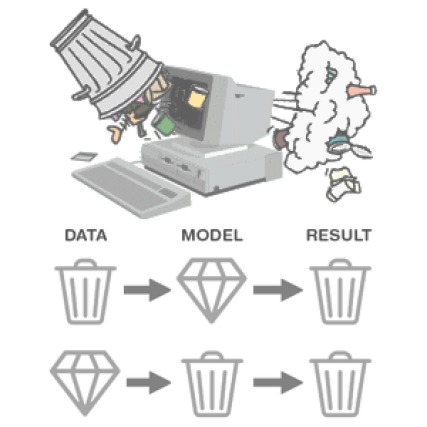

--- 
slug: tts-model-evaluation
title: "TTS Model Evaluation"

date: 2023-02-15

tags:

  - NLP
  - TTS

--- 

Evaluation of TTS models is an important aspect of the development of TTS System. It helps to give feedback in order to improve synthesis audio quality.

Mean Opinion Score: Rate TTS sample on a scale of 1 to 5 

The evaluation of TTS models is **mainly based on subjective human perception**, as there are no established objective metrics for determining their quality. The most commonly used method for measuring TTS quality is the **Mean Opinion Score (MOS)**, where listeners rate the quality of TTS samples on a scale of 1 to 5. Another popular method is MUSHRA (MUltiple Stimuli with Hidden Reference and Anchor), in which users are represented with reference audio and asked to rate multiple TTS samples in relation to the reference.

MUSHRA: Rate multiple TTS samples in relation to the reference.

While some metrics such as MCD-DTW, PESQ, and STOI have been used to try and measure audio quality, they have limited accuracy and usefulness. The lack of reliable objective numerical metrics is one of the reasons why many state-of-the-art TTS models rely on GAN-based training to achieve high-quality results…

It’s important to note that the quality of TTS models can be affected by a variety of factors, such as the **quality of the training data**, the choice of **architecture and training algorithm** the use of additional technologies like **prosody modeling** and **voice conversion**

Garbage in, Garbage out

Keyword:

Prosody modeling: is a technique to model the rhythm and intonation of speech. Prosody refers to the musical-like qualities of speech, such as stress, rhythm, and intonation, that convey meaning and add emotional content to speech. 

Voice conversion: this is a technique that aims to convert the voice of a speaker to another voice while preserving the content of the speech. Voice conversion is a complex task, as it involves not only modeling the acoustic features of speech, but also the speaker-specific characteristics that contribute to the unique voice of each speaker.