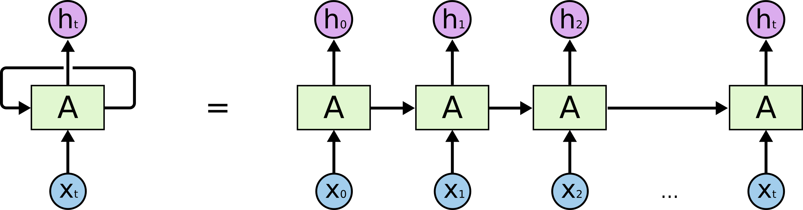

--- 
slug: what-is-auto-regressive-models-in-stt-and-tts
title: What is auto-regressive model mean in Text-to-Speech or Speech-to-text models?

date: 2023-02-10

tags: 

  - NLP
  - STT
  - TTS

--- 

Auto-regressive models are types of statistical models used in both Text-to-Speech(TTS) and Speech-to-Text(STT) applications.

In TTS, an auto-regressive model generates speech by predicting the next audio sample based on the previous samples in a sequence. This is achieved by training the model on a large corpus of speech data, where the target is to predict the audio sample at each time step given the previous samples. The models is trained to learn the statistical relationships between the speech signal and the corresponding text representation, allowing it to generate speech that sounds natural.

In TTS, an auto-regressive model transcribes speech into text by predicting the next word in a sentence given the previous words. The model is trained on large datasets of speech and text to learn the statistical relationships between speech and text, allowing it to transcribe speech accurately

Auto-regressive models are widely used in TTS and STT due to their **ability to capture long-term dependencies** in the data and generate high-quality outputs. These models are also highly scalable and can be trained on large datasets in parallel, making them an attractive option for building TTS and STT system

### Keywords / Terminologies:

- Auto-regressive models: A type of statistical model that generates an output based on a sequence of previous inputs or outputs. In TTS and STT, auto-regressive models are used to generate speech or transcribe speech into text.
- Text-to-Speech (TTS): A technology that converts written text into spoken language, allowing computers to "speak" to users. TTS systems use auto-regressive models to generate speech that sounds natural.
- Speech-to-Text (STT): A technology that converts spoken language into written text, allowing computers to transcribe speech into a written form. STT systems use auto-regressive models to transcribe speech into text accurately.
- Statistical model: A mathematical model that describes the statistical relationships between variables. Auto-regressive models in TTS and STT are statistical models that learn the relationships between speech and text.
- Audio sample: A single unit of audio data representing a small part of the speech signal. In TTS, the auto-regressive model generates audio samples that represent speech.
- Time step: The discrete time interval at which the audio samples are generated in TTS. The auto-regressive model generates an audio sample for each time step based on the
- Speech signal: The physical representation of speech, typically in the form of an audio waveform. In TTS, the auto-regressive model generates the speech signal from text.
- Text representation: The written representation of speech, typically in the form of words and sentences. In TTS, the text representation is used as input to generate the speech signal.
- Natural speech: Speech that sounds like it was produced by a human, as opposed to speech that sounds robotic or artificial. TTS systems aim to generate natural speech by training auto-regressive models on large corpora of speech data.
- Transcribe speech: The process of converting spoken language into written text. In STT, auto-regressive models are used to transcribe speech into text.
- Word prediction: The process of predicting the next word in a sentence based on the previous words. In STT, auto-regressive models use word prediction to transcribe speech into text.
- Statistical relationships: The mathematical relationships between variables, as described by statistical models. In TTS and STT, auto-regressive models learn the statistical relationships between speech and text to generate high-quality outputs.
- Long-term dependencies: Relationships between inputs or outputs that persist over long sequences of time. Auto-regressive models in TTS and STT capture long-term dependencies in the speech and text data to generate high-quality outputs.
- High-quality outputs: Outputs that are accurate, natural-sounding, or otherwise desirable. In TTS and STT, auto-regressive models aim to generate high-quality outputs that sound like natural speech or transcribe speech accurately.
- Parallel training: The process of training a model on multiple data samples simultaneously, using multiple processors or computers. In TTS and STT, parallel training is used to speed up the training process and allow auto-regressive models to be trained on large datasets.

