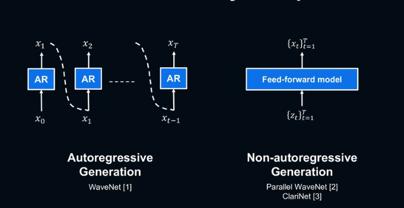

--- 
slug: tts-model-types-auto-regressive-vs-parallel
title: "TTS Model types: Auto-regressive vs Parallel"

date: 2023-02-13

tags: 

  - NLP
  - TTS

--- 

Predicting a spectrogram from text is a sequence-to-sequence problem because the input and output are different lengths

The most successful approach to this problem uses an encoder-decoder system. These models use different types of neural networks to process the input text:

1.  RNNs or Transformers do sentence-level processing, determining things like pronunciation and word emphasis based on the meaning of the sentence.
2. CNNs process features based on their adjacent characters or audio frame, **ensuring that words flow smoothly from one to the next one** (eg. how to start and end a word to make it flow naturally with the previous and next words)

There are two main categories of encoder-decoder systems: 

There are two primary categories of encoder-decoder systems: parallel models and auto-regressive models. Parallel models tend to rely on duration prediction, while auto-regressive models may use duration prediction or attention.

Keywords / Terminologies (Powered by ChatGPT)

1. Spectrogram: A spectrogram is a visual representation of the spectrum of frequencies of a signal as it varies with time. In this context, it refers to the graphical representation of the audio signal.
2. Sequence-to-Sequence (Seq2Seq) problem: Seq2Seq is a type of machine learning problem where the input and output are **sequences of different lengths**. In the context of this paragraph, it refers to predicting a spectrogram from text, where the input is text and the output is the spectrogram, which is a visual representation of the audio signal.
3. Encoder-Decoder system: An encoder-decoder system is a **type of deep neural network** architecture used for sequence-to-sequence problems. The encoder takes the input sequence and encodes it into a fixed-length vector, which is then passed to the decoder, which decodes the vector into the target sequence.
4. RNNs (Recurrent Neural Networks): RNNs are a type of neural network designed to process sequences of inputs, such as sequences of text or sequences of audio frames.
5. Transformers: Transformers are a type of neural network architecture designed to process sequences of inputs, such as sequences of text or sequences of audio frames. They have become popular in recent years for their ability to process **long sequences efficiently**.
6. CNNs (Convolutional Neural Networks): CNNs are a type of neural network designed to **process grid-like data, such as images or spectrograms**.
7. Context level: The context level refers to the level at which the neural network is processing the input data. For example, sentence-level processing refers to processing a sentence as a whole, while character-level processing refers to processing individual characters.
8. Sentence-level processing: Sentence-level processing refers to processing a sentence as a whole, as opposed to processing individual characters. In the context of this paragraph, RNNs or Transformers are used for sentence-level processing to determine how to pronounce or emphasize certain words based on the meaning of the sentence.
9. Character processing: Character processing refers to processing individual characters, as opposed to processing a sentence as a whole. In the context of this paragraph, CNNs are used for character processing to determine how to start and end a word to make it flow naturally with the previous and next words.
10. Adjacent characters: Adjacent characters refer to characters that are next to each other in a sequence, such as in a word or sentence.
11. Audio frame: An audio frame refers to a **short segment** of an audio signal.
12. Parallel models: Parallel models refer to TTS models that **generate speech in parallel**, as opposed to being generated one step at a time. FastSpeech is an example of a parallel TTS model, where the encoder and decoder are **trained simultaneously to convert text into speech**. Compared to auto-regressive TTS model, paralleled models like FastSpeech can generate speech much **faster and more efficiently**, making them suitable for r**eal-time applications**
13. Auto-regressive models: Auto-regressive TTS models generate speech one step at a time. In these models, the output at each time step is conditioned on the previous output, hence the name “auto-regressive”.  Auto-regressive TTS models have achieved high-quality results. However, they can be slower and more computationally intensive compared to paralleled TTS model.
14. Attention: Attention is a mechanism in neural networks that allows the model to focus on different parts of the input sequence when generating the target sequence. In the context of this paragraph, attention refers to the mechanism used by auto-regressive models to determine which parts of the input sequence to attend to when generating the target sequence.