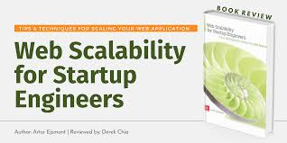

--- 
slug: book-takeaways-web-scalability-for-startup-engineers
title: (Book-Takeaways) Scaling Startups with "Web Scalability for Startup Engineers by Artur Ejsmont

date: 2023-11-20

tags: 

  - Books
  - Book-Takeaways

--- 

Recently, I read *Web Scalability for Startup Engineers* by Artur Ejsmont, and it gave me a fresh perspective on building scalable web systems. Packed with actionable strategies and real-world insights, this book is a must-read for engineers tackling the challenges of scalability in fast-paced startup environments. Here are the key lessons and takeaways that I found particularly valuable.

---

### **Key Takeaways**

1. **Scalability is More Than Scaling Up**
   Scalability is about the ability to adjust system capacity cost-efficiently, both up and down, to meet demand. It encompasses users, data, transactions, and requests—all while maintaining a consistent user experience.

2. **Horizontal vs. Vertical Scaling**
   - **Vertical Scaling**: Upgrading hardware or improving network throughput for smaller systems. However, it becomes expensive at scale.
   - **Horizontal Scaling**: Adding servers to distribute the load. This "holy grail" of scalability overcomes hardware limits but requires careful design.

3. **Embrace Statelessness**
   Stateless services simplify scalability and availability. They make instances interchangeable, improving resilience and enabling load balancing without complex synchronization.

4. **The Power of CDNs**
   Content Delivery Networks (CDNs) are essential for serving static assets like images, CSS, and JavaScript efficiently. CDNs reduce server load and improve performance—critical for startups with limited resources.

5. **Caching is a Scalability Superpower**
   Effective caching minimizes server requests by serving precomputed responses. Focus on improving cache hit ratios and reducing unique cache keys for maximum efficiency.

6. **Avoid Full Application Rewrites**
   Startups should steer clear of complete rewrites, as they often take longer and create similar issues within a couple of years. Instead, iterate incrementally to improve systems.

7. **Functional Partitioning & Sharding**
   - **Partitioning**: Divide your monolithic application into distinct services hosted independently.
   - **Sharding**: Break datasets into manageable parts to distribute storage and queries, reducing complexity.

8. **Automation is Non-Negotiable**
   Testing and deployment processes must be automated for scalability. Automation reduces human error, accelerates deployment cycles, and ensures consistent results.

9. **Design for Real Business Needs**
   Good architecture focuses on solving real business problems. Avoid overengineering and keep the system as simple as possible without sacrificing future extensibility.

10. **Metrics Matter**
    Scalability requires monitoring key metrics such as request rates, cache hit ratios, database transactions per second, and system load. Data-driven decisions are crucial—gut feelings are not enough.

---

### **Memorable Quotes**

1. **"Scalability is the ability to adjust the capacity of the system to cost-efficiently fulfill the demands."**  
   This encapsulates the essence of scalability, reminding us it’s about meeting demand efficiently, whether scaling up or down.

2. **"Avoid full application rewrites at all costs—especially if you work in a startup. Rewrites always take much longer than expected and often end up in the same mess within a couple of years."**  
   A candid warning against the common temptation of starting from scratch.

3. **"Stateless services are interchangeable, scalable, and resilient. Keep your services stateless, not your database."**  
   A simple yet powerful principle for designing scalable systems.

4. **"Architecture is the perspective of the software designer; infrastructure is the perspective of the system engineer."**  
   A great way to distinguish the roles in designing and maintaining scalable systems.

5. **"Caching is critical to scalability. It allows you to serve requests without computing responses, enabling you to scale much easier."**  
   A reminder that the simplest optimizations often yield the greatest results.

6. **"The first rule of creating indexes: the higher the cardinality, the better the performance."**  
   Practical advice for optimizing database queries in large systems.

7. **"Testing and deployments have to be automated if you want to scale. If you want it to happen often, automate it."**  
   A call to action for reducing manual inefficiencies and focusing on growth.

8. **"Don’t fix it if it ain’t broke."**  
   A timeless mantra for avoiding unnecessary changes in systems that work well.

9. **"Good architecture maximizes the number of decisions not made." – Robert C. Martin**  
   A profound thought on keeping your architecture simple and adaptable.

10. **"Burnout is your archenemy. It sneaks up slowly and blinds you, pulling you deeper into its grip."**  
    A crucial reminder for startup engineers working under immense pressure.

---

### **Actionable Insights**

- **Start Small, Think Big:** Prioritize cost-efficient solutions like CDNs and cloud services in the early stages. Build iteratively to scale effectively without overengineering.
- **Leverage Third-Party Tools:** Avoid reinventing the wheel. Use available tools and libraries for monitoring, caching, and analytics to save time and resources.
- **Prepare for Traffic Spikes:** Use auto-scaling load balancers but be mindful of potential delays during sudden traffic surges.
- **Focus on Collaboration:** Scalability isn’t just technical—it involves aligning teams, automating workflows, and ensuring everyone is on the same page.

---

For a deeper dive into these principles, check out [this talk on scalability](https://www.youtube.com/watch?v=UHIWQvVjv8k&ab_channel=BookOverflow), which complements the ideas discussed in the book. 

*Web Scalability for Startup Engineers* is a practical guide for those seeking to balance the challenges of rapid growth with sustainable engineering practices. Whether you're in a startup or building scalable systems elsewhere, this book is a goldmine of insights.