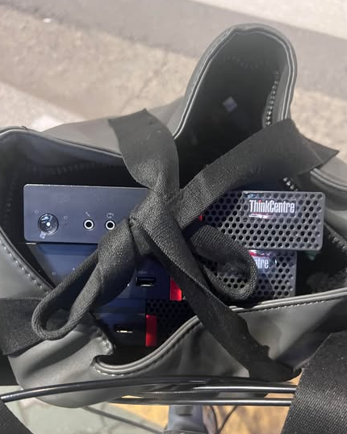
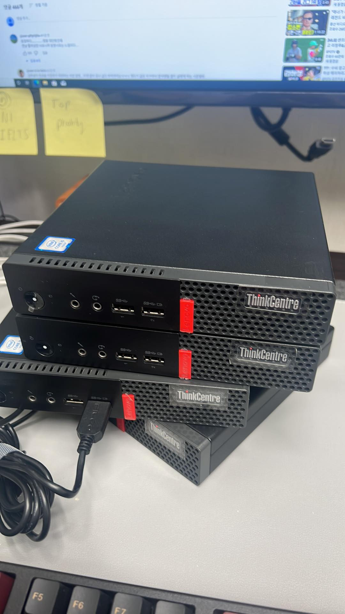

--- 
slug: homelab-the-birth-of-my-homelab
title: "The Birth of My Homelab"

date: 2024-04-01

tags: 
  - Homelab

--- 

#### Why I Built a Homelab

It all started with a simple realization: cloud services like AWS are fantastic but costly, especially when stability isn’t a top priority for my work. As someone who loves experimenting with servers and infrastructure, I stumbled upon the concept of **homelabs** while exploring alternatives. A homelab is essentially your personal server setup at home, and for me, it was a perfect playground to learn, create, and save costs.

My discovery began on Reddit, scrolling through endless posts about **homelabs** and **mini PCs**. The possibilities fascinated me—people hosting everything from game servers to enterprise-level setups at home. Initially, I considered buying equipment from Amazon, but the price tags were intimidating. That’s when I stumbled upon a local second-hand marketplace (당근마켓) in Korea and found an irresistible deal.

On impulse, I bought four mini PCs. I still vividly remember the adventure of riding my bicycle through the streets of Seoul, with these four “treasures” carefully packed and balanced. It was a sight to see! Here’s a snapshot from that day:

#### My Mini PC Specs

Here’s what I started with:

- **Processor:** Intel i5 (8th Gen)
- **RAM:** 8GB (single stick per PC)
- **Storage:** 128GB SSD

Not top-of-the-line, but they were perfect for my humble beginnings.

 I couldn’t help but admire their sleek, minimalist design. Solid black with bold red accents—these little machines exuded a sense of high-end professionalism, almost as if they were built for the command center of a spaceship 🚀🖤🔴