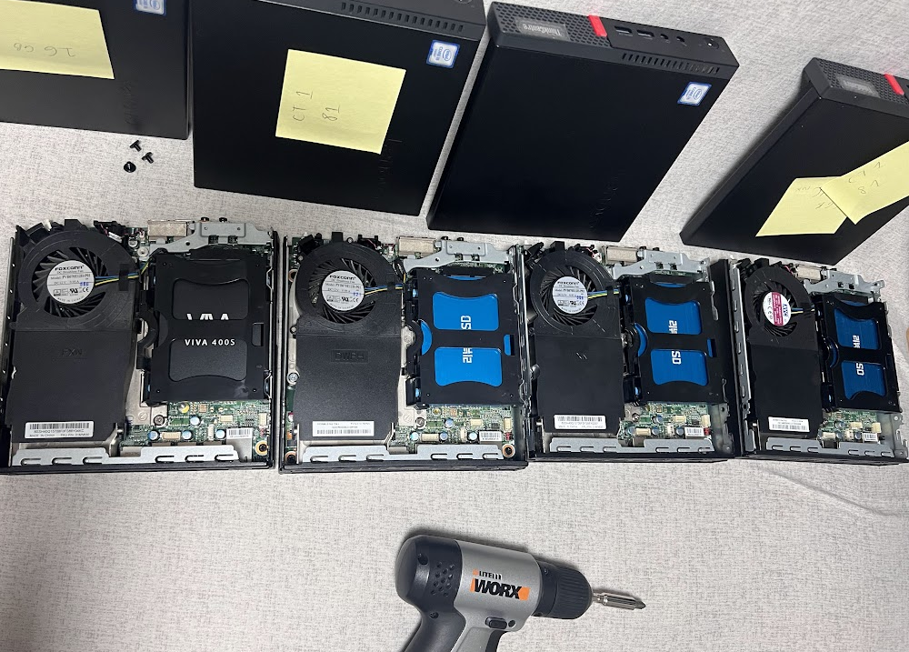
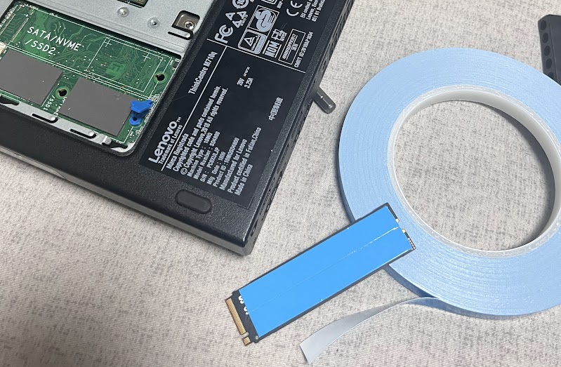
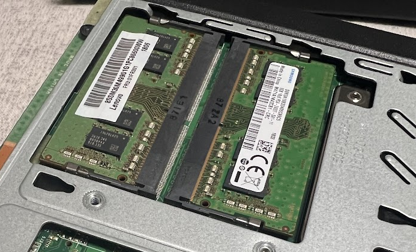
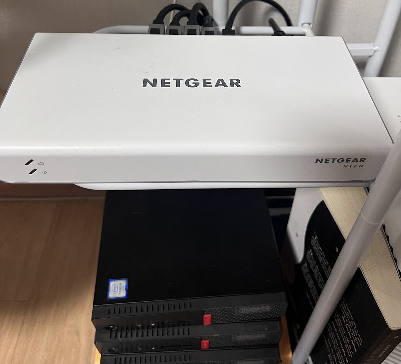

--- 
slug: homelab-upgrading-the-essentials
title: "Homelab: Upgrading Storage, RAM, and Network"

date: 2024-04-05

tags: 
  - Homelab
  - Networking
--- 

After setting up my initial homelab cluster, I quickly realized that while my mini PCs were capable, their default specs were limiting. It was time to give them some serious upgrades, starting with storage, RAM, and network equipment. Here's how I leveled up my homelab step by step.

---

#### Storage Upgrade: From 128GB SSD to NVMe 256GB SSDs

Each of my Lenovo ThinkCentre mini PCs originally came with a 128GB SSD, which worked fine for basic tasks but wasn’t enough for my needs. Since I planned to set up a **Network Attached Storage (NAS)** system, I decided to upgrade to **Samsung NVMe 256GB SSDs** for better performance and reliability.

Where did I get them? Back to my trusted second-hand marketplace, **당근마켓**, of course! I managed to snag a set of four Samsung NVMe SSDs at a great price.

Upgrading the SSDs was straightforward, but I encountered an important issue unique to the Lenovo ThinkCentre M710/M910 series:

> **Thermal Pads and Oil Leakage:**  
> The thermal pads between the NVMe SSD and the motherboard tend to "leak" oil, which can damage the SSD over time. To avoid this, I installed **thermal pads made from synthetic fibers** as a barrier between the motherboard and the SSD. It’s a small tweak but crucial for long-term reliability.

---

#### RAM Upgrade: From 8GB to 32GB

With just 8GB of RAM in each machine, multitasking and running multiple virtual machines (VMs) became a bottleneck. So, I upgraded:

- **Added RAM Sticks:** Four 16GB sticks of RAM.
- **Final Configuration:** Two PCs now have 32GB of RAM, while the other two run on 16GB each.

For my current needs, this setup is more than enough. If my requirements grow in the future, I can always upgrade further.

---

#### Network Upgrade: Professional-Grade Connectivity

##### 1. **TP-Link Archer AX10 Router**

Initially, I was using the TP-Link Archer AX10, a reliable router with 5 ports (1 WAN, 4 LAN). It worked well for basic needs like connecting my home devices, but as my homelab grew, it became insufficient to handle all the devices and their traffic.

##### 2. **NETGEAR GC110 Managed Switch**

To connect my four mini PCs and segment the network professionally, I invested in a **NETGEAR GC110 Managed Switch**. Why a managed switch?

- **VLAN Support:** Allows me to isolate my homelab network from my home network. This way, any homelab experiments or upgrades won’t disrupt the network for others in my household.
- **Insight Cloud Portal:** Provides advanced features for managing and monitoring the network.

This switch has been a game-changer, making my homelab feel more like a professional IT setup.

##### 3. **Ruijie RG-EG105G Router**

Thanks to my brother, I also received a **Ruijie RG-EG105G Router** as a gift. Although it’s a Chinese brand, it’s packed with powerful features for network management. I’m still exploring its capabilities, but it looks like a solid addition to my network infrastructure.

---

[1]  https://www.reddit.com/r/homelab/comments/y027un/my_homelab_20/?rdt=41077
