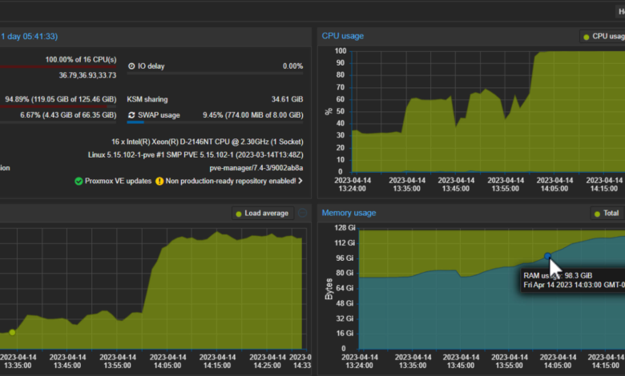

--- 
slug: homelab-setting-up-my-first-cluster
title: "Homelab: Setting Up My First Cluster"

date: 2024-04-10

tags: 
  - Homelab
  - Virtualization
  - Proxmox
  - Linux

--- 

Once the hardware upgrades were complete, it was time to set up the heart of my homelab: a cluster of four mini PCs. At this point, I was a complete beginner in cluster setup and virtualization, so I relied heavily on online resources. The learning curve was steep, but the result was worth every effort. Let me walk you through the process.  

---

#### Starting from Scratch: Installing Debian  

I started by installing **Debian**, a lightweight and versatile Linux distribution, on each of the four Lenovo ThinkCentre mini PCs. Debian was the perfect choice because of its stability, performance, and strong community support.  

Here are the key steps I followed:  

1. **Booting with a USB Installer:** I created bootable USB drives with the latest Debian ISO and booted each mini PC into the installer.  
2. **Partitioning and Formatting:** Configured the disks with appropriate partitions for the operating system and storage.  
3. **Networking Configuration:** Set static IP addresses for each machine to ensure reliable communication within the cluster.  

By the end of this process, all four machines were running a clean and minimal Debian installation, ready for the next step.  

---

#### Installing Proxmox VE: The Cluster's Brain  

With Debian in place, I installed **Proxmox Virtual Environment (Proxmox VE)** on each machine. Proxmox VE is an open-source platform that simplifies virtualization and cluster management. Here’s how the installation and setup unfolded:  

1. **Adding Proxmox Repositories:** I added the official Proxmox repositories to the Debian systems and installed Proxmox VE using `apt`.  
2. **Configuring Network Bridges:** To enable seamless VM communication, I set up network bridges on each machine. This allowed VMs to access the LAN and communicate with one another.  
3. **Cluster Setup:**  
   - I designated one machine as the **primary node** and initialized the cluster using `pvecm create`.  
   - The remaining three machines joined the cluster with `pvecm add`.  

After connecting all four nodes, I was thrilled to see them come together as a unified cluster.  

---

#### Centralized Management with Proxmox VE  

The moment I logged into the Proxmox VE web interface, I felt like a system admin running a miniature datacenter. Proxmox’s centralized portal made managing the cluster incredibly intuitive.  

Here’s what I could do:  

- **Create Virtual Machines (VMs):**  
   - Allocate specific CPU cores, RAM, and storage to each VM.  
   - Run multiple operating systems side-by-side for different experiments.  

- **Manage Containers:**  
   - Set up lightweight Linux containers (LXC) for tasks that didn’t require a full VM.  

- **Monitor Resource Usage:**  
   - View CPU, memory, and disk usage in real time for each node and VM.  

This portal gave me unprecedented control over my homelab, turning it into a powerful playground for experimentation.  

---

#### Challenges with VM Deployment  

While Proxmox VE was user-friendly, one thing that slowed me down was the initial setup of virtual machines. Since I was new to this, I had to manually:  

1. **Upload ISO Files:** Download OS images from the internet and upload them to the Proxmox storage pool.  
2. **Install Operating Systems:** Go through the OS installation process for each VM from scratch.  

This was a time-consuming task, especially when I wanted to spin up multiple VMs for testing purposes.  

---

#### Important

1. **Static IPs are Essential:** Assigning static IP addresses to each machine was a game-changer for cluster stability. Without this, communication between nodes can become unreliable.  
2. **Proxmox is Beginner-Friendly:** Despite the initial learning curve, Proxmox VE proved to be an excellent tool for virtualization and cluster management.  
3. **Automate VM Deployments:** I realized the need for automation tools like **CloudInit** or VM templates to streamline VM creation.  

---

### Conclusion: A Unified Homelab  

Setting up my first cluster was an unforgettable experience. Seeing four standalone mini PCs transform into a single, centralized system was incredibly rewarding. With Proxmox VE as the backbone, I now have the infrastructure to experiment, learn, and grow my skills in system administration and virtualization.  

In future posts, I’ll dive deeper into automating VM creation, exploring advanced Proxmox features, and experimenting with containerization and orchestration tools like Docker and Kubernetes.  

Stay tuned for more adventures in the world of homelabs! 🚀  

