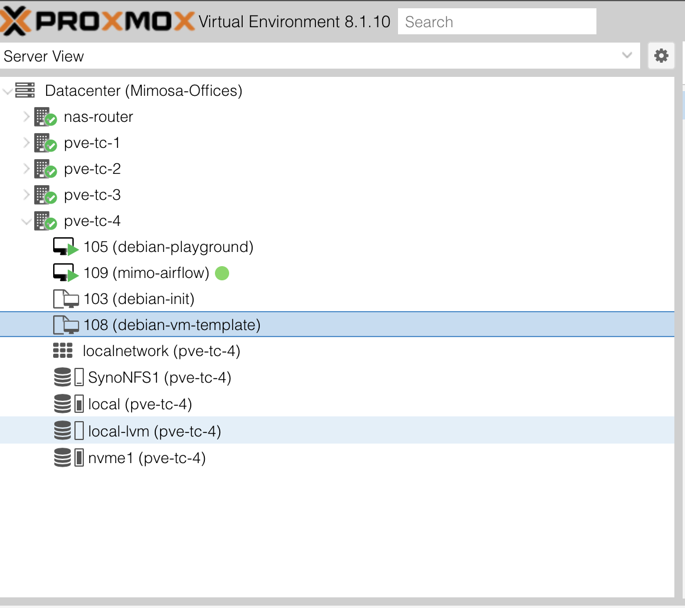
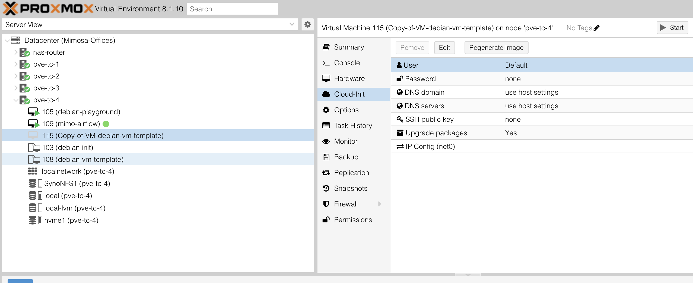
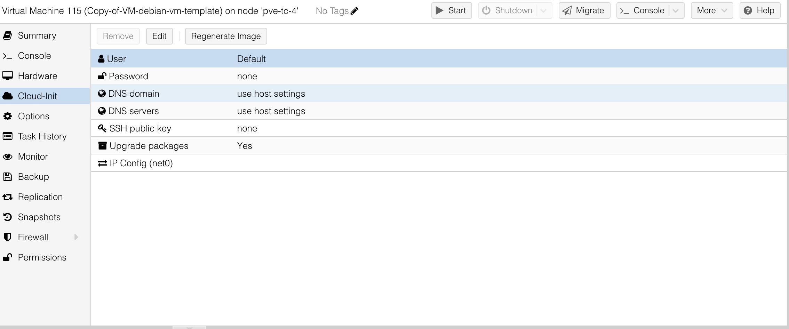

--- 
slug: homelab-automating-vm-provisioning-with-proxmox-cloud-init
title: "Homelab: Automating VM Provisioning with Proxmox + Cloud-Init"

date: 2024-05-02

tags: 
  - Homelab
  - Virtualization
  - Proxmox
  - Automation

--- 

After building my first Proxmox cluster, I started creating virtual machines manually: upload ISO, install OS, set hostname, create users, install packages, set static IP… every single time. It was fun at first—like watching your first VM come to life. But quickly, it became repetitive, especially when I needed to spin up multiple test environments. That’s when I realized: I needed automation.

Cloud-Init was the answer. Combined with Proxmox’s template system, it allowed me to launch fully-configured VMs in minutes. No more ISO uploads, no more keyboard gymnastics ~~.

⸻

### Step 1: Create a Base VM
	1.	Click Create VM in Proxmox.
	2.	Choose an ISO (I used Debian).
	3.	Give it basic resources (CPU, RAM, Disk).
	4.	Complete the OS installation.
	5.	Inside the VM, install two things:
	•	cloud-init
	•	qemu-guest-agent
(You can do this with apt or just make a note to install later.)
	6.	Shutdown the VM.

⸻

### Step 2: Convert to a Template
	1.	Right-click the VM in Proxmox sidebar.
	2.	Choose Convert to Template.

Now Proxmox treats this as a reusable base for new VMs.

⸻

⚙️ Step 3: Add Cloud-Init Support
	1.	Right-click the template → Clone → Create new VM from it.
	2.	Go to Hardware → Add → CloudInit Drive.
	3.	Set QEMU Agent to “Yes” in the Options tab.
	4.	Make sure Boot Order has the CloudInit drive last.

⸻

### Step 4: Set Configuration (All in the UI)

In the cloned VM:
	1.	Go to the Cloud-Init tab.
	2.	Set:
	•	Hostname
	•	IP Address (Static or DHCP)
	•	Username & Password
	•	SSH Key (optional)
	3.	Click Regenerate Image.
	4.	Then Start the VM.

Done! Your new VM boots with everything configured.

⸻

💡 Final Thoughts

This setup saved me tons of time. Now I can create a new test VM in 30 seconds — no terminal needed.

Pro tip: you can even create multiple clones with different IPs to build a mini lab cluster easily.