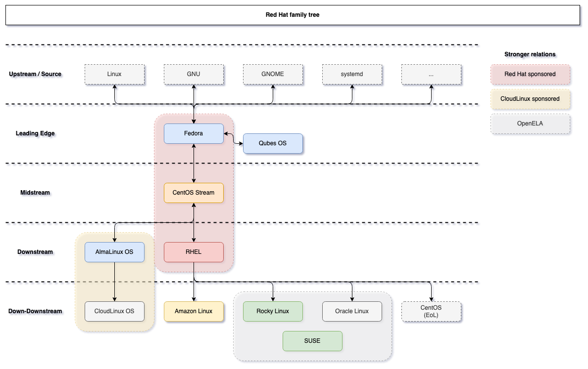

--- 
slug: homelab-from-fedora-to-rockylinux
title: "Homelab: From Fedora to RockyLinux: Understanding the RHEL Ecosystem"

date: 2024-05-05

tags: 
  - Homelab
  - Linux

--- 

When I first started building my homelab, choosing the right Linux distro felt like standing in front of a ramen aisle in a Korean supermarket — so many options, all slightly different.

I kept seeing names like Fedora, CentOS, CentOS Stream, and RockyLinux. All seemed to be related somehow, and many tutorials said “based on RHEL.” So… what’s the deal with the Red Hat family?

Here’s the breakdown I wish someone gave me earlier.



⸻

### The RHEL Lineage: Who’s Who?

Let’s start with the basic family tree (Before 2020):

```
Fedora (Bleeding edge)
   ↓
RHEL (Stable, Enterprise)
   ↓
CentOS (was RHEL clone, now CentOS Stream)
         ↓
    RockyLinux / AlmaLinux (New stable clones)
```

⸻

### What Happened to CentOS?

For years, CentOS was the go-to choice for a free RHEL-like experience. It was RHEL without the support contract — same features, same stability.

But in 2020, Red Hat dropped a bomb:

“CentOS will now become CentOS Stream, a rolling-release distro that sits ahead of RHEL.”

Wait. What?????


After 2020: 
```
Fedora (Upstream, experimental)
   ↓
CentOS Stream (Sits just *ahead* of RHEL)
   ↓
RHEL (Stable, Enterprise)
   ↓
RockyLinux / AlmaLinux (New downstream RHEL clones)
```


This means CentOS Stream is no longer a clone of RHEL. It now acts like a testing ground for what will eventually be in RHEL.

For production systems, that was a dealbreaker.


⸻

### Enter RockyLinux (and AlmaLinux)

In response, the open-source community didn’t sit still. Gregory Kurtzer, one of CentOS’s original founders, created RockyLinux, promising:
	•	100% bug-for-bug compatibility with RHEL
	•	No surprises
	•	Fully open and community-governed

Around the same time, AlmaLinux was launched by CloudLinux with similar goals. Both are now mature and widely adopted as CentOS replacements.

⸻

### Fedora: Where the Innovation Happens

Think of Fedora as the upstream lab for the Red Hat ecosystem. New features, experimental changes, and cutting-edge packages all start here.

If RHEL is your rock-solid spaceship,
then Fedora is the rocket lab.

Fedora is fast, exciting, and ideal for testing — but things break, and LTS support is short.

⸻

### My Homelab Choice for Kubernetes

When I set up Kubernetes on my mini PC cluster, I went with RockyLinux. Here’s why:
	•	Stable kernel and SELinux config (K8s loves this)
	•	Compatible with most RHEL-based Kubernetes guides
	•	Good support from the community
	•	Doesn’t break often — important when I leave VMs running unattended

I also spun up some Fedora containers just to play with the latest Podman and container tools — and yes, they’re blazing fast.

⸻

### Final Thoughts
	•	Use Fedora to explore, build, and break stuff.
	•	Use RockyLinux or AlmaLinux for serious work.
	•	Avoid CentOS Stream unless you’re OK with change sneaking in before it’s stable.