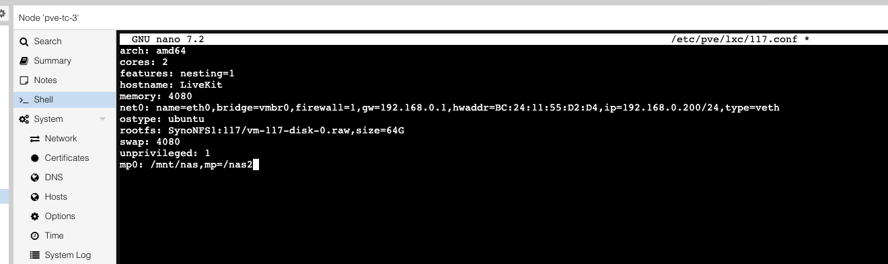
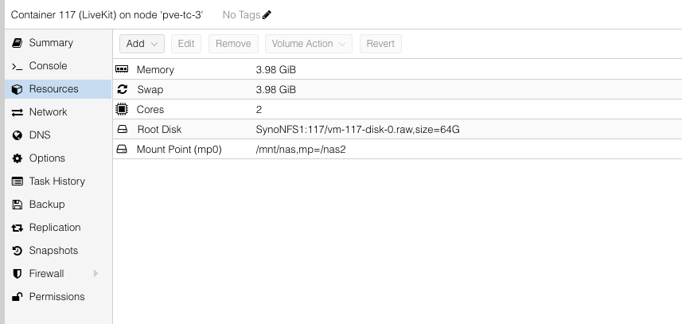

--- 
slug: mount-nfs-operation-not-permitted
title: "Technical Notes: Fixing `mount.nfs: Operation not permitted` in Proxmox LXC Container"

date: 2024-06-16

tags: 
  - Homelab
  - Proxmox
  - NFS

--- 

### **Overview**

Recently while configuring a new Ubuntu 24.04 container inside Proxmox VE, I ran into a subtle but frustrating issue: NFS shares mounted perfectly inside a VM, but failed inside the container with this cryptic message:

```bash
mount.nfs: Operation not permitted
```

As someone who has done this before on Debian-based LXC containers, I knew it was possible—but something was different this time. This post outlines what caused the problem, how I investigated it, and how I resolved it properly by leveraging host-side bind mounts.

---

### **Problem: NFS Mount Fails Only Inside the Container**

I had two Ubuntu-based environments:

- A **Proxmox VM**: could mount NFS from Synology NAS without issues.
- A **Proxmox LXC container** (unprivileged): `mount.nfs` failed with `Operation not permitted`.

The NAS exports were configured correctly:

```bash
showmount -e 192.168.0.25
/volume1/sharedfolder 192.168.0.200
```

The container’s IP was `192.168.0.200`. NFS permissions on Synology were confirmed, root squash was disabled, yet the error persisted.

---

### **Root Cause: Unprivileged LXC Containers Cannot Call `mount()` for NFS**

Unprivileged containers in Proxmox share the host kernel and are isolated using user namespaces. This means even "root" inside the container has no `CAP_SYS_ADMIN` in the host context. Mounting NFS requires kernel-level `mount()` system calls—which are blocked.

This is a design choice for security and container isolation. While privileged containers can bypass this, they come with increased risks.

---

### **Solution: Bind Mount Host NFS to LXC Container**

Instead of fighting container restrictions, I took the cleaner, more secure approach: **mount the NFS share on the Proxmox host**, then **bind-mount it into the container**.

#### **Step 1: Mount the NAS Share on Host**

```bash
mkdir -p /mnt/nas
mount -t nfs 192.168.0.25:/volume1/sharedfolder /mnt/nas
```

Add to `/etc/fstab` for persistence:
```bash
192.168.0.25:/volume1/sharedfolder  /mnt/nas  nfs  defaults  0  0
```

#### **Step 2: Add a Bind Mount to the Container Config**

Edit container config:
```bash
nano /etc/pve/lxc/117.conf
```

Add this line:
```ini
mp0: /mnt/nas,mp=/nas2
```



This maps `/mnt/nas` on the host to `/nas2` inside the container.

You can check the Container -> Resources, new Mount Point appeared:



#### **Step 3: Restart the Container**
```bash
pct restart 117
```

Inside the container:
```bash
ls /nas2
```

You should now see the mounted NAS contents.

---

### **Bonus: Confirmed via Proxmox Web UI**

After editing the config, Proxmox UI under **Resources** shows:

```
Mount Point (mp0)  /mnt/nas,mp=/nas2
```

Clean and UI-friendly.

---

### **Lessons Learned**

- NFS mounts inside unprivileged containers are blocked by design.
- Don’t waste time trying to "fix" permissions—instead, leverage the host.
- Proxmox makes bind-mounting very smooth with just a single line in the config.

---

### **Conclusion**

This is a great example of understanding container limitations and working **with** them, not against them. While mounting directly inside a container feels natural, in the world of LXC, sometimes the cleanest path is to let the host do the heavy lifting.

By bind-mounting your NAS share into the container, you get:
- Full NFS access
- Security of unprivileged containers
- Simplicity of native Linux tooling
---

