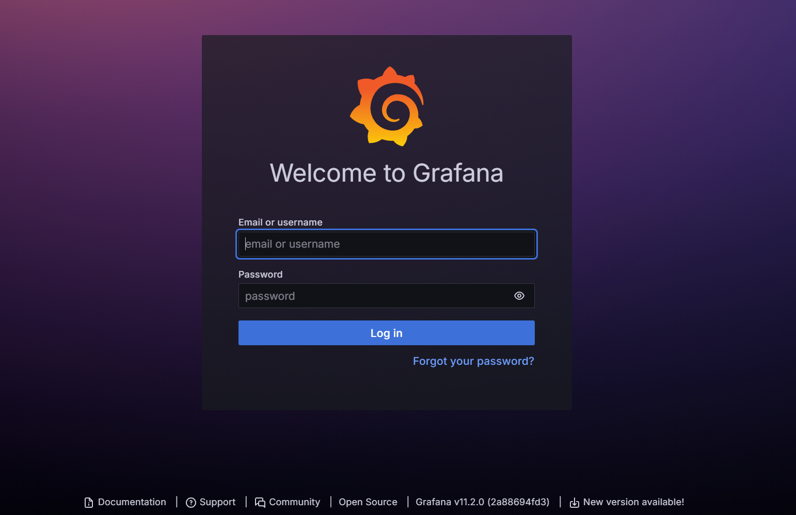
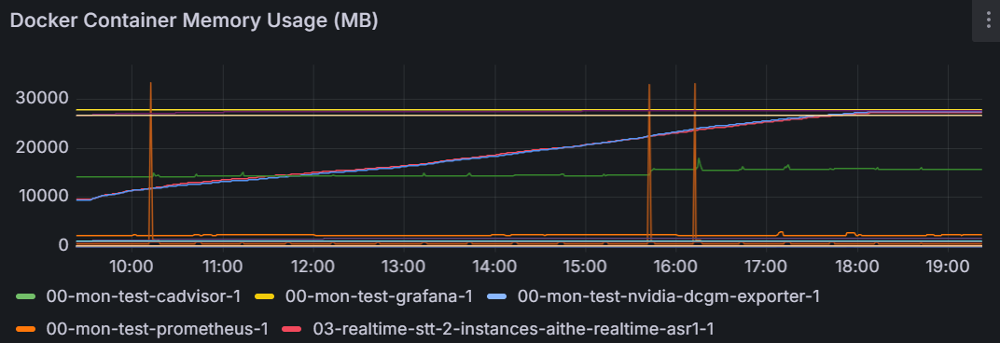
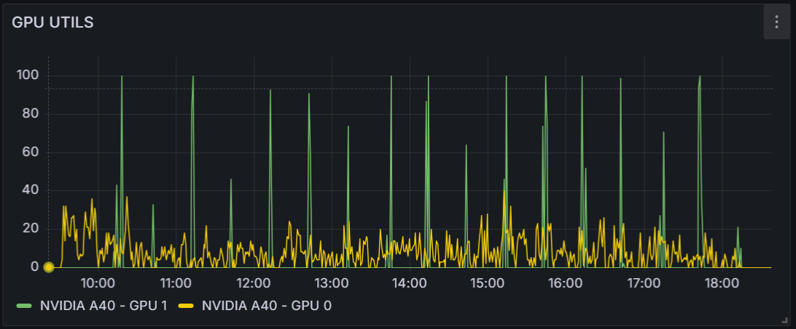
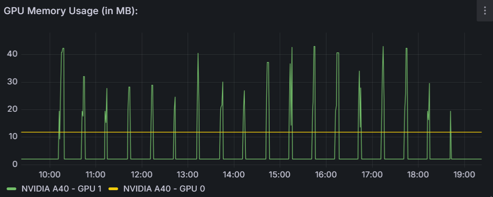
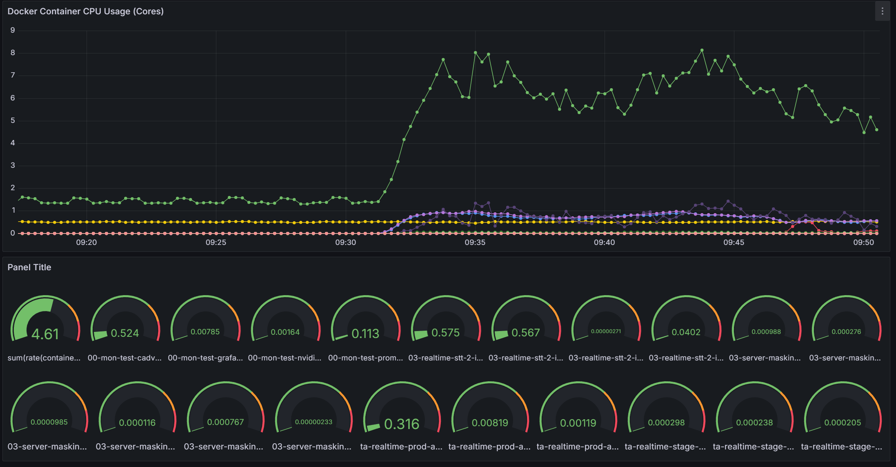

--- 
slug: prometheus-grafana-for-monitoring-mlops
title: "Technical Notes: Setting Up Prometheus + Grafana for Monitoring ML Systems"

date: 2024-07-29

tags: 

  - AI
  - MLOps

--- 

Recently, we deployed a microservice system for a Machine Learning application to an on-premises server. During the early stages of deployment, we quickly realized that monitoring was crucial to track system stability and performance metrics, especially for real-time applications. After researching various tools and solutions, we decided to deploy a Prometheus + Grafana stack to collect metrics and visualize the system's health.

Here are my detailed notes from the deployment process. These notes are quite specific and serve as a technical reference for anyone looking to implement a similar monitoring setup.



---

### Why Prometheus + Grafana?

We chose this combination for the following reasons:

- **Prometheus**: Provides a robust, time-series database for collecting real-time metrics from various sources.
- **Grafana**: Offers interactive and customizable dashboards to visualize and analyze the collected data.
- **Use Case**: Specifically, we aimed to monitor model performance (e.g., latency, throughput) and the overall system health, including GPU usage and container metrics.

---

### Features of the Setup

- **Real-time Metrics**: The stack collects data at a configurable interval (e.g., 5 seconds).
- **GPU Monitoring**: Leverages NVIDIA's DCGM exporter to monitor GPU utilization and memory.
- **Container Monitoring**: Uses cAdvisor to monitor Docker container performance.
- **Custom Dashboards**: Grafana allows the creation of tailored visualizations for specific metrics.

---

### Deployment Using Docker Compose

The entire stack is orchestrated using Docker Compose. Below is the `docker-compose.yml` file we used:

```yaml
version: '3.8'

services:
  cadvisor:
    image: google/cadvisor:latest
    ports:
      - "8088:8080"
    volumes:
      - /:/rootfs:ro
      - /var/run:/var/run:rw
      - /sys:/sys:ro
      - /var/lib/docker/:/var/lib/docker:ro
    networks:
      - monitoring

  prometheus:
    image: prom/prometheus:latest
    volumes:
      - ./prometheus.yml:/etc/prometheus/prometheus.yml
    command:
      - '--config.file=/etc/prometheus/prometheus.yml'
    ports:
      - "9090:9090"
    networks:
      - monitoring

  grafana:
    image: grafana/grafana:latest
    ports:
      - "3000:3000"
    volumes:
      - grafana-storage:/var/lib/grafana
    networks:
      - monitoring

  nvidia-dcgm-exporter:
    image: nvidia/dcgm-exporter:latest
    deploy:
      resources:
        reservations:
          devices:
            - capabilities: [gpu]
    environment:
      - NVIDIA_VISIBLE_DEVICES=all
    ports:
      - "9400:9400"
    networks:
      - monitoring

networks:
  monitoring:
    driver: bridge

volumes:
  grafana-storage:
```

---

### Configuring Prometheus

Prometheus is configured to scrape metrics from cAdvisor and NVIDIA DCGM exporter. Here is the `prometheus.yml` file:

```yaml
global:
  scrape_interval: 5s

scrape_configs:
  - job_name: 'cadvisor'
    static_configs:
      - targets: ['cadvisor:8080']

  - job_name: 'nvidia-gpu'
    static_configs:
      - targets: ['nvidia-dcgm-exporter:9400']
```

---

### Custom Grafana Dashboards

Once Prometheus is set up, Grafana can query its data to visualize metrics. Below are some of the key panels we created:

1. **Docker Container Memory Usage (MB)**:
    
    - **Query**: `sum(container_memory_usage_bytes{image!=""}) by (name) / 1024 / 1024`

    
2. **GPU Utilization**:
    
    - **Query**: `DCGM_FI_DEV_GPU_UTIL`
    - **Legend**: `{{modelName}} - GPU {{gpu}}`

    
3. **GPU Memory Usage (MB)**:
    
    - **Query**: `DCGM_FI_DEV_FB_USED / 1024`
    
    
4. **Docker Container CPU Usage (Cores)**:
    
    - **Query**: `sum(rate(container_cpu_usage_seconds_total{image!=""}[5m])) by (name)`
    
---

### Steps to Deploy the Stack

1. **Prepare Files**: Save the `docker-compose.yml` and `prometheus.yml` files in the same directory.
2. **Start the Services**: Run the following command to start the monitoring stack:
    
    ```bash
    docker-compose up -d
    ```
    
3. **Access Web Interfaces**:
    - **Prometheus**: Visit `http://<server-ip>:9090` to view raw metrics.
    - **Grafana**: Visit `http://<server-ip>:3000` to create and view dashboards.
4. **Import Dashboards**: Use the JSON model of your dashboard in Grafana to visualize metrics.

---

### Summary

- **Proactive Monitoring**: Monitoring both GPU and container metrics is essential for optimizing performance in ML systems.
- **Flexibility**: The Prometheus + Grafana stack is highly customizable, making it suitable for diverse monitoring needs.
- **Simplicity**: Using Docker Compose simplifies deployment and maintenance of the stack.