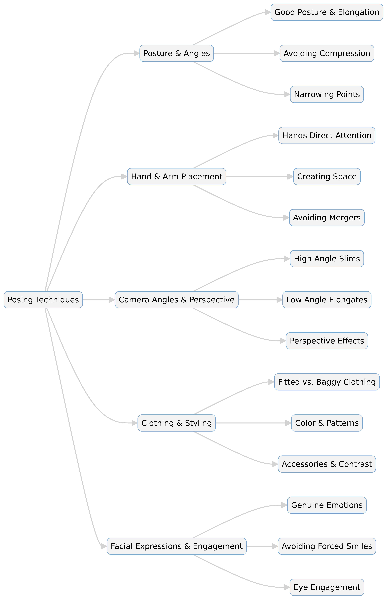

--- 
slug: book-takeaways-posing-lindsay-adler
title: "Book Takeaways: The Photographer's Guide to Posing By Lindsay Adler"

date: 2024-10-02

tags: 
  - Photos
  - Books
  - Book-Takeaways

--- 

Recently, I dove into The Photographer's Guide to Posing: Techniques to Flatter Everyone by Lindsay Adler, and it completely transformed how I think about capturing portraits.

Packed with practical tips, insightful techniques, and visual examples, this book isn't just a guide—it’s a toolkit for making every subject look and feel their best in front of the camera. As someone always striving to improve my portrait photography, I found Adler’s approach to posing to be not just technical but also deeply empathetic. It’s about understanding your subject’s unique qualities and using your camera to highlight their strengths.

Here are my key lessons and takeaways from the book, along with some personal notes that I think will elevate my future shoots.



---


**Key Takeaways**  
1. **Understand Posing Dynamics:** 
   - Each body type requires tailored poses to highlight strengths and downplay weaknesses. No one-size-fits-all pose exists.  
   - Posing women often involves creating curves, while posing men focuses on strong lines and stability.  
   - "Flow posing" involves small adjustments to move fluidly between poses.  

2. **The Power of Camera Angles:**  
   - Low angles make subjects look taller; high angles flatter the face and can reduce double chins.  
   - The relative distance to the camera changes perception—closer features appear larger.  
   - Experiment with camera positions to find the most flattering angle for each subject.  

3. **Use Negative Space:**  
   - Subtle gaps between the arms and body prevent the subject from looking wider.  
   - Cropping at narrowing points (like the waist or knees) enhances curves and creates pleasing shapes.  

4. **Expression and Connection:**  
   - The best pose fails without a natural, engaging expression. Work on building rapport with your subject to draw out genuine emotions.  
   - Direct attention with subtle cues like where the hands rest or how the head tilts.  

5. **Wardrobe and Accessories:**  
   - Proper clothing can highlight or obscure curves—tight clothing defines, while loose clothing hides shape.  
   - Use solid, darker colors to de-emphasize broader areas; avoid distracting patterns or embellishments in key areas.  

6. **Pose for Every Body Type:**  
   - For curvier subjects, define the waist with hand placement and avoid flat, symmetrical poses.  
   - Use angles, cropping, and narrowing points to highlight their best features without overemphasizing problem areas.  

7. **The Photographer’s Toolkit:**  
   - Combine lighting, lens choice, and camera position with posing for maximum impact.  
   - Pay attention to details like hands, chin angles, and shoulder placement to avoid tension or awkwardness.  

---

**Memorable Quotes**  
- *“Your job in posing is to draw attention to your subject’s strengths while pulling attention away from any weaknesses.”*  
- *“No matter how incredible the pose, if the subject doesn’t like their face in the image, they won’t like the photograph overall.”*  
- *“Confidence in your direction builds trust and comfort, transforming the shoot.”*  

---

**Actionable Insights**  
1. **Train Your Eye:** Analyze your work post-shoot for recurring issues like tension, unflattering angles, or poor cropping. Use these lessons to improve your next session.  
2. **Master Flow Posing:** Learn to transition smoothly from one pose to another, making small adjustments to achieve natural results.  
3. **Use Hands Wisely:** Hands act as visual cues. Place them thoughtfully to direct attention or create balance in the frame.  
4. **Practice Camera-Lens Dynamics:** Understand how focal lengths and angles impact body proportions. Wide-angle lenses exaggerate, while longer lenses compress.  
5. **Engage Emotion:** Build a connection with your subject by understanding their interests and making them feel at ease.  

---

This guide teaches more than posing—it’s a blueprint for creating meaningful, flattering portraits by mastering subtle nuances and paying attention to every detail. Whether photographing individuals or couples, Adler’s techniques help ensure every subject feels beautiful and confident in front of the lens.  

✨ *“The best poses are those that empower your subject and bring their story to life.”*


This is breakdown and organized summary for visualizing and internalize the key concepts!

```
The Photographer's Guide to Posing
   ├── Fundamentals
   │      ├── Negative Space
   │      ├── Define Waist
   │      └── Train Eye
   │
   ├── Angles
   │      ├── Low Angles
   │      ├── High Angles
   │      └── Wide Lens
   │
   ├── Flow
   │      ├── Variations
   │      ├── Micro Poses
   │      └── Smooth Flow
   │
   ├── Expression
   │      └── Relax Subjects
   │
   └── Tips
          ├── Hands Placement
          ├── Confidence Matters
          └── Relax Subjects

```


### **1. Fundamentals**  
#### a) **Negative Space**  
- Create subtle gaps between arms and the body to avoid making the subject appear wider.  
- Negative space adds elegance and definition to the subject’s form.  
- Triangles formed by arms or legs create dynamic and flattering poses.  

#### b) **Define the Waist**  
- Use hand placement or clothing to emphasize the waist, especially for curvier subjects.  
- Cropping at narrowing points, like the waist or knees, enhances curves and proportions.  
- A defined waist improves the visual flow and balance of the image.  

#### c) **Train Your Eye**  
- Analyze each pose for issues like tension, awkward angles, or merging limbs before snapping the shot.  
- Practice visualizing the subject in silhouette to spot unflattering shapes or areas of concern.  
- Continuously refine your skills by reviewing your own work critically.  

---

### **2. Angles**  
#### a) **Low Angles**  
- Make subjects appear taller, more powerful, and imposing.  
- Works well for emphasizing strength or authority, especially for male subjects.  
- Avoid shooting too close with a wide lens to prevent distortion.  

#### b) **High Angles**  
- Flatter the face by reducing double chins and emphasizing the eyes.  
- Slim the subject’s overall appearance, making it ideal for curvier subjects.  
- Use sparingly for shorter individuals to avoid exaggerating their height difference.  

#### c) **Wide Lens**  
- Exaggerates distances; closer elements appear larger while farther elements shrink.  
- Use for creative effects but avoid for portraits where balance and proportion are crucial.  
- Back up and use longer focal lengths to minimize distortion.  

---

### **3. Flow**  
#### a) **Variations**  
- Begin with a base pose and make small adjustments to hands, arms, or facial expressions.  
- Change focus points, like from the subject’s face to their hands, to create variety.  
- Move around the subject to explore different angles and perspectives without drastically changing the pose.  

#### b) **Micro Poses**  
- Minor tweaks, like tilting the head, adjusting the shoulders, or bending a wrist, can significantly improve a pose.  
- Focus on small movements rather than over-posing to maintain a natural look.  
- Micro poses prevent the subject from looking stiff or overly staged.  

#### c) **Smooth Flow**  
- Guide the subject through a series of subtle transitions to capture multiple shots from one setup.  
- Encourage movement, like leaning forward or shifting weight, for dynamic poses.  
- Flow posing helps create a more comfortable atmosphere for the subject.  

---

### **4. Expression**  
#### a) **Hands Placement**  
- Hands act as visual guides—place them to direct the viewer’s attention (e.g., hand on the waist draws attention there).  
- Avoid tension in the hands (clenched fists or awkward positions) as it can ruin the overall pose.  
- Use actions, like holding a prop or adjusting clothing, to give hands a natural purpose in the frame.  

#### b) **Confidence Matters**  
- Build rapport with your subject to make them feel relaxed and confident.  
- Positive reinforcement during the shoot improves expressions and body language.  
- Your confidence as a photographer directly translates to your subject’s comfort level.  

#### c) **Relax Subjects**  
- Use humor, stories, or specific directions to ease tension and draw out authentic expressions.  
- Ask for actions that evoke natural emotions (e.g., recalling a joyful memory for a genuine smile).  
- A relaxed subject leads to genuine and engaging portraits.  

---

### **5. Tips**  
#### a) **Pay Attention to Small Details**  
- Watch for subtle issues like slouched shoulders, uneven eye lines, or awkward hands.  
- A raised chin or tilted head can change the entire vibe of the shot.  
- Avoid baggy clothing that hides the subject’s shape and makes posing harder.  

#### b) **Lighting, Lens, and Pose**  
- Combine the right lighting, lens choice, and pose for maximum impact—one element alone isn’t enough.  
- Use longer focal lengths (85mm, 135mm) for portraits to compress features and maintain proportions.  
- Adjust poses to work with the lighting setup to enhance curves and minimize flaws.  

#### c) **Mind Your Direction**  
- Be specific in your instructions—use terms like "chin down," "lean left," or "hands relaxed."  
- Avoid overwhelming your subject; focus on one part of the pose at a time.  
- Communicate clearly and positively to keep the session productive and enjoyable.  

---


### Lindsay Adler’s most practical advice:

1. **"Your job in posing is to draw attention to your subject’s strengths while pulling attention away from any weaknesses."**  
2. **"No single pose is universally flattering, and there is no single perfect camera angle."**  
3. **"Flow posing is the ability to make small adjustments to move from one pose to the next without drastic changes."**  
4. **"Whatever is closest to the camera looks largest. Use this rule to emphasize or de-emphasize areas of the body."**  
5. **"Cropping at narrowing points creates more dynamic and flattering shapes in your portraits."**  
6. **"Subtle negative space between the arms and body helps define form and avoids making the subject appear wider."**  
7. **"The best poses are those that empower your subject and bring their story to life."**  
8. **"Angles, combined with pose and lens choice, can compress or elongate the subject—use them strategically."**  
9. **"Hands are like arrows. They subconsciously direct the viewer’s attention wherever they are placed."**  
10. **"A person’s name is, to them, the sweetest and most important sound in any language. Use it to create rapport."**  
11. **"If you want your subject to look taller, shoot from a lower angle. If you want them to look slimmer, shoot from above."**  
12. **"Train your eye to identify posing problems before you snap the shutter, not after."**  
13. **"Avoid tension in the hands—relaxed hands add elegance and balance to the shot."**  
14. **"Small details, like a bent wrist or the tilt of a head, can elevate a pose from static to dynamic."**  
15. **"Avoid baggy clothing as it hides the form and makes flattering posing much harder."**  
16. **"For curvier subjects, defining the waist through hand placement or clothing choice enhances their shape."**  
17. **"Be aware of camera angles and their impact: Low angles emphasize power; high angles create a sense of vulnerability or beauty."**  
18. **"A bad expression can ruin a perfect pose—connect with your subject to bring out natural emotions."**  
19. **"Lighting, lens choice, and camera angles are just as critical as the pose itself in creating a flattering image."**  
20. **"Confidence exuded by the photographer makes subjects feel comfortable, translating into better portraits."**  


---

# 📸 Expanded Summary: The Photographer's Guide to Posing by Lindsay Adler

# 📸 Expanded Summary: *The Photographer's Guide to Posing* by Lindsay Adler  

Lindsay Adler’s *The Photographer’s Guide to Posing* is a comprehensive resource on mastering the art of posing to flatter any subject. The book delves into posing fundamentals, camera angles, body positioning, hand placement, and interaction strategies for individuals and groups. It also highlights common posing mistakes and how to correct them.  

This expanded summary breaks down the essential insights and techniques in greater detail.  

---

## 🏆 **1. The Foundations of Posing**  

### 📌 **Posture & Body Positioning**  
- Good posture is the foundation of a great pose. Slouching compresses the midsection and shortens the neck, making subjects appear heavier.  
- Leaning back in a chair often results in a short neck and poor posture. To avoid this, use chairs without backs or have the subject lean slightly forward.  
- Proper weight distribution helps in creating a natural pose. Shifting weight onto one foot adds a more dynamic look.  

### 📌 **Narrowing Points for a Slimmer Look**  
- Positioning limbs to create “narrowing points” can make a subject appear more slender.  
- Crossing legs or positioning knees closer together creates an hourglass shape.  
- Hands on the waist, rather than the hips, define the waistline better and avoid emphasizing the hips.  

### 📌 **Avoiding Compression & Mergers**  
- When arms press against the body, they appear larger. A small gap between the arms and torso prevents this.  
- Clothing that is too tight or too loose can obscure body shape. Well-fitted clothing enhances the natural form.  

---

## 🎯 **2. Hand & Arm Placement: The Subtle Art**  

### 📌 **Hands as Visual Guides**  
- Hands act as arrows that guide the viewer’s eye. Placing them on the face, chest, or waist directs attention to these areas.  
- Hands should always appear relaxed. Tension in the fingers creates an unnatural look.  

### 📌 **Avoiding Unflattering Hand Placement**  
- Hands gripping too tightly create awkward indentations. Instead, gently place them on the body.  
- The palm side of the hand is usually broader and less elegant than the pinky side. Keeping the pinky side toward the camera enhances elegance.  

### 📌 **Creating Negative Space with Arms**  
- Arms too close to the body make the subject appear wider.  
- Slight bends in the arms and asymmetrical hand placement add natural flow to the pose.  

---

## 🎥 **3. Camera Angles & Lens Choice**  

### 📌 **High vs. Low Angles**  
- Shooting from a high angle slims the subject, making the face and upper body more prominent.  
- Shooting from a low angle elongates the subject but may exaggerate features like the hips.  

### 📌 **Perspective Effects & Focal Length**  
- A wide-angle lens exaggerates distance and can distort proportions if used too close to the subject.  
- A longer focal length (85mm-200mm) compresses distance and creates a more flattering perspective.  

### 📌 **Lens Distortion & Subject Proportions**  
- Subjects too close to the camera may appear disproportionate.  
- Backing up and using a longer lens creates a more natural look while maintaining proper proportions.  

---

## 🎭 **4. Expressions & Engagement**  

### 📌 **The Power of Facial Expressions**  
- Even a perfect pose can be ruined by a forced or blank expression.  
- Genuine emotions make portraits more compelling. Subjects should be engaged with the camera or each other naturally.  

### 📌 **Coaching Natural Expressions**  
- Ask the subject to think of something joyful or nostalgic to evoke a real smile.  
- For serious expressions, instruct them to take a deep breath and slightly squint their eyes to avoid looking too blank.  

### 📌 **Eye Direction & Engagement**  
- Looking directly at the camera creates connection, while looking slightly off can add mystery.  
- Avoid positioning the eyes so that too much of the whites are visible—it makes the subject appear disengaged.  

---

## 👫 **5. Posing for Couples & Groups**  

### 📌 **Creating Connection in Couples Portraits**  
- Multiple points of interaction (holding hands, touching faces) enhance romance in couples’ portraits.  
- Avoid mirrored poses; asymmetry creates a more natural look.  

### 📌 **Managing Height Differences**  
- If one partner is significantly taller, positioning them slightly behind or having them sit can balance proportions.  
- Using perspective tricks—placing the shorter person closer to the camera—can help even out height differences.  

### 📌 **Group Posing Strategies**  
- Ensure no one is standing stiffly—natural variations in height and posture add dynamism.  
- Avoid having all hands stacked or touching in one area, as it creates visual clutter.  

---

## 👗 **6. Styling & Clothing Choices**  

### 📌 **The Impact of Clothing on Posing**  
- Solid, dark colors help minimize broad areas.  
- Loose or baggy clothing obscures body shape and makes posing less effective.  
- Bold patterns and high-contrast areas in clothing draw the eye—use this to highlight or downplay certain body parts.  

### 📌 **Accessories & Props for Better Composition**  
- Accessories like scarves, hats, or jewelry can help balance a shot.  
- Using objects like chairs or railings can help subjects feel more comfortable in their pose.  

---

## 🎯 **7. Common Mistakes & How to Fix Them**  

### 📌 **Avoiding Flat, Stiff Poses**  
- Movement creates natural, engaging poses. Encourage slight shifts in weight or micro-movements.  
- Flow posing allows smooth transitions between poses without drastic changes.  

### 📌 **Preventing Double Chins & Short Necks**  
- Have the subject push their forehead slightly toward the camera to elongate the neck.  
- A higher camera angle can help reduce the appearance of a double chin.  

### 📌 **Controlling Foreshortening & Perspective Distortion**  
- Positioning limbs directly toward the camera can make them look shorter or disproportionate.  
- Rotating the subject slightly or adjusting the camera angle can reduce this effect.  

---

## 🏆 **Final Thoughts: Mastering the Art of Posing**  

1️⃣ **The best poses balance flattering angles, body shaping, and natural expressions.**  

2️⃣ **Every subject is unique—there’s no one-size-fits-all pose.**  

3️⃣ **Hand placement, posture, and negative space are key factors in creating a visually appealing composition.**  

4️⃣ **Camera angle and lens choice dramatically affect how the subject appears in the final image.**  

5️⃣ **Flow posing creates dynamic shots while keeping the session fluid and natural.**  

6️⃣ **For couples and groups, interaction is essential to capturing authentic relationships.**  

7️⃣ **Styling and clothing play a huge role in how well a pose translates on camera.**  

8️⃣ **Confidence in direction improves both the photographer’s workflow and the subject’s comfort.**  

9️⃣ **Identifying and correcting common posing mistakes takes practice, but it’s key to improving results.**  

🔟 **Ultimately, posing is about making people look and feel their best in front of the camera.**  

---

# **The Ultimate Guide to Posing in Photography**  
## **Mastering Techniques for Flattering Portraits**  

### 📸 Introduction  
Posing is an essential skill for photographers aiming to create compelling, flattering portraits. *The Photographer’s Guide to Posing* by Lindsay Adler is a comprehensive manual that explores how body positioning, camera angles, and small adjustments can transform an image. This guide breaks down the book’s core principles, offering actionable techniques to help photographers enhance their posing skills.  

---

## **1️⃣ The Fundamentals of Posing**  

### **📌 Posture & Body Positioning**  
A subject’s posture has a significant impact on how they appear in a photo. Good posture elongates the body, whereas slouching compresses it, making the subject appear shorter and heavier.  

✅ **Encourage a long neck and straight back**  
✅ **Avoid leaning too far back** (especially in seated poses)  
✅ **Shift weight onto one foot** for a dynamic stance  

### **📌 Creating a Slimmer Silhouette**  
Narrowing points help create curves and a more defined shape.  

✅ **Crossing legs or positioning knees closer together** enhances an hourglass effect  
✅ **Placing hands on the waist** (rather than the hips) slims the torso  
✅ **Using negative space between the arms and body** prevents a boxy look  

### **📌 Preventing Common Posing Mistakes**  
Many beginner photographers overlook small details that can affect the final result.  

❌ **Arms pressed against the body = wider appearance**  
❌ **Flat-footed stances appear stiff and unnatural**  
❌ **Loose, baggy clothing hides natural curves**  

---

## **2️⃣ The Role of Hands & Arms**  

### **📌 The Power of Hand Placement**  
Hands serve as visual guides in a photograph. Where they are placed determines where the viewer’s eye is drawn.  

✅ **Hands on the face = draws attention to facial features**  
✅ **Hands on the waist = defines the waistline**  
✅ **Hands on the chest = emphasizes upper body**  

### **📌 Avoiding Stiff or Awkward Hands**  
To ensure natural-looking hands in portraits:  

✅ Keep fingers relaxed, not rigid  
✅ Avoid clenching fists or gripping objects tightly  
✅ Show the pinky side of the hand rather than the palm  

---

## **3️⃣ Camera Angles & Perspective**  

### **📌 Understanding How Angles Change Perception**  
The angle at which a photographer shoots dramatically alters the subject’s appearance.  

✅ **High angles** – Slims the subject, emphasizes eyes and upper body  
✅ **Low angles** – Makes the subject appear taller but can exaggerate the hips  
✅ **Straight-on shots** – Work well for subjects with symmetrical features  

### **📌 Using the Right Lens for the Best Perspective**  
The choice of lens affects proportions and distortion in an image.  

✅ **85mm-200mm (telephoto lenses):** Flatter facial features and create a natural perspective  
✅ **50mm-70mm:** Versatile for general portraits  
✅ **35mm or wider:** Can exaggerate features if used too close to the subject  

### **📌 Avoiding Distortion & Perspective Errors**  
- **Wide-angle lenses can distort body parts** if used too close  
- **Avoid foreshortening**, which occurs when body parts are pointed directly at the camera, making them appear shorter  

---

## **4️⃣ Facial Expressions & Engagement**  

### **📌 Capturing Authentic Expressions**  
A well-posed subject with a poor expression can ruin an otherwise perfect shot.  

✅ **Encourage natural smiles by engaging in conversation**  
✅ **Use prompts to evoke real emotions** (e.g., ask them to think of a happy memory)  
✅ **Avoid blank stares by directing their gaze purposefully**  

### **📌 Enhancing Eye Contact**  
The direction of the eyes changes the mood of an image.  

✅ **Direct eye contact:** Creates engagement and connection  
✅ **Looking slightly off-camera:** Adds mystery or candidness  
✅ **Avoid too much white in the eyes:** Adjust head position to maintain balance  

---

## **5️⃣ Posing for Couples & Groups**  

### **📌 Couples Posing Tips**  
Capturing the emotional connection between two people is key.  

✅ **Create multiple points of contact** (holding hands, touching faces)  
✅ **Avoid mirrored poses** – Asymmetry looks more natural  
✅ **Use height and positioning to balance the frame**  

### **📌 Group Posing Strategies**  
Groups require thoughtful arrangement to maintain balance and avoid visual clutter.  

✅ **Use staggered positioning** instead of straight lines  
✅ **Ensure hands aren’t stacked or overlapping too much**  
✅ **Encourage relaxed body language** to make the pose feel natural  

---

## **6️⃣ Clothing & Styling for Better Poses**  

### **📌 How Clothing Affects Posing**  
Wardrobe choices can either enhance or hinder posing results.  

✅ **Solid colors and dark tones minimize attention to broad areas**  
✅ **Avoid loose or oversized clothing, as it hides body definition**  
✅ **Bold patterns and high-contrast outfits attract the viewer’s eye**  

### **📌 Using Accessories & Props**  
Props can help subjects feel more at ease and add visual interest.  

✅ **Hats, scarves, and jewelry add layers to a pose**  
✅ **Using chairs or railings helps subjects pose more naturally**  

---

## **7️⃣ Common Mistakes & How to Fix Them**  

### **📌 Avoiding Flat & Stiff Poses**  
Natural movement creates a more dynamic image.  

✅ Encourage micro-movements – Slight tilts and weight shifts  
✅ Flow posing – Transitioning from one pose to another naturally  
✅ Keep feet and hands engaged for a more balanced composition  

### **📌 Preventing Double Chins & Neck Shortening**  
✅ Ask the subject to **push their forehead slightly forward**  
✅ Shoot from a slightly higher angle  
✅ Ensure proper lighting to avoid harsh shadows under the chin  

### **📌 Fixing Foreshortening & Perspective Issues**  
✅ **Avoid limbs pointing directly at the camera**  
✅ **Turn shoulders slightly for a more natural proportion**  
✅ **Adjust the subject’s distance from the camera to maintain balance**  

---

## **8️⃣ Mastering Flow Posing**  

### **📌 What is Flow Posing?**  
Flow posing is a technique where the subject transitions seamlessly from one pose to another with small adjustments.  

✅ **Start with a base pose** and modify small details (hand placement, gaze direction)  
✅ **Encourage slight movements between shots** to create natural variety  
✅ **Use prompts to maintain engagement**  

---

## **🎯 Final Tips for Posing Success**  

1️⃣ **Flattering angles, body shaping, and natural expressions create the best portraits.**  
2️⃣ **Every subject is unique—adjust poses accordingly.**  
3️⃣ **Hand placement, posture, and negative space are key.**  
4️⃣ **Camera angle and lens choice dramatically affect proportions.**  
5️⃣ **Flow posing keeps sessions dynamic and engaging.**  
6️⃣ **Couples should have natural interactions to enhance connection.**  
7️⃣ **Wardrobe choices should complement body shape and pose.**  
8️⃣ **Photographer confidence and communication improve the posing process.**  
9️⃣ **Understanding common posing mistakes helps avoid them.**  
🔟 **Ultimately, posing should make people look and feel their best.**  

---

## **📌 Conclusion**  
Mastering posing is about more than just positioning the body—it’s about creating a story, enhancing features, and evoking emotion. By understanding posture, hand placement, camera angles, clothing choices, and expressions, photographers can ensure their subjects look and feel their best.  

With practice and confidence, these techniques will become second nature, allowing photographers to capture stunning, professional-level portraits effortlessly.  

---  

## 📸 Table: Posing Techniques & Best Practices  

| **Category**           | **Key Techniques** | **Common Mistakes** | **Corrections** |
|------------------------|------------------|-------------------|----------------|
| **Posture & Body Positioning** | Straight back, elongated neck, shift weight to one foot | Slouching, leaning too far back | Encourage upright posture, slight forward lean |
| **Narrowing Points** | Cross legs, position knees together, hands on waist | Placing hands on hips (widens torso) | Define waist with hand placement, create negative space |
| **Hand & Arm Placement** | Hands frame face, waist, or chest for emphasis | Clenched fists, stiff fingers, hands pressed into face | Keep hands relaxed, pinky side toward camera |
| **Camera Angles** | High angle slims, low angle elongates | Shooting too close with wide-angle lens | Use a longer lens (85mm-200mm) for compression |
| **Facial Expressions** | Use prompts for genuine smiles, slight squint for serious look | Blank stare, forced smile | Engage subject, direct gaze purposefully |
| **Couples Posing** | Multiple points of interaction, asymmetry for natural feel | Mirrored poses, lack of physical connection | Stagger positions, add touching elements |
| **Group Posing** | Stagger heights, avoid stacking hands | Lined-up stiff poses, cluttered hand placement | Encourage relaxed interactions, balance heights |
| **Clothing & Styling** | Solid colors, fitted clothing, use accessories | Baggy clothes hide shape, high-contrast patterns draw unwanted attention | Guide subject on outfit choices before shoot |
| **Common Mistakes** | Avoid foreshortening, double chins, stiff hands | Arms pressed against body, pointing limbs directly at the camera | Adjust angle, create separation between arms and torso |
| **Flow Posing** | Transition smoothly between poses with micro-adjustments | Stagnant posing, overly rigid transitions | Encourage small movements, vary angles subtly |

This table summarizes the essential posing techniques, common mistakes, and how to fix them for better portrait photography. Let me know if you need additional details! 😊


## 🎯 Quiz: Mastering Posing in Photography  

🔗 [Take the quiz here](https://questions.widenex.com/8f078413-7eac-44b7-a8cb-ecf9d082f3f5)  