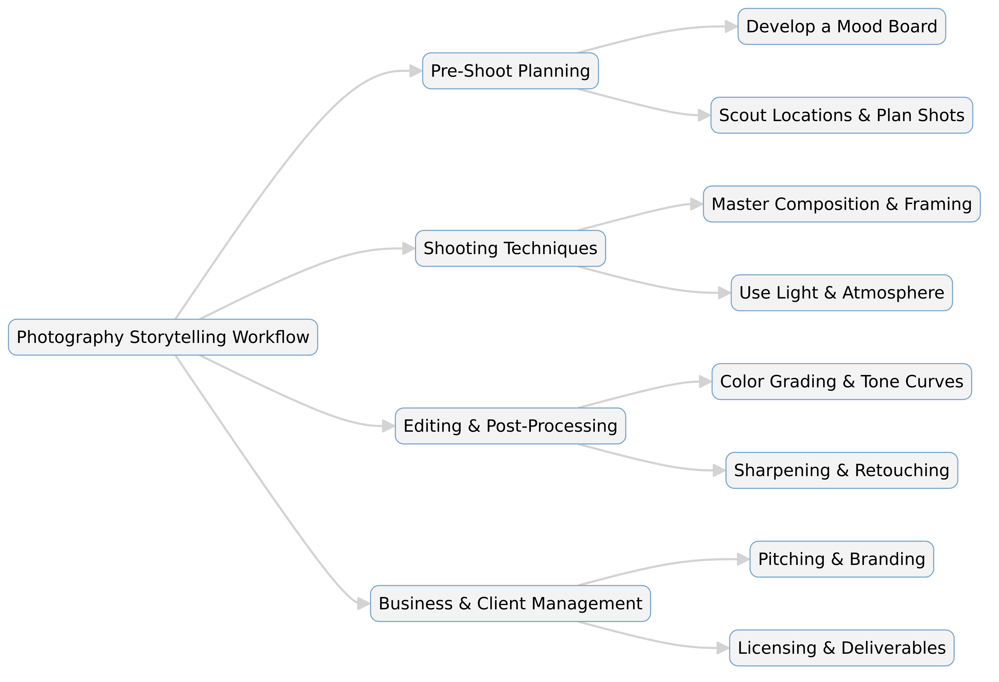

--- 
slug: the-photography-storytelling-workshop
title: "Book Takeaways: The Photography Storytelling Workshop By Finn Beales"

date: 2024-10-22

tags: 
  - Photos
  - Books
  - Book-Takeaways

--- 

Finn Beales' The Photography Storytelling Workshop is a guide to crafting compelling visual narratives. The book takes readers through the entire process of professional photography, covering everything from pitching clients and preparing shoots to executing, editing, and delivering final images. Beales emphasizes storytelling as the core of great photography, teaching techniques for engaging audiences, mastering lighting, composition, and editing, and handling the business side of photography.

---

# **Summary of *The Photography Storytelling Workshop* by Finn Beales** 📸  

Finn Beales' *The Photography Storytelling Workshop* is a guide to crafting compelling visual narratives. The book takes readers through the entire process of professional photography, covering everything from pitching clients and preparing shoots to executing, editing, and delivering final images. Beales emphasizes storytelling as the core of great photography, teaching techniques for engaging audiences, mastering lighting, composition, and editing, and handling the business side of photography.  

---

## **Key Takeaways** ✨  

📸 **Photography as Storytelling**: Great photography invites viewers to imagine and fill in the gaps of the story themselves.  

❓ **Pose Questions in Composition**: Arrange shots so subjects look outside the frame, creating intrigue.  

🖼️ **Emotion Beyond Faces**: Capture emotion in gestures, textures, and interactions, not just expressions.  

🌅 **Lighting and Atmosphere**: Utilize golden hour, blue hour, and diffused light to control mood.  

📍 **Location Matters**: Choose environments that enhance your subject and narrative.  

💡 **Follow Your Interests**: Avoid trends; shoot what genuinely excites you to create authentic work.  

🖊️ **Editing for Impact**: Use dodging and burning, color grading, and sharpening to enhance storytelling.  

💼 **Business of Photography**: Pitching, client communication, licensing, and pricing are crucial for success.  

📚 **Pre-Production is Key**: Planning shot lists, scouting locations, and understanding lighting conditions save time.  

🤝 **Engage on Social Media**: Consistency, interaction, and a strong portfolio attract clients and opportunities.  

---

## **Detailed Summary** 📖  

### 1. **The Power of Visual Storytelling**  
   - Photography is a storytelling medium where viewers fill in the blanks with their imagination.  
   - Creating intrigue through composition (e.g., subjects looking outside the frame) enhances engagement.  

### 2. **Emotional and Narrative Impact**  
   - Emotion goes beyond facial expressions—objects, textures, and gestures tell deeper stories.  
   - Nostalgia, atmosphere, and visual cues evoke feelings and create powerful narratives.  

### 3. **Compositional Techniques**  
   - Frame images to ask questions rather than giving all the answers.  
   - Use a mix of establishing shots, cutaways, and close-ups for dynamic storytelling.  

### 4. **Mastering Light and Atmosphere**  
   - Golden hour and blue hour create soft, cinematic lighting.  
   - Overcast skies act as diffusers, reducing harsh shadows.  

### 5. **Technical Choices for Stronger Stories**  
   - Prime lenses (e.g., 50mm, 85mm) create crisp images and beautiful depth of field.  
   - Shot types (long shots, close-ups) help structure a photo story.  

### 6. **Pre-Shoot Planning**  
   - Mood boards help define color grading and lighting approaches.  
   - Location scouting ensures optimal lighting and composition.  

### 7. **Shooting and Directing Subjects**  
   - Building rapport with subjects leads to natural and authentic shots.  
   - Environmental portraiture balances a subject with their surroundings.  

### 8. **Post-Processing for Storytelling**  
   - Editing enhances mood with dodging and burning, color grading, and sharpening.  
   - Lightroom workflows, from selection to final color grading, streamline the process.  

### 9. **Business and Branding for Photographers**  
   - A well-curated website attracts the right clients.  
   - Social media consistency and engagement build a strong personal brand.  
   - Licensing, contracts, and pricing strategies ensure fair compensation.  

### 10. **Delivering a Polished Product**  
   - Shot selection, final grading, and proper file formats (JPEG for web, TIFF for print) matter.  
   - Clients should feel involved in the selection process to strengthen relationships.  

---

## **Conclusion** 🎯  

Beales’ book is a practical guide for photographers looking to improve their storytelling skills. He highlights the importance of leaving gaps in the narrative to spark viewer imagination, posing questions with composition, and capturing emotions beyond just facial expressions. Technical aspects such as lens choices, lighting conditions, editing workflows, and color theory play a significant role in creating impactful images. Additionally, Beales offers valuable insights on the business of photography, including pitching, client relations, licensing, and pricing. Ultimately, *The Photography Storytelling Workshop* provides a roadmap for both creative and commercial success in visual storytelling.  

---

# **The Photography Storytelling Workshop: A Complete Guide** 📸  

## **Introduction**  
Finn Beales’ *The Photography Storytelling Workshop* is a masterclass in visual storytelling. The book provides a structured approach to photography, covering the entire creative and business process—from conceptualizing and pitching a project to shooting, editing, and delivering the final images. Beales emphasizes that photography is more than just capturing images; it’s about crafting narratives that evoke emotions and invite viewers to engage with the story.  

This guide explores the key lessons from the book, including technical skills, compositional strategies, lighting techniques, editing workflows, and business insights to help photographers build a successful career.  

---

## **1. The Power of Storytelling in Photography**  
### **Photography as a Narrative Tool**  
Unlike other art forms, photography leaves parts of the story open-ended, allowing viewers to engage their imagination. A well-composed image should raise questions, prompting curiosity and emotional connection.  

### **Creating Intrigue in Your Composition**  
- Frame shots so that subjects are looking at something outside the frame.  
- Capture only part of a scene to create mystery.  
- Use lighting, close-ups, and perspectives to highlight key emotions.  

### **Emotion Beyond Expressions**  
- Emotional depth is found in textures, gestures, and small details—not just faces.  
- Nostalgia, tension, and warmth can be communicated through composition and lighting.  

---

## **2. Mastering Composition for Impact**  
### **The Four Essential Shot Types**  
1. **Establishing Shot** – Introduces location and context.  
2. **Transition Shot** – Shows movement or journey (e.g., roads, footsteps).  
3. **Cutaways & Details** – Enhances narrative depth with close-ups of objects or expressions.  
4. **The Reveal** – The final scene or climax of the story.  

### **The Importance of Shot Variety**  
Using different shot types helps structure a photo series, ensuring a natural flow of storytelling.  

### **Environmental Portraits**  
- Balance the subject with their surroundings.  
- Ensure background details complement the story without overwhelming the subject.  
- Use wide-angle lenses (24mm, 35mm) to give context, but keep the person the focal point.  

---

## **3. Lighting and Atmosphere: Controlling Mood**  
### **Types of Natural Light**  
- **Golden Hour** – The warm, soft light right after sunrise and before sunset.  
- **Blue Hour** – The cool, twilight glow before sunrise and after sunset.  
- **Diffused Light** – Cloudy days create even, shadow-free lighting, great for portraits.  
- **Direct Sunlight** – Harsh light can create strong contrast but may require reflectors.  

### **Using Light for Emotion**  
- Soft, warm light evokes nostalgia and intimacy.  
- Strong contrast can add drama and depth.  
- Light direction affects mood—side lighting enhances texture and emotion.  

---

## **4. Technical Mastery: Lenses, Camera Settings, and Focus**  
### **Best Lenses for Storytelling**  
- **50mm Prime** – A versatile, natural-looking focal length.  
- **35mm Prime** – Excellent for environmental portraits and storytelling.  
- **70–200mm Zoom** – Great for capturing intimate moments from a distance.  

### **Key Camera Settings**  
- **Aperture** – A wider aperture (f/1.8–f/2.8) blurs the background, drawing attention to the subject.  
- **Shutter Speed** – Fast shutter speeds freeze action; slow speeds introduce motion blur.  
- **ISO** – Lower ISO reduces noise; increase ISO for low-light situations.  

### **Autofocus and Manual Focus Techniques**  
- **Use Single-Point Focus** to keep subjects sharp.  
- **Switch to Manual Focus** for fine control over depth of field.  

---

## **5. Pre-Production: The Key to a Successful Shoot**  
### **Developing a Mood Board**  
- Gather inspiration from different sources (archives, Instagram, art).  
- Define color tones and lighting styles in advance.  

### **Shot Planning and Scouting Locations**  
- Visit locations beforehand to evaluate lighting conditions.  
- Use apps like *Sunseeker* to track sunlight angles.  
- Plan a shot list to streamline the shoot.  

---

## **6. The Business of Photography: Pitching & Working with Clients**  
### **Building a Strong Portfolio**  
- Showcase only the type of work you want to get hired for.  
- Maintain a consistent visual style across your portfolio.  
- Use a clean, user-friendly website to present your work.  

### **Social Media & Branding**  
- Post regularly on Instagram (ideally Monday–Friday).  
- Engage with followers, clients, and other photographers.  
- Keep captions authentic and concise.  

### **Pitching to Clients**  
- Have a well-prepared treatment document outlining your approach.  
- Clearly define deliverables, licensing terms, and pricing.  
- Ask about usage rights (e.g., social media, advertising, exclusivity clauses).  

---

## **7. Editing & Post-Processing for Impact**  
### **The Editing Workflow**  
1. **Culling & Selection** – Choose the best shots using star ratings and color labels.  
2. **Basic Adjustments** – Exposure, contrast, and white balance.  
3. **Tone Curve & Color Grading** – Adjust highlights, shadows, and colors for mood.  
4. **Sharpening & Retouching** – Apply creative sharpening to enhance focal points.  
5. **Export & Delivery** – Optimize for web (JPEG, sRGB) or print (TIFF, ProPhoto RGB).  

### **Retouching & Color Theory**  
- Adjust colors to enhance emotion (e.g., warm tones for nostalgia, cool tones for calm).  
- Use dodge and burn techniques to emphasize key areas.  
- Subtle film-inspired imperfections add texture and character.  

---

## **8. Delivering the Final Product**  
### **Client Delivery Process**  
- Upload low-resolution previews to a web-based gallery (e.g., *Pixieset*).  
- Let clients favorite images to involve them in the selection process.  
- Send high-resolution images via *Dropbox* or *WeTransfer*.  

### **Usage Licensing & Pricing**  
- Set clear licensing terms based on how images will be used.  
- Factor in pre-production, shooting, editing, and post-processing costs.  
- Consider travel expenses, assistants, equipment rentals, and retouching fees.  

---

## **Conclusion** 🎯  
*The Photography Storytelling Workshop* is an essential guide for photographers looking to elevate their craft. Beales provides a comprehensive approach to storytelling, from conceptualization to final delivery. Key lessons include:  

- Photography is about storytelling, not just taking pictures.  
- Composition, lighting, and emotion are critical in engaging an audience.  
- Technical mastery of lenses, settings, and editing enhances storytelling.  
- Pre-production planning and location scouting are crucial for success.  
- Running a photography business requires strong branding, pitching, and client relations.  
- Editing and color grading shape the final narrative.  
- Delivering high-quality, well-organized final products strengthens client relationships.  

By following these principles, photographers can create compelling visual narratives that captivate audiences and build successful careers. 📷✨  

---

# **Expanded Summary: *The Photography Storytelling Workshop*** 📸  

Finn Beales’ *The Photography Storytelling Workshop* is a deep dive into the art and business of photography. It offers a structured approach to visual storytelling, covering essential techniques from pre-shoot preparation to editing and client management. This expanded summary breaks down the book’s core lessons with detailed explanations of how to create compelling photo narratives.  

---

## **📖 Part 1: Photography as Storytelling**  

### **1.1 The Power of Visual Storytelling**  
Unlike other forms of media, photography is a silent medium—there’s no dialogue, sound, or motion to guide the viewer. Instead, a great image should **pose a question**, leaving room for interpretation.  

- **Photography invites imagination**: Viewers fill in the gaps of the story.  
- **Create intrigue**: Frame shots in a way that raises curiosity rather than answering everything directly.  
- **Use subtle visual cues**: Light, color, expressions, and framing shape how viewers engage with an image.  

### **1.2 Techniques to Engage Viewers**  
Beales suggests using composition and subject placement to create an emotional connection:  
✅ **Subjects looking outside the frame** → Raises curiosity  
✅ **Intriguing close-ups** → Draws attention to emotions  
✅ **Use of shadows and light** → Enhances mood  

### **1.3 Emotion Beyond Expressions**  
Photography isn't just about capturing smiles or tears—it’s about evoking **instinctive feelings** through textures, movement, and environmental details.  

- Everyday elements can tell stories (e.g., a worn-out sneaker can symbolize struggle or adventure).  
- Nostalgia is a powerful tool—use colors, props, and locations that connect with past emotions.  

---

## **📷 Part 2: Mastering Composition for Impact**  

### **2.1 The Four Essential Shot Types**  
To tell a visual story effectively, Beales recommends structuring photo sets with:  

1️⃣ **Establishing Shot** – Contextualizes the setting (e.g., a cityscape or a house in a landscape).  
2️⃣ **Transition Shot** – Captures movement or journey (e.g., footsteps, a moving car, a door opening).  
3️⃣ **Cutaways & Details** – Close-ups of objects that add depth (e.g., hands holding a cup, an old watch).  
4️⃣ **The Reveal** – The final moment of the story (e.g., a subject reaching their goal, a wide concluding shot).  

### **2.2 Composition Rules to Follow**  
📌 **Rule of Thirds** – Place key elements along grid intersections.  
📌 **Leading Lines** – Use roads, fences, or paths to direct attention.  
📌 **Negative Space** – Give subjects room to ‘breathe’ in the frame.  
📌 **Balance Foreground & Background** – Ensure the scene adds context without overpowering the subject.  

---

## **🌅 Part 3: Mastering Light & Atmosphere**  

### **3.1 Understanding Natural Light**  
Lighting dramatically affects mood and storytelling. Here are key lighting conditions Beales emphasizes:  

- **Golden Hour (Sunrise & Sunset)** → Warm, soft, cinematic light.  
- **Blue Hour (Twilight Before Sunrise & After Sunset)** → Cool, dreamy tones.  
- **Diffused Light (Overcast Days)** → Even lighting, ideal for portraits.  
- **Direct Sunlight** → High contrast, sharp shadows—use reflectors to soften it.  

### **3.2 Controlling Mood with Light**  
💡 Side lighting enhances textures and depth.  
💡 Soft backlight can create a dreamlike, ethereal effect.  
💡 Harsh shadows add drama and intensity.  

---

## **📸 Part 4: Technical Mastery – Camera, Lenses, and Settings**  

### **4.1 Choosing the Right Lens for the Story**  
- **50mm Prime** → Ideal for portraits and natural-looking shots.  
- **35mm Prime** → Great for storytelling and environmental portraits.  
- **70–200mm Zoom** → For capturing intimate moments from a distance.  

### **4.2 Camera Settings for Different Effects**  
**Aperture (f/stop)**  
🔹 f/1.8 – f/2.8 → Blurred background, good for portraits.  
🔹 f/8 – f/11 → Balanced sharpness, great for landscapes.  

**Shutter Speed**  
🔹 1/1000s+ → Freezes motion.  
🔹 1/30s – 1/60s → Introduces motion blur.  

**ISO**  
🔹 Low ISO (100–400) → Crisp images in bright conditions.  
🔹 High ISO (800–3200) → Needed for low-light but introduces noise.  

---

## **🎬 Part 5: The Business of Photography**  

### **5.1 Branding & Social Media Presence**  
- Post consistently on Instagram (Monday–Friday schedule).  
- Engage with photographers, clients, and art buyers.  
- Keep captions short, natural, and personal.  

### **5.2 Pitching to Clients & Securing Jobs**  
💼 **Create a pitch that includes**:  
✔ What makes your photography unique  
✔ Your understanding of the client’s needs  
✔ A shot list and mood board  

### **5.3 Understanding Licensing & Pricing**  
- **Usage Fees** → Determine how and where the images will be used (e.g., social media, billboards).  
- **Creative Fees** → Charge for time spent shooting and editing.  
- **Exclusivity Clauses** → Be cautious of restrictions that prevent working with competitor brands.  

---

## **🎨 Part 6: Editing & Post-Processing for Impact**  

### **6.1 Editing Workflow in Lightroom**  
✅ **Step 1: Culling & Selection** – Use a star rating system to filter the best images.  
✅ **Step 2: Basic Adjustments** – Exposure, contrast, highlights, and shadows.  
✅ **Step 3: Color Grading** – Use the **Tone Curve** and **HSL Panel** for subtle mood enhancements.  
✅ **Step 4: Dodging & Burning** – Brighten or darken selective areas for depth.  
✅ **Step 5: Sharpening & Retouching** – Keep details crisp without overdoing it.  

### **6.2 Using Color Theory in Editing**  
🎨 **Warm tones** → Evoke nostalgia, energy, and happiness.  
🎨 **Cool tones** → Create a sense of calm, distance, or mystery.  
🎨 **Muted/desaturated tones** → Feel cinematic and moody.  

### **6.3 Delivering the Final Product to Clients**  
📂 Upload previews to a platform like **Pixieset** for client review.  
📂 Deliver high-resolution images via **Dropbox** or **WeTransfer**.  
📂 Ensure licensing terms are documented in contracts.  

---

## **📢 Final Thoughts**  

Finn Beales’ *The Photography Storytelling Workshop* is an essential guide for photographers looking to elevate their craft. He emphasizes that great photography isn’t just about technical skills—it’s about **telling a compelling story**.  

✅ **Photography is about posing questions, not giving answers.**  
✅ **Mastering light and composition transforms an ordinary photo into a narrative.**  
✅ **A structured editing process ensures a polished final product.**  
✅ **Success in photography requires both creativity and business acumen.**  

By following Beales’ process, photographers can develop their unique voice and create impactful images that stand out in the industry. 📷✨  

---

📌 **[Start the Quiz](https://questions.widenex.com/c19a4ac9-18cd-4502-bb89-db3fe3891906)**  
