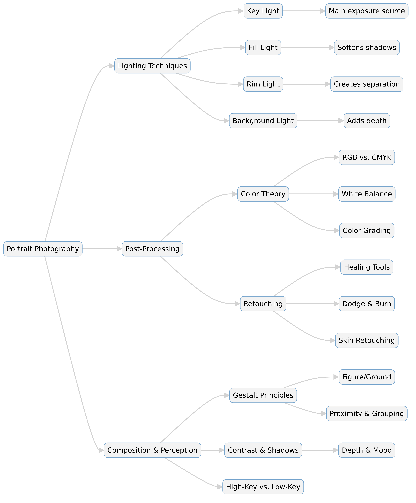

--- 
slug: book-takeaways-the-dramatic-portrait-by-chris-knight
title: "Book Takeaways: The Dramatic Portrait by Chris Knight"

date: 2024-11-03

tags: 
  - Photos
  - Books
  - Book-Takeaways
--- 

The Dramatic Portrait by Chris Knight is a comprehensive guide to lighting, retouching, and post-production techniques in portrait photography. The book emphasizes the importance of light manipulation, color correction, and retouching decisions to create visually striking and emotionally compelling portraits. It also delves into technical aspects such as bit depth, color spaces, and the psychology behind human visual perception.

Here are my key lessons and takeaways from the book, along with some personal notes that I think will elevate my future shoots.

---

### **📌 Key Points**

🎭 **Light Patterns & Portraiture**: The shape of light on the face determines the portrait's visual impact, with different lighting techniques affecting mood and depth.

🖌️ **Retouching with Restraint**: Effective retouching is about knowing what to keep rather than what to remove. Over-editing can strip the portrait of authenticity.

🌈 **Color Theory & Editing**: Understanding RGB and CMYK relationships is crucial for color correction. Adjusting curves affects brightness, contrast, and color balance.

📷 **Bit Depth & Image Quality**: A 16-bit image provides more editing flexibility than an 8-bit one, especially when handling gradients or post-production work.

🖼️ **White Balance & Exposure**: White balance is crucial in maintaining realistic colors, while exposure adjustments affect highlights, shadows, and overall contrast.

💡 **Lighting Ratios & Modifiers**: The key, fill, rim, and background lights work together to create depth, with modifiers like softboxes and scrims controlling light softness.

📊 **Histogram Interpretation**: A well-balanced histogram improves dynamic range and image clarity, helping photographers achieve high-key or low-key effects.

👀 **Perception & Composition**: Gestalt principles help guide the viewer’s eye, while contrast, sharpness, and color choices influence depth and storytelling.

🖍️ **Post-Production Workflow**: Lightroom is useful for initial adjustments, but Photoshop offers better tools for detailed retouching, especially for skin correction.

📢 **Gear vs. Skill**: While equipment matters, a photographer's ability to manipulate light and composition plays a more significant role in creating great portraits.

### ** 📖 Summary **

1️⃣ Lighting & Its Role in Portraiture
The book starts by discussing how different lighting setups affect portraits. The key light creates the primary shape of light on the face, while fill, rim, and background lights add depth. The use of lighting ratios, such as 1:1 or -2 stop fill, helps balance shadows and highlights for different moods.

2️⃣ Retouching Philosophy
Retouching should be subtle and purposeful, emphasizing natural beauty rather than excessive correction. The best retouchers focus on removing distractions while maintaining skin texture. Color correction techniques, such as adjusting RGB curves, play a crucial role in enhancing the final image.

3️⃣ Color Spaces & Profiles
sRGB is a common web color space, but professional editing benefits from larger color spaces. Bit depth impacts how many colors can be displayed or edited, with 16-bit images providing better flexibility in post-production.

4️⃣ Understanding Color & Contrast
Colors interact with each other in predictable ways—red is opposite cyan, green is opposite magenta, and blue is opposite yellow. This knowledge is essential for correcting color casts and achieving balanced tones.

5️⃣ White Balance & Exposure Control
Proper white balance ensures color accuracy, with the Flash preset often used in studio settings. Exposure, contrast, clarity, and vibrance adjustments refine the image before retouching begins.

6️⃣ Histograms & Image Contrast
Histograms help photographers balance highlights, shadows, and midtones. A high-key image has most data in the right section, while a low-key image has information concentrated on the left.

7️⃣ Lighting Control & Modifiers
Light direction, feathering, and falloff all impact the final look. A large scrim softens light, while a direct, small light source creates harder shadows. The inverse square law governs light intensity over distance.

8️⃣ Psychology of Visual Perception
Viewers naturally focus on faces and high-contrast areas. Delayed perception techniques help guide attention subtly. Understanding Gestalt principles aids in composing impactful images.

9️⃣ Post-Production Workflow
The book outlines an efficient workflow from Lightroom adjustments to Photoshop retouching. While Lightroom is useful for broad adjustments, Photoshop provides precise control over fine details.

🔟 Philosophy of Photography
While gear plays a role, creative vision and decision-making define a photographer's success. Practicing with available tools is more important than obsessing over equipment.

### ** 👀 Detail **

# **Mastering Dramatic Portrait Photography**  
### *Insights from *The Dramatic Portrait* by Chris Knight*  

## **💡 Understanding Light in Portraiture**  
Lighting is the foundation of dramatic portrait photography. The way light interacts with a subject determines the mood, texture, and overall aesthetic of the image.  

### **🔹 The Four Essential Lights in Portrait Photography**  
1. **Key Light** – The main source of illumination, setting the primary exposure.  
2. **Fill Light** – Softens shadows and controls contrast.  
3. **Rim Light** – Separates the subject from the background, adding depth.  
4. **Background Light** – Enhances or colors the backdrop for visual interest.  

### **🔹 Lighting Ratios and Their Effects**  
- **1:1 Ratio** – Equal intensity of key and fill lights, creating soft shadows.  
- **-1 Stop Fill** – The fill light is one stop darker than the key light, producing moderate contrast.  
- **-2 Stop Fill** – The fill light is significantly darker than the key, creating dramatic shadows.  

### **🔹 Hard vs. Soft Light**  
- **Hard Light** – Comes from small, direct sources, creating sharp shadows and high contrast.  
- **Soft Light** – Comes from large, diffused sources, producing gradual shadows and smooth skin tones.  

### **🔹 Light Modification Techniques**  
- **Feathering Light** – Using the edge of a light source for a smoother transition from highlight to shadow.  
- **Scrims and Softboxes** – Diffuse light to make it softer and more even.  
- **Inverse Square Law** – Light intensity decreases exponentially with distance, affecting contrast and falloff.  

---

## **🎨 The Science of Color and Contrast**  
Color and contrast significantly impact the emotional tone of an image. Mastering color correction and grading allows photographers to create visually compelling portraits.  

### **🔹 Color Theory in Photography**  
- **RGB (Red, Green, Blue) & CMYK (Cyan, Magenta, Yellow, Black)** – Fundamental color models in digital photography.  
- **Complementary Colors** – Colors that neutralize each other (e.g., red cancels out cyan, blue cancels out yellow).  
- **Hue, Saturation, and Brightness (HSB)** – Key attributes of color in digital editing.  

   ### RGB vs. CMYK Color Systems
   - RGB (Red, Green, Blue) is used for screen-based images.
   - CMYK (Cyan, Magenta, Yellow, Black) is used for print.
   - Opposing Colors: Red ↔ Cyan, Green ↔ Magenta, Blue ↔ Yellow. Adjusting these color relationships in editing helps correct color imbalances.

### **🔹 Bit Depth and Image Quality**  
- **8-bit Images** – Suitable for minimal post-processing but limited in color depth.  
- **16-bit Images** – Ideal for heavy post-production work, retaining more color data and flexibility.  
- **Why Higher Bit Depth Matters?** – It prevents color banding and allows for smoother gradients, especially in skies and skin tones.  

### **🔹 Histogram and Exposure Control**  
- **Low-Key Images** – Darker tones dominate, creating mood and drama.  
- **High-Key Images** – Brighter tones dominate, producing a soft and ethereal look.  
- **Contrast Adjustments** – Controlling highlights, midtones, and shadows to achieve the desired look.  

---

## **🖌️ The Art of Retouching**  
Post-production is a crucial step in achieving a polished and professional portrait. The goal is to enhance the subject while maintaining a natural and realistic look.  

### **🔹 Key Retouching Techniques**  
- **Skin Smoothing** – Reducing blemishes without losing texture.  
- **Color Grading** – Adjusting hues to set the mood of the portrait.  
- **Detail Enhancement** – Sharpening key areas while maintaining softness where needed.  

### **🔹 Lightroom vs. Photoshop**  
- **Lightroom** – Best for broad adjustments like exposure, white balance, and color grading.  
- **Photoshop** – Essential for detailed retouching, such as skin correction and advanced cloning.  

### **🔹 Workflow for Editing Portraits**  
1. **Start with White Balance & Exposure Adjustments** – Ensure natural skin tones.  
2. **Use the Histogram for Balanced Contrast** – Avoid losing detail in highlights or shadows.  
3. **Apply Selective Adjustments** – Enhance eyes, skin, and hair without over-processing.  
4. **Export to Photoshop for Detailed Retouching** – Use frequency separation and dodge & burn for skin refinement.  

---

## **📢 Gear vs. Skill: What Matters More?**  
Chris Knight emphasizes that while gear is important, it is not the defining factor in a great portrait. Instead, mastering lighting, composition, and post-processing makes the real difference.  

### **🔹 Key Takeaways on Gear & Learning**  
- A skilled photographer can create stunning images with minimal equipment.  
- Learning through practice is more valuable than obsessing over gear.  
- The best camera is the one you know how to use effectively.  

---

# **The Dramatic Portrait – Extended Summary**  
### *By Chris Knight*  

## **📖 Introduction**  
*The Dramatic Portrait* by Chris Knight is a deep dive into portrait photography, focusing on lighting techniques, post-processing, and artistic decision-making. It explores how light shapes a subject, the technical aspects of color management, and the nuances of retouching to create compelling, dramatic images. The book also touches on the psychology of human perception, guiding photographers to use contrast, composition, and retouching choices to direct the viewer’s eye.  

---

# **🎭 Understanding Light in Portraiture**  

## **The Role of Light in Shaping the Subject**  
The foundation of portrait photography lies in controlling light to create mood and depth. The key light is the primary source that determines the subject’s exposure, while additional lights—fill, rim, and background—help balance shadows and add dimension.  

- **Key Light**: The dominant light that shapes the subject’s face.  
- **Fill Light**: Softens shadows and reduces contrast.  
- **Rim Light**: Helps separate the subject from the background.  
- **Background Light**: Adds illumination or color to the environment.  

### **Lighting Modifiers and Techniques**  
- **Soft Light vs. Hard Light**: Soft light (diffused sources) creates gentle shadows, whereas hard light (small, direct sources) creates sharper contrasts.  
- **Feathering Light**: Using the edge of a light source to achieve more even lighting.  
- **Inverse Square Law**: The intensity of light decreases exponentially with distance, impacting contrast and brightness.  

### **Lighting Ratios & Their Impact**  
- **1:1 Ratio** – Balanced exposure between key and fill lights.  
- **-1 Stop Fill** – The fill light is one stop darker, creating more depth.  
- **-2 Stop Fill** – The key light dominates, producing dramatic contrast.  

---

# **🎨 Color Theory & Post-Processing**  

## **RGB vs. CMYK Color Systems**  
- **RGB (Red, Green, Blue)** is used for screen-based images.  
- **CMYK (Cyan, Magenta, Yellow, Black)** is used for print.  
- **Opposing Colors**: Red ↔ Cyan, Green ↔ Magenta, Blue ↔ Yellow. Adjusting these color relationships in editing helps correct color imbalances.  

## **Understanding Bit Depth in Editing**  
Bit depth determines how many colors an image can store:  
- **8-bit** images have 16.8 million possible colors.  
- **16-bit** images have trillions of colors and offer greater flexibility for post-processing.  
- High-bit-depth images prevent banding in gradients (e.g., skies).  

## **White Balance & Exposure Adjustments**  
- White balance ensures color accuracy by correcting warm or cool tones.  
- **Exposure Tweaks**: Raising exposure brightens an image, while reducing it darkens it.  
- **Histogram Interpretation**: Helps balance blacks, shadows, midtones, highlights, and whites.  

## **Retouching Best Practices**  
- The goal of retouching is **subtlety**—preserve texture while enhancing features.  
- **Common Adjustments**: Skin smoothing, color grading, sharpening, and dodging & burning.  
- **Photoshop vs. Lightroom**:  
  - Lightroom is useful for broad adjustments.  
  - Photoshop allows for detailed corrections, like blemish removal.  

---

# **🖼️ Composition & Psychological Perception**  

## **Gestalt Principles in Photography**  
Developed in the 1920s, Gestalt principles explain how the brain perceives images:  
1. **Figure/Ground** – Distinguishing the subject from the background.  
2. **Proximity & Grouping** – Elements close together appear related.  
3. **Similarity** – Repeating colors or shapes create visual harmony.  
4. **Continuity** – The eye follows leading lines.  
5. **Closure** – The brain fills in missing details.  
6. **Symmetry** – Balanced images are naturally pleasing.  

## **High-Key vs. Low-Key Photography**  
- **High-Key**: Bright, soft, and low contrast (often used for beauty portraits).  
- **Low-Key**: Dark, moody, and high contrast (common in dramatic portraits).  

## **The Role of Shadows**  
- Shadows create depth and mood.  
- Contrast influences how light and shadow shape the subject.  
- Without shadows, images lose dimension and look flat.  

---

# **🖌️ Workflow & Image Selection**  

## **Editing Workflow (Start to Finish)**  
1. **Develop RAW File in Lightroom**  
   - Adjust exposure, contrast, highlights, and shadows.  
   - Fine-tune white balance and color grading.  
   - Reduce noise and sharpen details.  
2. **Retouching in Photoshop**  
   - Use **healing brushes** for blemish removal.  
   - Apply **dodge & burn** to sculpt light and shadows.  
   - Adjust **color curves** for refinement.  
3. **Final Adjustments & Exporting**  
   - Resize, sharpen, and apply output color space.  
   - Export for web (sRGB) or print (Adobe RGB or CMYK).  

## **Culling & Image Selection**  
- First pass: Flag potential selects.  
- Second pass: Rate images with stars (0-5).  
- Final pass: Organize into categories with color tags.  

---

# **📷 Equipment vs. Skill: The Ongoing Debate**  

## **Does Gear Matter?**  
- Great photographers create stunning images with any camera.  
- **Skill & Vision > Expensive Gear**.  
- However, better gear **does** improve flexibility (e.g., dynamic range, resolution).  

## **Common Misconceptions**  
- Buying a high-end camera doesn’t replace **understanding light and composition**.  
- A smartphone or older DSLR can produce amazing images with proper technique.  

---

# **📝 Final Thoughts & Takeaways**  
1. **Light is Everything** – Understanding light’s behavior is key to great portraits.  
2. **Retouching Should Be Subtle** – Remove distractions but keep authenticity.  
3. **Color Theory Matters** – Adjusting curves and white balance is crucial for accurate skin tones.  
4. **Master Exposure & Histograms** – A well-exposed image makes post-processing easier.  
5. **Composition is Intentional** – Use Gestalt principles to guide the viewer’s eye.  
6. **Know Your Workflow** – Lightroom for global edits, Photoshop for detailed refinements.  
7. **Experiment with Lighting Ratios** – Play with contrast and mood in your portraits.  
8. **Photography is About Storytelling** – What do you want your image to say?  
9. **Gear is Secondary** – Creativity and practice are far more important than expensive equipment.  
10. **Keep Shooting** – The more you practice, the more defined your personal style becomes.  

--

## **Table: Key Concepts from *The Dramatic Portrait***  

| **Category**          | **Concept**                        | **Explanation** |
|----------------------|--------------------------------|----------------|
| **Lighting**         | Key Light                     | The main light source shaping the subject. |
|                      | Fill Light                    | Softens shadows and reduces contrast. |
|                      | Rim Light                     | Creates separation from the background. |
|                      | Background Light              | Adds depth or color to the scene. |
|                      | Soft vs. Hard Light           | Soft light has gradual shadows, while hard light creates sharp contrasts. |
| **Color Theory**     | RGB vs. CMYK                  | RGB is used for screens, CMYK for print. |
|                      | Color Opposites               | Red ↔ Cyan, Green ↔ Magenta, Blue ↔ Yellow. |
|                      | Bit Depth                     | 16-bit images have more color flexibility than 8-bit. |
|                      | White Balance                | Adjusts color temperature to keep colors accurate. |
| **Post-Processing**  | Lightroom vs. Photoshop      | Lightroom handles general edits; Photoshop is for detailed retouching. |
|                      | Healing Tools                 | Used for blemish and distraction removal. |
|                      | Dodge & Burn                  | Enhances highlights and shadows for depth. |
|                      | Color Grading                 | Adjusting tones to set a specific mood. |
| **Composition**      | Gestalt Principles            | Psychological rules that influence perception. |
|                      | High-Key vs. Low-Key          | High-key is bright with low contrast; low-key is dark and moody. |
|                      | Contrast & Shadows           | Helps define depth and direct the viewer’s attention. |
| **Photography Mindset** | Gear Importance          | Skill is more important than expensive gear. |
|                      | Practicing & Learning        | Experience and creativity matter more than tools. |

## **Quiz: *The Dramatic Portrait***  

[🎯 Take the Quiz](https://questions.widenex.com/0b34b725-77af-4679-bf9f-07af04aa4ed2)  