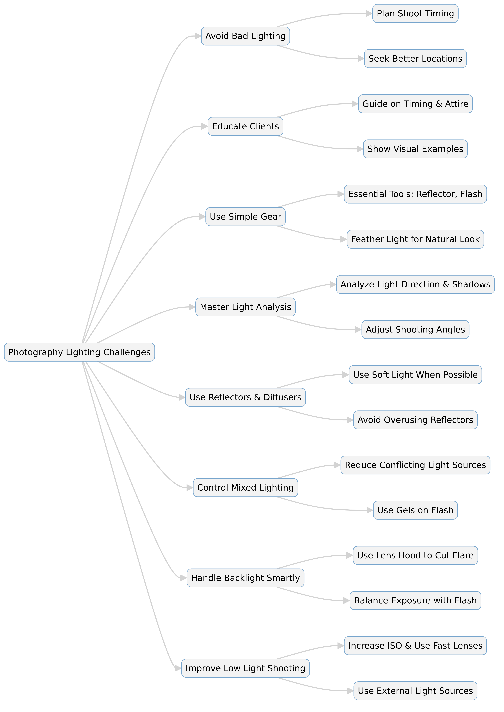

--- 
slug: book-takeaways-shitting-light-by-lindsay-adler
title: "Book Takeaways: Shooting in Shtty Light* by Lindsay Adler"

date: 2024-12-01

tags: 
  - Photos
  - Books
  - Book-Takeaways
--- 

Lighting is the most critical element in photography. This book provides practical solutions for photographers facing difficult lighting situations. It covers the top ten worst lighting conditions and teaches techniques to overcome them, ensuring great portraits even in challenging environments. The author emphasizes the importance of understanding light, educating clients, and using simple tools effectively.

Here are my key lessons and takeaways from the book, along with some personal notes that I think will elevate my future shoots.

---

## 📷 Summary of *Shooting in Sh*tty Light* by Lindsay Adler  

This book provides practical solutions for photographers facing difficult lighting situations. It covers the top ten worst lighting conditions and teaches techniques to overcome them, ensuring great portraits even in challenging environments. The author emphasizes the importance of understanding light, educating clients, and using simple tools effectively.  

---

## 🎯 Key Takeaways  

📌 **Avoid bad light**: The best solution is not to shoot in terrible lighting conditions. Plan your shoots around favorable light.  

📌 **Educate clients**: Many clients don’t understand lighting, so guide them on location, timing, and attire for better photos.  

📌 **Simple gear matters**: A few essential tools like reflectors and flashes can solve most lighting issues without overloading on expensive equipment.  

📌 **Analyze light**: Pay attention to where the light comes from, how it affects the face, and adjust your shooting angle accordingly.  

📌 **Beware of overhead light**: It creates unflattering shadows on the eyes and highlights on the forehead. Use shade, foam core, or reflectors to soften it.  

📌 **Use reflectors wisely**: Overusing them can create harsh lighting. Feather the light for a natural, flattering look.  

📌 **Control mixed lighting**: Reduce conflicting color temperatures by using gels on flashes or eliminating unnecessary light sources.  

📌 **Master backlit situations**: Use lens hoods, reflectors, or off-camera flashes to balance exposure and avoid silhouette issues.  

📌 **Overcast days aren’t always great**: While they provide soft light, they can also create dull images. Use reflectors or flash to add contrast.  

📌 **Flash is a powerful tool**: Proper use of flash can balance exposure, create direction, and add dimension, even in challenging lighting scenarios.  

---

## 📚 Summary  

1️⃣ **Lighting is the foundation of good photography** – Poor lighting can ruin an image. The book starts with foundational lighting principles and five key tips for overcoming bad light.  

2️⃣ **Bad lighting situations can be managed** – Whether shooting at midday, indoors with fluorescent lights, or in harsh backlight, there are specific strategies to make the best of any situation.  

3️⃣ **Client education is key** – Photographers should guide their clients on optimal lighting conditions for their shoots to avoid difficult scenarios.  

4️⃣ **Understanding light is more important than gear** – Rather than relying on expensive equipment, photographers should focus on mastering light direction, quality, and control.  

5️⃣ **The sun is both an ally and an enemy** – Direct sunlight, overcast skies, and backlit conditions each present unique challenges, but they can be managed with shade, reflectors, or fill flash.  

6️⃣ **Reflectors and diffusers are essential tools** – Used correctly, they can soften harsh shadows, control contrast, and improve overall lighting quality.  

7️⃣ **Mixed lighting situations require careful handling** – Balancing different light temperatures (fluorescent, tungsten, daylight) is crucial for natural-looking images.  

8️⃣ **Backlight techniques can create beautiful effects** – Using lens flare creatively and balancing exposure properly can result in stunning, dramatic portraits.  

9️⃣ **Low-light photography needs adjustments** – High ISO, fast lenses, and external light sources can help in dimly lit conditions. Flash techniques are particularly useful here.  

🔟 **The book offers practical, actionable advice** – Each chapter contains step-by-step techniques, illustrated examples, and real-world scenarios to help photographers improve their lighting skills.  

---

## 📚 Details

# 📷 *Expanded Summary of* Shooting in Sh*tty Light by Lindsay Adler  

## 📌 Introduction: Conquering Bad Lighting in Photography  
Lighting is the most critical element in photography. This book provides practical strategies to tackle ten of the most challenging lighting situations photographers encounter. Whether shooting weddings, portraits, or fashion, learning to manipulate light ensures consistently great images, even in suboptimal conditions.  

## 🌞 **1. Avoiding Bad Lighting is the Best Solution**  
- The best way to deal with poor lighting is **not to shoot in it at all**.  
- Midday sun and harsh indoor lighting can ruin images with unflattering shadows and color casts.  
- Photographers must take control, **schedule shoots during optimal lighting conditions**, and choose locations carefully.  

**💡 Solution:**  
- **Avoid midday sun**: Shoot during golden hour for softer light.  
- **Stay away from fluorescent light**: It produces an unnatural greenish tint.  
- **Use shade strategically**: Large trees, buildings, or porches can create soft, diffused light.  

## 🗣 **2. Educating Clients About Lighting**  
Many clients don’t understand light, so it’s up to photographers to **educate them on location, time of day, and attire choices** for the best results.  

**💡 Solution:**  
- Show clients visual examples comparing good vs. bad lighting.  
- Suggest better locations and times for optimal lighting conditions.  
- For weddings, **recommend ceremonies away from direct midday sun** or under shaded areas.  

## 🎛 **3. Mastering Light Analysis: Understanding Light Direction and Quality**  
Photographers need to **train their eyes** to recognize how light interacts with their subjects.  

**💡 Key factors to analyze:**  
- **Direction**: Where is the primary light source?  
- **Quality**: Is it soft (overcast, shaded) or harsh (direct sunlight)?  
- **Shadows**: Are they flattering or distracting?  

**Techniques for controlling light:**  
- **Turn the subject slightly** to catch the best light.  
- **Use a reflector to bounce light back** into the subject’s face.  
- **Move to a different location** with more balanced lighting.  

## 📸 **4. Using Reflectors and Diffusers**  
Reflectors and diffusers are simple yet powerful tools to shape light.  

**💡 How to use reflectors effectively:**  
- **Gold reflectors**: Add warmth but can create unnatural color shifts.  
- **Silver reflectors**: Enhance contrast and add brightness.  
- **White reflectors**: Provide a soft, natural-looking fill light.  

**💡 Avoid common mistakes:**  
- Don’t **overuse reflectors**—too much reflected light can cause harsh highlights.  
- Feather the light by adjusting the reflector **at an angle** to create natural-looking shadows.  

## 🔥 **5. Handling Harsh Overhead Light**  
Direct sunlight from above creates **ugly shadows under the eyes and nose**, known as “raccoon eyes.”  

**💡 Solutions:**  
- Move subjects into **open shade** or **create artificial shade** (hold up a white foam core or a translucent diffuser).  
- **Use a reflector** to fill in shadows under the eyes.  
- **Avoid covered shade** (like under an awning), which can create dark, dull lighting.  

## 🌅 **6. Mastering Backlight and Lens Flare**  
Backlighting occurs when the light source is behind the subject, often causing exposure issues.  

**💡 Techniques for shooting in backlight:**  
- **Use a lens hood** to reduce flare.  
- **Expose for the subject’s face**, not the bright background.  
- **Use a reflector or flash** to fill in shadows on the subject.  
- If flare is unavoidable, **embrace it for a creative, dreamy look**.  

## 🌙 **7. Shooting in Low-Light Situations**  
Indoor and nighttime photography require adjustments to exposure settings.  

**💡 Key techniques:**  
- **Increase ISO** to let in more light while managing noise levels.  
- **Use fast lenses** with wide apertures (f/1.4–f/2.8) for better low-light performance.  
- **Utilize external light sources** such as flashes or LED panels.  
- **Use a tripod** for longer exposures when possible.  

## 🎨 **8. Dealing with Mixed Lighting and Color Temperature**  
Different light sources (daylight, tungsten, fluorescent) have different color temperatures, which can create **unwanted color casts in images**.  

**💡 Solutions:**  
- **Use a gray card** to correct white balance.  
- **Gel your flash** to match the ambient light temperature.  
- **Reduce conflicting light sources** by turning off unnecessary lights or adjusting the subject’s position.  

## ⚡ **9. Using Flash for Better Lighting Control**  
Flash can be an essential tool when used correctly, but improper flash usage can create **harsh, unnatural images**.  

**💡 How to use flash effectively:**  
- **Bounce flash off walls or ceilings** to create softer light.  
- **Use a diffuser** to avoid harsh shadows.  
- **Adjust flash power** (avoid full power unless necessary).  
- **Combine flash with ambient light** for natural-looking results.  

## ☁️ **10. Overcoming Overcast and Cloudy Day Challenges**  
While overcast skies provide soft, even light, they can also make images **dull and lifeless**.  

**💡 Solutions:**  
- **Use reflectors to add contrast** and fill shadows.  
- **Position subjects to face the light source** (e.g., the brightest part of the sky).  
- **Use off-camera flash with a soft modifier** for added direction and contrast.  

## 🎯 **Final Takeaways**  
- **Great photography isn’t about having the best gear**—it’s about knowing how to **manipulate and control light**.  
- **Preparation is key**—schedule shoots wisely, educate clients, and always assess the lighting environment.  
- **Simple tools like reflectors, diffusers, and flashes can dramatically improve your images** when used correctly.  
- **Analyze light carefully** in every scene—observe its quality, direction, and impact on your subject.  
- **Experiment and practice** different lighting techniques to develop confidence in handling tricky situations.  

---

# 📷 Mastering Photography in Challenging Light: A Guide to Overcoming Bad Lighting  

## 📊 Lighting Techniques for Photography  

| **Lighting Challenge** | **Problems** | **Solutions** | **Tools to Use** |  
|------------------------|-------------|--------------|------------------|  
| **Harsh Midday Sun** | Unflattering shadows, squinting, overexposure | Move to shade, use a diffuser, shoot during golden hour | Reflector, diffuser, shade |  
| **Low-Light Conditions** | Blurry images, high noise, focus issues | Increase ISO, use a fast lens, add external light | Fast lens (f/1.4–f/2.8), tripod, flash |  
| **Mixed Lighting (Daylight + Indoor)** | Color casts (orange, green, blue) | Set custom white balance, use gels on flash, turn off conflicting lights | Gray card, color gels, flash |  
| **Overhead Light** | Shadows under eyes and nose, shiny highlights | Use a diffuser, add a reflector, change subject position | Foam core, white reflector, translucent diffuser |  
| **Backlighting & Lens Flare** | Underexposed subject, lens flare, focus difficulty | Use spot metering, add fill flash, use a lens hood | Reflector, flash, lens hood |  
| **Flash Photography** | Harsh direct light, unnatural results | Bounce flash, use a diffuser, adjust flash power | Flash, softbox, diffuser |  
| **Overcast Days** | Flat lighting, lack of contrast | Use a reflector, adjust subject positioning, add off-camera flash | Reflector, silver reflector, off-camera flash |  
| **Reflector Use** | Over-reflecting, harsh light | Feather light, avoid overuse, choose the right color | White, silver, gold reflectors |  
| **Indoor Events (Fluorescent/Tungsten)** | Unnatural color, mixed lighting | Use white balance presets, gel your flash, reduce unwanted light sources | Gray card, CTO gels, flash |  
| **Night Photography** | Slow shutter speeds, motion blur, high noise | Use a tripod, increase ISO, add artificial light | Tripod, LED light, flash |  

## 📌 Introduction  

Lighting is the foundation of great photography. Whether you're shooting portraits, weddings, or fashion, knowing how to manipulate light is essential for creating compelling images. Unfortunately, photographers don’t always have control over lighting conditions. This guide explores how to handle some of the worst lighting situations and turn them into opportunities for stunning photography.  

---

## 🌞 **1. Understanding the Importance of Light**  

Before diving into specific lighting scenarios, it's crucial to understand **why light matters in photography**. Light affects:  
- **Exposure**: Too much light leads to overexposed images, while too little results in underexposure.  
- **Shadows & Highlights**: Poor lighting can create unflattering shadows, while well-controlled light enhances facial features.  
- **Mood & Atmosphere**: The quality, direction, and color of light impact the feel of a photograph.  

### **How to Analyze Light Before Shooting**  
- Observe the **direction** of the light source.  
- Determine the **quality** (soft vs. harsh).  
- Identify **potential problem areas** (overhead light, shadows, reflections).  

---

## 📷 **2. Avoiding Harsh Midday Light**  

Shooting in direct sunlight can be challenging due to harsh shadows and extreme contrast.  

### **Problems with Midday Light:**  
- Creates **unflattering facial shadows** (raccoon eyes).  
- Causes **overexposure and blown-out highlights**.  
- Results in **squinting subjects**.  

### **Solutions:**  
✅ **Move to Open Shade**: Look for shaded areas with diffused light (trees, buildings, porches).  
✅ **Use a Reflector**: Bounce light back onto the subject to fill in harsh shadows.  
✅ **Shoot During Golden Hour**: Schedule outdoor shoots early in the morning or late in the afternoon for softer light.  

---

## 🌙 **3. Handling Low-Light Photography**  

Indoor and nighttime photography often means working with **limited light**.  

### **Challenges in Low-Light Conditions:**  
- **Blurry images** due to slow shutter speeds.  
- **High noise levels** from increasing ISO.  
- **Difficulty focusing** in dim environments.  

### **Solutions:**  
✅ **Increase ISO**: Modern cameras handle high ISO well, so don’t be afraid to boost it.  
✅ **Use a Fast Lens (Wide Aperture)**: Lenses with f/1.4–f/2.8 allow more light in.  
✅ **Add External Lighting**: Use a flash or continuous LED light.  
✅ **Use a Tripod**: Helps stabilize the camera for longer exposures.  

---

## 🎭 **4. Dealing with Mixed Lighting**  

Indoor photography often involves multiple light sources with **different color temperatures**, leading to unwanted color casts.  

### **Common Mixed Lighting Scenarios:**  
- Fluorescent + Daylight = **Greenish Tint**  
- Tungsten + Daylight = **Orange or Blue Tint**  

### **Solutions:**  
✅ **Use a Custom White Balance**: Set the correct color temperature using a gray card.  
✅ **Gel Your Flash**: Use colored gels on your flash to match ambient light.  
✅ **Turn Off Unnecessary Light Sources**: Reduce conflicting light temperatures.  

---

## ☀️ **5. Managing Harsh Overhead Light**  

Direct overhead light (midday sun, office lighting) creates deep shadows and unflattering highlights.  

### **Problems with Overhead Light:**  
- **Harsh shadows under the eyes and chin**.  
- **Shiny highlights on the forehead and nose**.  

### **Solutions:**  
✅ **Use a Diffuser**: Soften the light by holding a translucent diffuser above your subject.  
✅ **Add a Reflector**: Bounce light back up to fill in shadows.  
✅ **Change Subject’s Position**: Have them tilt their face toward the light for better illumination.  

---

## 🎇 **6. Backlighting and Lens Flare**  

Shooting with the sun behind your subject can create exposure issues, but it also allows for creative effects.  

### **Challenges with Backlight:**  
- **Silhouettes and underexposure**.  
- **Lens flare causing loss of contrast**.  
- **Focus issues due to strong light behind the subject**.  

### **Solutions:**  
✅ **Use Spot Metering**: Expose for the subject’s face, not the background.  
✅ **Block Direct Sunlight**: Use a lens hood or a reflector to reduce flare.  
✅ **Use Fill Flash**: Balance exposure by adding light to the subject.  

---

## 📸 **7. Flash Photography: Making Artificial Light Look Natural**  

Flash can be a powerful tool when used correctly. However, poorly executed flash can look unnatural.  

### **Common Flash Mistakes:**  
- **Direct Flash Causes Harsh Shadows**  
- **Overpowering Ambient Light Creates Flat Images**  

### **Solutions:**  
✅ **Bounce the Flash**: Aim it at a ceiling or wall for softer light.  
✅ **Use a Diffuser**: Softens the light to prevent harsh shadows.  
✅ **Adjust Flash Power**: Avoid full power; instead, use lower settings to blend naturally.  

---

## 🌫 **8. Overcast Days: Flat Lighting and How to Fix It**  

Cloudy weather provides soft, even light but can also lead to **low-contrast, dull images**.  

### **Solutions:**  
✅ **Use a Reflector**: Adds contrast and fills in shadows.  
✅ **Change Subject Position**: Rotate them to find the best natural light.  
✅ **Use Off-Camera Flash**: Adds direction and dimension to the image.  

---

## 🖼 **9. Using Natural and Artificial Reflectors**  

Reflectors are an easy way to manipulate light without additional equipment.  

### **Types of Reflectors and Their Effects:**  
- **White**: Soft, natural-looking fill light.  
- **Silver**: Adds contrast and brightness.  
- **Gold**: Warms up the subject but can cause unnatural tones.  
- **Black**: Creates deeper shadows for dramatic effect.  

### **DIY Reflectors:**  
- White walls, sidewalks, and even large pieces of cardboard can act as natural reflectors.  

---

## 📢 **10. Final Takeaways**  

- **Understand light before you shoot**: Always analyze the quality, direction, and intensity.  
- **Take control of lighting**: Don’t just accept bad lighting—adjust, manipulate, and enhance it.  
- **Use simple tools**: A reflector and a flash can solve most lighting problems.  
- **Educate your clients**: Guide them on the best lighting conditions for great results.  
- **Experiment and practice**: The best way to master lighting is through experience!  

---

## 🎯 Photography Lighting Quiz  

📌 **Test your knowledge on handling difficult lighting situations!**  

▶️ **[Start the Quiz](https://questions.widenex.com/800656c1-c09e-4fa6-b29b-cdc87a4375cc)**  
