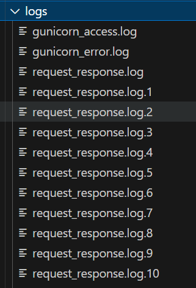

--- 
slug: log-rotation-for-log-management
title: "Technical Notes: Configuring Log Rotation for Log Management"

date: 2024-06-15

tags: 

  - Linux
  - MLOps
  - CS
  - BE

--- 

Log rotation is essential for managing log files in production systems, ensuring that logs do not consume excessive disk space while maintaining accessibility for troubleshooting and analytics. Recently, I configured log rotation for our microservice system. Below are my detailed notes and configurations, which can serve as a guide for implementing log rotation in your environment.

---

### Why Log Rotation?

- Prevents log files from consuming too much disk space.
- Ensures old logs are archived for future reference.
- Allows processes to continue logging without interruptions.
- Customizable settings for different services and environments.

---

### Configuration Overview

#### 1. Log Rotation for Realtime Microservices

- **Purpose**: Manage logs generated by the realtime services.
- **Configuration file**: `/etc/logrotate.d/realtime_logs`
- **Settings**:
    
    ```bash
    /path/to/realtime-service/logs/*.log {
        su root root
        size 10M
        rotate 9999999
        missingok
        notifempty
        copytruncate
    }
    ```
    
    - **Key Settings**:
        - `size 10M`: Rotate logs when they reach 10 MB.
        - `rotate 9999999`: Retain a very high number of old logs (effectively unlimited).
        - `missingok`: Skip missing files without generating errors.
        - `notifempty`: Avoid rotating empty logs.
        - `copytruncate`: Truncate the log file after rotation.

#### 2. Rotating NGINX Logs

- **Purpose**: Rotate logs for the NGINX web server.
- **Configuration file**: `/etc/logrotate.d/nginx`
- **Settings**:
    
    ```bash
    /var/log/nginx/*.log {
        daily
        rotate 10
        missingok
        notifempty
        compress
        delaycompress
        create 0640 nginx root
        sharedscripts
        postrotate
            if [ -f /run/nginx.pid ]; then
                kill -USR1 `cat /run/nginx.pid`
            fi
        endscript
    }
    ```
    
    - **Additional Features**:
        - `compress`: Compress old logs to save space.
        - `postrotate`: Reload NGINX to ensure it uses new log files.

---

### Scheduling Log Rotation with Cron

To automate log rotation, the following cron jobs were added to rotate logs every hour:

```bash
0 * * * * /usr/sbin/logrotate /etc/logrotate.d/realtime_logs
```

For daily rotation, you can modify the schedule accordingly.

---



### Summary

1. **Size-based Rotation**: Rotate logs when they reach a specific size (e.g., 10 MB).
2. **Retention Policy**: Use `rotate` to specify the number of old logs to keep.
3. **Compression**: Compress old logs to save space.
4. **Error Handling**:
    - `missingok`: Skip missing files without errors.
    - `notifempty`: Skip empty logs.
5. **Copytruncate**: Enable processes to continue writing to the same log file without restarting.
