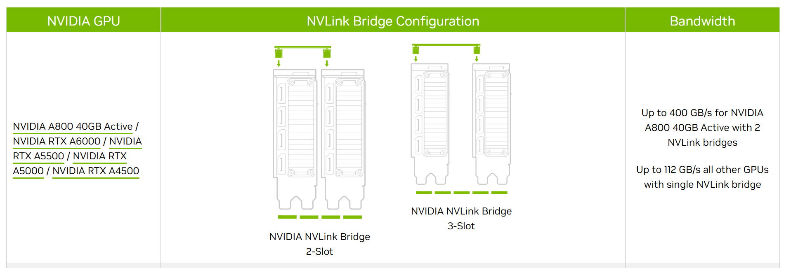

--- 
slug: how-to-boost-gpu-performance-with-nvlink
title: How to Boosting GPU Performance with NVLink

date: 2024-6-1

tags: 

  - AI

--- 

When training large machine learning models across multiple GPUs, the way your GPUs are connected can have a huge impact on your training speed. One of the key technologies that can help here is **NVLink**, developed by NVIDIA.



### What is NVLink?

In simple terms, NVLink is a high-speed connection between GPUs. It’s much faster than the traditional PCIe connection, allowing GPUs to share data more quickly. Think of it as a superhighway for your data, compared to a regular road.

---

### Why Does NVLink Matter?

When GPUs need to exchange a lot of data during training, a faster connection helps them work more efficiently. For example:

- If two GPUs are connected via NVLink, they can transfer data up to **23% faster** compared to using PCIe alone.
- This speed boost is especially important for models that require frequent communication between GPUs.

---

### Real Example: GPU Connectivity in Action

You can check how your GPUs are connected by running:

```bash
nvidia-smi topo -m
```

Here’s an example from my company’s setup:

```
        GPU0    GPU1    GPU2    GPU3    CPU Affinity    NUMA Affinity
GPU0     X      NV4     SYS     SYS     0,2,4,6,8,10    0
GPU1    NV4      X      SYS     SYS     0,2,4,6,8,10    0
GPU2    SYS     SYS      X      NV4     1,3,5,7,9,11    1
GPU3    SYS     SYS     NV4      X      1,3,5,7,9,11    1

Legend:

  X    = Self
  SYS  = Connection traversing PCIe as well as the SMP interconnect between NUMA nodes (e.g., QPI/UPI)
  NODE = Connection traversing PCIe as well as the interconnect between PCIe Host Bridges within a NUMA node
  PHB  = Connection traversing PCIe as well as a PCIe Host Bridge (typically the CPU)
  PXB  = Connection traversing multiple PCIe bridges (without traversing the PCIe Host Bridge)
  PIX  = Connection traversing at most a single PCIe bridge
  NV#  = Connection traversing a bonded set of # NVLinks
```

- **GPU0 and GPU1 are connected via NVLink (NV4)**
- **GPU2 and GPU3 are also connected via NVLink (NV4)**

Legend:

- **NV#**: Connection using NVLink (e.g., NV4 means 4 bonded NVLinks).
- **SYS**: Connection using PCIe.

---

### How Does NVLink Improve Training?

Here’s a quick comparison of training a GPT-2 model with and without NVLink from [1]:

|NVLink|Training Time|
|---|---|
|**Yes**|101 seconds|
|**No**|131 seconds|

This shows that NVLink speeds up training by **~23%**.

---

### When Is NVLink Most Useful?

The benefit of NVLink depends on how often GPUs need to talk to each other:

- **Rare Communication (e.g., DDP)**: The impact of NVLink is smaller because GPUs work more independently.
- **Frequent Communication (e.g., ZeRO-DP)**: The impact is much larger because GPUs constantly share data.

---

### Takeaway for Your GPU Setup

- **Use GPUs with NVLink connections** when you need maximum speed for training models that frequently exchange data.
- Check your system’s connectivity with `nvidia-smi topo -m` and plan your GPU usage accordingly. For example, in the setup above, GPU0 and GPU1 work best as a pair, and GPU2 and GPU3 work best as another pair.


 [1] Ref: https://huggingface.co/transformers/v4.9.2/performance.html