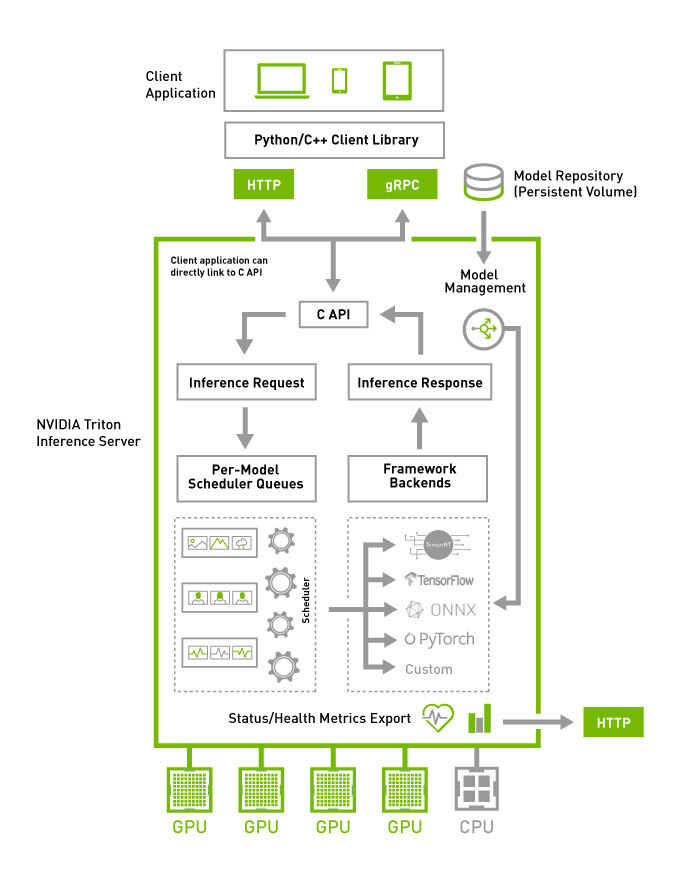
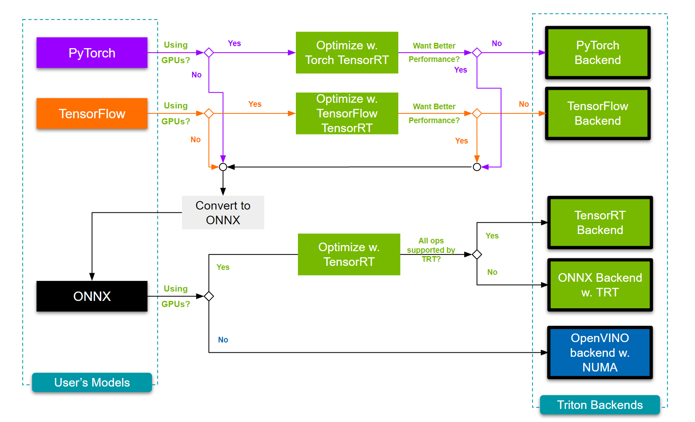

--- 
slug: nvidia-triton-inference-server
title: "Technical Notes: NVIDIA Triton Inference Server"

date: 2024-07-01

tags: 

  - AI
  - MLOps

--- 

Recently, I explored the NVIDIA Triton Inference Server, and it completely changed how I think about deploying and optimizing AI models at scale. Packed with robust features, including multi-framework support, dynamic batching, and inference acceleration, Triton is a must-know tool for engineers solving real-world challenges in AI inference. From managing complex pipelines to fine-tuning configurations for maximum throughput, Triton offers a wealth of possibilities. Here are my key learnings and technical notes, which I hope will serve as a quick reference for anyone diving into Triton.

---



## **Problem Overview**
AI inference solutions need to address:
1. **Model Management**: Multiple frameworks, devices, and versions.
2. **Dynamic Model Handling**: Loading/unloading models without disrupting live services.

---

### **1. Model Deployment**
- **Multi-Framework Support**: Deploy PyTorch, TensorFlow, and ONNX models on the same server.
- **Hardware Flexibility**: Assign different models to GPUs, CPUs, or specific devices.
- **Version Management**: By default, Triton serves the latest model version, but this behavior is configurable.

**Model Control Modes**:
- `NONE`: Static configuration, no dynamic updates.
- `EXPLICIT`: Manual API-driven updates.
- `POLL`: Automatic polling for repository updates.

Example:
```bash
tritonserver --model-repository=/models --model-control-mode=poll
```

---

### **2. Concurrent Execution & Dynamic Batching**
#### **Dynamic Batching**:
- Combines multiple inference requests dynamically into a single batch.
- Configurable in `config.pbtxt`:
```plaintext
dynamic_batching {
    max_queue_delay_microseconds: 100
}
```

#### **Concurrent Execution**:
- **Multiple Instances**: Spawn multiple instances of the same model for parallel processing.
- **Instance Placement**: Allocate instances across GPUs for optimal performance.

Example:
```plaintext
instance_group [
  {
    count: 2
    kind: KIND_GPU
    gpus: [ 0, 1 ]
  }
]
```

---

### **3. Optimizing Triton Configuration**
Every inference workload is unique. Triton allows configuration sweeps to balance:
1. **Network Latency**: Reduce transfer overhead, especially for large datasets.
2. **Compute Latency**: Accelerate with optimizations like FP16 precision, fused kernels, etc.
3. **Queue Latency**: Address delays by increasing model instances.

**Model Analyzer**:
- A CLI tool for configuration sweeps and performance profiling.
- Tracks latency, throughput, GPU utilization, and more.
- Outputs detailed reports and metrics to guide deployments.

---

### **4. Inference Acceleration**



#### **Backend Support**:
Triton supports various backends:
- **GPU**: TensorRT, CUDA Execution Provider.
- **CPU**: OpenVINO for optimized performance.

**TensorRT**:
- Integrates with PyTorch and TensorFlow (`Torch-TensorRT`, `TF-TensorRT`) for fallback handling.
- Example config for FP16 acceleration:
```plaintext
optimization {
  execution_accelerators {
    gpu_execution_accelerator : [ {
      name : "tensorrt"
      parameters { key: "precision_mode" value: "FP16" }
    }]
  }
}
```

**CPU Acceleration**:
- Use OpenVINO for efficient inference on CPUs.
```plaintext
optimization {
  execution_accelerators {
    cpu_execution_accelerator : [ { name : "openvino" } ]
  }
}
```

---

### **5. Model Ensembles**
- Execute multiple models in a single **Directed Acyclic Graph (DAG)** pipeline with one network call.
- Reduces client-server data transfer and latency.

For complex logic (loops, conditionals), use the Python or C++ backend with Triton’s **Business Logic Scripting API (BLS)**.

---

### **6. Building Complex Pipelines**
- Multiple contributors can integrate their work seamlessly using the Python or C++ backend.
- Ideal for collaborative projects with modular deep learning pipelines.

---

### **Performance Optimization Summary**
- **Dynamic Batching**: Improves throughput/latency by grouping requests.
- **Parallel Model Instances**: Reduces wait time in model queues.
- **Accelerator Integration**: GPU-based TensorRT and CPU-based OpenVINO.

---

### Key Takeaways: ###

1. Combine multiple inference requests into a single batch for better speed and resource utilization. Configurable in config.pbtxt.
2. Run multiple instances of the same model on one or more GPUs to improve throughput and reduce queue latency.
3. Run multiple models in sequence (pipeline) with a single network request to minimize latency.
4. Use the Model Analyzer CLI to identify optimal configurations for latency, throughput, and resource usage.


Tip: Use the NGC PyTorch container with Docker as your environment. It saves time, avoids setup headaches, and provides a pre-configured, optimized setup for development and deployment.


Ref:

https://github.com/triton-inference-server/tutorials/tree/main/Conceptual_Guide