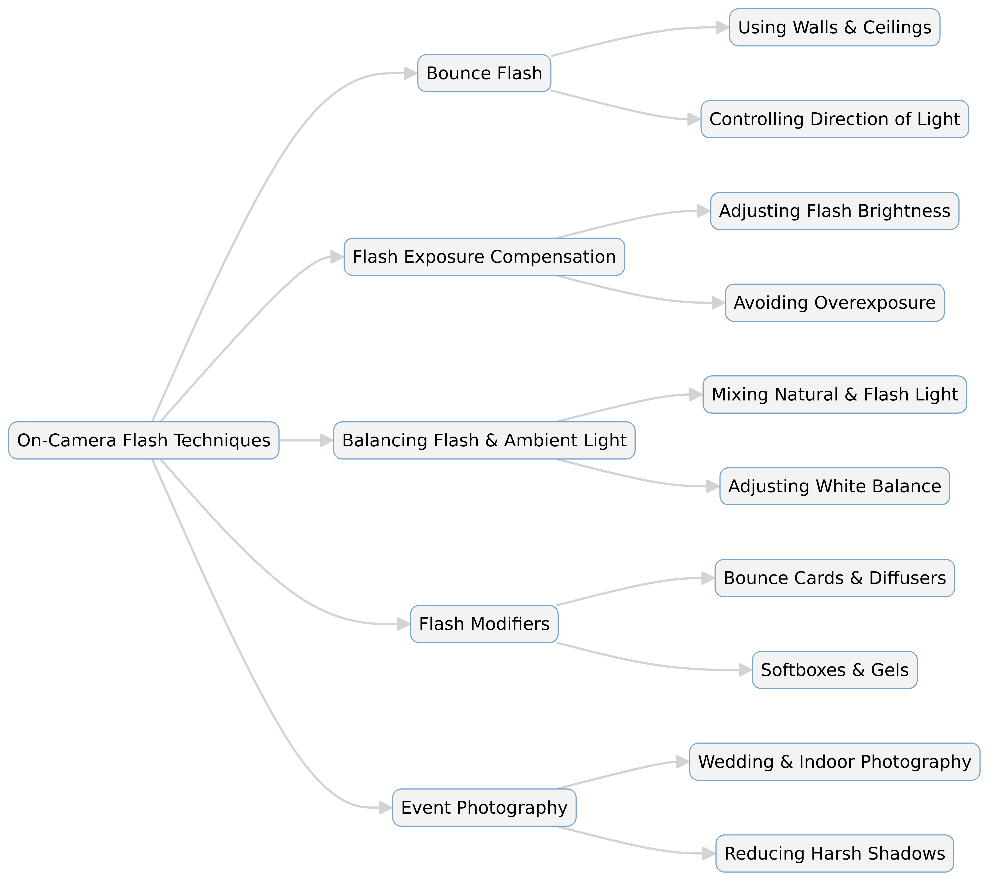

--- 
slug: book-takeaways-1-On-Camera-Flash
title: "Book Takeaways: "On-Camera Flash" by Neil van Niekerk"

date: 2025-01-29

tags: 
  - Photos
  - Books
  - Book-Takeaways
--- 

### **Summary of "On-Camera Flash" by Neil van Niekerk**  

Neil van Niekerk’s *On-Camera Flash* is a practical guide to mastering flash photography using an on-camera flash unit. The book focuses on creating natural-looking lighting in various conditions, overcoming common flash problems, and improving portraits using flash techniques. Unlike many photography books that emphasize off-camera lighting, this book teaches how to work effectively with the flash mounted on the camera, using bounce techniques, light modifiers, and exposure adjustments.  

---  
## **Conclusion**  
Niekerk emphasizes that on-camera flash, when used skillfully, can produce soft, directional, and flattering light. He provides step-by-step guidance on bouncing flash, using modifiers, and balancing flash with ambient light. The book debunks common flash myths, such as the idea that direct flash is always bad, and encourages photographers to experiment with angles and surfaces to achieve the best results. By mastering these techniques, photographers can take better indoor and event photos without the need for elaborate lighting setups.  

---  
## **Key Points**  

📷 **Bounce Flash**: Using walls, ceilings, or reflectors to create softer, more natural light.  

💡 **Flash Exposure Compensation (FEC)**: Adjusting flash power to avoid overexposed or underexposed images.  

🌅 **Balancing Flash & Ambient Light**: Learning to mix natural light with flash for realistic, well-lit photos.  

🔄 **Direction of Light**: Manipulating where flash bounces to create depth and dimension.  

📏 **Distance & Power**: Understanding how flash power and distance from the subject affect exposure.  

🛠️ **Flash Modifiers**: Tools like bounce cards, diffusers, and softboxes improve light quality.  

🔍 **TTL vs. Manual Flash**: How to use automatic and manual flash settings effectively.  

🚫 **Avoiding Harsh Shadows**: Techniques to eliminate unflattering shadows in portraits.  

🎭 **Using Flash for Mood & Drama**: Controlling flash to enhance the atmosphere of a scene.  

📸 **Event Photography Tips**: Practical advice for weddings, parties, and indoor events.  

---  
## **Summary**  

1. **Understanding Flash Basics**: The book starts by explaining how on-camera flash works, covering light intensity, angle, and duration.  

2. **Bounce Flash Techniques**: Niekerk details how bouncing flash off ceilings, walls, and reflectors creates softer and more natural lighting.  

3. **Controlling Flash Exposure**: The author explains how to use Flash Exposure Compensation (FEC) to fine-tune the brightness of flash-lit subjects.  

4. **Balancing Ambient Light with Flash**: One of the key skills taught is how to integrate flash with available light to avoid artificial-looking images.  

5. **Using Flash Modifiers**: The book discusses different light modifiers, such as bounce cards, diffusers, and softboxes, to enhance flash quality.  

6. **Shaping Light for Portraits**: Readers learn how to manipulate the direction and intensity of flash to create professional-looking portraits.  

7. **TTL vs. Manual Flash**: The author explains when to use TTL (Through-The-Lens) automatic flash metering and when manual flash control is better.  

8. **Avoiding Common Mistakes**: Tips on preventing harsh shadows, red-eye, and overexposed flash shots.  

9. **Using Flash Creatively**: Niekerk encourages photographers to experiment with flash for different moods, from bright and airy to moody and dramatic.  

10. **Event Photography Strategies**: The book concludes with practical tips for wedding and event photography, where on-camera flash is often the primary light source.  

**Enter a number to expand**  

---  

# **Detail Summary of Mastering On-Camera Flash: Techniques from Neil van Niekerk**  

## **Introduction**  

Flash photography is often seen as challenging due to the risk of harsh lighting, overexposure, and unnatural shadows. In *On-Camera Flash*, Neil van Niekerk provides a comprehensive guide on how to use an on-camera flash effectively, creating soft, flattering light while maintaining a natural look. This book is particularly valuable for photographers working in event photography, weddings, and indoor environments where lighting conditions can be unpredictable.  

By understanding bounce techniques, flash modifiers, and exposure balancing, photographers can achieve professional results without complex off-camera lighting setups. This article explores the key lessons from the book and provides practical tips to enhance your flash photography skills.  

---  
## **The Basics of On-Camera Flash**  

Flash photography is often misunderstood, with many assuming that an external flash unit will always create artificial-looking images. However, when used correctly, flash can enhance photos by filling in shadows, improving subject clarity, and maintaining exposure balance.  

### **Key Flash Settings**  

- **TTL (Through-The-Lens) vs. Manual Mode**: TTL adjusts flash power automatically based on camera metering, while manual mode allows full control over flash intensity.  
- **Flash Exposure Compensation (FEC)**: Adjusting FEC helps fine-tune the brightness of the flash output.  
- **Shutter Speed, Aperture, and ISO**: Understanding the relationship between these settings ensures proper exposure when combining flash and ambient light.  

---  
## **Bounce Flash: Creating Soft, Natural Light**  

One of Niekerk’s core techniques is **bounce flash**, which redirects light off ceilings, walls, or other surfaces to create a softer, more natural look. Instead of aiming the flash directly at the subject, photographers can use their surroundings to diffuse and spread light.  

### **Techniques for Effective Bounce Flash**  

1. **Use White or Neutral Surfaces**: Colored walls or ceilings can create unwanted color casts.  
2. **Control the Direction**: Angling the flash toward a side wall rather than the ceiling can create more natural directional lighting.  
3. **Use a Bounce Card**: When no suitable surfaces are available, a bounce card helps diffuse the light.  

### **Benefits of Bounce Flash**  

- Eliminates harsh shadows and red-eye.  
- Creates a more even, flattering light for portraits.  
- Helps maintain a balance between flash and ambient light.  

---  
## **Balancing Flash with Ambient Light**  

Many photographers struggle with integrating flash into naturally lit environments without making the scene look artificial. Niekerk emphasizes that the goal is to make the flash **blend seamlessly** with available light.  

### **How to Balance Flash and Ambient Light**  

- **Adjust Flash Power**: Reduce flash intensity so it acts as a subtle fill light rather than the dominant light source.  
- **Use a Slow Shutter Speed**: A longer exposure allows ambient light to contribute more to the scene, avoiding the typical "flashed" look.  
- **Modify White Balance**: Adjusting white balance settings ensures that flash and natural light blend without creating color inconsistencies.  

---  
## **Flash Modifiers: Enhancing Light Quality**  

To further refine on-camera flash, Niekerk discusses **flash modifiers**, tools that shape and soften the light output. These can be particularly useful when bouncing flash isn’t an option.  

### **Popular Flash Modifiers**  

- **Bounce Cards**: Direct some light toward the subject while bouncing the rest for a softer effect.  
- **Diffusers**: Spread light more evenly to reduce harsh shadows.  
- **Softboxes & Gels**: Softboxes mimic natural light, while gels help match flash color to ambient light.  

Using the right modifier depends on the environment and the desired effect. Event photographers often carry a small selection to adapt to different shooting conditions.  

---  
## **Avoiding Common Flash Photography Mistakes**  

Many photographers make errors when using flash, leading to unnatural-looking results. Niekerk highlights common mistakes and how to avoid them:  

1. **Overexposing the Subject**: Use Flash Exposure Compensation (-1 to -2 stops) to prevent an overly bright subject.  
2. **Flat Lighting**: Avoid direct flash and use bounce techniques to create depth.  
3. **Strong Shadows Behind the Subject**: Bounce flash properly or use a fill light to soften shadows.  
4. **Red-Eye Effect**: Position the flash slightly off-axis or use a bounce technique.  
5. **Underexposing Backgrounds**: Adjust camera settings to ensure the background doesn’t turn completely dark.  

---  
## **On-Camera Flash for Event Photography**  

Flash is essential for event and wedding photography, where lighting conditions constantly change. Niekerk offers practical strategies for capturing well-lit, professional images in these settings.  

### **Key Strategies for Event Photography**  

- **Use TTL for Quick Adjustments**: In fast-paced environments, TTL mode helps automatically adjust flash power.  
- **Modify Light Based on Venue**: High ceilings? Use bounce flash. Dark walls? Use a flash diffuser.  
- **Maintain a Natural Look**: Balance flash with ambient light to avoid over-lit subjects.  
- **Move and Adjust Angles**: Avoid static positioning; adjust flash angles to create more dynamic lighting.  

Event photography often requires a mix of **technical skill and adaptability**, and Niekerk’s techniques ensure photographers can confidently shoot in different conditions.  

---  
## **Conclusion**  

Neil van Niekerk’s *On-Camera Flash* is an essential guide for photographers looking to master flash photography without relying on off-camera setups. The book provides **practical techniques** for using bounce flash, adjusting exposure, and modifying flash output to create **soft, natural-looking light**.  

By applying these techniques, photographers can avoid common flash pitfalls, achieve professional results in challenging lighting conditions, and elevate their event and portrait photography. Whether shooting weddings, corporate events, or casual portraits, **understanding how to control and manipulate on-camera flash is a game-changer**.

---

# **Expanded Summary of "On-Camera Flash" by Neil van Niekerk**  

## **📸 Introduction**  

Neil van Niekerk’s *On-Camera Flash* is an in-depth guide designed to help photographers master flash photography using an **on-camera flash unit**. Many photographers struggle with the unnatural, harsh lighting that an on-camera flash often creates. This book teaches how to **bounce flash**, use **flash exposure compensation**, and **modify light quality** to produce more professional and flattering images.  

Unlike books that focus on **off-camera flash setups**, Niekerk’s approach emphasizes **practical techniques** for wedding, portrait, and event photographers who need to work efficiently in various lighting conditions. Through real-world examples and step-by-step instructions, he demystifies flash photography and helps photographers achieve consistent, natural-looking results.  

---  

## **💡 Chapter 1: The Basics of Flash Photography**  

Flash is often misunderstood, with many assuming it should only be used in **low-light situations**. However, flash can be a powerful tool for improving **image clarity**, **filling in shadows**, and **creating directional lighting**.  

### **Key Flash Components**  

- **Guide Number**: The power rating of a flash, determining how far the light reaches.  
- **TTL (Through-The-Lens) vs. Manual Flash**: TTL automatically adjusts flash power based on the camera’s metering, while manual mode allows precise control.  
- **Flash Exposure Compensation (FEC)**: Adjusts the brightness of the flash to fine-tune the exposure.  
- **Shutter Speed, Aperture, and ISO**: These settings determine how much flash and ambient light are captured in an image.  

### **Understanding Flash Myths**  

- **Myth 1: Direct Flash is Always Bad** → While direct flash can be harsh, modifying or bouncing it can make it look natural.  
- **Myth 2: Flash is Only for Low-Light** → Flash can be used in daylight to fill shadows and balance exposure.  
- **Myth 3: High-Speed Sync is Always Needed** → HSS is useful but not always necessary; balancing flash power with ambient light is often a better solution.  

---  

## **🔄 Chapter 2: Bounce Flash – Creating Soft and Natural Light**  

One of the **core techniques** in the book is **bounce flash**. Instead of pointing the flash directly at the subject, photographers can bounce it off **walls, ceilings, or reflectors** to create a more diffused, natural look.  

### **Techniques for Effective Bounce Flash**  

1. **Choose the Right Bounce Surface**: White or neutral-colored walls and ceilings work best to avoid color casts.  
2. **Control the Direction of Light**: Bouncing off a side wall rather than the ceiling can create a more natural light direction.  
3. **Use a Bounce Card for More Control**: If walls or ceilings aren’t available, bounce cards help diffuse the light.  

### **Common Bounce Flash Mistakes**  

🚫 Bouncing off **colored walls** → Can create unwanted color shifts.  
🚫 Using **ceilings that are too high** → The flash won’t have enough reach.  
🚫 Not considering **shadows** → Sometimes, bounce flash can still create unwanted side shadows.  

---  

## **🎛️ Chapter 3: Balancing Flash with Ambient Light**  

One of the biggest challenges photographers face is ensuring that **flash doesn’t overpower ambient light**. The goal is to make **flash blend naturally** into the scene.  

### **How to Balance Flash and Ambient Light**  

- **Use Flash as Fill Light**: Reduce the flash power so it subtly brightens shadows instead of dominating the exposure.  
- **Slow Shutter Speed**: A slower shutter speed allows more ambient light into the frame, preventing a “flashed” look.  
- **Modify White Balance**: Adjusting white balance settings ensures flash and ambient light match without color inconsistencies.  

### **Practical Example: Indoor Event Photography**  

1. Set **shutter speed** to 1/60s – 1/200s to capture ambient light.  
2. Use **TTL flash mode** and adjust **Flash Exposure Compensation (FEC)** if necessary.  
3. Bounce the flash off the **ceiling or a nearby wall** to soften the light.  

By following these steps, **event photographers can avoid the dreaded “dark background, bright subject” look** that poorly balanced flash can create.  

---  

## **🛠️ Chapter 4: Flash Modifiers – Enhancing Light Quality**  

When bouncing isn’t an option, **flash modifiers** help soften and shape the light output.  

### **Popular Flash Modifiers**  

🔳 **Bounce Cards** – Reflect some light forward while still softening the overall effect.  
🌫️ **Diffusers** – Spread flash light more evenly, reducing harsh highlights.  
📦 **Softboxes** – Create a natural, soft light effect (often used in portraits).  
🎨 **Gels** – Match the flash color to ambient lighting (e.g., orange gels for warm tungsten light).  

Each modifier serves a different purpose, so photographers should experiment to find what works best in different environments.  

---  

## **⚠️ Chapter 5: Avoiding Common Flash Photography Mistakes**  

Many photographers struggle with **flash photography mistakes** that result in unnatural-looking images. Niekerk highlights key pitfalls and how to fix them:  

### **Top Flash Photography Mistakes & Solutions**  

🚫 **Overexposed Flash** → Solution: Lower flash power or use **Flash Exposure Compensation (-1 or -2 stops)**.  
🚫 **Flat, Unflattering Light** → Solution: Use **bounce techniques** or a **diffuser**.  
🚫 **Strong Background Shadows** → Solution: Angle the flash correctly or use fill light.  
🚫 **Red-Eye Effect** → Solution: Position the flash off-axis or use bounce flash.  
🚫 **Underexposed Backgrounds** → Solution: Adjust camera settings to prevent blacked-out backgrounds.  

---  

## **📸 Chapter 6: On-Camera Flash for Event Photography**  

Flash photography is essential in **event and wedding photography**, where **lighting conditions constantly change**. Niekerk offers **practical strategies** to help photographers work efficiently.  

### **Event Photography Strategies**  

✅ Use **TTL mode** for quick, automatic adjustments.  
✅ Modify light based on **venue conditions** (bounce if possible, use modifiers when necessary).  
✅ Keep **shutter speed between 1/60s – 1/200s** to balance flash and ambient light.  
✅ Adjust **Flash Exposure Compensation (-1 to -2 stops)** to avoid overexposed faces.  
✅ Stay **mobile** and adjust **angles and bounce direction** to create more dynamic lighting.  

---  
## **Table: Key Concepts from *On-Camera Flash* by Neil van Niekerk**  

| **Concept**               | **Description** |
|---------------------------|----------------|
| **Bounce Flash**          | Redirecting flash off surfaces (walls, ceilings) to create softer, more natural light. |
| **Flash Exposure Compensation (FEC)** | Adjusting flash power to prevent overexposure or underexposure. |
| **Balancing Flash & Ambient Light** | Ensuring flash blends with natural light for a seamless look. |
| **TTL vs. Manual Flash** | TTL automatically adjusts flash power, while manual mode allows precise control. |
| **Flash Modifiers** | Tools like bounce cards, diffusers, and softboxes that improve flash quality. |
| **Avoiding Harsh Shadows** | Using bounce techniques and fill light to eliminate unflattering shadows. |
| **Using Flash for Mood & Drama** | Controlling flash intensity and direction to set the atmosphere. |
| **Event Photography Tips** | Strategies for using on-camera flash effectively in weddings and indoor events. |
| **Shutter Speed & Flash Sync** | Adjusting settings to maintain proper exposure while using flash. |
| **Common Flash Mistakes** | Overexposed subjects, red-eye, and unnatural lighting – and how to fix them. |

---

## **🏆 Conclusion**  

Neil van Niekerk’s *On-Camera Flash* is a **must-read** for photographers looking to master **flash photography** without relying on off-camera setups. His techniques provide **practical solutions** for working in **challenging lighting conditions**, particularly for **indoor events and weddings**.  

By using **bounce flash**, **flash exposure compensation**, and **modifiers**, photographers can create **soft, natural-looking light** that enhances their images rather than overpowering them. Whether shooting portraits, corporate events, or casual gatherings, **understanding how to control and manipulate on-camera flash is a game-changer**.  

**Final Takeaway:** Flash photography doesn’t have to be intimidating—by following the techniques in this book, photographers can **elevate their images and confidently work with flash in any scenario**.

## **Quotes from *On-Camera Flash* by Neil van Niekerk**  

📸 **"Good lighting is not about the flash itself, but how you use it to shape and control the light."**  

💡 **"Bounce flash transforms harsh direct light into something soft and natural—it’s about using your environment creatively."**  

🌅 **"Balancing ambient light with flash ensures your subject looks natural rather than obviously lit by artificial light."**  

🔦 **"Instead of thinking of flash as just a light source, think of it as a way to add direction and depth to your images."**  

🎭 **"The difference between a snapshot and a professional-looking portrait often comes down to how well the light is controlled."**  

🚀 **"Flash photography isn't about blasting your subject with light—it's about subtly enhancing what's already there."**  

🔄 **"The key to using TTL flash effectively is understanding when to let the camera assist you and when to take full manual control."**  

📏 **"Distance matters: the farther the flash, the softer the light appears. Use walls, ceilings, and reflectors to your advantage."**  

🎨 **"Gels aren’t just for color correction—they can add drama and mood to an otherwise standard shot."**  

📸 **"Event photography is about adaptability—learning how to modify flash output on the fly is a game-changer."**  

## **Flash Photography Quiz** 🎯  

Test your knowledge with this quiz on *On-Camera Flash* by Neil van Niekerk!  

👉 [**Start the Quiz**](https://questions.widenex.com/33be5e37-0477-4fb3-b5f0-28c9dda0365c)  
