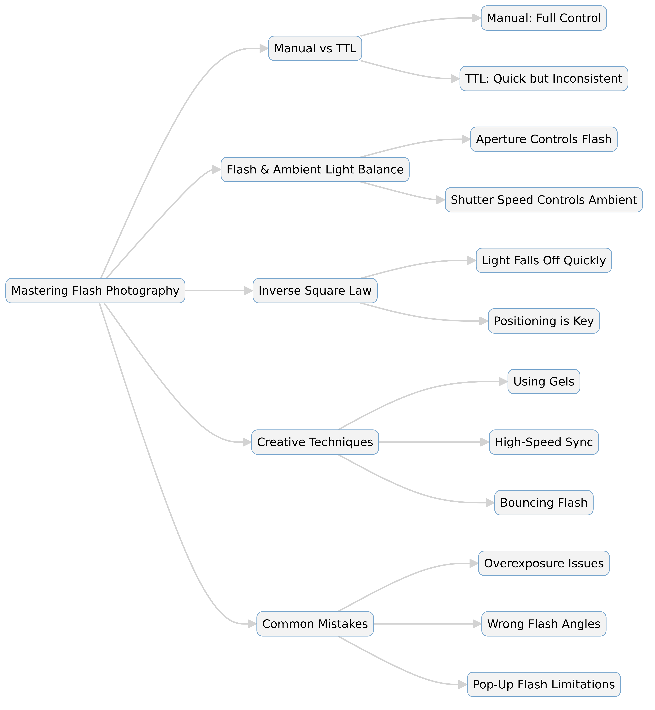

--- 
slug: book-takeaways-understanding-flash-photography-by-bryan-peterson
title: "Book Takeaways: Understanding Flash Photography by Bryan Peterson"

date: 2025-01-20

tags: 
  - Photos
  - Books
  - Book-Takeaways
--- 

This book explores the use of electronic flash in photography, emphasizing the importance of manual exposure mode for full creative control. Bryan Peterson demystifies the concepts of flash photography, explaining how flash interacts with ambient light, how to achieve correct exposures, and how to use flash creatively to enhance photos.

Here are my key lessons and takeaways from the book, along with some personal notes that I think will elevate my future shoots.

---

## Summary of *Understanding Flash Photography* by Bryan Peterson  

### Overview  
This book explores the use of electronic flash in photography, emphasizing the importance of manual exposure mode for full creative control. Bryan Peterson demystifies the concepts of flash photography, explaining how flash interacts with ambient light, how to achieve correct exposures, and how to use flash creatively to enhance photos.

---

### 📌 Key Takeaways  

📷 **Manual Flash is Essential**: Most camera manuals barely cover using flash in manual mode, but mastering it is key to unlocking its full potential.  

👁️ **Human Eye vs. Camera Sensor**: Our eyes can perceive a wider range of light and shadow compared to a camera sensor, which is why understanding exposure and flash is crucial.  

🌞 **Flash as Sunlight Replacement**: Flash can be used to reduce harsh contrast in sunlight or simulate natural light when it's absent.  

📐 **Photographic Triangle Still Applies**: Flash doesn’t replace the basics; it works alongside aperture, shutter speed, and ISO to create balanced exposures.  

💡 **Inverse Square Law**: Light intensity decreases rapidly with distance—this principle is crucial when positioning flash for optimal exposure.  

🎨 **Flash Gives Control Over Contrast**: Unlike ambient light, flash allows photographers to control contrast, brightness, and shadow intensity precisely.  

📏 **Aperture Controls Flash Exposure**: Flash intensity on a subject is dictated by aperture, while shutter speed influences ambient light.  

⏳ **Shutter Speed and Ambient Light**: A slow shutter lets in more ambient light, while a fast shutter darkens the background—critical for balancing flash with surroundings.  

🔢 **Flash Distance Scale**: Modern flashes provide automated scales to match the correct aperture with the subject distance for precise exposures.  

🖌️ **Flash Modifiers and Gels**: Adding gels can help mimic natural lighting, such as using an amber gel to create a warm sunset effect.  

---

### ✨ Summary  

1. **Flash is best used in manual mode** to provide full creative control over exposure, rather than relying on automatic settings like TTL (Through-The-Lens metering).  

2. **Aperture determines flash exposure**, while **shutter speed controls ambient light**—this separation is key to balancing natural and artificial lighting.  

3. **Flash follows the Inverse Square Law**, meaning light falls off rapidly as distance increases. This must be considered when positioning a flash.  

4. **Different apertures serve different purposes**: Wide apertures (f/2.8–f/5.6) isolate subjects, small apertures (f/16–f/22) capture more detail, and mid-range apertures (f/8–f/11) are general-purpose.  

5. **Flash can simulate natural light**, whether by filling in harsh shadows under midday sun or mimicking golden-hour lighting using gels.  

6. **TTL is useful but not perfect**, as it can be fooled by highly reflective (white) or dark (black) subjects, causing over- or underexposed results.  

7. **High ISO alone isn’t always enough**—while it reduces noise and allows handheld shooting in low light, it cannot improve bad lighting conditions like raccoon-eye shadows.  

8. **Pop-up flashes are weak and poorly positioned**, making them ineffective for professional-quality indoor photography.  

9. **Flash power and distance must be managed carefully**—higher power allows greater reach, while lowering power requires moving the flash closer to maintain correct exposure.  

10. **Sync speed matters**—using a shutter speed faster than the camera’s flash sync speed can result in incomplete exposures (black bars in the image).  

---

# Detail: Understanding Flash Photography: A Guide to Mastering Light  

## Introduction  
Flash photography is often misunderstood, but mastering it can drastically improve the quality of images, especially in challenging lighting conditions. Bryan Peterson’s *Understanding Flash Photography* explores how to use electronic flash effectively, focusing on manual exposure mode for better control over light. This guide breaks down the core principles of flash photography, including exposure, light behavior, and practical techniques for achieving professional results.  

---  

## 📸 The Importance of Manual Flash Mode  
Most photographers rely on automatic flash settings, such as TTL (Through-The-Lens metering), but using flash in **manual mode** offers greater creative control. Camera manuals often provide limited guidance on manual flash settings, even though they are crucial for achieving consistent and intentional lighting effects.  

### 🔹 Why Manual Mode Matters  
- Ensures **consistent** results compared to TTL, which can be fooled by bright or dark subjects.  
- Allows **precise control** over light intensity, contrast, and brightness.  
- Helps balance **ambient light and flash** effectively.  

---  

## 🌞 Flash vs. Ambient Light: Understanding the Balance  
In photography, there are two light sources:  
1. **Flash Light** – The burst of artificial light from your flash.  
2. **Ambient Light** – The natural or existing light in the scene.  

### 🔹 Key Rules for Balancing Flash and Ambient Light  
- **Aperture controls flash exposure** – The wider the aperture, the more flash light is captured.  
- **Shutter speed controls ambient light** – A slower shutter allows more ambient light, while a faster shutter darkens the background.  

💡 *Example:* To make a background darker while using flash, increase the shutter speed. To brighten it, slow the shutter speed.  

---  

## 📐 The Inverse Square Law: Managing Flash Light  
Flash light **does not travel evenly** across a scene. The **Inverse Square Law** states that light intensity falls off rapidly as the distance increases.  

### 🔹 How It Affects Photography  
- Subjects closer to the flash receive significantly **more light** than those farther away.  
- This explains why backgrounds often look dark when using flash.  
- Adjusting **flash-to-subject distance** or flash power helps maintain correct exposure.  

---

## 📏 Choosing the Right Aperture for Flash  
Your choice of **aperture** directly impacts flash exposure. Peterson categorizes apertures into three types:  

🔹 **Storytelling Apertures (f/16, f/22)** – High depth of field, ideal for landscapes or detailed shots.  
🔹 **Isolation Apertures (f/2.8, f/4, f/5.6)** – Shallow depth of field, great for portraits.  
🔹 **"Who Cares?" Apertures (f/8, f/11)** – Balanced shots where depth of field isn't a priority.  

*Example:* A flash exposure set at **f/11** with a subject at **9 feet** will only be correct at that distance. If the subject moves, the flash-to-subject distance must be adjusted.  

---

## 🔄 TTL vs. Manual Flash: Pros and Cons  
TTL (Through-The-Lens) metering **automates flash output**, but it’s not always accurate. Manual mode gives complete control.  

### ✅ TTL Advantages  
✔ Fast and easy for events/weddings.  
✔ Automatically adjusts for distance.  

### ❌ TTL Disadvantages  
❌ Inconsistent results with black or white subjects.  
❌ Can misinterpret reflective surfaces.  

💡 *Example:* If a bride is wearing white, TTL might underexpose the image, assuming too much light is present.  

---  

## 🎭 Creative Flash Techniques  
### 🔹 Using Gels to Modify Flash Color  
Flash can be used to mimic different lighting conditions by adding color gels.  
- **Amber Gel** → Simulates warm sunset lighting.  
- **Blue Gel** → Mimics cool daylight tones.  

### 🔹 High-Speed Sync (HSS) for Bright Conditions  
Most flashes have a **maximum sync speed** (often 1/200s or 1/250s). If you use a faster shutter speed, part of the image may be blacked out. **High-speed sync (HSS)** allows the flash to work with higher shutter speeds, useful in bright daylight conditions.  

### 🔹 Flash Power & Positioning  
- **Moving flash closer** increases its intensity.  
- **Powering down flash** requires bringing it closer to maintain the same exposure.  

💡 *Example:* Imagine a flash at **full power (1/1)** as a **gallon of water**. At **half power (1/2)**, only half the water reaches the subject, requiring you to move closer to get the same effect.  

---

## 🏡 Indoor Flash Photography: Common Issues & Fixes  
### 🚨 Problems with Built-In Pop-Up Flash  
- Weak power (effective only for subjects within **10-12 feet**).  
- Direct light causes harsh shadows.  
- Always points forward, limiting creativity.  

✅ **Solution**: Use an **external flash** and **bounce light off walls or ceilings** for softer shadows.  

💡 *Example:* Avoid the "criminal mugshot" effect by diffusing or bouncing flash light rather than pointing it straight at the subject.  

---

## 🔄 Recap: The Two Rules of Flash Photography  
📌 **Rule #1: Aperture controls flash exposure.**  
- A wider aperture (f/2.8) lets in more flash light.  
- A smaller aperture (f/16) limits flash light.  

📌 **Rule #2: Shutter speed controls ambient light.**  
- A slow shutter (1/30s) allows more ambient light.  
- A fast shutter (1/250s) reduces ambient light.  

---

## 🎯 Conclusion  
Mastering flash photography requires understanding **how light behaves** and how to balance **flash with ambient light**. By using **manual mode**, adjusting **aperture and shutter speed separately**, and experimenting with **flash positioning and power**, photographers can gain complete creative control over their lighting.  

Flash isn’t just a tool for low light—it’s a **powerful creative asset** that can shape and enhance the mood of any image.  

---
---

# 📸 *Understanding Flash Photography* – Expanded Summary  

## Introduction  
Flash photography is often misunderstood, with many photographers relying on automatic settings rather than taking full control of their lighting. *Understanding Flash Photography* by Bryan Peterson provides a detailed breakdown of how to master flash, explaining the principles of **manual exposure mode**, the relationship between **flash and ambient light**, and how to use **flash creatively** to enhance photos.  

This expanded guide dives deeper into these concepts, covering:  
✔ The role of **aperture and shutter speed** in flash photography  
✔ The **Inverse Square Law** and how light behaves  
✔ **TTL vs. Manual Flash** – when to use each  
✔ **Creative flash techniques** to mimic natural lighting  
✔ **Common mistakes** and how to avoid them  

---

# 📷 **Chapter 1: Why Manual Flash is Essential**  

Most photographers start by using flash in **automatic (TTL) mode**, but this often leads to inconsistent results. TTL calculates the flash output automatically based on a pre-flash measurement. However, it can be easily fooled by reflective surfaces, dark backgrounds, or unusual lighting conditions.  

### 🔹 **The Benefits of Manual Flash Mode:**  
✅ Gives **full control** over brightness and contrast.  
✅ Ensures **consistent** exposure without relying on the camera’s meter.  
✅ Helps balance **flash with ambient light** more effectively.  

💡 *Example:* You want to create a dramatic portrait with a **darker background** and only the subject illuminated. With **TTL**, the flash might try to brighten the background, ruining the effect. In **manual mode**, you can set the exact amount of light needed to isolate the subject.  

---

# 🌞 **Chapter 2: The Relationship Between Flash & Ambient Light**  

In any flash photo, there are **two light sources**:  
1. **Flash Light** – The burst of light from the flash unit.  
2. **Ambient Light** – The natural or existing light in the scene.  

### 🔹 **Flash vs. Ambient Light: Key Principles**  
✔ **Aperture controls flash exposure** – A wider aperture lets in more flash light, a smaller aperture restricts it.  
✔ **Shutter speed controls ambient light** – A slower shutter lets in more ambient light; a faster shutter makes the background darker.  

💡 *Example:* You take a portrait at **f/8, 1/250 sec**, and the subject is well-lit, but the background is too dark. If you slow the shutter to **1/60 sec**, more ambient light will enter, making the background brighter.  

---

# 📐 **Chapter 3: The Inverse Square Law – Understanding Light Falloff**  

One of the most important principles in flash photography is the **Inverse Square Law**, which states:  

> "Light intensity decreases as the square of the distance from the source."  

### 🔹 **What This Means for Photographers:**  
- The closer the subject is to the flash, the **brighter** they will appear.  
- Light falls off quickly – doubling the distance reduces brightness to **one-quarter**.  
- Flash may not reach background elements, making them appear **dark**.  

💡 *Example:* A subject **2 feet from the flash** receives **four times** the light of a subject **4 feet away**. This explains why backgrounds often appear underexposed in flash photography.  

---

# 🎯 **Chapter 4: Choosing the Right Aperture for Flash**  

Peterson categorizes apertures into three types:  

1️⃣ **Storytelling Apertures (f/16, f/22)** – High depth of field, great for landscapes and detailed images.  
2️⃣ **Isolation Apertures (f/2.8, f/4, f/5.6)** – Shallow depth of field, perfect for portraits where the background is blurred.  
3️⃣ **"Who Cares?" Apertures (f/8, f/11)** – Balanced settings where depth of field isn’t a major concern.  

💡 *Example:* If you're shooting at **f/11**, and your flash-to-subject distance is **9 feet**, the exposure will be correct **only at that distance**. If the subject moves, you must adjust either the flash power or the aperture.  

---

# ⚡ **Chapter 5: TTL vs. Manual Flash – When to Use Each**  

TTL (Through-The-Lens) metering automatically adjusts flash power based on the scene, but it’s not always accurate.  

### 🔹 **When to Use Manual Flash:**  
✔ Studio or controlled lighting situations.  
✔ When you need **consistent results** across multiple shots.  
✔ To balance **flash with ambient light** manually.  

### 🔹 **When to Use TTL:**  
✔ **Fast-moving events** like weddings and parties.  
✔ When you need **quick, automatic adjustments** for changing conditions.  
✔ For situations where manual exposure isn’t practical.  

💡 *Example:* At a **wedding**, TTL helps adjust exposure quickly as the bride and groom move. But for a **fashion shoot**, manual flash ensures every shot looks identical.  

---

# 🎨 **Chapter 6: Creative Flash Techniques**  

### 🔹 **Using Gels to Modify Flash Color**  
Adding color gels to your flash can mimic natural lighting conditions:  
✔ **Amber Gel** → Simulates warm sunset light.  
✔ **Blue Gel** → Mimics cool daylight tones.  

### 🔹 **High-Speed Sync (HSS) for Bright Conditions**  
Most flashes have a **sync speed limit** (often **1/200s or 1/250s**). If you use a faster shutter speed, part of the image may be blacked out. **High-speed sync (HSS)** allows flash to work at shutter speeds like **1/1000s or faster**, useful for outdoor daylight photography.  

### 🔹 **Flash Power & Positioning**  
- **Moving flash closer** increases brightness.  
- **Powering down flash** requires moving it **closer** to maintain the same exposure.  

💡 *Example:* Imagine a flash at **full power (1/1)** as a **gallon of water**. At **half power (1/2)**, only half the water reaches the subject, requiring you to move closer to get the same effect.  

---

# 🏡 **Chapter 7: Fixing Common Indoor Flash Photography Issues**  

### 🚨 **Problems with Built-In Pop-Up Flash:**  
❌ Weak power (only works within **10-12 feet**).  
❌ Direct light creates **harsh shadows**.  
❌ Flash always **points forward**, limiting creativity.  

✅ **Solution**: Use an **external flash** and **bounce light off walls or ceilings** for softer shadows.  

💡 *Example:* Instead of pointing the flash directly at the subject, bounce it off a **white ceiling** for a natural look.  

---

# 🔄 **Conclusion: The Two Rules of Flash Photography**  

📌 **Rule #1: Aperture controls flash exposure.**  
✔ A wider aperture (f/2.8) lets in more flash light.  
✔ A smaller aperture (f/16) restricts flash light.  

📌 **Rule #2: Shutter speed controls ambient light.**  
✔ A slow shutter (1/30s) allows more ambient light.  
✔ A fast shutter (1/250s) reduces ambient light.  

---

## 🎯 Flash Photography Quiz  
Test your knowledge with this interactive quiz on *Understanding Flash Photography*!  

👉 **[Take the Quiz Here](https://questions.widenex.com/f60ac019-0690-4163-97d5-ec4b0929a215)**  
