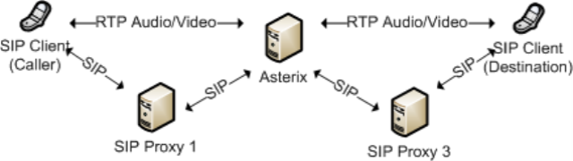
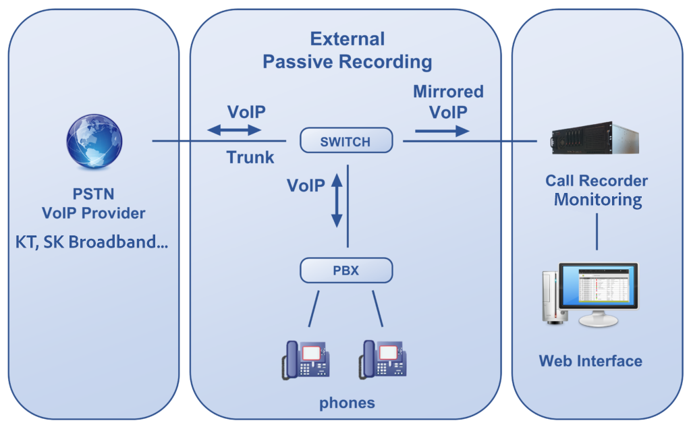

--- 
slug: port-mirroring-for-sip-monitoring
title: "Technical Notes: Port Mirroring on Switches – How to Monitor SIP/RTP without Touching Production!"

date: 2025-02-27

tags: 
  - VoIP
  - SIP
  - Networking
  - Passive Monitoring
---

### **Overview**

In modern call center or VoIP environments—especially those using legacy or third-party systems like CTI, Asterisk, or KT’s carrier infrastructure—it's often impossible or risky to directly inject new services like Speech-to-Text (STT) monitoring into the production path.

As a Technical Lead, my priority was to **capture all SIP and RTP traffic for transcription**, without impacting any part of the production call flow. The safest way to do this is using **Port Mirroring (SPAN)** on a network switch.

This note covers how Port Mirroring works, what hardware supports it, and how you can set up a monitoring server to sniff SIP and RTP traffic with `pyshark`, `sngrep`, or `tshark`.



---

### **What is Port Mirroring?**

Port Mirroring, or **SPAN (Switch Port Analyzer)**, is a feature available in managed switches that allows you to create a copy of traffic from one or more ports (or VLANs) and forward it to another port, known as the **monitoring port**.

This technique is passive: it doesn’t modify or delay the original packets.

**Use case**:
- Monitor all traffic going to/from a SIP gateway or CTI system.
- Capture both SIP signaling (port 5060) and RTP media (dynamic UDP).
- Feed mirrored traffic into a recording, STT, or analytics engine.

---

### **Which Switches Support Port Mirroring?**

Most **Layer 2 Managed Switches** support port mirroring.
Look for terms like: `SPAN`, `Mirror`, `Monitor Session`, or `Port Analysis` in your device’s manual.

---

### **Why Port Mirroring is Ideal for SIP/RTP Monitoring**

**Non-intrusive**: No impact on production SIP server, CTI, or Asterisk
**Passive recording**: No ACK, INVITE, or RTP packet is ever touched
**Full visibility**: See both call signaling (SIP) and audio (RTP)
**Flexible**: Multiple streams can be analyzed in parallel

It’s especially useful for:
- Building a parallel **STT transcription system**
- **Quality assurance (QA)** and **compliance recording**
- **Debugging SIP failures** without altering live systems

---

### **Monitoring in Practice: Physical Setup**

Here’s a practical architecture:



- Port 1: Production traffic (e.g., to/from KT SIP)
- Port 2: Mirror destination (connected to passive sniffing server)

On the monitoring server, run tools like:
```bash
sudo sngrep -d eth0
# Or pyshark
pyshark.LiveCapture(interface="eth0", display_filter="sip || rtp")
```

📝 *Note: Ensure interface is in promiscuous mode if needed.*

---

### **Lessons Learned**

- Not all switches support bidirectional port mirroring. Test your device first.
- Check if your server NIC supports large packet throughput (some cheap USB dongles drop RTP).
- If you see only 1 direction in Wireshark/sngrep: check switch config → mirror direction.

---

### **Conclusion**

Port Mirroring is the foundation for **passive SIP and RTP inspection** in enterprise voice networks. Without touching or modifying any production system, you gain full insight into signaling and media flow.

This method has enabled me to roll out **real-time STT monitoring** on legacy CTI systems in production without any outage or risk.

I hope this guide helps other engineers looking to add AI-driven analysis, logging, or compliance tools to existing VoIP infrastructure.

Let’s build observability the right way — passively, safely, and smartly.

---

*This article reflects real-world setups I’ve deployed as a Technical Lead. Written and structured with help from my AI assistant to enhance clarity and reusability.*

