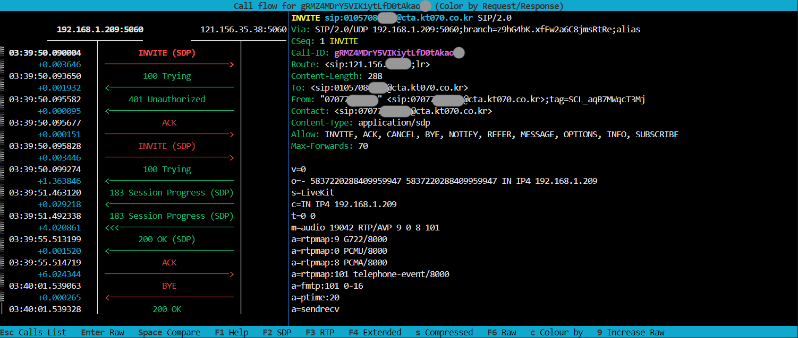

--- 
slug: debugging-sip-connections-with-sngrep-on-linux
title: "Technical Notes: Debugging SIP Connections with sngrep on Linux"

date: 2025-03-01

tags: 
  - AI
  - VoIP
  - Linux
  - Networking
---

### **Overview**

  

When leading the implementation and maintenance of SIP-based communication systems—such as Asterisk, LiveKit SIP Gateway, or FreeSWITCH—having full visibility into real-time signaling flows is critical. As a Technical Lead, I’ve found that being hands-on with tools like sngrep helps not only in debugging complex production issues quickly but also in guiding the team through clear, observable patterns.

  

sngrep is my go-to terminal-based tool when I need to trace SIP INVITE flows, verify header correctness (From, Contact), or confirm how our infrastructure responds to authentication challenges and call failures.

  

In this note, I’ll walk through how to install and use sngrep on Linux to diagnose outbound or inbound SIP call problems with clarity and precision.

---



### **Problem: SIP Call Is Failing or Audio Is Missing**

  

You might see:

- The INVITE is sent, but there’s no audio (RTP path or NAT issue).
    
- The SIP trunk rejects with 403/480/487 errors.
    
- From or Contact headers use local IPs instead of your public domain (e.g., cta.kt070.co.kr).
    
- No ACK or improper dialog termination.
    

  

Without proper tooling, debugging these scenarios becomes time-consuming and error-prone.

---

### **Solution: Use sngrep to Trace SIP Calls**

  

sngrep is a lightweight, ncurses-based SIP flow analyzer. It captures SIP messages in real time and organizes them into clean call flow diagrams right in your terminal.

---

### **Step 1: Install sngrep**

```
sudo apt update && sudo apt install sngrep -y     # Debian/Ubuntu
sudo yum install sngrep -y                        # CentOS/RHEL
```

  

---

### **Step 2: Capture SIP Traffic**

```
sudo sngrep
```

Or to narrow the capture:

```
sudo sngrep -d any port 5060
```

Press:

- Enter to inspect full SIP headers
    
- F7 to save a .pcap file
    
- q to quit
    

---

### **Step 3: Make a SIP Call and Observe**

  

Initiate a call through your SIP system (LiveKit, Asterisk, or a softphone like PhonerLite). As the call is made, sngrep will immediately begin to populate with real-time SIP dialog flows.

  

In a typical successful outbound call, you’ll observe something like:

```
INVITE -> 100 Trying -> 180 Ringing -> 200 OK -> ACK
```

Each arrow represents a SIP message being exchanged between your client and the SIP server (or provider gateway).

In some cases, the first INVITE is not immediately accepted. Here’s a more complete flow involving SIP authentication:

```
INVITE
   -> 407 Proxy Authentication Required
INVITE (with credentials: username + digest + nonce)
   -> 100 Trying
   -> 180 Ringing
   -> 200 OK
ACK
```


This allows you to verify:

- From, To, and Contact headers
    
- SIP status codes (e.g., 401 Unauthorized, 403 Forbidden)
    
- Call-ID and CSeq consistency
    

---

### **Step 4: Export and Analyze Further**

  

To save and analyze in Wireshark later:

```
sudo sngrep -O /tmp/sip_capture.pcap
wireshark /tmp/sip_capture.pcap
```

  

---

### **Step 5: What to Look For**

- **Header validation**: Ensure headers use correct domain (cta.kt070.co.kr) instead of private IP.
    
- **Status codes**: 480, 403, and 487 reveal common call rejection reasons.
    
- **Missing ACK**: Might indicate firewall or NAT traversal issue.
    
- **No RTP despite 200 OK**: Indicates signaling succeeded, but media path failed.
    

---

### **Lessons Learned**

- sngrep reveals SIP call state transitions faster than traditional logs.
    
- Incorrect From/Contact headers can silently break interoperability with SIP providers.
    
- Having the right tooling accessible lets you lead technical triage sessions with clarity.
    

---

### **Conclusion**

  

As a Technical Lead, being able to step in and debug SIP signaling directly from the terminal is empowering. sngrep makes that possible with minimal overhead. Whether you’re troubleshooting LiveKit SIP Gateway routing issues or verifying a trunk integration with KT, this tool saves you—and your team—valuable time and guesswork.


These are real-world experiences I’ve encountered while deploying and maintaining SIP infrastructure in production. I wrote this article with the help of my AI assistant to better organize and present the content clearly.

I hope this guide helps other DevOps, VoIP engineers, or anyone who finds themselves deep in the weeds of SIP signaling debugging.