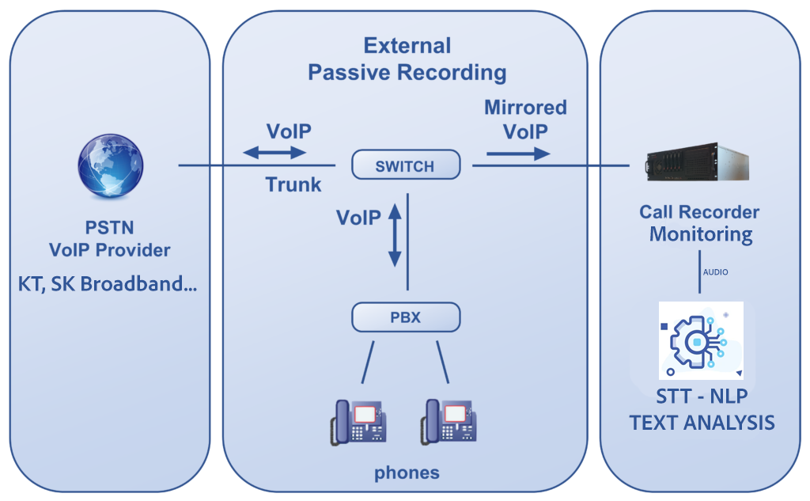

--- 
slug: integrating-stt-into-existing-call-centers-passively
title: "Technical Notes: Seamlessly Integrating STT into Legacy Call Center Systems via Passive Monitoring"

date: 2025-03-10

tags: 
  - AI
  - STT
  - VoIP
  - Call Center
  - Networking
---

### **Overview**

Deploying Speech-to-Text (STT) into legacy call center environments—especially those built on CTI platforms, Asterisk, or custom SIP PBX systems—poses serious architectural challenges. As a Technical Lead, I’ve encountered resistance when suggesting modifications to these systems: business continuity is non-negotiable, and even minor disruptions can impact thousands of live calls.

That’s why the passive integration approach—leveraging port mirroring and low-level SIP/RTP packet inspection—has become a key strategy for augmenting legacy infrastructure with AI capabilities, without touching production systems.

In this note, I’ll first walk through the key challenges of integrating STT into existing call center stacks. Then, I’ll present a solution architecture using port mirroring for passive STT ingestion.

---

### **Problem: Embedding AI into Legacy Call Center Systems**

You might be tasked with adding STT (and later NLU or TTS) to a call center platform that:

- Was built 5–10 years ago
- Uses hardcoded SIP trunks with CTI or Asterisk
- Cannot tolerate downtime
- Has no concept of AI pipeline or media forks
- Has no API to subscribe to RTP streams

#### The technical blockers:
- No hooks to access audio or signaling cleanly
- Any change risks breaking SIP registration or call routing
- Limited hardware or bandwidth at edge locations

Yet business wants:
- Real-time transcription for QA, analytics, coaching
- Insights from customer intent and agent behavior

How can you attach a modern AI pipeline without breaking anything?

---



### **Solution: Passive Integration via Port Mirroring**

A proven approach is to **listen without interfering** by capturing network-level traffic.

We do this via:

- **Port Mirroring** (SPAN) on the core switch or router
- A dedicated **Monitoring Server** connected to that mirror port
- Tools like `sngrep`, `tshark`, or `pyshark` to extract:
  - SIP signaling (INVITE, 200 OK, etc.)
  - SDP blocks (to find IP/Port pairs for RTP)
  - RTP media streams (audio)

#### Benefits:
- Zero changes to CTI, Asterisk, or SIP provider setup
- Works even if the core system is a black box
- Scalable and repeatable for multiple locations

Once SIP and RTP are mirrored, you can:
1. Parse INVITE and 200 OK messages for IP/Port via SDP
2. Open UDP sockets to receive RTP
3. Convert audio (e.g., G.711 to PCM)
4. Send to WebSocket-based STT server

---

### **Implementation Steps**

#### 1. Set up Port Mirroring on the Switch
- Mirror all traffic from the CTI or SIP interface
- Example for TP-Link, Cisco, or Netgear switch:
  - Source Port: CTI or Asterisk server
  - Destination Port: Your Monitoring Server

#### 2. Connect Monitoring Server
- Physical LAN cable to the mirrored port
- Static IP configuration (recommended)
- Install `sngrep`, `pyshark`, or `tcpdump`

#### 3. Parse SIP → Extract RTP IP/Port
```python
# Simplified with pyshark
capture = pyshark.LiveCapture(interface='eth0', display_filter='sip')
for packet in capture.sniff_continuously():
    if hasattr(packet, 'sip') and "m=audio" in str(packet):
        # extract IP/Port from SDP lines
        ...
```

#### 4. Open RTP Listener → Pipe to STT

Once you’ve identified the IP and port pairs for the RTP streams, the next step is to open UDP sockets and start capturing the media payload (typically PCMU or PCMA codecs). 

```python
sock = socket.socket(socket.AF_INET, socket.SOCK_DGRAM)
sock.bind(("0.0.0.0", port))
while True:
    data, _ = sock.recvfrom(2048)
    pcm = audioop.ulaw2lin(data[12:], 2)
    websocket.send(pcm)
```

**Important Note**
In most SIP call scenarios, there are two separate audio channels—RX (incoming) and TX (outgoing). You must clearly distinguish between them using the associated IP addresses.
If you blindly mix both RTP streams into a single decoder, the resulting audio will sound distorted or unnatural (e.g., overlapping voices, mismatched sample rate), and STT output will be unreliable.


---

### **Real-World Lessons**

- Port mirroring is *reliable*, but ensure your monitoring NIC is not doing anything else (no IP conflict)
- STT latency depends more on RTP buffering than packet delay
- Use `sngrep` to verify SIP flow before diving into custom parsing
- Mirror both directions (TX/RX) to see complete SIP + RTP

---

### **Conclusion**

Passive SIP/RTP monitoring offers a clean path to integrate AI-powered speech recognition into legacy telephony systems. By treating the network like an observation layer, you can build scalable and robust STT pipelines with minimal risk.

This pattern has worked for large-scale call centers with thousands of concurrent calls, and can easily be adapted to support multi-site or cloud-hosted environments.

---
*I wrote this guide based on my experience in real deployment scenarios, supported by my AI assistant to organize and clarify the approach.*


