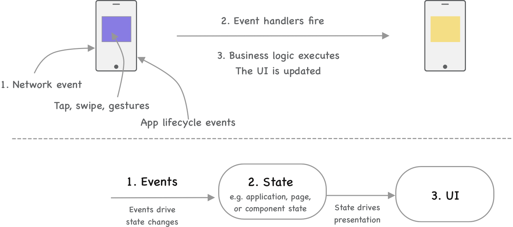
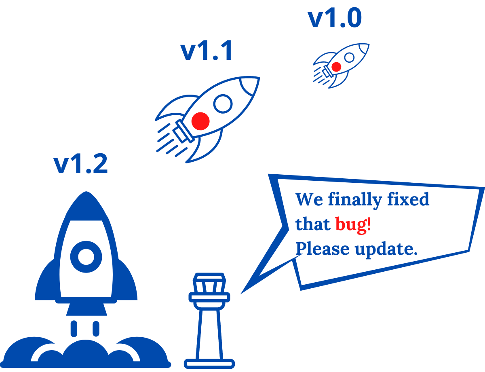
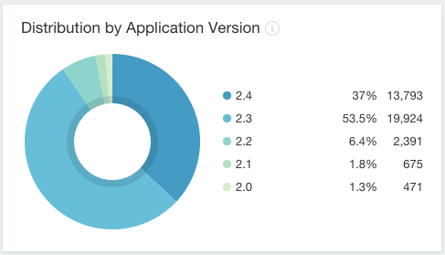
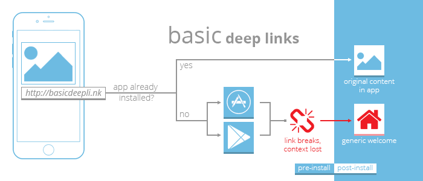
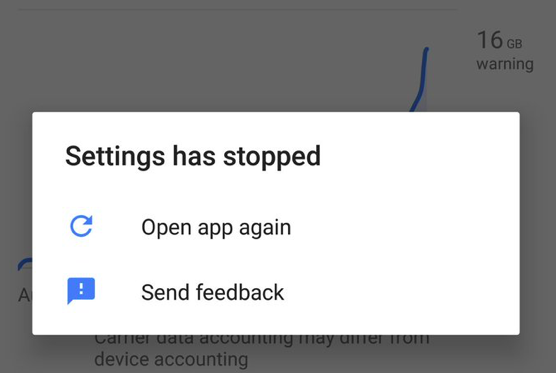
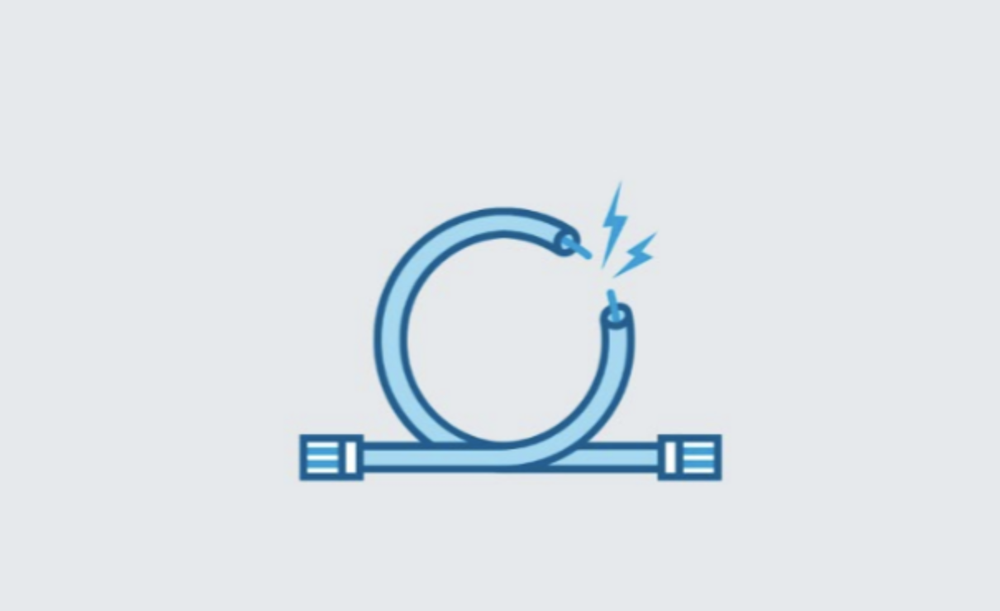
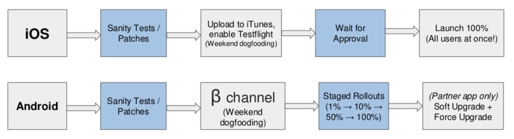

--- 
slug: building-mobile-apps-at-scale-part-1
title: "Building Mobile Apps at Scale: 39 Engineering Challenges, Part 1"

date: 2021-09-20

tags: 

  - Mobile Apps
  - Books

---

# Mở đầu: 
Mình vừa đọc xong cuốn sách **Building Mobile Apps at Scale: 39 Engineering Challenges**  của tác giả **Gergely Orosz** và thấy nó thực sự bổ ích nên tóm tắt lại nội dung chính của cuốn sách trong post này. Cuốn sách nói về những khó khăn, vấn đề mà các kỹ sư gặp phải khi xây dựng những ứng dụng mobile (Android, iOS) ở quy mô lớn. Hơn 30 kỹ sư hiện đang là việc tại những công ty công nghệ lớn như Twitter, Amazon, Flipkart, Square, Uber … đã đóng góp những góc nhìn của họ trong cuốn sách này. 

Khi xây dựng một ứng dụng với quy mô nhỏ, chúng ta có thể dễ dàng tìm đến những giải pháp đơn giản. Cụ thể hơn khi xây dựng một ứng dụng với ít tính năng và chỉ dành cho một số lượng người dùng nhỏ, ứng dụng đó thường sẽ không phức tạp và sử dụng những thư viện có sẵn, templates. Nhưng khi quy mô của dự án tăng lên - lượng khách hàng, kỹ sư, codebase và tính năng… mọi thứ sẽ trở nên phức tạp hơn, khó để hiểu và sửa chữa hơn. Cuốn sách sẽ đưa ra những khó khăn về kĩ thuật và cách giải quyết khi ứng dụng trở nên phức tạp hơn.

# Part 1: Challenges Due to the Nature of Mobile Applications
Những người ở lĩnh vực khác thường nghĩ hầu hết các vấn đề của native apps cũng giống như web. Thực tế là phát triển mobile có cả tá những vấn đề độc nhất khác hẳn với web và backend. Hầu hết những vấn đề liên quan đến việc phân phối binary của ứng dụng mobile, phải thiết lập các kết nối ở tầng thấp hay những tính năng độc đáo như  thông báo, deeplinks hoặc in-app-purchase

### 1. State Management 
Việc quản lý các state thường rất đau đầu với cả mobile , web và backend. Nhưng sự khác biệt với mobile là chúng phải phụ thuộc vào vòng đời của ứng dụng (stop, foreground, background). 

Image from [1].

Event sẽ thay đổi state (trạng thái) trong hầu hết các ứng dụng mobile. Những event này được khởi tạo mọt cách bất đồng bộ từ những yêu cầu network, user input hoặc thay đổi trạng thái ứng dụng. **Hầu hết bugs và crash trong ứng dụng gây ra bởi những event không được lường trước hoặc không được kiểm tra kĩ lưỡng**.  Những vấn đề này thường được giải quyết bằng cách phân chia lại những thành phần (components), trạng thái của ứng dụng (application state) và dù sớm hay muộn sẽ sử dụng **reactive state management** .

Reactive programming là phương pháp thường sử dụng với ứng dụng lớn và có nhiều states. Chúng ta cố gắng giữ các trạng thái bất biến, lưu trữ các models như các đối tượng bất biến và chúng tạo ra những thay đổi về trạng thái.

Ứng dụng mobile chia sẻ cùng một tài nguyên với những ứng dụng khác. Hệ điều hành sẽ theo dõi CPU, bộ nhớ và mức tiêu thụ năng lượng. Nếu ứng dụng của chúng ta sử dụng quá nhiều tài nguyên nó sẽ bị kill với chỉ một thông báo nhỏ. 

Deeplinks là một điểm để khởi động ứng dụng, nó thiết lập các đường tắt nội bộ trong ứng dụng và làm tăng sự phức tạp. Với deeplinks việc thiết lập các trạng thái của ứng dụng phải được cài đặt trước khi deeplinks được kích hoạt. 

### 2. Mistakes Are Hard to Revert:

Image from [1].

Ứng dụng mobile được phát hành dưới dạng binary. Một khi người dùng cập nhật một phiên bản có lỗi, người dùng sẽ mắc kẹt với lỗi đó cho tới khi chúng ta release một bản vá lỗi và người dùng cập nhật phiên bản đó. 

Một số khó khăn với phương pháp tiếp cận này:
	* Cả Apple và Google không cho phép file code có thể thực thi được gửi đến ứng dụng. Đều này nghĩa là chúng ta không thể cập nhật ứng dụng từ xa
	* Việc release phiên bản mới có thể mất nhiều giờ thậm chí là nhiều ngày.
	* Người dùng có thể mất đến vài ngày để tự động cập nhật lên phiên bản đã được release
	* Chúng ta không thể chắc chắn rằng người dùng sẽ cập nhật phiên bản vá lỗi này. Một số người dùng có thể đã tắt tính năng tự động update.

Một số bước có thể áp dụng để giảm bớt lỗi xảy ra ở các phiên bản cũ:
	* Thực hiện testing kỹ lưỡng ở tất cả các mức độ: Automated testing, beta testing và feedback loops. 
	* Có hệ thống đánh dấu những tính năng: Dựa vào những flag này, chúng ta cỏ thể loại bỏ lỗi một cách nhanh chóng. 
	* Cân nhắc việc rollouts (phát hành)  từ từ: chúng ta phát hành một lượng người dùng nhỏ trước, theo dõi và đảm bảo ứng dụng hoạt động như mong đợi và sau đó tăng lượng phát hành lên.
	* Cưỡng chế cập nhật là một giải pháp hữu hiệu

### 3. The Long Tail of Old App Versions:

Những phiên bản cũ sẽ vẫn tồn tại trong một thời gian dài và có thể đến một vài năm. Khoảng thời gian dẽ được rút ngắn nếu chúng ta áp dụng cập nhật cưỡng chế một cách đều đặn. Hầu hết người dùng sẽ cập nhật phiên bản mới trong một vài ngày nhưng **sẽ tồn tại một cái đuôi dài với người dùng bị trễ một vài phiên bản phía sau** . Những phiên bản cũ thường không được kiểm tra đều đặn bởi vì nó tốn rất nhiều công sức và không mang lại nhiều lợi ích.
 

### 4. Deeplinks

Image from [2]

Deeplinks cung cấp một đường dẫn có thể mở một màn hình cụ thể trong ứng dụng. 
Một vài thứ làm cho việc triển khai deeplinks gặp khó khăn:
	* Tương thích ngược: Đảm bảo việc deeplinks làm việc với cả những phiên bản cũ thậm chí sau khi thay đổi lớn diễn ra với navigation hoặc logic 
	* Vấn đề về state khi deeplink vào một ứng dụng đang chạy với cùng state đó. Cụ thể hơn, Điều gì sẽ xảy ra nếu bạn đang dùng ứng dụng với một màn hình chi tiết một sản phẩm và bạn bấm vào một đường link trong ứng dụng trỏ đến một màn hình chi tiết sản phẩm khác?
	* iOS và Android deeplinks được triển khai khác nhau. iOS sử dụng universal links và URL schemes còn Android sử dụng intents
	* Không lên kế hoạch trước: deeplinks thường được triển khai sau một vài phiên bản

### 5. Push and Background Notifications 

Push notification thường được sử dụng để thông báo hoặc như một công cụ marketing. Việc cài đặt và vận hành push notification là phức tạp. Đối với cả Android và iOS chúng ta cần phải nhận token từ server (FCM cho Android và APNs cho iOS) và lưu token này trên backend. Chúng ta cần thống nhất với backend về những loại thông báo nào và lúc nào thì sẽ được gửi. 
Một số khó khăn với push notification cũng giống như deeplinks, chúng ta cần xử lý tương thích ngược, vấn đề về state trong ứng dụng, lên kế hoạch trước… Ngoài ra người dùng có thể lựa chọn việc nhận thông báo hoặc không, việc đẩy thông báo cũng không được đảm bảo bởi chúng ta phụ thuộc vào việc xử lý của Apple và Google.

### 6. App Crashed 

App crashed là một trong những lỗi được chú ý trong tất cả Mobile app và thường gây ảnh hưởng lớn đến việc kinh doanh. Người dùng sẽ cảm thấy ứng dụng không ổn định và ngừng sử dụng ứng dụng hoặc để lại review xấu. Việc đầu tiên chúng ta cần làm là theo dõi lúc nào crashed xảy ra và có đầy đủ thông tin gỡ lỗi. Chúng ta có thể tự xây dựng một hệ thống báo cáo crash hoặc sử dụng một số giải pháp theo dõi như Crashlytics…

### 7. Offline Support

Người dùng thường mong đợi ứng dụng sẽ chạy ổn định ngay cả khi bị mất kết nối. Việc xây dựng chế độ offline cần thêm những phức tạp như sau:
	* Phát hiện việc thiết bị đang ở chế độ offline: OS có thể cho chúng ta biết khi người dùng online những nhiều lúc nó không thể sử dụng. Cụ thể như khi thiết bị kết nối với Wi-fi nhưng không thể truyền dữ liệu.
	* Phát hiện tốc độ và độ trễ của mạng và thay đổi cách xử lý của ứng dụng là cần thiết. Ứng dụng streaming có thể thay đổi, tối ưu stream để phù hợp với băng thông hiện có. Một số ứng dụng khác có thể cảnh báo người dùng về tốc độ mạng kém.
	* Lưu vào bộ nhớ khi thiết bị offline và có thể đồng bộ nó khi kết nối được khôi phục.

Chúng ta cần phải quyết định phần nào của ứng dụng sẽ có thể hoạt động offline. Lời khuyên cho quá trình này đó là chúng ta bắt đầu với những tính năng chính của ứng dụng và sau đó mở rộng một cách từ từ. 

### 8. Accessibility 

Accessibility thường là một vấn đề lớn đối với những ứng dụng có một lượng lớn, nhiều trong số họ cần những tính năng hỗ trợ và không thể sử dụng ứng dụng của bạn mà không có sự hỗ trợ đầy đủ. Ngoài ra có thể sẽ xảy ra một số vấn đề pháp lý nếu ứng dụng không cung cấp đủ accessibility. 
Đảm bảo rằng ứng dụng có thể sử dụng được với những người có khả năng nhìn kém thông qua VoiceOver(iOS) hoặc TalkBack (Android) và đảm bảo những màu sắc và thành phần chính có đủ độ tương phải là những yêu cầu cơ bản nhất.

### 9. CI/CD

Steps for staged rollout for Uber app from [3]

Việc CI/CD với một ứng dụng giống như backend service hoặc web apps là điều không thể bởi vì ứng dụng của chúng ta được review một cách thủ công bởi App Store và Play Store. Chúng ta có thể sử dụng một số công cụ (vd: Fastlane,  Bitrise…) để tự động hoá một vài bước trong khi triển khai ứng dụng như upload ứng dụng lên Apple Store, PlayStore, release ứng dụng với phần trăm rollouts trên PlayStore

Một số bước release phổ biến bao gồm:
	* Dev/ nightly build: Một phiên bản được build bởi hệ thống CI/CD. Chỉ những kỹ sư hoặc nhân viên trong công ty được truy cập phiên bản này.
	* Beta/dogfood release: Thường phát hành cho toàn thể nhân viên công ty và beta testers trước khi phát hành chính thức.
	* General, staged rollout: phát hành vào thực tế. Thường được phát hành vào một số phần trăm nhất định người dùng.
	
Tần suất phát hành ứng dụng thường phụ thuộc vào mỗi team, công ty. Sau đây là nhưng tần suất release thường dùng:
	* Weekly:Ứng dụng được cập nhật mỗi tuần đối với những team lớn 
	* Every two weeks: Ứng dụng được cập nhật mỗi 2 tuần. Nhiều công ty chọn mô hình này để giảm gánh nặng việc testing cho mỗi phiên bản.
	* Less frequent or ad-hoc releases: Một số ứng dụng nhỏ thường chỉ cập nhật khi có một số thay đổi lớn.

### 10. Third-Party Libraries and SDKs
Một khi ứng dụng lớn dần và tích hợp thêm nhiều thư viện thứ 3, quá trình build sẽ trở nên phức tạp hơn. Một số thư viện có những phiên bản mới hơn và bắt buộc source code của chúng ta phải được cập nhận một cách đúng đắn và kiểm thử lại. 

Những thư viện bên thứ 3 có thể gây nên những vấn đề về bảo mật, dữ liệu người dùng bị đánh cắp. Ngoài ra việc hoạt động ổn định và bảo đảm của những thư viện này cũng là một vấn đề cần được chú ý. 

Một phương pháp tiếp cận đúng đắn đó là coi những ứng dụng thứ ba này là những phụ thuộc nguy hiểm, theo dõi và đánh giá sự cần thiết của chúng  một cách đều đặn.

### 11. Device & OS Fragmentation
Mẫu thiết bị mới và sự phân mảnh hệ đều hành là một trong những vấn đề phổ biến nhất của cả Android lẫn iOS. 

Việc giữ cho ứng dụng hoạt động tốt trên hệ điều hành liên tục cập nhật các phiên bản mới và các thay đổi API đòi hỏi sự tập trung của các kỹ sư mobile. Cả iOS và Android đều liên tiếp đổi mới với những tính năng bổ sung. Việc liên tục theo dõi những điểm mới trên WWDC hoặc Google I/O và sau đó là triển khai nó vào ứng dụng là một công việc thú vị.

Việc quyết định dừng hỗ trợ ứng dụng, cập nhật ở phiên bản OS nào là một quá trình mà team mobile cần cân nhắc. **Khi lợi nhuận từ những version cũ thấp hơn chi phí để maintain thì chúng ta nên cân nhắc loại bỏ những phiên bản OS cũ đó** .

### 13. In-App Purchases (IAP):
IAP là là cách duy nhất để bán những sản phẩm điện tử trên nền tảng mobile hầu hết các ứng dụng đều sẽ triển khai IAP. 
Một vài khó khăn khi triển khai IAP:
* Sự khác nhau giữa iOS và Android IAP: Ví dụ Google Play cho phép tạm dừng subscriptions nhưng iOS thì không. 
* Rigid pricing: Với Apple chúng ta chỉ có thể chọn những mức giá được định sẵn. Nó sẽ trở nên phức tạp nếu chúng ta thiết lập mức giá khác nhau ở mỗi nước, chúng ta sẽ phải hardcode ở binary.
* Tài liệu tham khảo kém chất lượng.

### References:
[1]: [State management | Building Mobile Apps at Scale](https://www.mobileatscale.com/content/posts/01-state-management/)
[2]: [Context is What Makes Deeplinks Matter | by Austin Hay | Medium](https://medium.com/@AustinHay/context-is-what-makes-deeplinks-matter-94214a37f178)
[3]: [Uber mobility - Build & Release](https://www.slideshare.net/dhaval2025/uber-mobility-build-amp-release-74577549)

 