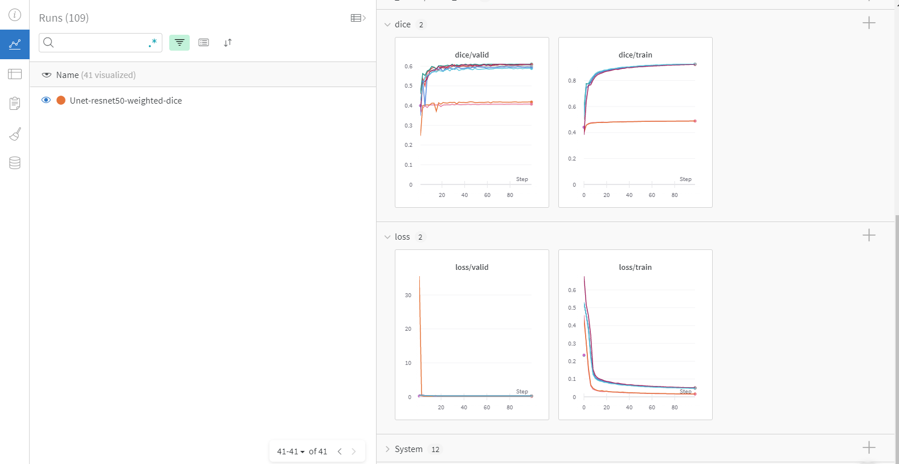
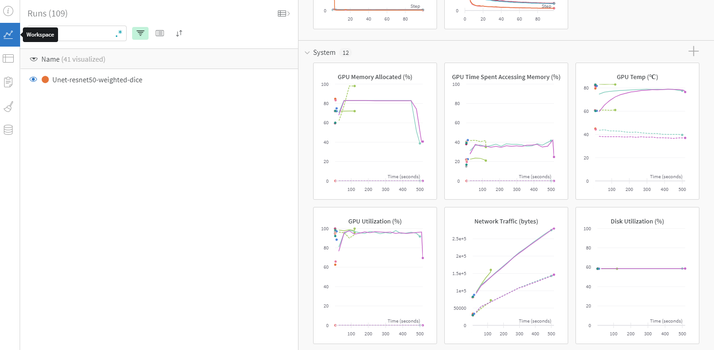

--- 
slug: cach-cai-dat-va-su-dung-wandb-de-experiment-tracking-ml
title: MLOps-Cách cài đặt và sử dụng Wandb để theo dõi thử nghiệm(experiment tracking) trong Machine Learning 

date: 2021-09-01 

tags: 

  - MLOps 

--- 

## 1. Mở đầu

Trong khi xây dựng mô hình học máy, việc lưu lại kết quả và theo dõi những thử nghiệm (experiment tracking) là rất quan trọng để cại thiện mô hình. Một số thông số quan trọng cần theo dõi đó là phiên bản code nào đang được sử dụng (code version) và tập dữ liệu nào đã sử dụng để huấn luyện , nó sẽ giúp bạn quay lại và lặp lại thử nghiệm một cách dễ dàng những thử nghiệm mà có thể bạn đã chạy trước đó vài tuần và không thể nhớ những chi tiết nữa. Tiếp theo là những hyperparameters (learning rate, batch size, max epochs...), chúng ta không thể tái hiện lại thử nghiệm nếu thiếu những tham số này. Cuối cùng là kết quả của thử nghiệm, các metrics được dùng trong thí nghiệm qua đó ta có thể so sách và có một cái nhìn tổng quan về những thí nghiệm đã chạy.

Có một vài công cụ giúp bạn có thể dễ dàng lưu kết quả và theo dõi những thử nghiệm như Weight & Biases, Comet, MLflow, Amazon SageMaker Studio...Trong bài viết này mình sẽ giới thiệu Weight & Biases (Wandb). Đây là một công cụ tương đối dễ sử dụng có hỗ trợ các chức năng Dashboard, Sweeps, Artifacts..

Giải thích các từ ngữ (terminology) trong wandb:
* `Run`: Một thử nghiệm lúc bạn huấn luyện hoặc đánh giá mô hình (training hoặc inference)
* `Config`: Lưu lại những thông số như hyperparameters, architecure, dataset, những thông số này sẽ hiện ra trên dashboard để gộp thành nhóm, sắp xếp hoặc lọc. 
* `Project`: Project là một nhóm các thử nghiệm để so sánh với nhau. Mỗi project sẽ có một dashboard riêng.
* `Note`: Một ghi chú ngắn gọn như ghi chú lúc bạn commit gì đó trong Git.
* `Tags`: Để gán nhãn và thử nghiệm (ví dụ: baseline..). Có thể sửa trên dashboard.

## 2. Cài đặt
Để cài đặt, các bạn vào trang chủ của Wandb [tại đây](https://wandb.ai/site) để đăng ký bằng thành viên. Có thể đăng ký bằng tài khoản Github hoặc Google một cách dễ dàng.

Cài đặt thư viện Wandb:
```
pip install wandb
```

Tiếp theo bạn cần đăng nhập vào Wandb như sau:
```
wandb login

# Kết quả hiện ra như sau:
wandb: You can find your API key in your browser here: https://wandb.ai/authorize
wandb: Paste an API key from your profile and hit enter:
```

Bấm vào liên kết trên  `https://wandb.ai/authorize`, sao chép chuỗi token, và dán vào terminal và nhấn **Enter**. 

## 2. Sử dụng Weight and Bias để theo dõi các thử nghiệm

Wandb có thể tích hợp vào rất nhiều nền tảng như PyTorch, Keras, Hugging Face... Trong bài viết này, mình sẽ hưỡng dẫn cách tích hợp vào Pytorch, những nền tảng khác cũng được tích hợp một cách tương tự.

Đầu tiên, chúng ta import thư viện `wandb` và khởi tạo một 'Run' bằng lệnh `wandb.init(config=args)`.
Tiếp theo là cài đặt model và các hyperparameter. 
Cuối cùng chúng ta log ra những thông số quan trọng như loss.

```
import wandb
wandb.init(config=args)

model = ... # load model 

# Magic
wandb.watch(model, log_freq=100)

model.train()
for batch_idx, (data, target) in enumerate(train_loader):
    output = model(data)
    loss = F.nll_loss(output, target)
    loss.backward()
    optimizer.step()
    if batch_idx % args.log_interval == 0:
        wandb.log({"loss": loss})
```

**Đặt tên cho  `Run`:**

Nếu không đặt tên cho `Run`, wandb sẽ tự động đặt tên cho các `Run` như: `splendid-elevator-2, misunderstood-frost-1, stellar-dragon-14...`. Chúng ta có thể đặt tên lại bao gồm những cài đặt của mình như sau:

```
import wandb
wandb.init()
wandb.run.name = 'run-name'   # Ex: "Train-Unet-resnext50_32x4d-weighted-cedice" hoặc "Test_UNet3D_size-128..."
wandb.run.save()
```

**Lưu lại những config**
Chúng ta lưu lại những thông số trong quá tình chạy thử nghiệm một `Run` như sau:

```
config = dict (
  learning_rate = 0.01,
  momentum = 0.2,
  architecture = "CNN",
  dataset_id = "peds-0192",
  infra = "AWS",
)

wandb.init(
  project="detect-pedestrians",
  config=config,
)
```

Hoặc có thể thêm config sau khi khởi tạo `Run` như sau:
```
wandb.init(project='project_name')
wandb.config.epochs = 30
wandb.config.batch_size = 32
wandb.config.learning_rate = 0.001
wandb.config.architecture = "unet"
```


**Lưu vào nhật ký các kết quả**

Chúng ta có thể lưu lại những hình ảnh, accuracy, loss vào Wandb bằng cách chạy hàm `wandb.log()`

```
wandb.log({
        "Accuracy": acc,
        "Loss": loss})
```

Sau khi cài đặt và chạy, những thông số và kể quả của thử nghiệm sẽ được lưu lại và theo dõi trên tài khoản wandb.ai của bạn nhử thế này: 




Ngoài những tham số và kết quả của mô hình thì Wandb còn tự dộng lưu lại, giám sát tài các tài nguyên của hệ thống như sử dụng bao nhiêu bộ nhớ, CPU, GPU...




Mọi người có thể tham khảm thêm nhiều ví dụ khác [tại đây](https://github.com/wandb/examples).

## 3. Cách làm việc với team member dùng Weight and Biases
Wandb cho phép chúng ta làm việc nhóm 1 cách hiệu quả, giúp tránh việc những thành viên trong nhóm chạy lại cũng một config trùng lặp. Thững thành viên trong nhóm hoặc team lead có thể có cái nhìn toàn cảnh về những thử nhiệm đang được chạy ở trong nhóm.

Để tạo 1 team trên wandb, chúng ta bấm vào hình profile ở góc phải trên trang chủ wandb sau khi đăng nhập. Nhập team name và tạo team cho mình sau đó mời các thành viên khác vào team. 

Sau khi tạo team, các thành viên phải thay đổi tham số `entity` thành tên của team ở bước khởi tạo `Run` như sau: 

```{4}
import wandb

# 1. Start a new run
wandb.init(project='gpt-3', entity='kynd-team')

# 2. Save model inputs and hyperparameters
config = wandb.config
config.learning_rate = 0.01

# 3. Log gradients and model parameters
wandb.watch(model)
for batch_idx, (data, target) in enumerate(train_loader):
  ...
  if batch_idx % args.log_interval == 0:
    # 4. Log metrics to visualize performance
    wandb.log({"loss": loss})
```


## 4. Kết luận

Mình đã hưỡng dẫn cách sử dụng Wandb để lưu lại và theo dõi những thử nghiệm trong lúc tạo mô hình machine learning. Việc theo dõi thử nghiệm (experiment tracking) là rất quan trọng bởi vì sau này, nếu bạn cố gắng nhìn lại hay nhớ lại cách bạn đã tạo ra một mô hình nào đó, có những thông tin này sẽ thực sự hữu ích để giúp bạn mở rộng hoặc cải thiện kết quả của mình.


Tài liệu tham khảo: 

https://docs.wandb.ai/guides/track


https://docs.wandb.ai/guides/integrations/pytorch


