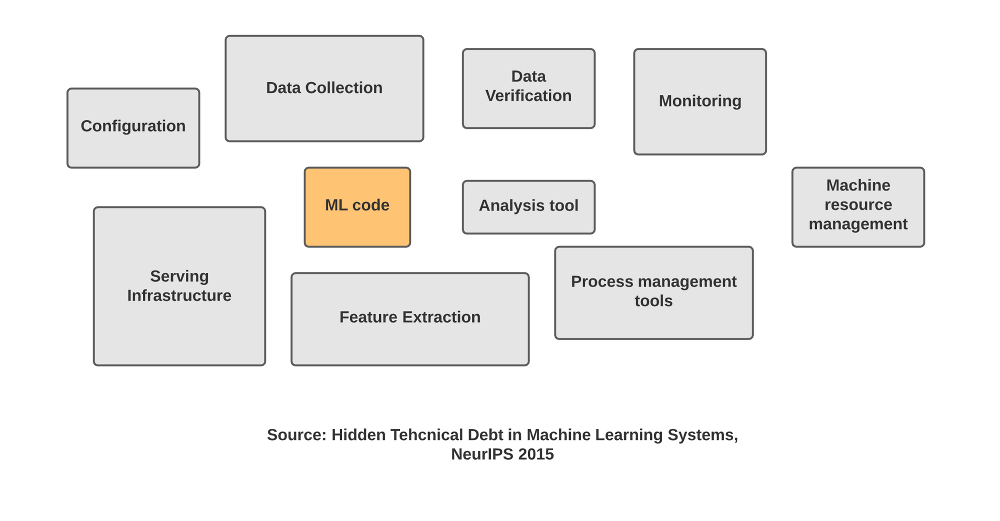
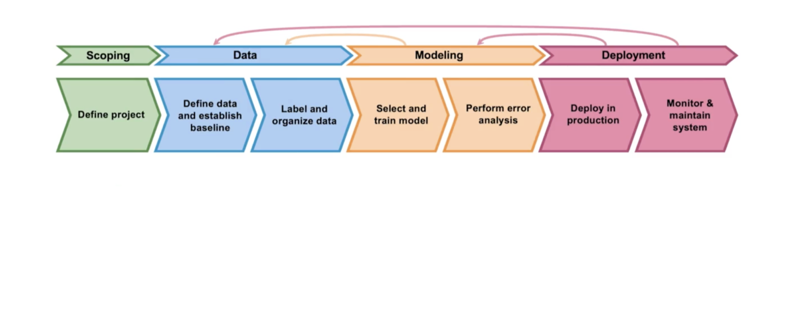
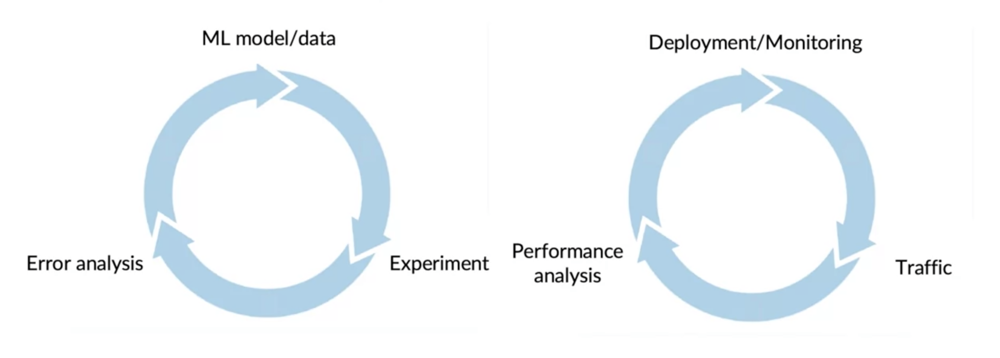

--- 
slug: vong-doi-phat-trien-va-trien-khai-mo-hinh-hoc-may-ml-lifecycle-deployment
title: (MLOps) Vòng đời phát triển và triển khai mô hình học máy (ML Lifecycle & Deployment)

date: 2021-09-03 

tags: 

  - MLOps

--- 

## 1. Mở đầu:
Mình vừa mới học xong một khoá học về MLOps từ Coursera nên mình muốn note lại những gì mình đã học được một cách ngắn gọn ở trong post này trước khi mình quên hết. 

Sau đã học xong cách để huấn luyện một mô hình thì làm gì tiếp theo? Đây là một câu hỏi chúng ta thường thắc mắc và câu trả lời đã được đưa ra trong khoá học này. Một mô hình học máy chỉ hữu ích khi chúng ta biết cách sử dụng nó vào những dịch vụ trong đời sống. Rất nhiều người suy nghĩ rằng hoàn thành việc xây dựng mô hình là xong nhưng thực tế thì nó chỉ là một phần rất nhỏ trong hệ thống học máy. Sau đây mình sẽ giải thích tóm lược các bước để triển khai một hệ thống học máy vào thực tiễn.

**Một số thách thức của việc triển khai hệ thống ML:**
Hãy thử nói về một dịch vụ phân tích cú đánh Golf mà mình đã từng làm. Đầu tiên chúng ta phải xây dựng một mô hình để lấy ra toàn bộ những keypoints trên cơ thể người và từ đó phân tích kỹ thuật của người chơi. Mô hình này được huấn luyện trên một tập dữ liệu mà bên mình tự thu thập tại các sân golf với những người chơi khác nhau và được quay bởi những camera khác nhau. Nhưng khi triển khai ứng dụng này vào thực tiễn, mình nhận thấy rằng hình ảnh đầu vào thực tế khác rất nhiều so với ảnh dùng để huấn luyện. Điều đó là vì những điều kiện ánh sáng, góc chụp của camera. => Những vấn đề này thường được gọi là **sự lệch pha về khái niệm (concept drift)** hoặc **sự lệch pha về dư liệu (data drift)** 

**Triển khai mô hình học máy phức tạp hơn chúng ta nghĩ:**

Khi chúng ta hoàn thành việc xây dụng mô hình trên Jupyter Notebook. Nó vẫn còn rất nhiều việc phải làm từ việc xây dựng xong mô hình cho đến lúc triển khai sản phẩm thực tế. Trong một hệ thống học máy, số lượng source code của mô hình học máy chỉ chiếm khoảng 5-10% hoặc có thể ít hơn nhiều so với toàn bộ source code của hệ thống.

Trên đây là một biểu đồ được dùng để miêu tả một mô hình học máy. Chúng ta có thể thấy, ngoài việc xây dựng source code cho mô hình học máy chúng ta còn có rất nhiều việc phải làm khác như quản lý, thu thập và kiểm tra dữ liệu đầu vào cũng như việc feature extraction. Sau khi triển khai mô hình, chúng ta còn phải xây dựng hệ thống theo dõi hệ thống giúp chúng ta phần tích hệ thống tốt hơn.

## 2. Vòng đời của một dự án Machine Learning
Biết được vòng đời của mộ dự and Machine Learning là rất quan trọng, nó giúp chúng ta lên kế hoạch cho tất cả các bước cần làm.

Ảnh ML Project Lifecycle from Coursera, Introduction to Machine Learning in Production.

* **Scoping:** Xác định dự án và những công việc cần làm.
* **Data:** Thu thập dữ liệu cần thiết, định nghĩa dữ liệu và xây dựng mô hình ban đầu cũng như gán nhãn và sắp xếp dữ liệu.
* **Modeling:** Huấn luyện mô hình học máy, đánh giá độ chính xác và triển khai phân tích lỗi (error analysis). Trong quá trình kiểm tra lỗi, chúng ta có thể phải quay lại bước _Modeling_ để cập nhật mô hình hoặc quay lại bước _Data_ để xem xét bổ sung thêm dữ liệu. Ở cuối bước này chúng ta có một lượt kiểm tra cuối cùng (final audit) để đánh giá độ chính xác và ổn định của mô hình.
* **Deployment:** Triển khai mô hình vào phần mềm hoặc dịch vụ. Ngoài ra, chúng ta cần theo dõi (monitor) hệ thống, kiểm tra dữ liệu vào và maintain hệ thống. Dựa vào việc theo dõi và kiểm tra dữ liệu đầu vào, chúng ta có thể sẽ phải quay lại để phân tích lỗi và cập nhật mô hình.

## 3. Triển khai mô hình học máy
### Những khó khăn chính trong lúc triển khai
Trong lúc triển khai mô hình học máy, có 2 khó khăn lớn nhất mà chúng ta thường gặp phải đó là những vấn đề về **Mô hình Học máy** và vấn đề về **Kỹ thuật phần mềm**.

**Mô hình học máy, thống kê:** 
Một trong những khó khăn phổ biến nhất trong mô hình học máy đó là sự _lệch pha khái niệm_ và _lệch pha dữ liệu_. Đơn giản hơn đó là sự  _thay đổi của dữ liệu đầu vào sau khi triển khai hệ thống_. Đó có thể do điều kiện môi trường như ánh sáng, tiếng ồn hoặc một số nhiễu nào đó.

Sự thay đổi, lệch pha của dữ liệu có thể xảy ra một cách từ từ như từ điển Tiếng Anh được thêm vào một số từ mới tốc độ rất chậm. Trong mô hình dự đoán mẫu xe ô tô dựa vào hình ảnh mà khách hàng tải lên của một hàng sản xuất xe ô tô, mỗi năm một lượng xe mới được đưa ra thì trường. Đôi khi dữ liệu bị thay đổi một cách đột ngột như việc Covid-19 làm cho những hệ thống dự đoán của tài chính hoặc ngân hàng xảy ra lỗi.
Một ví dụ cho sự lệch pha khái niệm đó là: Khi bạn xây dựng một mô hình dự đoán giá nhà dựa vào diện tích hoặc vị trí của căn nhà nhưng bởi vì sự lạm phát hoặc sự thay đổi của thị trường dẫn đến giá nhà tăng gấp.

**Kỹ thuật phần mềm:**
Một khó khăn nữa trong khi xây dựng hệ thống học máy đó là kỹ thuật phần mềm. Có một danh sách những điều chúng ta cần kiểm tra cho ứng dụng của mình đó là:
* **Realtime** or **Batch**: Liệu có cần thiết kế một hệ thống thời gian thực hay chỉ cần chạy một gói dữ liệu đầu vào và nhận kết quả sau một khoảng thời gian.
* **Cloud** or **Edge/ Web Browser** or **On-device**: Hầu hết các hệ thống học máy được triển khai trên Cloud những cũng có một số hệ thống được triển khai trên máy chủ của công ty hoặc ngay trên thiết bị như điện thoại di động hoặc hệ thống nhúng. 
* **Computer resource (CPU,GPU,Memory…):** Xác định tài nguyên sử dụng là rất cần thiết để xây dụng kiến trúc của hệ thống
* Độ trễ (Latency), Tốc độ xử lý (Throughput, Queries per second)
* **Bảo mật và quyền riêng tư (Security & Privacy)** 

Việc xác định trước những yếu tố trên giúp chúng ta lựa chọn một kiến trúc phù hợp khi triển khai hệ thống học máy.

### Những mô hình triển khai mẫu
Trong khi triển khai những mô hình học máy, có một vãi những mô hình mẫu (Design Patterns) thường được sử dụng trong nhiều ứng dụng và nhiều lĩnh vực khác nhau. Sau đây là một số những mô hình mẫu, use-case:
1. **Dịch vụ, sản phẩm mới:** Một dịch vụ mới chưa từng được triển khai trước đây. Với loại này, chúng ta nên bắt đầu với một lượng nhỏ dữ liệu / traffic và mở rộng nó một cách đều đặn.
2. **Tự động hoá/ Hỗ trợ công việc thủ công:**  Những công việc này trước đây đã được thực hiện bởi con người. Chúng ta muốn dùng ML hỗ trợ hoặc tự động hoá công việc đó. Chúng ta có một số các options để triển khai dựa vào độ thay thế con người (**shadow mode**).
3. **Thay thế hệ thống ML trước đây:** Một công việc đã được thực hiện bởi hệ thống học máy nhưng chúng ta muốn thay thế hệ thống cũ này với một hệ thống tốt hơn. Có 2 phương pháp thường được tiến hành để thay thế hệ thống cũ với hệ thống mới. Một là chúng ta thay thế dần dần **một lượng nhỏ traffic trước** sau đó theo dõi và tăng dần lên nếu hiệu quả. Hai là chúng ta **rollback** (quay lại với) hệ thống trước đây nếu hệ thống mới làm việc không hiệu quả. 

### Theo dõi mô hình
Sau khi triển khai mô hình học máy, chúng ta cần phải theo dõi liệu hệ thống có đạt được độ chính xác cần thiết hay không. Một trong những cách phổ biến nhất đó là sử dụng **bảng theo dõi (Dashboard)**. Dựa vào việc theo dõi thệ thống này chúng ta có thể phát hiện được một số lỗi trong quá trình vận hành, việc thiếu hụt dư liệu đầu vào hoặc những vấn đề khác. Để quyết định những thông số nào cần theo dõi chúng ta căn cứ vào những lỗi có thể xảy ra của hệ thống. Hoặc chúng ta có thể bắt đầu với nhiều thống số cùng lúc và sau đó loại bỏ những thông số không hữu ích. 

Một số thông số thường được theo dõi:
* Thông số phần mềm: Bộ nhớ, Tính toán, Độ trễ, Tốc độ xử lý, Độ Tải của máy chủ
* Thông số đầu vào: Độ dài, khích thước đầu vào, Số lượng dữ liệu bị thiếu, Độ sáng của ảnh đầu vào…
* Thông số đầu ra: Thời gian xử lý, lượng người dùng click (CTR)…

Image from Coursera, Introduction to Machine Learning in Production.

**Huấn luyện và triển khai mô hình là quá trình lặp đi lặp lại:** 
Trong lúc huấn luyện mô hình, chúng ta bắt đầu với dữ liệu, làm thí nghiệm để huấn luyện mô hình, sau khi xây dựng mô hình chúng ta cần phân tích lỗi (error analysis). Dựa vào kết quả phân tích đo, chúng ta quay lại và suy nghĩ cách để cải thiên mô hình hoặc dữ liệu. Đây là một vòng lặp cho đến lúc chúng ta đạt được kết quả đủ tốt.

Việc triển khai mô hình cũng được coi như một vòng lặp. Đầu tiên chúng ta triển khai mô hình và thiết lập hệ thống theo dõi. Tiếp theo là chạy thử nghiệm với một lượng dữ liệu thực tế, điều đó giúp chúng ta có thể phân tích hiệu năng, cập nhật và tiếp tục theo dõi hệ thống.  

# 4. Kết luận
Mình đã note lại một phần những kiến thức về vòng đời của một dự án học máy cũng như việc triển khai một hệ thống học máy. Hi vọng mọi người có một cái nhìn tổng quan về những bước cần làm, những lưu ý cũng như best practices để lên kế hoạch hoặc xây dụng một hệ thống học máy hiệu quả.

Tài liệu tham khảo:

https://www.coursera.org/learn/introduction-to-machine-learning-in-production/home/welcome