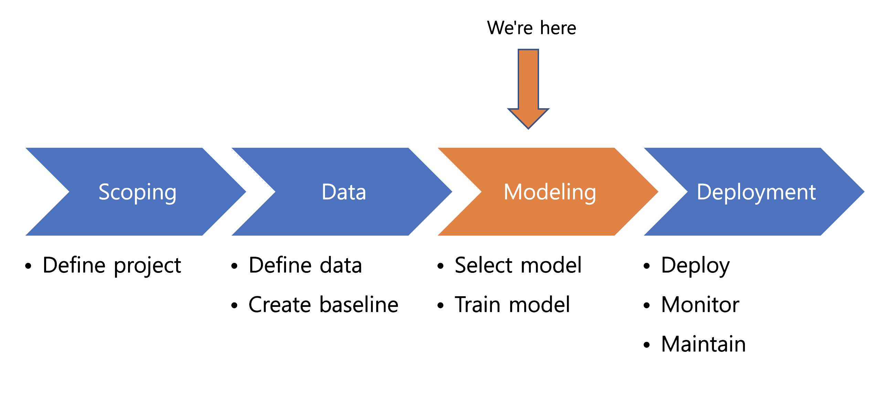
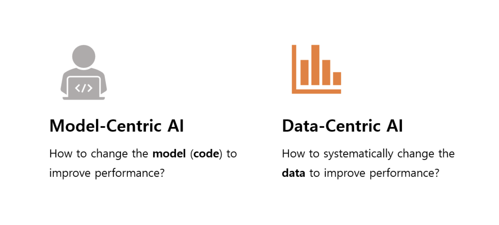
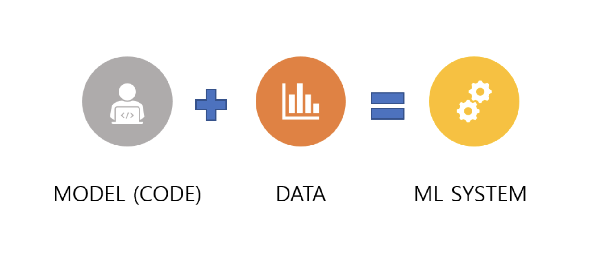
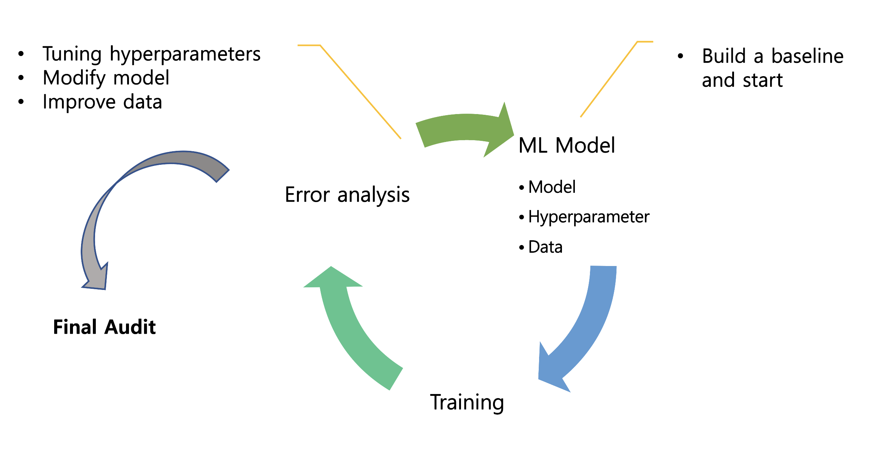
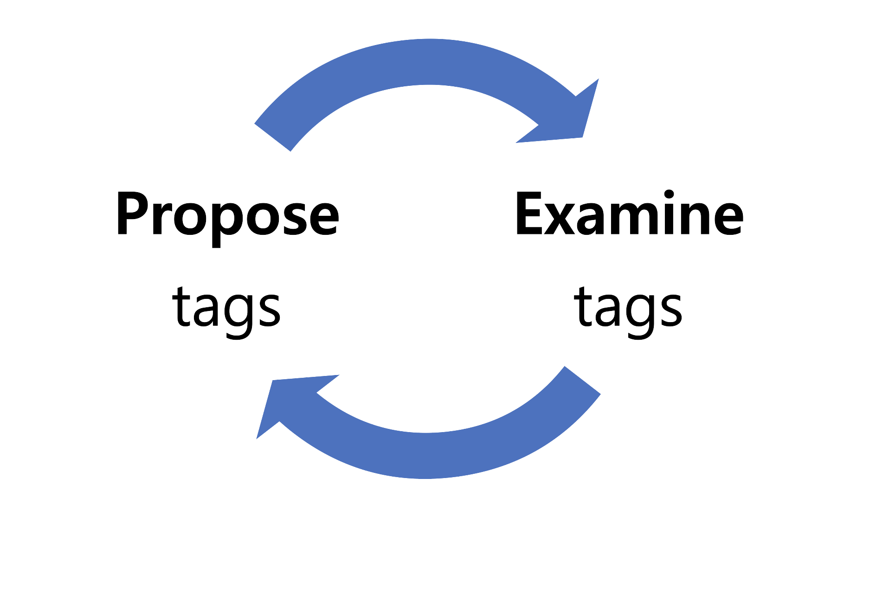
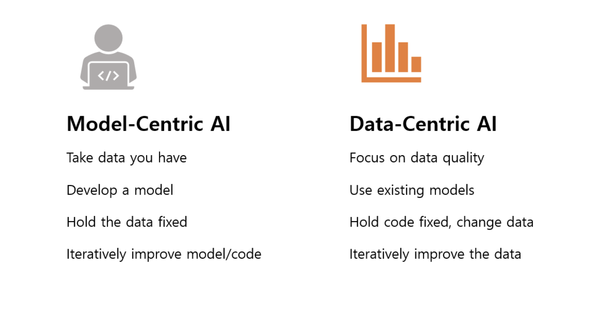

--- 
slug: modeling-xay-dung-mo-hinh-hoc-may-va-giai-quyet-nhung-van-de-thuc-tien
title: "Modeling: phát triển mô hình học máy và giải quyết những vấn đề thực tiễn"

date: 2021-09-04

tags: 

  - MLOps

--- 

## 1. Mở đầu

TIếp tục chuỗi bài về MLOps, Hôm nay mình sẽ tóm tắt về cách **phát triển mô hình học máy** và giải quyết những khó khăn thường gặp. Chúng ta sẽ tập trung vào phần xây dựng mô hình học máy (Modeling) trong vòng đời dự án học máy, học **cách lựa chọn mô hình** thích hợp và **huấn luyện mô hình** đó, tiếp nữa là **cách phân tích lỗi** và dựa vào đó để **cải thiện mô hình** .

## 2. Chọn lựa và huấn luyện một mô hình học máy

### Các trường phái phát triển mô hình học máy.

Có hai trường phải chính trong phát triển mô hình ML.  Kiểu thứ nhất là **tập trung vào mô hình(Model-centric AI).** Đối với kiểu này, chúng ta giữ nguyên tập dữ liệu đào tạo, tập trung vào mô hình và cố gắng cải thiện hiệu năng của mô hình đó. Cách này thường được những nhà nghiên cứu áp dụng để phát triển những kỹ thuật, mô hình AI mới. Kiểu thứ hai là **tập trung vào dữ liệu (Data-centric AI).** Ở kiểu này, chúng ta không tập trung vào mô hình mà tập trung nhiều hơn vào cài thiện **chất lượng dữ liệu** . Điều này giúp tăng hiệu năng của cả hệ thống học máy.  Việc cải thiện dữ liệu không nhất thiết phải thu thập nhiều dữ liệu hơn mà chúng ta còn có thể dũng những kỹ thuật khác để cải thiện dữ liệu hiện có.

### Thành phần chính của một hệ thống mô hình học máy:

Chúng ta có thể hiểu một cách đơn giản rằng một **hệ thống học máy** bao gồm 2 phần chính là **mô hình(code)** và **dữ liệu**. Trong những thập kỷ vừa qua những nhà nghiên cứu đã tập trung phát triển và cải tiến những  mô hình học máy một cách đáng kể bằng cách giữ nguyên tập dữ liệu.  Với những ứng dụng thực tế, những vấn đề về mô hình hoặc thuật toán hầu như đã được giải quyết (classification, detection, segmentation…). Chúng ta có thể dễ dàng clone những **mô hình có sẵn** từ Github và hiệu năng của những mô hình đó là đủ tốt.  Do đó, chúng ta có thể làm việc hiệu quả hơn bằng cách tập trung vào việc thay đổi và **cải tiến chất lượng của dữ liệu** đầu vào. 

### Những khó khăn khi xây dựng mô hình học máy

Xây dựng một mô hình học máy là một công việc có tính **lặp đi lặp lại** cao. Chúng ta thường bắt đầu bằng việc **xây dựng một mô hình baseline** với một vài mô hình, hyperparameters và một lượng dữ liệu đào tạo, tiếp theo là chúng ta thực hiện những **thử nghiệm, huấn luyện** mô hình sau đó thực hiện việc **phân thích lỗi** và dùng kết quả đó để cải thiện mô hình hoặc các hyperparameters.  Việc thực hiện vòng lặp này, thử nghiệm và cải thiện mô hình, các tham số một cách nhanh chóng là rất quan trọng. Ở mỗi vòng lặp, chúng ta cần có những **lựa chọn khôn khéo**  cách cải thiện mô hình, dữ liệu cũng như tuning hyperparameters. Sau khi thực hiện vòng lặp và đạt được một độ chính xác đủ tốt ở bước error analysis, chúng ta cần thực hiện một đợt **kiểm tra cuối cùng**  để đảm bảo rằng mô hình của chúng ta hoạt động tốt sau khi triển khai lên hệ thống thực tế.

Trong khi thực hiện vòng lặp xây dựng mô hình học máy trên đối với hầu hết các dự án học máy, chúng ta có một số các cột mốc như sau:

1. Mô hình chạy tốt trên **tập huấn luyện (training set).**
2. Mô hình chạy tốt trên tập phát triển( **development , hold out validation.**)
3. Mô hình chạy tốt trên **tập kiểm thử ( test set)**

Một mô hình chạy tốt trên tập kiểm thử  là mục tiêu cuối cùng trong vòng lặp xây dựng mô hình học máy trên. Nhưng liệu việc xây dựng một mô hình chạy với tỉ lệ lỗi thấp trên tập kiểm thử đã đủ tốt hay chưa? Câu trả lời là “Chưa”. Ví dụ khi chúng ta xây dụng một mô hình dự đoán một người có bị Covid-19 hay không dựa trên tiếng ho của người đó và đạt được độ chính xác là 98% nhưng thực tế là dữ liệu của chúng ta bị mất cân bằng. Chỉ có 2% số mẫu là của người bình thường và hệ thống dự đoán tất cả mọi người đều là bình thường. Đây chỉ là một ví dụ nhỏ để thể hiện tầm quan trọng của việc đánh giá cuối cùng. **Việc xây dụng mô hình với mục đích đạt được độ chính xác cao trên tập kiểm thử vẫn là chưa đủ**. Chúng ta cần xây dựng một hệ thống học máy **tập trung vào giải quyết vấn đề thực tiễn**

### Cách xây dựng mô hình sơ khai (baseline)
Khi xây dựng một mô hình học máy, việc đầu tiên chúng ta cần làm là xây dựng một mô hình sơ khai (baseline model) và cố gắng đạt được mức hiệu năng tối thiểu sau đó tìm cách cải thiện mô hình baseline.  Sau đây là một số cách để xây dựng một baseline model:

* Dựa vào Human level performance (HLP)
* Tìm kiếm những mô hình tốt nhất hiện có hoặc những mã nguồn mở (state-of-the-arts, open-source)
* Thực hiện nhanh một mô hình thử nghiệm (quick-and-dirty implementation)
* Hiệu năng của những mô hình trước đó (older-system)

Đôi khi, cấp trên hoặc team kế hoạch thường đề ra một kết quả mục tiêu như 80%, 90% hay 99% trước khi chúng ta kịp xây dựng một mô hình baseline. Đều này là rất khó để có thể đưa ra một  dự đoán chắc chắn về kết quả của hệ thống trước khi chúng ta thực hiện một mô hình baseline. Việc chúng ta nên làm đó là giải thích cho các `sếp` hiểu được tầm quan trọng của việc xây dựng một mô hình baseline trước và có một dự đoán chắc chắn hơn về độ chính xác mà hệ thống học máy có thể đạt được. 

## 3. Phân tích lỗi và đánh giá hiệu năng
Phân tích lỗi và đánh giá hiệu năng là rất quan trọng trong việc phát triển một hệ thống học máy. Nó giúp chúng ta quyết định tập vào phần nào của hệ thống để cải tiến và đạt được hiệu quả cao nhất.

### Phân tích lỗi (error analysis)

Một phương pháp thường được sử dụng để phân tích lỗi đó là tạo một bảng **spreadsheet**  với những **danh mục, nhãn** và **số lượng lỗi** . Dựa vào đó để hình dung một cách tổng quát và so sánh mục nào có nhiều lỗi nhất, mục nào cần được tập trung và cải thiện nhất.

#### Quy trình phân tích lỗi:

Quy trình phân tích lỗi cũng có thể coi là một vòng lặp.  Ở đó, chúng ta thường bắt đầu **gán nhãn cho một tập hợp dữ liệu mẫu** (Ví dụ: Tiếng ồn giao thông, tiếng ồn đám đông trong hệ thống NLP, ảnh thiếu sáng, góc chụp không đúng trong hệ thống phân loại ảnh…) và tiến hành **kiểm tra kết quả, lỗi trên từng nhãn**. Dựa vào kết quả kiểm tra những nhãn này, chúng ta **có thể cần quay lại và gán thêm nhãn mới và kiểm tra** kết quả trên nhãn mới đó.

Khi phân tích lỗi với từng nhãn có một số **Phép đo (metrics) hiệu quả** nên được cân nhắc như sau:

* Tỉ lệ lỗi của nhãn đó trong tổng số lỗi là bao nhiêu?
* Trong tất cả dữ liệu mẫu với nhãn đó, tỉ lệ mẫu bị sai là bao nhiêu?
* Tỉ lệ mẫu của nhãn đó với tổng số mẫu trong dữ liệu là bao nhiêu?
* Khả năng để cải thiện hiệu năng trên nhãn đó là bao nhiêu?

Sau khi gán nhãn và kiểm tra lỗi trên từng nhãn dựa trên đặc tính khác nhau của nhãn. Chúng ta có thể nhìn vào đó và quyết định **thứ tự ưu tiên** cần tập trung vào để cải thiện mô hình học máy. Để có thể quyết định nhãn nào nên được tập trung chúng ta có thể cân nhắc những yếu tố sau đây trước khi đưa ra quyết định:

* Khả năng để cải thiện nó là bao nhiêu?
* Danh mục đó có xuất hiện thường xuyên không?
* Có dễ để cải thiện hiệu năng trên danh mục đó không?
* Mức độ quan trọng để cải thiện danh mục đó là bao nhiêu?

### Đánh giá hiệu năng (performance auditing)

Như chúng ta nói ở trên, đạt được một mô hình với kết quả cao trên tập kiểm định với độ chính xác hoặc F1 score cao vẫn là chưa đủ. Chúng ta cần một bước **kiểm tra hiệu năng cuối cùng** trước khi triển khai mô hình vào thực tế. Ở bước kiểm tra cuối cùng này, chúng ta kiểm tra độ chính xác của mô hình với những **tiêu chí đánh giá(metrics) chính xác** và suy nghĩ thêm về **những vấn đề sai, sót có thể xảy ra**. Ví dụ như liệu mô hình có chạy tốt trên những sắc tộc hoặc giới tính khác nhau, liệu mô hình có chạy tốt trên những nhóm dữ liệu hiếm (rare classes).

## 5. Phương pháp tiếp cận tập trung vào dữ liệu (Data-centric AI approach)

Như đã được đề cập ở trên, với phương pháp tiếp cân này chúng tay giữ nguyên mô hình, source-code và tập trung vào việc cải thiện dữ liệu. Khi tìm cách cải thiện kết quả của một mô hình học máy, hãy thử tập trung vào câu hỏi **làm sao để cải thiện dữ liệu tốt hơn**.

### Data augmentation
**Data augmentation**: là một trong những phương láp tốt nhất để cải thiện dữ liệu, làm tăng số lượng tập dữ liệu mẫu, nó đặc biệt hiệu quả với những dữ liệu **unstructure data** như hình ảnh, âm thanh… Chúng ta có thể sử dụng một số kỹ thuật, công cụ miễn phí để tiến hành data-augmentation hoặc thậm chí có thể áp dụng một số kỹ thuật cao cấp như GANs để sinh ra ảnh nhưng cách này có vẻ quá mức cần thiết.  Một vấn đề chúng ta có thể thắc mắc khi làm tăng số lượng tập dữ liệu đó là liệu **tăng thêm dữ liệu có ảnh hưởng xấu đến mô hình không?**. Bởi vì trên thực tế, tập huấn luyện, tập phát triển và tập kiểm thử thường sẽ có **phân bố tương tự nhau**. Khi chúng ta sử dụng data-augmentation để tăng số lượng dữ liệu trên tập huấn luyện có thể sẽ gây **sai khác về phân bố** giữa những tập dữ liệu. **Câu trả lời là không** nếu chúng ta sử dụng **mô hình kích thước lớn** và dữ liệu thêm vào ánh xạ (mapping) từ **điểm x tới nhãn y của nó là rõ ràng** (con người có thể dễ dàng dự đoán được) .

### Adding features
**Adding features**: đối với dữ liệu **structured-data** việc tăng thêm số lượng dữ liệu là rất khó. Thay vào đó, chúng ta có thể suy nghĩ cách thêm những đặc tính hữu ích từ những tập dữ liệu huấn luyện có sẵn. Kỹ thuật học sâu (deep learning)  đã phát triển rất mạnh những năm gần đây nhưng nếu những đối với **structured-data với kích thước dữ liệu là không lớn** thì tự thiết kết các đặc tính (designing of features) có thể hữu ích để tăng hiệu năng của hệ thống.

### Experiment tracking
Trong khi xây dựng mô hình học máy, việc lưu lại kết quả và theo dõi những thử nghiệm (experiment tracking) là rất quan trọng để cải thiện mô hình. Một số thông số quan trọng cần theo dõi đó là phiên bản code nào đang được sử dụng (code version) và tập dữ liệu nào đã sử dụng để huấn luyện , nó sẽ giúp bạn quay lại và lặp lại thử nghiệm một cách dễ dàng những thử nghiệm mà có thể bạn đã chạy trước đó vài tuần và không thể nhớ những chi tiết nữa. Tiếp theo là những hyperparameters (learning rate, batch size, max epochs…), chúng ta không thể tái hiện lại thử nghiệm nếu thiếu những tham số này. Cuối cùng là kết quả của thử nghiệm, các metrics được dùng trong thí nghiệm qua đó ta có thể so sách và có một cái nhìn tổng quan về những thí nghiệm đã chạy. Mình có một bài viết cụ thể về cách thực hiện experiment tracking bằng Weights and Biases [tại đây](https://kyndev.com/cach-cai-dat-va-su-dung-wandb-de-experiment-tracking-ml))

## 6. Kết luận
Trong bài viết này, mình tóm tắt lại những gì đã học được từ khoá học Giới thiệu về MLOps của Andrew Ng ở Coursera.  Mình đã nói qua cách chúng ta xây dựng mộ mô hình học máy, các bước cần thực hiện để xây dựng một mô hình học máy đủ tốt trước khi triển khai mô hình đến thực tế.

Tài liệu tham khảo: 

[*Introduction to Machine Learning in Production by DeepLearning.AI*](https://www.coursera.org/learn/introduction-to-machine-learning-in-production/home/welcome)