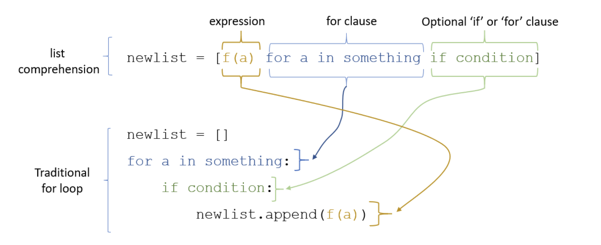

--- 
slug: python-list-comprehensions-explanations
title: "Python list comprehensions explanations"

date: 2021-09-24

tags: 

  - Python
  - CS

--- 

Trong khi xử lý string và list trong python, chúng ta thường sử dụng một tính năng của python có tên [list comprehensives ](https://docs.python.org/3/tutorial/datastructures.html#list-comprehensions) . Sau đây chúng ta sẽ cùng tìm hiểu về hướng dẫn cụ thể và cách dùng list comprehensions.

Python list comprehensions nhúng một cấu trúc lặp vào bên trong một khai báo list để thu dọn nhiều dòng code thành một dòng duy nhất.  List comprehensions thường được dùng để tạo một list mà các phần tử trong đó mỗi phần tử thường là kết quả của một số phép biến đổi từ một phần tử trong list khác hoặc để tạo một list con từ một list khác thoả mãn một số điều kiện nhất định.
Nếu không quen thuộc với list comprehensions, chúng ta sẽ thấy nó có vẻ hơi khác với vòng lặp for  nhưng chúng chỉ là cách viết nắng gọn hơn.



Images from [1]

Sơ đồ trên cho thấy rằng các thành phần của  list comprehensions cũng giống hệt như những thành phần trong một vòng lặp for nhưng theo một thứ tự khác.  

References:
[1] [Coursera | Online Courses & Credentials From Top Educators. Join for Free | Coursera](https://www.coursera.org/learn/probabilistic-models-in-nlp/home/welcome)
[2] [5. Data Structures — Python 3.9.7 documentation](https://docs.python.org/3/tutorial/datastructures.html#list-comprehensions)

