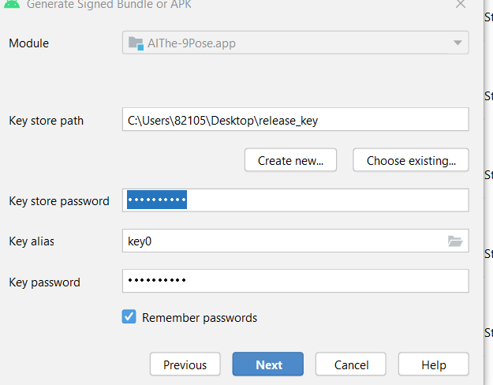

--- 
slug: lay-lai-mat-khay-key-store-android-studio
title: "Lấy lại mật khẩu key store khi còn lưu trên Android Studio"

date: 2022-03-22

tags: 

  - Android

---


Lấy lại mật khẩu key store khi còn lưu trên Android Studio

**Vấn đề:**
Nếu một ngày bạn nhận ra bạn đã quên mật khẩu của keystore file dùng để sign app release nhưng mật khẩu vẫn được lưu ở trên Android Studio vì bạn chọn lưu lại nó. Không có mật khẩu này thì bạn không thể tiếp tục sign file apk và cập nhật ứng dụng nếu project hiện tại gặp vấn đề hoặc Android Studio update…



**Phương pháp:** 
Bạn có thể lấy lại mật khẩu đã lưu đó một cách dễ dàng bằng cách thêm dòng mã sau đây vào file **app/build.gradle**:

```
afterEvaluate {
    if (project.hasProperty("android.injected.signing.store.file")) {
        println "Your key store path: ${project.property("android.injected.signing.store.file")}"
    }
    if (project.hasProperty("android.injected.signing.store.password")) {
        println "Your key store password: ${project.property("android.injected.signing.store.password")}"
    }
    if (project.hasProperty("android.injected.signing.key.alias")) {
        println "Your key alias: ${project.property("android.injected.signing.key.alias")}"
    }
    if (project.hasProperty("android.injected.signing.key.password")) {
        println "Your key password: ${project.property("android.injected.signing.key.password")}"
    }
}

```

Sau đó, vào Build -> Generate Signed Bundle /APK.. -> Chọn next next và build file release apk như thường.
Lúc Android Studio đang build, hãy bấm vào xem build log và lấy lại mật khẩu của mình nhé. 


