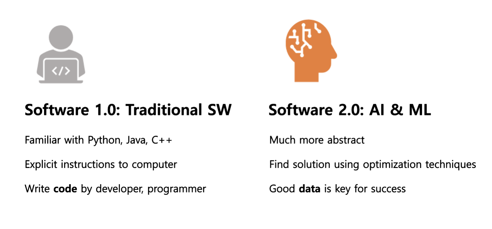

--- 
slug: software-2.0-vs-software-1.0
title: "Software 2.0: Sự ảnh hưởng của AI & ML đến việc phát triển phần mềm"

date: 2021-09-07

tags: 

  - AI & ML

--- 

## Mở đầu

Với sự phát triển nhanh chóng của kỹ thuật học máy và trí tuệ nhân tạo, chúng ta có thể thấy sự ảnh hưởng của nó đến cách mà chúng ta xây dựng các phần mềm. Gần đây mình có đọc và cảm thấy thú vị với từ “Software 2.0”. Hãy cùng tìm hiểu Software 2.0 là gì và sự khác nhau với Software 1.0. 

## Software 2.0 là gì?

Trong khi thiết kế một chương trình phần mềm, ngôn ngữ lập trình(Python, Java, C++) là một trong những yếu tố đầu tiên ,quan trọng và hỗ trợ tất cả các hoạt động và các yếu tố khác. Cũng như vậy, trong machine learning, dữ liệu (data) là yếu tố đầu tiên mà chúng ta xét đến. 

Ở Software 1.0, một chương trình chỉ là một tập hợp các lệnh để hướng dẫn cho máy tính cách hoạt động và những **lập trình viên và nhà phát triển phải triển khai những tập lệnh** này từ những business rule thực tế. Trong Software 2.0, chúng ta cần xác định mục tiêu và cách hoạt động của một chương trình, tập lệnh là quan trọng nhưng không phải thứ duy nhất mà chúng ta cần quan tâm, **những tập lệnh sẽ được viết bằng quá trình tối ưu hoá dựa trên đánh giá qua mỗi vòng lặp**. Chúng ta lập trình Software 2.0 bằng những ví dụ mẫu chứ không chỉ bằng những ngôn ngữ lập trình. Đầu tiên chúng ta thu thập dư liệu, những công việc mà mình muốn chương trình làm, sau đó là xây dựng mô hình để thực hiện công việc đó với một đầu vào mới từ thực tế. Đối với ML, chất lượng dữ liệu là tối quan trọng cho sự thành công của SW 2.0. Chúng ta có thể coi sự quan trọng của dữ liệu trong Software 2.0 cũng giống như sự quan trọng của các tập lệnh trong Software 1.0 vậy. 

Chắc mọi người đã từng nghe câu “Garbage in garbage out”. Điều này là hoàn toàn đúng với Software 2.0. Nếu chúng ta sử dụng dữ liệu rác, chất lượng dữ liệu thấp thì mô hình và ứng dụng của chúng ta cũng sẽ có chất lượng thấp

## Một số điểm mạnh của Software 2.0:
* Đầu tiên là sự đồng nhất về mặt tính toán, hầu hết tất cả các phép tính toán là những phép toán với ma trận và lấy ngưỡng.
* Dễ dàng triển khai trên thiết bị
* Thời gian chạy đồng nhất, mỗi vòng lặp của một mạng neural tường là cố định, được đo lường bằng một FLOPs.
* Sử dụng một lượng bộ nhớ nhất định, chúng ta không cần thiết khai báo bộ nhớ động và không gặp phải tình trạng bộ nhớ bị leaks
* Dễ dàng triển khai, bởi vì những phép nhân ma trận có thể dễ dàng thực hiện trên những thiết bị bất kì.
* Máy tính tối ưu chương trình tốt hơn chúng ta

### Một số nhược điểm của Software 2.0:
* Khó để giải thích tại sao chương trình hoạt động tốt
* Có thể cho kết quả sai một cách thầm lặng (silently adopting biases)

Tài liệu tham khảo: 

https://karpathy.medium.com/software-2-0-a64152b37c35