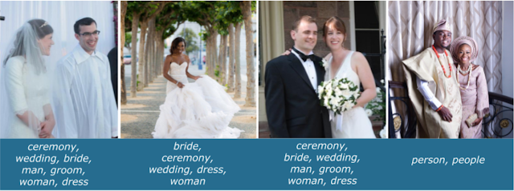
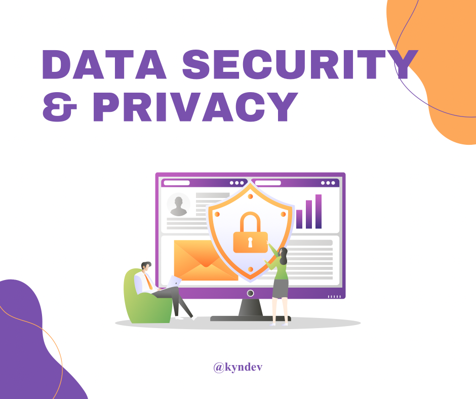

--- 
slug: bias-in-dataset
title: Bias in dataset: Sự thiên vị trong dữ liệu

date: 2021-09-06 

tags: 

  - AI & ML

Một trong những lưu ý khi thu thập dữ liệu đó là đảm bảo rằng dữ liệu được **thu thập một cách có trách nhiệm**, chúng ta cần chú ý tới những khía cạnh như bảo mật dữ liệu, quyền riêng tư và sự bình đẳng trong dữ liệu đó. Hôm nay mình sẽ tóm tắt lại một phần kiến thức học được trong khoá học Machine Learning Data Lifecycle in Production trên Coursera.
 

### Sự thiên vị (bias) trong dữ liệu

Images are from [2]

Việc đảm bảo về sự bình đẳng trong dữ liệu và xây dựng một hệ thống gán nhãn dữ liệu giảm bớt sự thiên vị trong dữ liệu(bias in dataset) là rất quan trọng.  Ví dụ như hình bên trên là hình ảnh và nhãn được dự đoán bằng một mô hình phân loại ảnh huấn luyện từ tập Open Images datasets. Chúng ta có thể thấy rằng hình ảnh đám cưới được dự đoán nhãn khác nhau ở những vùng khác nhau trên thế giới.  Ở nhìn đầu tiên được dự đoán là một buổi lễ, đám cưới, cô dâu, người, chú rể… kết quả là tương đối tốt. Ở bức ảnh thứ 2 và thứ 3 cũng vậy mô hình dự đoán đúng cho những hình ảnh đám cưới ở phương tây. Hãy nhìn ở bức ảnh cuối cùng, đó là một đám cưới ở châu Phi và được mô hình dự đoán là person và people. Nhưng thực tế là đó cũng là một buổi lễ với cô dâu và chú rể.
Đây là một ví dụ điển hình của việc thiên vị(bias) trong dữ liêu. Mô hình học máy này có thể được huấn luyện với dữ liệu không được gắn nhãn đúng với các vùng khác nhau. Do đó, khi xây dựng mô hình học máy chúng ta cần để ý đến việc dữ liệu được thu thập ở đâu cũng như độ chính xác của nhãn.

### Bảo mật dữ liệu và quyền riêng tư (Data security and privacy)

Bảo mật dữ liệu và quyền riêng tư là rất quan trọng, nó liên quan đến cách thức và phương pháp chúng ta bảo vệ dữ liệu cá nhân (Personally Identifiable Information). Quyền cá nhân trong dữ liệu liên quan đến việc sử dụng dữ liệu, thu thập, lưu trữ hoặc xoá bỏ một cách đúng đắn. Người dùng nên quyết định việc dữ liệu nào được thu thập và chúng ta cần đảm bảo việc dữ liệu bị đánh cắp. 	

### Tài liệu tham khảo:

[Machine Learning Data Lifecycle in Production  | DeepLearning.AI](Machine Learning Data Lifecycle in Production  | DeepLearning.AI)

[Introducing the Inclusive Images Competition](https://ai.googleblog.com/2018/09/introducing-inclusive-images-competition.html)

