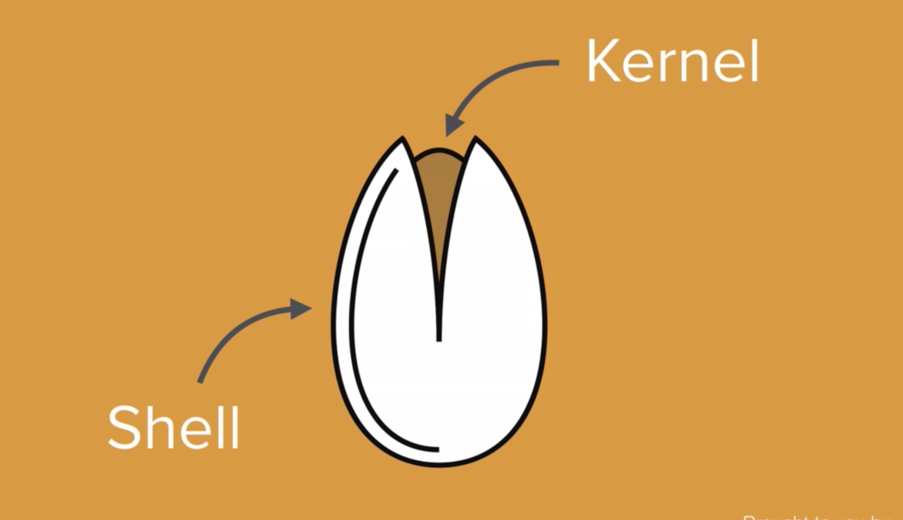

--- 
slug: command-line-tricks-for-better-control-over-our-pc
title: Command Line tricks that give more control over our PC

date: 2022-03-25

tags: 

  - Linux
  - Tools

--- 

## Intro:
At the end of the day what it all boils down to is greater control
=> Journey of becoming a better programmer is better of controlling your computer. With Command-Line, It’s easier, faster and has full control 

Kernel:  The actual program that interfaces with the hardware. It’s core of operating system
Shell: User Interface, for you to interface to the kernel, and in turn with the hardware

## Bash Shell:
Bash stands for “Bourne Again Shell” (Mr. Bourne Again Shell)
Command Line Interpreter for the UNIX system 
Linux is UNIX-like system
macOS runs on a UNIX-like
Window running DOS

At the end of the day what it all boils down to is about greater control
=> Journey of becoming better programmer
Command Line: Easier, Faster  (Finder take a lot of efforts). Having full control 

## Some new tricks:
* `cd ~` to go to the home directory
* `cd` + drag folder into the terminal  => cd to that folder
* In terminal, we can click Option + click on line to move cursor to that position. 
* Control + A: Move cursor to the beginning
* Control + E: Move cursor to the end
* Control + U:  Clear current command without executing it
* Control + L: Clear screen
* Control + H: Same as backspace
* Control + K: Cut everything forward the end of line
* Control + U: Cut everything backward to the beginning of line

Additional reading:
https://github.com/0nn0/terminal-mac-cheatsheet

